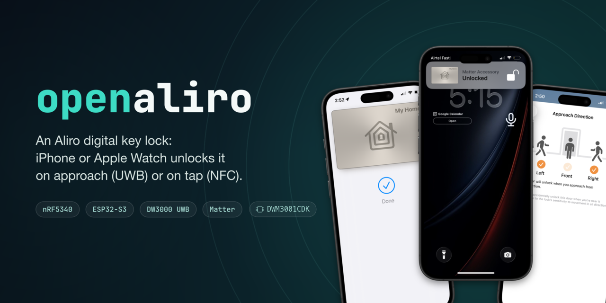
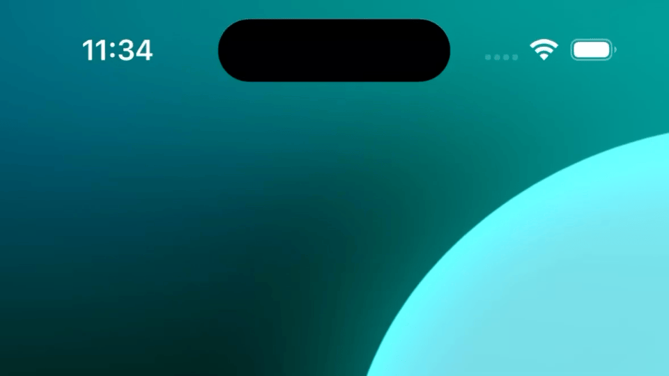
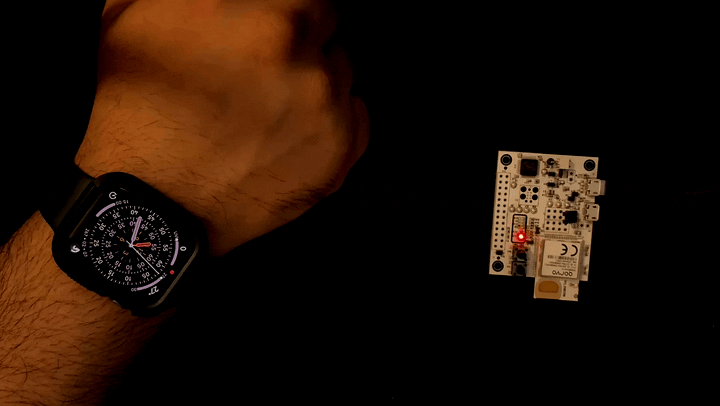
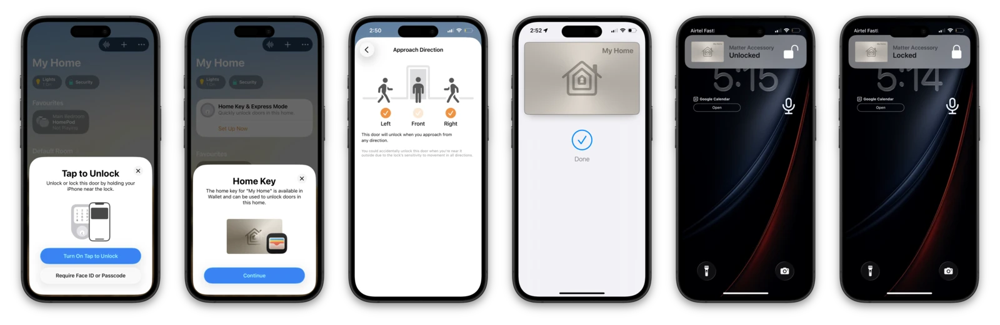

<a name="readme-top"></a>

<div align="center">

<a href="https://openaliro.github.io/openaliro/"></a>

<h1>openaliro</h1>

**Build an Aliro lock your iPhone opens by walking up to it.**

BLE + UWB · one board · no app · no cloud · no vendor Aliro binary

<p>
<a href="https://github.com/openaliro/openaliro/actions/workflows/ci.yml"></a>
<a href="https://github.com/openaliro/openaliro/releases"></a>
<a href="LICENSE"></a>
<a href="CHANGELOG.md"></a>
<a href="https://deepwiki.com/openaliro/openaliro"></a>
<a href="https://discord.gg/7Ez9SRD87Q"></a>
</p>

<p>


</p>

<p>
<a href="#-build-it"><kbd> &nbsp; Build it &nbsp; </kbd></a>&nbsp;
<a href="firmware/README.md"><kbd> &nbsp; The board &nbsp; </kbd></a>&nbsp;
<a href="https://openaliro.github.io/openaliro/flash/"><kbd> &nbsp; Flash an ESP32 &nbsp; </kbd></a>&nbsp;
<a href="web-twin/index.html"><kbd> &nbsp; Web twin &nbsp; </kbd></a>&nbsp;
<a href="https://openaliro.github.io/openaliro/"><kbd> &nbsp; Documentation &nbsp; </kbd></a>&nbsp;
<a href="https://discord.gg/7Ez9SRD87Q"><kbd> &nbsp; Discord &nbsp; </kbd></a>
</p>



<sub>Real hardware. A real Wallet key. A real walk-up unlock.</sub>

</div>

<details>
<summary><kbd> &nbsp; Table of contents &nbsp; </kbd></summary>

#### TOC

- [How a door opens](#how-a-door-opens)
- [The board](#-the-board)
- [Build it](#-build-it)
- [Update over the air](#-update-over-the-air)
- [Before you rely on it](#-before-you-rely-on-it)
- [Other targets](#-other-targets)
- [What it does](#-what-it-does)
- [Under the hood](#-under-the-hood)
- [Commands](#-commands)
- [Documentation](#-documentation)
- [Community](#-community)
- [Trademarks](#trademarks)
- [Credits](#credits)

</details>

---

## How a door opens

```text
    iPhone / Apple Watch               openaliro on one board
   ┌────────────────────┐             ┌──────────────────────┐
   │  Wallet home key   │             │  nRF52833 + DW3110   │
   └──────────┬─────────┘             └───────────┬──────────┘
              │                                   │
   1  BLE     │  advert 0xFFF2, 15 ms intervals   │
              │ ─────────────────────────────────▶│
   2  Aliro   │  AUTH0 → AUTH1 → EXCHANGE         │
              │ ◀────────────────────────────────▶│
              │  both ends now hold the URSK      │
   3  UWB     │  CCC key ladder → STS → DS-TWR    │
              │ ◀──────── 565 cm → 0 cm ─────────▶│
   4  Gate    │  range consistency agrees         │
              │      ──  U N L O C K  ──          │
   5  Matter  │  lock state over Thread           └──▶ Apple Home
              ╵
```

Local only. No app, no account, no cloud round trip.

Step 3 is the point. The distance is **measured**, with a scrambled timestamp sequence
bound to the credential. Not asserted.

<div align="center">

<br/>
<sub>The same five steps on the bench: an Apple Watch key and one DWM3001CDK.</sub>
</div>

<div align="right"><sub><a href="#readme-top">↑ back to top</a></sub></div>

---

## 📟 The board

**Qorvo DWM3001CDK.** One nRF52833 (512 KB flash, 128 KB RAM) with a DW3110 radio beside
it in the same module, and a J-Link already on it. Nothing to wire, nothing to solder.

That one part runs all of this at once:

| | On the same nRF52833 |
|:--|:--|
| 📶 | **BLE peripheral** the iPhone approaches and talks Aliro to |
| 🔑 | **Aliro reader**: AUTH0 / AUTH1 / EXCHANGE, CCC key ladder, STS, DS-TWR |
| 🏠 | **Hand-written Matter node** ([`modules/woz_matter`](modules/woz_matter/)), not CHIP |
| 🧵 | **OpenThread MTD**, so it joins a real Thread network |
| 📏 | **DW3110 UWB ranging**, over the module's internal SPI |

<table>
<tr><td width="34" align="center" valign="top">🧨</td><td>

**Matter on this part was supposed to be impossible.**

Nordic's most stripped *supported* single-core CHIP Matter lock, with LTO on and no
shell, console or logging:

| | CHIP lock needs | This board has | Over by |
|:--|--:|--:|--:|
| Flash | 614,008 B | 516,096 B | **95.6 KB** |
| RAM | 162,164 B | 131,072 B | **30.4 KB** |

- That is before one line of reader or UWB code.
- No QSPI on the nRF52833, so there is no external memory to escape into.
- Writing the Matter node by hand closed the gap.
- Apple Home commissions this board and shows a live lock tile.

</td></tr>
</table>

### Run on hardware

| | Milestone | State |
|:--:|:--|:--|
| ✅ | Reader + Matter node + Thread MTD in one image | 409,988 B flash, 125,012 B RAM, LTO on |
| ✅ | iPhone enumerates Aliro `0xFFF2` over BLE | done |
| ✅ | DW3110 ranges live against an iPhone | done, 565 cm to 0 cm |
| ✅ | An initiator reaches `ESTABLISHED` | done, the iPhone itself |
| 🏆 | **iPhone Wallet walk-up unlock** | **done**, four in one session, 2026-08-02 |
| ✅ | Firmware update over Bluetooth | done, byte-identical, 2026-08-03 |
| ⬜ | **≥ 95% ranging success over 100 walk-ups** | **open, never run** |

Nothing is proven *at a rate* yet. The walk-up sample is single digits, and closing that
row means walking at a door a hundred times. Log lines per stage:
[`firmware/README.md`](firmware/README.md).

### No NFC tap here

No NFC reader IC on the board, and the nRF52833's own NFC peripheral is tag emulation
only. The part can be read; it cannot read.

BLE + UWB walk-up is the whole feature set. For an Express Mode tap, use
[the nRF5340 DK](#-other-targets).

<div align="right"><sub><a href="#readme-top">↑ back to top</a></sub></div>

---

## 🔨 Build it

```bash
git clone https://github.com/openaliro/openaliro.git
cd openaliro

make dfu-key      # 1 · once per clone   ·  this checkout's image-signing key
make bootstrap    # 2 · once per machine ·  host tools + pinned NCS v3.3.0 (~8.5 GB)
make build        # 3 · the lock         ->  build/cdk-matter
make flash        # 4 · over the on-board J-Link, no external probe
make monitor      # 5 · the console, over RTT
```

<table>
<tr><td width="34" align="center" valign="top">🔑</td><td>

**Do not skip step 1.** Every image is signed. With no key the build **fails at
configure** instead of falling back to MCUboot's published demo key.

The key is gitignored, so a fresh clone or a new worktree needs its own.

</td></tr>
</table>

Bare targets always mean this board and its Matter image:

| Command | Builds | Output |
|:--|:--|:--|
| `make build` | reader + Matter node + Thread MTD | `build/cdk-matter` |
| `make rebuild` | the same, forced pristine | `build/cdk-matter` |
| `make reader` | Aliro + UWB only, no Matter, no Thread | `build/cdk-reader` |
| `make selftest` | one-shot DW3110 `DEV_ID` read over SPI at boot | `build/cdk-selftest` |
| `make flash` · `flash-erase` · `monitor` | write it, wipe-and-write it, watch it | n/a |

Options are make variables: `PRISTINE=1`, `RELEASE=1`, `LTO=0`, `SMP=1`. Bare `make`
prints all of them, grouped.

<table>
<tr><td width="34" align="center" valign="top">🔢</td><td>

**The setup code comes from the build, not the board.**

A Matter device stores the SPAKE2+ *verifier*, never the passcode, so nothing on the
device can print it. `make build` and `make monitor` each end by re-deriving the code on
the host and checking it against the verifier that was compiled in.

Add the accessory with **More options… → Enter Code**. There is no QR label on this board.

</td></tr>
</table>

<details>
<summary><kbd> &nbsp; Just the radio &nbsp; </kbd> &nbsp; <b><code>make reader</code></b>, the same source without Matter or Thread</summary>

<br/>

Aliro and UWB only. No commissioner, no Thread network, reader identity typed in over USB.

It builds elsewhere on purpose, so the flash and console targets keep meaning the Matter
image:

```bash
make reader
make flash   CDK_BUILD=build/cdk-reader
make monitor CDK_RTT_BUILD=build/cdk-reader
```

`make selftest` reads the DW3110's `DEV_ID` over SPI at boot. A wrong pin, a wrong SPI
mode or an unpowered radio all say so in one line.

</details>

<div align="right"><sub><a href="#readme-top">↑ back to top</a></sub></div>

---

## 📡 Update over the air

No cable, no probe. Proven on hardware 2026-08-03: the board's flash came out byte for
byte identical to the target image, matching CRCs on both sides.

Two MCUboot slots want about **844 KB on a 512 KB part** and there is no external flash to
stage into, so what travels is a signed **delta**.

```text
   host                                board
   ───────────────────────             ──────────────────────────
   woz_patch.py                        patch_staging partition
   diff + sign the delta   ──GATT──▶   staged by the application
                                       │
                                       ▼   reboot
                                       woz_dfu, from a SYS_INIT
                                       INSIDE MCUboot   (17-31 s)
                                       │
                                       ▼
                                       MCUboot re-verifies, boots
```

[`woz_patch.py`](scripts/woz_patch.py) signs it, [`woz_push.py`](scripts/woz_push.py)
carries it, [`woz_dfu`](modules/woz_dfu/) applies it from inside the bootloader. An
application cannot rewrite the flash it is executing from.

```bash
make dfu         # build, diff against what the board runs, sign, push. One command.
make fota        # instead: the single file a phone can install, plus the steps
make fota-done   # after a phone push, confirm what the board is now running
```

**The update window is the whole authorization model.** The patch is signed and MCUboot
re-verifies the result before booting it, so no peer can install code either way. A closed
window only stops a stranger in radio range spending your erase cycles.

| Open the window | How |
|:--|:--|
| 🔘 **At the board** | Press **SW2**. |
| 🏠 **From Apple Home** | **"Turn On Pairing Mode"**. The node serves the AdministratorCommissioning cluster. |
| 🔌 **From the host** | `make ota-window`, over SWD. |

The first two are confirmed on a live commissioned lock. The blue LED is on while the
window is open, so a press that did not register is visible without a debugger.

<table>
<tr><td width="34" align="center" valign="top">🛑</td><td>

**Run `make fota-done` after every push from a phone.**

A delta is computed against the exact bytes on the board, only the build host keeps that
record, and a phone push is invisible to it. Skip it and the next update is built from the
wrong base and refused.

</td></tr>
</table>

<div align="right"><sub><a href="#readme-top">↑ back to top</a></sub></div>

---

## ⚠️ Before you rely on it

<table>
<tr><td width="34" align="center" valign="top">🖥️</td><td>

**The console is RTT over `probe-rs`, not UART.**

On a single-core part the DW3110's delayed-transmit reply window cannot afford a blocking
console write. `make monitor` attaches with the ELF you *flashed*, not one you built.

The RTT ring survives a reset on purpose, so the first block is the previous run. Anchor
on the `*** Booting nRF Connect SDK ***` line.

</td></tr>
<tr><td width="34" align="center" valign="top">🧹</td><td>

**`make flash-erase` costs the commissioning.**

It takes the Matter fabrics, the reader identity and its trust anchors, so Apple Home has
to add the lock again.

To clear only what a controller can see, hold **SW2 through reset**. Same effect on the
fabrics and anchors, and it leaves the Thread settings alone.

</td></tr>
<tr><td width="34" align="center" valign="top">🔒</td><td>

**Never lock APPROTECT on this board.** Two independent guards fail the build if it is.

Recovering debug access costs a mass erase of flash *and* UICR, which takes the reader's
private key and every iPhone key ever provisioned against it.

</td></tr>
<tr><td width="34" align="center" valign="top">🚧</td><td>

**Nothing revokes yet.** The trust store holds four phone keys, and a phone removed in
Apple Home still opens the board until the store is cleared.

Read [`firmware/README.md`](firmware/README.md) first. Do not secure valuables with it.

</td></tr>
</table>

<div align="right"><sub><a href="#readme-top">↑ back to top</a></sub></div>

---

## 🧩 Other targets

Both still build, both share the same engine in [`modules/`](modules/README.md). Neither
is the headline.

| Target | Approach unlock | NFC tap | Matter | Build |
|:--|:--:|:--:|:--:|:--|
| **DWM3001CDK**, the headline | ✅ validated | ❌ no reader IC | ✅ in-tree node | *(bare)* `make build` |
| **nRF5340 DK**, the one with NFC | ✅ validated | ✅ Express Mode | ✅ CHIP add-on | `make nrf-build` |
| **ESP32-S3** | ✅ validated | ❌ | ✅ esp-matter | `make esp-build` |
| **ESP32-C5 / C6** | ⬜ builds, no recorded run | ❌ | ✅ esp-matter | `make esp-build` |

<details>
<summary><kbd> &nbsp; nRF5340 DK &nbsp; </kbd> &nbsp; <b>the one with NFC</b></summary>

<br/>

Wants an nRF5340 DK, a DWM3000EVB or DW3110, and an X-NUCLEO-NFC12A1 or ST25R300. Wiring:
[`docs/nrf5340-wiring.md`](docs/nrf5340-wiring.md).

```bash
make bootstrap        # the same one-time setup
make dfu-key          # the same key as the CDK, skip if you already ran it
make nrf-build        # -> build/nrf5340dk/merged.hex
make nrf-flash-erase  # the first flash
make nrf-term         # serial console
```

Signed for the same reason the CDK is: MCUboot plus Matter OTA (`DFU=1`) is the default,
and the build will not hand the bootloader a key this checkout does not own.

One key covers both boards. `DFU=0` builds the older no-bootloader bench layout, which
needs none.

Which Aliro stack:

- `ALIRO_SOURCE=0` selects the legacy Nordic binary, for regression comparison only.
- That path holds the recorded hardware result for NFC tap and approach unlock.
- The in-tree stack is the default, is host and CI tested, and still owes the full phone
  checklist in [`docs/hardware-validation.md`](docs/hardware-validation.md).

</details>

<details>
<summary><kbd> &nbsp; ESP32 &nbsp; </kbd> &nbsp; <b>S3, C5, C6</b></summary>

<br/>

Needs ESP-IDF, esp-matter, and a DWM3000EVB or DW3110. No NFC on any of them.

```bash
make esp-build APP=matter-lock TARGET=esp32s3   # or esp32c5, esp32c6
make esp-go    APP=matter-lock TARGET=esp32s3   # build + flash + monitor
```

ESP32-S3 has a recorded hardware result for approach unlock. The others build and are
released without one. See [`ports/esp32/`](ports/esp32/) and
[`docs/esp32-gotchas.md`](docs/esp32-gotchas.md).

No install at all: [**flash an ESP32 from the browser
↗**](https://openaliro.github.io/openaliro/flash/)

</details>

<div align="right"><sub><a href="#readme-top">↑ back to top</a></sub></div>

---

## ✨ What it does

|  | |
|:--|:--|
| 🚪 **Unlock** | Home Key over BLE and UWB on approach, relock on departure, NFC Express Mode where the hardware has a reader. |
| 🛡️ **Security** | Credential-bound DS-TWR with STS and a [range consistency gate](docs/range-integrity.md). Proximity is measured, not claimed. |
| ⚡ **Speed** | Credential reuse, PHY prewarm, 15 ms BLE intervals, fast auth. |
| 📻 **Bare UWB** | The DW3110 runs CCC/FiRa, STS, DS-TWR and the M1-M4 codec with **no UWB coprocessor**. |
| 🧭 **Approach Direction** | Apple Home's control is exposed and its Left / Front / Right selection round-trips to the device. See [`docs/approach-direction.md`](docs/approach-direction.md). |
| 🏡 **Home Assistant** | UWB distance and access events over [MQTT][ha-docs], lock control over Matter, no firmware change. `make ha-setup HA=1`. |
| 🧪 **Runs on a laptop** | `make test` needs a C compiler, no SDK and no hardware. `make verify` is the whole pre-push sweep. |

<div align="center">
<picture>
  <source media="(prefers-color-scheme: dark)" srcset="assets/grid-demo-dark.webp">
  <source media="(prefers-color-scheme: light)" srcset="assets/grid-demo-light.webp">
  
</picture>
<br/>
<sub>Home Key · Approach Direction · provisioning · NFC tap · live lock state</sub>
</div>

<div align="right"><sub><a href="#readme-top">↑ back to top</a></sub></div>

---

## 🔬 Under the hood

The Aliro stack is this project's own source, and so is the Matter node on the primary
board. Every module below compiles for all three targets from one tree.

| Module | What it is |
|:--|:--|
| [`woz_port`](modules/woz_port/) | The platform contract: heap, clock, sleeps, mutex, logging. A new RTOS is a new branch in two headers. |
| [`woz_uwb`](modules/woz_uwb/) | The UWB engine, one Kconfig tier per layer: DW3000 bring-up → DS-TWR responder → CCC credential-bound STS and the M1-M4 codec. |
| [`woz_aliro`](modules/woz_aliro/) | The portable C reader: key schedule, secure channel, wire codec, provisioning, ranging glue, RSSI gate, approach controller. |
| [`woz_matter`](modules/woz_matter/) | The hand-written Matter node: TLV, message and exchange layers, MRP, BTP, PASE/CASE, attestation, clusters. Exists because CHIP does not fit. |
| [`woz_dfu`](modules/woz_dfu/) | Delta update over Bluetooth: a receiver in the app, an applier inside MCUboot. |
| [`woz_aliro_stack`](modules/woz_aliro_stack/) | The Nordic Aliro API rebuilt from the published Aliro 1.0 spec, plus a build that rejects any link map the vendor binary touched. |
| [`woz_nfc`](modules/woz_nfc/) · [`woz_aliro_ecp`](modules/woz_aliro_ecp/) | NFC transport seam (RFAL / PN532 / none) and the ECP emitter for Express tap. nRF5340 only. |

Around them:

- [`tests/host/`](tests/host/) KAT suite, CBMC proofs, fuzz harnesses
- [`security/`](security/) the eight blocking gates
- [`web-twin/`](web-twin/) the firmware as WASM, so the protocol runs in a browser
- [`integration/homeassistant/`](integration/homeassistant/) · [`host/presence/`](host/presence/)
- [`tools/`](tools/) docs pipeline and the `make openaliro` bench TUI

<div align="right"><sub><a href="#readme-top">↑ back to top</a></sub></div>

---

## 🎛️ Commands

Bare `make` prints every target, grouped. Each recipe's `##` block in [`mk/`](mk/) is the
authority on its options.

| | |
|:--|:--|
| `make bootstrap` | Set this machine up. The only command before `build`. |
| `make dfu-key` | This checkout's MCUboot signing key. Once per clone. |
| `make build` · `flash` · `monitor` | The lock: compile, write, watch. |
| `make reader` · `selftest` | The radio without Matter. The one-shot SPI bring-up check. |
| `make dfu` · `fota` · `fota-done` | Update over Bluetooth. Make the file a phone installs. Record what landed. |
| `make test` · `check` · `verify` | Host suite. Every host suite under one banner. The pre-push sweep. |
| `make security` | The eight blocking security gates: what a PR must pass. |
| `make fuzz` · `cbmc` · `coverage` | Parser hardening, bounded model checking, line coverage. |
| `make docs` | Rebuild the documentation site → `site/index.html`. |
| `make openaliro` | The guided bench TUI. |
| `make ws-seed` | Give this worktree its own workspace (APFS copy-on-write, ~0 disk). |

<div align="right"><sub><a href="#readme-top">↑ back to top</a></sub></div>

---

## 📚 Documentation

Rendered site: **[openaliro.github.io/openaliro ↗][site]**

| Read this | When |
|:--|:--|
| [`firmware/README.md`](firmware/README.md) | The DWM3001CDK manual: sizes, partitions, RTT, OTA, provisioning, evidence. |
| [`docs/set-up.md`](docs/set-up.md) | First bring-up, from an empty machine. |
| [`docs/configuring.md`](docs/configuring.md) | Every build option, per target. |
| [`docs/troubleshooting.md`](docs/troubleshooting.md) | Symptoms, grouped by target, CDK first. |
| [`docs/dwm3001cdk-surgery.md`](docs/dwm3001cdk-surgery.md) | CDK Matter-node traps, each with symptom and fix. |
| [`docs/esp32-gotchas.md`](docs/esp32-gotchas.md) | The same, numbered, for ESP32. |
| [`docs/protocol-notes.md`](docs/protocol-notes.md) · [`protocol-research.md`](docs/protocol-research.md) | Time sync, credential validity, the wider reverse-engineering notes. |
| [`docs/range-integrity.md`](docs/range-integrity.md) · [`approach-direction.md`](docs/approach-direction.md) | Why a measured distance is trustworthy. How direction is honoured. |
| [`docs/hardware-validation.md`](docs/hardware-validation.md) | The phone checklist each target still owes. |
| [`docs/home-assistant.md`](docs/home-assistant.md) · [`power-profile.md`](docs/power-profile.md) | Integration, and where the milliamps go. |
| [`docs/README.md`](docs/README.md) → [`docs/architecture/`](docs/architecture/) | Generated code map: subsystems, entry points, every exported symbol. |

New here: [`CONTRIBUTING.md`](CONTRIBUTING.md) · [`SECURITY.md`](SECURITY.md) ·
[`CODE_OF_CONDUCT.md`](CODE_OF_CONDUCT.md) · [`PRIVACY.md`](PRIVACY.md)

<div align="right"><sub><a href="#readme-top">↑ back to top</a></sub></div>

---

## 💬 Community

<div align="center">

<a href="https://discord.gg/7Ez9SRD87Q"></a>

</div>

| Where | For |
|:--|:--|
| 💬 [**Discord**](https://discord.gg/7Ez9SRD87Q) | Bring-up help, RTT logs that make no sense, walk-ups that did not work. |
| 🐛 [**Issues**](https://github.com/openaliro/openaliro/issues) | Reproducible bugs, with the target, the build command and the console output. |
| 🤝 [**CONTRIBUTING.md**](CONTRIBUTING.md) | What `make verify` expects before a patch can land. |
| 🔐 [**SECURITY.md**](SECURITY.md) | Anything that would let the wrong phone open a door. Privately, not in Discord. |

<div align="right"><sub><a href="#readme-top">↑ back to top</a></sub></div>

---

## Trademarks

Independent project. Not affiliated with, endorsed by, sponsored by, or speaking for any
company or standards body named here.

- Aliro and Matter are trademarks of the Connectivity Standards Alliance.
- Apple, iPhone and Apple Watch are trademarks of Apple Inc.
- Nordic Semiconductor, Qorvo, DecaWave and Espressif are trademarks of their owners.

All are used nominatively, to say what this firmware interoperates with. Every
specification, standard and trademark referenced stays the property of its owner, along
with every right, licence and disclaimer attached to it.

Protocol notes in `docs/` cite specification section numbers so you can look them up in
your own copy. They reproduce no specification text and include no member-confidential
material.

## Credits

Thanks: [@br101](https://github.com/br101) · [@kormax](https://github.com/kormax/) ·
[@rednblkx](https://github.com/rednblkx/) · [@scottjg](https://github.com/scottjg/).

---

<div align="center">

<sub>License: ISC project code · mixed vendor terms · <a href="LICENSE">LICENSE</a> · <a href="PRIVACY.md">Privacy</a></sub>

<sub><b>Independent project · no affiliation · no warranty · do not secure valuables with it</b></sub>

<br/>

<a href="#readme-top"><kbd> &nbsp; ↑ back to top &nbsp; </kbd></a>

</div>

[site]: https://openaliro.github.io/openaliro/
[ha-docs]: https://openaliro.github.io/openaliro/home-assistant.html
