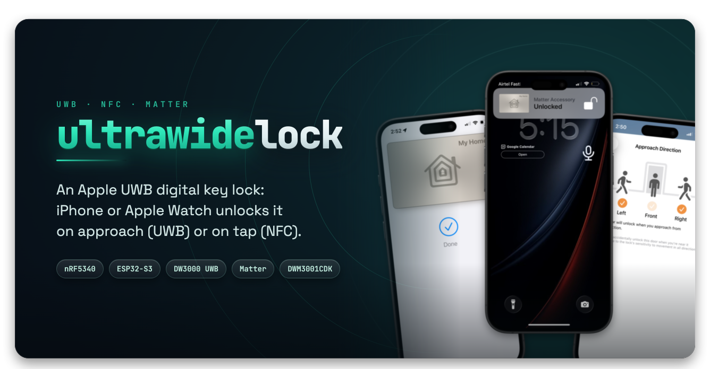

<div align="center">



**Portable firmware for NFC and UWB smart locks.**


</div>

UltraWideLock implements the CSA's door-lock credential protocol, BLE plus NFC
(ECP) plus UWB ranging, built and tested against Nordic's
ncs-door-lock-and-access-control add-on. It ships three complete lock
applications and focused examples for reader, initiator, and anchor roles.

## Quick start

### Without hardware

Nothing but a C compiler and `python3`. Every host suite, in about two minutes:

```sh
git clone https://github.com/ultrawidelock/ultrawidelock.git
cd ultrawidelock
make check
```

`make tools` names every host tool, the targets each one gates, and what is
already installed on this machine.

### With a board

The default target is the **Qorvo DWM3001CDK**: an nRF52833 with a DW3110 radio
in the same module and a J-Link already on it. Nothing to wire, nothing to
solder.

```sh
make dfu-key      # 1 · once per clone   · this checkout's image-signing key
make bootstrap    # 2 · once per machine · host tools + pinned NCS v3.3.0
make build        # 3 · the lock         -> build/cdk-matter
make flash        # 4 · over the on-board J-Link, no external probe
make monitor      # 5 · the console, over RTT
```

Step 1 comes first because every image is signed and the key is gitignored, so
a fresh clone or a new worktree needs its own. Step 2 is the large one: roughly
2 GB for the NCS v3.3.0 toolchain, then a multi-GB `west update` into
`./workspace`. It is safe to re-run, and an interrupted fetch resumes rather
than starting over. Set `ULTRAWIDELOCK_WS=/other/disk/ws` to put the workspace
elsewhere.

Bare targets always mean this board. Options are make variables
(`PRISTINE=1`, `RELEASE=1`, `LTO=0`, `SMP=1`), and `make help` prints every
target grouped by board.

## How a door opens

```text
    iPhone / Apple Watch              UltraWideLock on one board
   ┌────────────────────┐             ┌──────────────────────┐
   │  Wallet home key   │             │  nRF52833 + DW3110   │
   └──────────┬─────────┘             └───────────┬──────────┘
              │                                   │
   1  BLE     │  credential service 0xFFF2        │
              │ ─────────────────────────────────▶│
   2  Auth    │  AUTH0 → AUTH1 → EXCHANGE         │
              │ ◀────────────────────────────────▶│
              │  both ends now hold the URSK      │
   3  UWB     │  key ladder → STS → DS-TWR        │
              │ ◀────────── ranging ─────────────▶│
   4  Gate    │  range consistency agrees         │
              │      ──  U N L O C K  ──          │
   5  Matter  │  lock state over Thread           └──▶ Apple Home
              ╵
```

Local only. No app, no account, no cloud round trip.

<div align="center">


<sub>Real hardware. A real Wallet key. A real walk-up unlock.</sub>

</div>

## The board

One nRF52833, 512 KB flash and 128 KB RAM, runs all of this at once:

| | On the same part |
|:--|:--|
| 📶 | **BLE peripheral** the iPhone approaches and talks the credential protocol to |
| 🔑 | **Reader**: AUTH0 / AUTH1 / EXCHANGE, key ladder, STS, DS-TWR |
| 🏠 | **Hand-written Matter node** ([`modules/ultrawidelock_matter`](modules/ultrawidelock_matter/)), not CHIP |
| 🧵 | **OpenThread MTD**, so it joins a real Thread network |
| 📏 | **DW3110 UWB ranging**, over the module's internal SPI |

The recorded baseline for that image is 379,332 B of 433,664 B flash and
111,012 B of 131,072 B RAM. `make cdk-size` measures the current tree, and
`make cdk-size-check` fails if it lost headroom.

There is no NFC reader IC on this board, and the nRF52833's own NFC peripheral
is tag emulation only, so the part can be read but cannot read. BLE plus UWB
walk-up is the whole feature set here. For a tap, use the nRF5340 DK below.

Two more targets on the same board are worth knowing about: `make reader`
builds the radio half alone, without Matter or Thread, and `make selftest`
reads the DW3110's device ID over SPI at boot, so a wrong pin, a wrong SPI mode
or an unpowered radio all say so in one line.

## Other boards

| Application | Hardware | Connectivity |
|---|---|---|
| [`apps/dwm3001cdk-lock/`](apps/dwm3001cdk-lock/) | DWM3001CDK | credential UWB, Matter over Thread |
| [`apps/nrf5340dk-lock/`](apps/nrf5340dk-lock/) | nRF5340 DK, DWM3000EVB, NFC12A1 | credential UWB and NFC, Matter over Thread |
| [`apps/esp32-matter-lock/`](apps/esp32-matter-lock/) | ESP32-S3, ESP32-C5, or ESP32-C6 with DWM3000EVB | credential UWB, Matter over Wi-Fi |

```sh
make nrf-build && make nrf-flash && make nrf-term    # nRF5340 DK
make esp-go APP=matter-lock TARGET=esp32s3          # ESP32: build, flash, monitor
```

ESP32 builds use an installed ESP-IDF environment, and the Matter lock also
needs esp-matter. Neither is pinned by this repository, and both paths default
under `$HOME/esp` (override with `IDF_EXPORT` and `ESP_MATTER_PATH`). The bench
builds against ESP-IDF v5.5.4 and esp-matter `93b1680`.

With the reader and nRF5340 DK initiator attached, the unattended end-to-end
bench flow is `make hitl`. Pass script options through `HITL_ARGS`, for example
`make hitl HITL_ARGS=--skip-enrol`.

<div align="center">
<picture>
  <source media="(prefers-color-scheme: dark)" srcset="assets/grid-demo-dark.webp">
  <source media="(prefers-color-scheme: light)" srcset="assets/grid-demo-light.webp">
  
</picture>
<br/>
<sub>Home Key · Approach Direction · provisioning · NFC tap · live lock state</sub>
</div>

## Update over the air

No cable, no probe. Two MCUboot slots want more room than a 512 KB part has,
and there is no external flash to stage into, so what travels is a signed
delta.

```sh
make dfu         # build, diff against what the board runs, sign, push
make fota        # instead: the single file a phone can install, plus the steps
make fota-done   # after a phone push, confirm what the board is now running
```

Run `make fota-done` after every push from a phone. A delta is computed against
the exact bytes on the board, only the build host keeps that record, and a
phone push is invisible to it.

## Before you rely on it

- **The console is RTT, not UART.** `make monitor` attaches with the ELF you
  flashed, not one you built. The ring survives a reset on purpose, so the
  first block is the previous run; anchor on the boot banner.
- **`make flash-erase` costs the commissioning.** It takes the Matter fabrics,
  the reader identity and its trust anchors, so Apple Home has to add the lock
  again.
- **Never lock APPROTECT on these boards.** Recovering debug access costs a
  mass erase of flash and UICR, which takes the reader's private key and every
  phone key provisioned against it. `scripts/check-approtect.sh` checks a part.
- **Repository defaults are bench defaults.** Keys, identities, and pairing
  material in the tree are for development. Do not secure valuables with it.

## Use as an SDK

Application code includes only its role. A reader uses:

```c
#include <ultrawidelock/reader.h>
#include <ultrawidelock/uwb.h>
```

Initiators use `<ultrawidelock/device.h>`, and codec-only consumers use
`<ultrawidelock/tlv.h>`. Installed plain-CMake consumers may use the all-in-one
`<ultrawidelock/ultrawidelock.h>` when they intentionally want every declaration.

Port implementations use `<ultrawidelock/ultrawidelock_hal.h>`, which names the five chipset
seams for DW3000 GPIO/IRQ, DW3000 SPI, reader BLE, central BLE, and credential
storage. See [`PORTING.md`](PORTING.md) for the shortest board and chipset
workflow.

Full firmware is consumed through the Zephyr module or the ESP-IDF components.
Plain CMake consumers can install the public headers and portable TLV codec:

```sh
cmake -S . -B build/sdk -DCMAKE_INSTALL_PREFIX="$PWD/build/sdk-install"
cmake --build build/sdk
cmake --install build/sdk
```

The exported targets are `UltraWideLock::headers` and `UltraWideLock::tlv`. A complete
package-consumer example is under
[`examples/cmake/consumer/`](examples/cmake/consumer/).
The SDK version comes from the root `VERSION` file. Plain-CMake consumers may
request a compatible series or add this repository with `add_subdirectory`;
`make sdk-check` verifies both paths.

## Repository layout

| Directory | Purpose |
|---|---|
| [`apps/`](apps/) | Complete lock products |
| [`examples/`](examples/) | Independently buildable role and bench examples |
| [`modules/`](modules/) | Portable protocol and feature implementations |
| [`ports/`](ports/) | Zephyr and ESP32 backends for platform seams |
| [`integrations/`](integrations/) | Patches for external upstream applications |
| [`tests/`](tests/) | Host, shared, port, tooling, and on-target tests |
| [`include/`](include/) | SDK umbrella and public-API ownership guide |
| [`cmake/`](cmake/) | Shared CMake helpers used by build definitions |
| [`mk/`](mk/) | Implementations behind the top-level Make targets |
| [`scripts/`](scripts/) | Setup, release, DFU, sizing, and device utilities |
| [`release/`](release/) | Templates and scripts included in release bundles |

The protocol implementation lives in `modules/`; supported operating systems
and chipsets are connected through thin backends in `ports/`. Canonical SDK
headers are under each owner's `modules/<name>/include/ultrawidelock/`
directory. Other module contracts remain under `modules/<name>/include/`.
Private headers and implementation details remain under `modules/<name>/src/`.

Contributions are welcome; start with [`CONTRIBUTING.md`](CONTRIBUTING.md).
Coding agents should start with [`AGENTS.md`](AGENTS.md), which carries the
architecture invariants, task routing, and exact verification commands without
duplicating separate instructions for individual agent products.

<div align="center">

</div>

## License

Project-original code is Copyright (c) 2026 asxeem and UltraWideLock
contributors, under the ISC license in [LICENSE](LICENSE). The
DW3000 integration in `modules/ultrawidelock_dw3000` is ISC (Bruno Randolf); the vendored
Qorvo UWB driver it wraps is LicenseRef-QORVO-2, which permits use only with
Qorvo integrated circuits, so binaries built with UWB support inherit that
hardware restriction. The full file-to-license mapping is in
[THIRD_PARTY_NOTICES](THIRD_PARTY_NOTICES).
