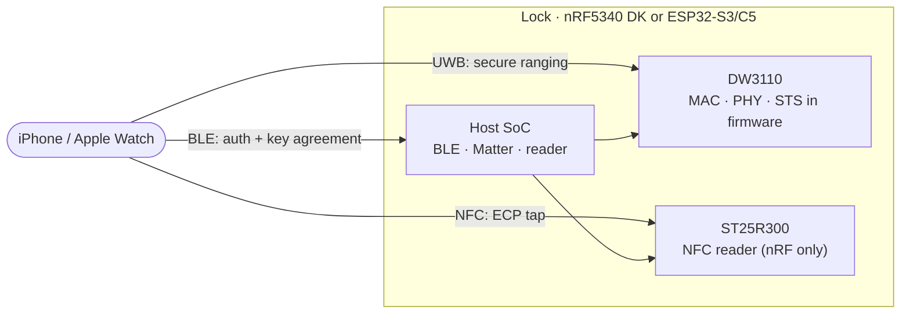

<h1 align="center">openaliro</h1>

<p align="center">
  <b>An Aliro digital key lock: an iPhone or Apple Watch unlocks it on approach
  (ultra-wideband ranging) or on tap (NFC).</b>
</p>

<p align="center">
  <a href="#maturity">Maturity</a> ·
  <a href="#fastest-ways-to-try-it">Try it</a> ·
  <a href="#source-build-quick-start">Build</a> ·
  <a href="#hardware">Hardware</a> ·
  <a href="#how-it-works">How it works</a> ·
  <a href="#documentation">Documentation</a> ·
  <a href="#license">License</a>
</p>

<p align="center">
  <a href="https://github.com/asxeem/openaliro/actions/workflows/host-tests.yml"></a>
  <a href="https://github.com/asxeem/openaliro/actions/workflows/sanitizers.yml"></a>
  <a href="https://github.com/asxeem/openaliro/actions/workflows/patch-drift.yml"></a>
  <a href="https://github.com/asxeem/openaliro/actions/workflows/tooling.yml"></a>
  <a href="https://github.com/asxeem/openaliro/actions/workflows/format.yml"></a>
</p>

<p align="center">
  
  
  
  
  
  
</p>

<p align="center">
  
</p>

<p align="center"><sub>Real unlock on hardware: iPhone on approach.</sub></p>

---

openaliro implements the lock side of an [Aliro](https://csa-iot.org/all-solutions/aliro/)
digital key. The phone authenticates over Bluetooth LE and measures its distance over
ultra-wideband: the door unlocks as the phone approaches and relocks as it leaves. A plain
NFC tap unlocks it as well. No app, no button.

## Features

- **Hands-free unlock**: unlocks on approach, relocks on departure.
- **Tap to unlock**: hold an iPhone or Apple Watch to the reader (Express Mode, no Face ID).
- **Credential-bound ranging**: the distance measurement is bound to the key, so a recorded
  signal cannot replay an unlock.
- **No UWB coprocessor**: the entire secure ranging stack runs in firmware on a bare
  Qorvo DW3110.
- **Two silicon vendors**: the same ranging engine runs on Nordic and Espressif SoCs.

<p align="center">
  
</p>
<p align="center"><sub>Key setup · Approach Direction · provisioning · lock and unlock states, all against live hardware</sub></p>


## Maturity

Validation belongs to a configuration, not to every option that happens to compile for
the same board.

| Configuration | Delivery | Automated evidence | Hardware evidence |
|---|---|---|---|
| **nRF5340 DK + DW3110 + X-NUCLEO-NFC12A1/ST25R300** | Default source build and release bundle | Host suites plus nRF firmware CI build | **Hardware-validated:** NFC tap and BLE/UWB approach unlock against a live Apple device |
| **ESP32-S3 + DW3110** | Source build, release image, and browser-flash image | ESP32 host suites plus S3 firmware CI build | **Hardware-validated:** approach unlock against a live iPhone |
| **ESP32-C5 + DW3110** | Source build, release image, and browser-flash image | Release workflow builds and bundles the C5 image | **Pending:** no hardware-validation record |
| **nRF5340 DK with `ALIRO_SOURCE=1`** | Opt-in source build; not release-bundled | Dedicated nRF CI build plus host tests for the portable protocol layer | **Pending:** no source-stack hardware-validation record |
| **nRF5340 DK with `NFC=pn532`** | Opt-in source build; not release-bundled | PN532 driver and APDU adaptation host-tested against a fake bus | **Pending:** no PN532 firmware-CI or hardware-validation record |

The ESP32 port is not a recompile. The reference design delegates credential
authentication and ranging-key derivation to a closed Arm library, so the ESP targets
cannot link it. The key schedule, secure channels, wire codec, and reader identity are
reimplemented here.

## Fastest ways to try it

- **Shipped, CI-tested, no hardware:** open
  [`web-twin/index.html`](web-twin/index.html) and walk the simulated phone toward the
  door. The UWB responder is the repository's firmware compiled to WASM.
- **Experimental browser install, ESP32-S3/C5:** use the
  [browser flasher](https://asxeem.github.io/openaliro/flash/) in Chrome or Edge. The page
  and dual-chip manifest are shipped and dry-checked, but a successful real WebSerial
  flash is not yet recorded. See [`web-flasher/README.md`](web-flasher/README.md).
- **Shipped host gate, no hardware:** run `make test` for protocol, state-machine,
  transport, radio-fake, backend-fake, and tooling coverage.

## Source-build quick start

**nRF5340 DK:**

```bash
make bootstrap     # host tools, the NCS v3.3.0 toolchain, then NCS + the
                   # Nordic add-on (~6.5 GB) into ./workspace — once per machine
make build         # → ./build/merged.hex
make flash-erase   # first flash of a net-core image
make flash         # every flash after that
```

Also available: `make test` (host test suite, no toolchain or hardware required),
`make tools` (what the CI gates need on this machine, and what is missing),
`make coverage`, `make selftest` (boot self-test, no iPhone required), `make rebuild`,
`make term`, and `make clean`. Run `make` alone for the full grouped list. Options pass
as variables: `make build PRETTY=1 CHIP=dw3720`. See
[`docs/configuring.md`](docs/configuring.md) for the full option and validation matrix.

`HA=1` builds an optional Home Assistant variant that surfaces lock operations and
UWB proximity over Matter. It has to be set on both steps
(`make bootstrap HA=1 && make build HA=1`) and is not hardware-validated; default
builds are unaffected. See
[`integration/homeassistant/`](integration/homeassistant/README.md), which also
documents a console-to-MQTT bridge that needs no firmware change at all.

**ESP32-S3 or ESP32-C5** (needs ESP-IDF and esp-matter on the machine):

```bash
cd ports/esp32/apps/matter-lock
make set-target TARGET=esp32s3   # once per checkout; or TARGET=esp32c5
make go                          # build + flash + monitor
```

S3 is the hardware-validated configuration. C5 has build and release support, with
bench validation pending.

**No hardware** (laptop only):

```bash
make tools         # what the CI gates need here, and what is missing
make test          # protocol, state-machine, transport, backend, and tooling suites
make test-port     # ESP32 port suite (crypto KATs, codec, provisioning)
make verify        # every host-runnable CI gate: tripwire, then parallel lanes
```

`make verify` is the pre-PR sweep: one row per CI job, so green locally and green
on the PR mean the same thing. A gate whose tool is missing fails it rather than
passing quietly, because CI runs that gate either way.

See [`ports/README.md`](ports/README.md) for the port index, and
[`docs/esp32-bringup.md`](docs/esp32-bringup.md) to wire the radio up.

## Repository map

```
Makefile           every entry point (build, flash, test, docs); run `make` for the list
scripts/           the machinery behind it (bootstrap, build, docs, workspace seeding)
modules/
  woz_port/        THE PORTING SEAM: woz_port.h + woz_log.h, the whole platform contract
  woz_uwb/         UWB engine: driver, FiRa MAC, CCC STS, M1-M4 codec (shared, all targets)
  woz_aliro/       portable C reader used by ESP32-S3/C5 and the host suites
  woz_aliro_stack/ nRF source replacement for the Nordic Aliro API (ALIRO_SOURCE=1)
  woz_nfc/         nRF NFC transport seam: ST25R300/RFAL, PN532, or no reader
  woz_aliro_ecp/   NFC ECP emitter for Express Mode tap (Nordic-licensed)
ports/
  nrf5340dk/       primary target: patches + overlays laid over the fetched Nordic add-on
  esp32/           ESP32-S3/C5: shared components + two apps (matter-lock, bench reader) + tests
deps/dw3000/       vendored Qorvo/Decawave DW3000 driver, compiled unchanged by every target
integration/       Home Assistant MQTT bridge (no firmware change needed)
tests/             host KAT suite, sanitizers, fuzzing, CBMC proofs, tooling tests
docs/              guides (protocol research, bring-up, porting) + generated reference
```

## Hardware

**nRF5340 DK:**

| Part | Role |
|---|---|
| nRF5340 DK | Host SoC: BLE + Matter and the ranging engine |
| DWM3000EVB (DW3110) | UWB radio, on the Arduino header (SPIM4) |
| [X-NUCLEO-NFC12A1 (ST25R300)](https://www.st.com/en/evaluation-tools/x-nucleo-nfc12a1.html) | NFC reader front end for tap (SPIM1) |

Pin assignments live in
[`ports/nrf5340dk/overlays/dw3000-nfc.overlay`](ports/nrf5340dk/overlays/dw3000-nfc.overlay).

**ESP32-S3:**

| Part | Role |
|---|---|
| ESP32-S3 dev board | Host SoC: BLE + Matter over Wi-Fi and the ranging engine |
| DWM3000EVB (DW3110) | UWB radio on SPI2, eleven jumpers |

Pin assignments live in
[`ports/esp32/components/woz_uwb/port/board_pins.h`](ports/esp32/components/woz_uwb/port/board_pins.h);
the wiring table is in [`docs/esp32-bringup.md`](docs/esp32-bringup.md).

ESP32-C5 uses the C5 pin column in that same wiring table. Its source and release
images are supported, but the hardware configuration is not yet bench-validated.

## How it works

The whole transaction rides on BLE; UWB carries no application data, only the distance
measurement. Both sides independently derive the ranging key from the authentication, so
ranging cannot be replayed from sniffed BLE traffic. The lock opens inside a configured
distance threshold and relocks past a hysteresis margin.



## Hardware-validated capability status

| Capability | nRF5340 DK | ESP32-S3 |
|---|---|---|
| Matter commissioning + key provisioned to Wallet | Working | Working |
| BLE auth + ranging-key agreement | Working (via the add-on's vendor library) | Working (reimplemented) |
| On-air ranging setup (M1-M4) | Working | Working |
| Secure UWB ranging (distance) | Working | Working |
| Distance-gated unlock / relock | Working | Working |
| NFC ECP tap unlock | Working | Not implemented |

These rows describe the default nRF5340 DK/ST25R300 configuration and ESP32-S3
only. Both have been driven end to end against a live iPhone: the Wallet unlock
animation plays on approach and the bolt relocks on departure. Releases are
gated on the manual [hardware validation checklist](docs/hardware-validation.md).
ESP32-C5, `ALIRO_SOURCE=1`, and PN532 do not inherit those results.

## Documentation

### Install and build

- **Shipped guide:** [`docs/set-up.md`](docs/set-up.md) gets each target built;
  [`docs/configuring.md`](docs/configuring.md) covers variants and their evidence.
- **Experimental installer:** [`web-flasher/README.md`](web-flasher/README.md)
  explains browser flashing for ESP32-S3/C5. It is dry-checked, not WebSerial
  hardware-validated.
- **Shipped guide:** [`docs/troubleshooting.md`](docs/troubleshooting.md) covers
  build, flash, wiring, and unlock failures.

### Understand the protocol

- **Research:** [`docs/protocol-research.md`](docs/protocol-research.md) and
  [`docs/protocol-notes.md`](docs/protocol-notes.md) record the BLE, UWB, NFC,
  time-sync, and credential behavior observed on real hardware.
- **Shipped, CI-tested tool:** [`web-twin/README.md`](web-twin/README.md) explains
  the interactive walk-up twin and its firmware-backed WASM replay.
- **Shipped feature guide:** [`docs/approach-direction.md`](docs/approach-direction.md)
  explains approach-direction behavior and validation.

### Port and integrate

- **Shipped guides:** [`ports/README.md`](ports/README.md),
  [`docs/porting.md`](docs/porting.md), and
  [`docs/porting-esp32.md`](docs/porting-esp32.md) cover the platform seam and
  the ESP32-S3/C5 implementation.
- **Generated maps:** [`docs/README.md`](docs/README.md) and
  [`docs/ARCHITECTURE.md`](docs/ARCHITECTURE.md) show subsystem ownership and
  call relationships.
- **Generated API reference:** [`docs/reference.md`](docs/reference.md) explains
  how to build and use the Doxygen tree.

### Diagnose and research

- **Diagnostic:** [Aliro Lab](tests/host/data/README.md) captures and scores
  complete walk-ups; the [flight recorder](tools/flight_recorder.py) replays UWB
  sessions. Raw `[FREC]` logs and `.frc` files contain the ephemeral URSK and
  must stay private.
- **Diagnostic/research:** [`docs/wireshark.md`](docs/wireshark.md) describes the
  Aliro BLE dissector and its validated clear-text scope.
- **Diagnostic study:** [`docs/power-profile.md`](docs/power-profile.md) records
  the RSSI gate, power methodology, bench results, and remaining measurements.
- **Experimental research:** [`docs/passive-carry-verification.md`](docs/passive-carry-verification.md)
  covers the offline gait tool; its firmware gate is not shipped.

Project practices: [`CONTRIBUTING.md`](CONTRIBUTING.md) ·
[`SECURITY.md`](SECURITY.md) · [`CHANGELOG.md`](CHANGELOG.md) ·
[`docs/RELEASING.md`](docs/RELEASING.md)

<details>
<summary><b>Under the hood</b> (why this is hard, and how it is built)</summary>

### The hard part

Most UWB projects rely on a turnkey ranging module that hides the radio behind a friendly
API. This one does not. It runs on a bare Qorvo DW3110 (a DWM3000EVB) with no UWB
coprocessor, so the entire secure ranging stack, the MAC, the PHY framing, and the STS
(scrambled timestamp sequence) are implemented in firmware on the host SoC, directly over
the [`deps/dw3000`](deps/dw3000) driver. Getting a phone to trust the distance it
measures means getting every byte of that right.

On ESP32 there is a second hard part. The reference design hands credential
authentication and ranging-key derivation to a closed vendor library, so on the ESP
targets that layer had to be reimplemented: the key schedule, the two secure channels,
the wire codec, and the reader identity. And the DS-TWR responder has to arm each frame
inside a 2 ms slot on a target with slower SPI and jitterier callback dispatch than the
nRF, which is its own separate fight.

### Architecture

A layered implementation with explicit platform seams:

- **`modules/woz_port/`**: the platform contract, `woz_port.h` (eight functions plus a
  mutex) and `woz_log.h`. Every other layer is written against these two headers, which
  is what makes the engine portable; see [`docs/porting.md`](docs/porting.md).
- **`modules/woz_uwb/`**: the UWB engine (`src/`, split into
  `driver/ fira/ ccc/ aliro/ facade/ shell/`): the CCC key ladder, MAC, STS, and DS-TWR
  responder, driving `deps/dw3000` directly. The M1-M4 ranging-setup codec is in
  `src/aliro/`, and callers come in through `facade/woz_uwb_facade.c`.
- **`modules/woz_aliro/`**: portable C credential-auth reader, wire codec,
  provisioning, RSSI gate, and approach controller used by ESP32 and the host suites.
- **`modules/woz_aliro_stack/`**: source replacement for the Nordic Aliro API,
  selected on nRF with `ALIRO_SOURCE=1`.
- **`modules/woz_nfc/`**: nRF NFC transport seam with ST25R300/RFAL, PN532, and
  no-reader backends.
- **`modules/woz_aliro_ecp/`**: nRF NFC ECP emitter for Express Mode tap.
- **`deps/dw3000/`**: Bruno Randolf's DW3000 decadriver (ISC).
- **`ports/`**: target integrations. `nrf5340dk/` layers patches and overlays over
  the Nordic add-on; `esp32/` builds the shared UWB and C reader sources for S3/C5,
  adds the ESP-IDF DW3000 backend, and supplies its own app integration.

On the default nRF build, the Nordic add-on owns BLE and Matter and hands the engine a
plaintext ranging key; `ALIRO_SOURCE=1` replaces that binary implementation. On ESP32,
the port's own reader derives the key and hands it over at the same UWB seam. The nRF
NFC call sites route through `woz_nfc`, with ST25R300/RFAL as the hardware-validated
default and PN532 as a host-tested alternative.
Integration onto the fetched add-on is layered and never edited in place: patches in
`ports/nrf5340dk/patches/`, configuration in `ports/nrf5340dk/overlays/`, modules in `modules/` +
`deps/`.

</details>

## Credits

- **Nordic Semiconductor** for the nRF Connect SDK and the door-lock add-on this firmware
  extends.
- **Espressif** for ESP-IDF and esp-matter, which the ESP32-S3/C5 port is built on.
- **Bruno Randolf** for the ISC-licensed [`dw3000` decadriver](deps/dw3000) that drives
  the radio.
- [@kormax](https://github.com/kormax/) for ideas on ECP and UWB.
- [@rednblkx](https://github.com/rednblkx/) for ideas on HomeKey.
- [@scottjg](https://github.com/scottjg/) for authoring the independent Aliro
  source-stack implementation and PN532 NFC transport, plus UWB chipset guidance.

## License

The project's own code (`modules/`, `ports/`, build scripts, and docs), except as
noted below, is ISC; see [`LICENSE`](LICENSE). The tree as a whole
is mixed-license, not uniformly ISC:

- [`deps/dw3000/`](deps/dw3000) is the Qorvo/Decawave driver under `LicenseRef-QORVO-2`
  (usable only with a Qorvo IC, no reverse engineering).
- `modules/woz_aliro_ecp/src/nfc_prop_ecp.cpp` is `LicenseRef-Nordic-5-Clause`
  (Nordic Semiconductor).

The per-file `SPDX-License-Identifier` headers are the source of truth. Because of those
vendor terms, the repository as a whole is source-available, not open source in the OSI
sense.

---

<p align="center"><sub>
Independent personal project. Not affiliated with or endorsed by any vendor or standards
body.<br/>
Provided as is, without warranty. Do not rely on it to secure anything of value.
</sub></p>
