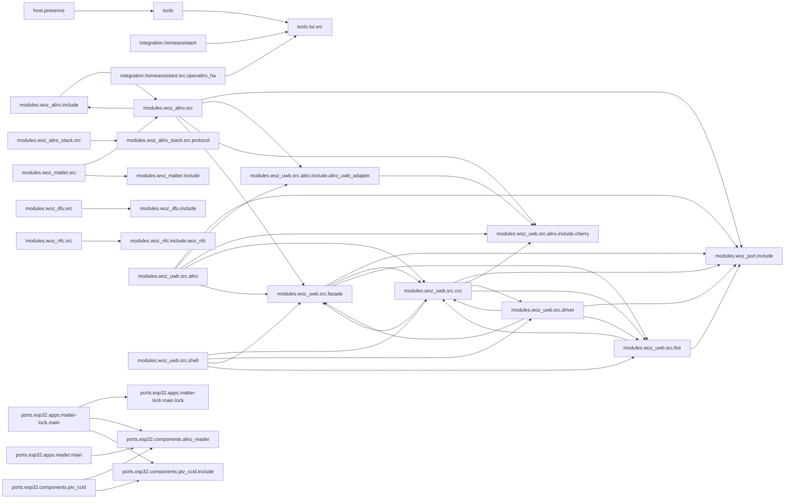

<!-- generated documentation — edit the source, not this file -->
# openaliro — architecture

Every subsystem on one page, in reading order: entry points (nothing imports them) first, then the machinery they drive. Each section is the subsystem's own prose, what it exposes, and how the pieces depend on each other; headings link to the full per-module reference under [`architecture/`](architecture/).

## `modules/woz_uwb/src/aliro/`

### [`modules/woz_uwb/src/aliro/aliro_uwb_msg.c`](architecture/modules.woz_uwb.src.aliro/aliro_uwb_msg.c.md)

@file aliro_uwb_msg.c — setup/notification message codec.

**depends on** [`modules/woz_port/include/woz_log.h`](architecture/modules.woz_port.include/woz_log.h.md), [`modules/woz_uwb/src/aliro/aliro_uwb_msg.h`](architecture/modules.woz_uwb.src.aliro/aliro_uwb_msg.h.md), [`modules/woz_uwb/src/aliro/aliro_uwb_msg_builder.h`](architecture/modules.woz_uwb.src.aliro/aliro_uwb_msg_builder.h.md), [`modules/woz_uwb/src/aliro/aliro_uwb_msg_parser.h`](architecture/modules.woz_uwb.src.aliro/aliro_uwb_msg_parser.h.md), [`modules/woz_uwb/src/aliro/aliro_uwb_msg_spec.h`](architecture/modules.woz_uwb.src.aliro/aliro_uwb_msg_spec.h.md), [`modules/woz_uwb/src/aliro/include/aliro_uwb_adapter/aliro_uwb_adapter.h`](architecture/modules.woz_uwb.src.aliro.include.aliro_uwb_adapter/aliro_uwb_adapter.h.md), [`modules/woz_uwb/src/ccc/aliro_round_config.h`](architecture/modules.woz_uwb.src.ccc/aliro_round_config.h.md), [`modules/woz_uwb/src/facade/woz_alloc.h`](architecture/modules.woz_uwb.src.facade/woz_alloc.h.md), [`modules/woz_uwb/src/facade/woz_util.h`](architecture/modules.woz_uwb.src.facade/woz_util.h.md)

### [`modules/woz_uwb/src/aliro/aliro_device_uwb.c`](architecture/modules.woz_uwb.src.aliro/aliro_device_uwb.c.md)

Device-side UWB ranging-service setup codec: parses the reader's M1 and M3
setup messages, picks the device's answer to M1 (select_m2), and builds the M2
and M4 replies. The inverse of the reader path in aliro_uwb_msg.c, written over
the same TLV parser and builder helpers. No crypto and no session state, so a
host loopback can drive the real reader codec end to end.

**depends on** [`modules/woz_uwb/src/aliro/aliro_device_uwb.h`](architecture/modules.woz_uwb.src.aliro/aliro_device_uwb.h.md), [`modules/woz_uwb/src/aliro/aliro_uwb_msg.h`](architecture/modules.woz_uwb.src.aliro/aliro_uwb_msg.h.md), [`modules/woz_uwb/src/aliro/aliro_uwb_msg_builder.h`](architecture/modules.woz_uwb.src.aliro/aliro_uwb_msg_builder.h.md), [`modules/woz_uwb/src/aliro/aliro_uwb_msg_parser.h`](architecture/modules.woz_uwb.src.aliro/aliro_uwb_msg_parser.h.md)

### [`modules/woz_uwb/src/aliro/aliro_uwb_session.c`](architecture/modules.woz_uwb.src.aliro/aliro_uwb_session.c.md)

@file aliro_uwb_session.c — per-session lifecycle and state machine.

**depends on** [`modules/woz_port/include/woz_log.h`](architecture/modules.woz_port.include/woz_log.h.md), [`modules/woz_uwb/src/aliro/aliro_uwb_internal.h`](architecture/modules.woz_uwb.src.aliro/aliro_uwb_internal.h.md), [`modules/woz_uwb/src/aliro/aliro_uwb_msg.h`](architecture/modules.woz_uwb.src.aliro/aliro_uwb_msg.h.md), [`modules/woz_uwb/src/aliro/aliro_uwb_msg_spec.h`](architecture/modules.woz_uwb.src.aliro/aliro_uwb_msg_spec.h.md), [`modules/woz_uwb/src/aliro/include/aliro_uwb_adapter/aliro_uwb_session.h`](architecture/modules.woz_uwb.src.aliro.include.aliro_uwb_adapter/aliro_uwb_session.h.md), [`modules/woz_uwb/src/aliro/include/cherry/cherry_ccc.h`](architecture/modules.woz_uwb.src.aliro.include.cherry/cherry_ccc.h.md), [`modules/woz_uwb/src/facade/woz_alloc.h`](architecture/modules.woz_uwb.src.facade/woz_alloc.h.md)

### [`modules/woz_uwb/src/aliro/aliro_uwb_adapter.c`](architecture/modules.woz_uwb.src.aliro/aliro_uwb_adapter.c.md)

@file aliro_uwb_adapter.c — reader-context lifecycle.

**depends on** [`modules/woz_port/include/woz_log.h`](architecture/modules.woz_port.include/woz_log.h.md), [`modules/woz_uwb/src/aliro/aliro_uwb_internal.h`](architecture/modules.woz_uwb.src.aliro/aliro_uwb_internal.h.md), [`modules/woz_uwb/src/aliro/include/aliro_uwb_adapter/aliro_uwb_adapter.h`](architecture/modules.woz_uwb.src.aliro.include.aliro_uwb_adapter/aliro_uwb_adapter.h.md), [`modules/woz_uwb/src/aliro/include/cherry/cherry_ccc.h`](architecture/modules.woz_uwb.src.aliro.include.cherry/cherry_ccc.h.md), [`modules/woz_uwb/src/facade/woz_alloc.h`](architecture/modules.woz_uwb.src.facade/woz_alloc.h.md)

### [`modules/woz_uwb/src/aliro/aliro_uwb_msg_builder.c`](architecture/modules.woz_uwb.src.aliro/aliro_uwb_msg_builder.c.md)

@file aliro_uwb_msg_builder.c — big-endian TLV message builder.

**depends on** [`modules/woz_uwb/src/aliro/aliro_uwb_msg_builder.h`](architecture/modules.woz_uwb.src.aliro/aliro_uwb_msg_builder.h.md), [`modules/woz_uwb/src/facade/woz_alloc.h`](architecture/modules.woz_uwb.src.facade/woz_alloc.h.md)

### [`modules/woz_uwb/src/aliro/aliro_uwb_msg_parser.c`](architecture/modules.woz_uwb.src.aliro/aliro_uwb_msg_parser.c.md)

@file aliro_uwb_msg_parser.c — TLV attribute parser and big-endian reads.

**depends on** [`modules/woz_port/include/woz_log.h`](architecture/modules.woz_port.include/woz_log.h.md), [`modules/woz_uwb/src/aliro/aliro_uwb_msg_parser.h`](architecture/modules.woz_uwb.src.aliro/aliro_uwb_msg_parser.h.md)

### [`modules/woz_uwb/src/aliro/aliro_uwb_msg.h`](architecture/modules.woz_uwb.src.aliro/aliro_uwb_msg.h.md)

@file aliro_uwb_msg.h — message framing accessors, dispatch and builders.

**depends on** [`modules/woz_uwb/src/aliro/aliro_uwb_internal.h`](architecture/modules.woz_uwb.src.aliro/aliro_uwb_internal.h.md), [`modules/woz_uwb/src/aliro/include/aliro_uwb_adapter/aliro_uwb_session.h`](architecture/modules.woz_uwb.src.aliro.include.aliro_uwb_adapter/aliro_uwb_session.h.md)  ·  **used by** [`modules/woz_uwb/src/aliro/aliro_device_uwb.c`](architecture/modules.woz_uwb.src.aliro/aliro_device_uwb.c.md), [`modules/woz_uwb/src/aliro/aliro_uwb_msg.c`](architecture/modules.woz_uwb.src.aliro/aliro_uwb_msg.c.md), [`modules/woz_uwb/src/aliro/aliro_uwb_session.c`](architecture/modules.woz_uwb.src.aliro/aliro_uwb_session.c.md)

### [`modules/woz_uwb/src/aliro/aliro_uwb_msg_builder.h`](architecture/modules.woz_uwb.src.aliro/aliro_uwb_msg_builder.h.md)

@file aliro_uwb_msg_builder.h — big-endian TLV message builder.

**depends on** [`modules/woz_uwb/src/aliro/aliro_uwb_msg_spec.h`](architecture/modules.woz_uwb.src.aliro/aliro_uwb_msg_spec.h.md), [`modules/woz_uwb/src/aliro/include/aliro_uwb_adapter/aliro_uwb_session.h`](architecture/modules.woz_uwb.src.aliro.include.aliro_uwb_adapter/aliro_uwb_session.h.md)  ·  **used by** [`modules/woz_uwb/src/aliro/aliro_device_uwb.c`](architecture/modules.woz_uwb.src.aliro/aliro_device_uwb.c.md), [`modules/woz_uwb/src/aliro/aliro_uwb_msg.c`](architecture/modules.woz_uwb.src.aliro/aliro_uwb_msg.c.md), [`modules/woz_uwb/src/aliro/aliro_uwb_msg_builder.c`](architecture/modules.woz_uwb.src.aliro/aliro_uwb_msg_builder.c.md)

### [`modules/woz_uwb/src/aliro/aliro_uwb_msg_parser.h`](architecture/modules.woz_uwb.src.aliro/aliro_uwb_msg_parser.h.md)

@file aliro_uwb_msg_parser.h — TLV attribute iteration and big-endian reads.

**depends on** [`modules/woz_uwb/src/aliro/aliro_uwb_msg_spec.h`](architecture/modules.woz_uwb.src.aliro/aliro_uwb_msg_spec.h.md), [`modules/woz_uwb/src/aliro/include/aliro_uwb_adapter/aliro_uwb_session.h`](architecture/modules.woz_uwb.src.aliro.include.aliro_uwb_adapter/aliro_uwb_session.h.md)  ·  **used by** [`modules/woz_uwb/src/aliro/aliro_device_uwb.c`](architecture/modules.woz_uwb.src.aliro/aliro_device_uwb.c.md), [`modules/woz_uwb/src/aliro/aliro_uwb_msg.c`](architecture/modules.woz_uwb.src.aliro/aliro_uwb_msg.c.md), [`modules/woz_uwb/src/aliro/aliro_uwb_msg_parser.c`](architecture/modules.woz_uwb.src.aliro/aliro_uwb_msg_parser.c.md)

### [`modules/woz_uwb/src/aliro/aliro_uwb_msg_spec.h`](architecture/modules.woz_uwb.src.aliro/aliro_uwb_msg_spec.h.md)

@file aliro_uwb_msg_spec.h — UWB ranging-service framing constants.

**used by** [`modules/woz_uwb/src/aliro/aliro_device_uwb.h`](architecture/modules.woz_uwb.src.aliro/aliro_device_uwb.h.md), [`modules/woz_uwb/src/aliro/aliro_uwb_msg.c`](architecture/modules.woz_uwb.src.aliro/aliro_uwb_msg.c.md), [`modules/woz_uwb/src/aliro/aliro_uwb_msg_builder.h`](architecture/modules.woz_uwb.src.aliro/aliro_uwb_msg_builder.h.md), [`modules/woz_uwb/src/aliro/aliro_uwb_msg_parser.h`](architecture/modules.woz_uwb.src.aliro/aliro_uwb_msg_parser.h.md), [`modules/woz_uwb/src/aliro/aliro_uwb_session.c`](architecture/modules.woz_uwb.src.aliro/aliro_uwb_session.c.md)

### [`modules/woz_uwb/src/aliro/aliro_device_uwb.h`](architecture/modules.woz_uwb.src.aliro/aliro_device_uwb.h.md)

Device/initiator side of the UWB ranging-service setup codec: the interface for
parsing the reader's M1 and M3 and building the device's M2 and M4. Declares the
decoded views of M1 and M3, the parameter structs the two builders take, and
select_m2, which chooses a config and slot layout from what M1 offered. Pure
TLV, no crypto and no session state, so it is host-testable against the reader's
own codec by loopback.

**depends on** [`modules/woz_uwb/src/aliro/aliro_uwb_msg_spec.h`](architecture/modules.woz_uwb.src.aliro/aliro_uwb_msg_spec.h.md)  ·  **used by** [`modules/woz_uwb/src/aliro/aliro_device_uwb.c`](architecture/modules.woz_uwb.src.aliro/aliro_device_uwb.c.md)

### [`modules/woz_uwb/src/aliro/aliro_uwb_internal.h`](architecture/modules.woz_uwb.src.aliro/aliro_uwb_internal.h.md)

@file aliro_uwb_internal.h — private context types and shared helpers.

**depends on** [`modules/woz_uwb/src/aliro/include/aliro_uwb_adapter/aliro_uwb_adapter.h`](architecture/modules.woz_uwb.src.aliro.include.aliro_uwb_adapter/aliro_uwb_adapter.h.md), [`modules/woz_uwb/src/aliro/include/aliro_uwb_adapter/aliro_uwb_session.h`](architecture/modules.woz_uwb.src.aliro.include.aliro_uwb_adapter/aliro_uwb_session.h.md), [`modules/woz_uwb/src/aliro/include/cherry/cherry.h`](architecture/modules.woz_uwb.src.aliro.include.cherry/cherry.h.md), [`modules/woz_uwb/src/aliro/include/cherry/cherry_ccc.h`](architecture/modules.woz_uwb.src.aliro.include.cherry/cherry_ccc.h.md)  ·  **used by** [`modules/woz_uwb/src/aliro/aliro_uwb_adapter.c`](architecture/modules.woz_uwb.src.aliro/aliro_uwb_adapter.c.md), [`modules/woz_uwb/src/aliro/aliro_uwb_msg.h`](architecture/modules.woz_uwb.src.aliro/aliro_uwb_msg.h.md), [`modules/woz_uwb/src/aliro/aliro_uwb_session.c`](architecture/modules.woz_uwb.src.aliro/aliro_uwb_session.c.md)

## `modules/woz_aliro/src/`

### [`modules/woz_aliro/src/aliro_ranging.c`](architecture/modules.woz_aliro.src/aliro_ranging.c.md)

UWB ranging bring-up and lifecycle for the Aliro reader: initializes the reader's UWB
adapter and Cherry CCC context once, then arms, feeds, and tears down per-connection ranging
sessions driven by the M1-M4 setup exchanged over the peer's L2CAP channel.
Maintains process-wide singletons for the Cherry context and adapter (set up once via
aliro_ranging_init) and for the single active ranging session (the DW3000 supports only one
session at a time), tracking its owning secure channel for send/receive framing.

**depends on** [`modules/woz_aliro/include/aliro_ble.h`](architecture/modules.woz_aliro.include/aliro_ble.h.md), [`modules/woz_aliro/include/aliro_crypto.h`](architecture/modules.woz_aliro.include/aliro_crypto.h.md), [`modules/woz_aliro/include/aliro_lab.h`](architecture/modules.woz_aliro.include/aliro_lab.h.md), [`modules/woz_aliro/include/aliro_lat.h`](architecture/modules.woz_aliro.include/aliro_lat.h.md), [`modules/woz_aliro/src/aliro_ranging.h`](architecture/modules.woz_aliro.src/aliro_ranging.h.md), [`modules/woz_port/include/woz_log.h`](architecture/modules.woz_port.include/woz_log.h.md), [`modules/woz_uwb/src/aliro/include/aliro_uwb_adapter/aliro_uwb_adapter.h`](architecture/modules.woz_uwb.src.aliro.include.aliro_uwb_adapter/aliro_uwb_adapter.h.md), [`modules/woz_uwb/src/aliro/include/aliro_uwb_adapter/aliro_uwb_session.h`](architecture/modules.woz_uwb.src.aliro.include.aliro_uwb_adapter/aliro_uwb_session.h.md), [`modules/woz_uwb/src/aliro/include/cherry/cherry.h`](architecture/modules.woz_uwb.src.aliro.include.cherry/cherry.h.md), [`modules/woz_uwb/src/aliro/include/cherry/cherry_ccc.h`](architecture/modules.woz_uwb.src.aliro.include.cherry/cherry_ccc.h.md), [`modules/woz_uwb/src/facade/woz_uwb_facade.h`](architecture/modules.woz_uwb.src.facade/woz_uwb_facade.h.md)

### [`modules/woz_aliro/src/aliro_reader.c`](architecture/modules.woz_aliro.src/aliro_reader.c.md)

Aliro reader engine: drives the Access Protocol (AUTH0/AUTH1/EXCHANGE) handshake over BLE,
manages reader identity and credential trust provisioning in NVS, and arms UWB ranging once
a session is authenticated. Maintains a fixed-size table of per-connection sessions tracking
transaction phase and secure-channel state, and exposes start/attach entry points for both
standalone and Matter-attached BLE transports, plus provisioning and diagnostic APIs used by
Matter commissioning and the bench console.

**depends on** [`modules/woz_aliro/include/aliro_ble.h`](architecture/modules.woz_aliro.include/aliro_ble.h.md), [`modules/woz_aliro/include/aliro_crypto.h`](architecture/modules.woz_aliro.include/aliro_crypto.h.md), [`modules/woz_aliro/include/aliro_lab.h`](architecture/modules.woz_aliro.include/aliro_lab.h.md), [`modules/woz_aliro/include/aliro_lat.h`](architecture/modules.woz_aliro.include/aliro_lat.h.md), [`modules/woz_aliro/include/aliro_prim.h`](architecture/modules.woz_aliro.include/aliro_prim.h.md), [`modules/woz_aliro/include/aliro_prov.h`](architecture/modules.woz_aliro.include/aliro_prov.h.md), [`modules/woz_aliro/include/aliro_reader.h`](architecture/modules.woz_aliro.include/aliro_reader.h.md), [`modules/woz_aliro/include/aliro_rssi_gate.h`](architecture/modules.woz_aliro.include/aliro_rssi_gate.h.md), [`modules/woz_aliro/include/aliro_stepup.h`](architecture/modules.woz_aliro.include/aliro_stepup.h.md), [`modules/woz_aliro/src/aliro_apdu.h`](architecture/modules.woz_aliro.src/aliro_apdu.h.md), [`modules/woz_aliro/src/aliro_ranging.h`](architecture/modules.woz_aliro.src/aliro_ranging.h.md), [`modules/woz_port/include/woz_log.h`](architecture/modules.woz_port.include/woz_log.h.md), [`modules/woz_port/include/woz_port.h`](architecture/modules.woz_port.include/woz_port.h.md)

### [`modules/woz_aliro/src/aliro_device.c`](architecture/modules.woz_aliro.src/aliro_device.c.md)

Aliro initiator (User-Device) session machine: the implementation behind
aliro_device.h. Feeds one reader command at a time through
aliro_device_on_command, which parses AUTH0/AUTH1/EXCHANGE with the inverse
codec, runs the mirror of the reader's key schedule (ephemeral ECDH, the two
ECDSA transcripts, the session salt) and returns the sealed response. Owns the
two AES-256-GCM channels the device holds, the Access-Protocol channel and the
BleSK ranging channel, both split out of the same 160-byte key block, plus the
standard-path derivation factored EC-free so host tests can drive it with a
supplied shared secret.

**depends on** [`modules/woz_aliro/include/aliro_crypto.h`](architecture/modules.woz_aliro.include/aliro_crypto.h.md), [`modules/woz_aliro/include/aliro_device.h`](architecture/modules.woz_aliro.include/aliro_device.h.md), [`modules/woz_aliro/include/aliro_prim.h`](architecture/modules.woz_aliro.include/aliro_prim.h.md), [`modules/woz_aliro/src/aliro_apdu.h`](architecture/modules.woz_aliro.src/aliro_apdu.h.md)

### [`modules/woz_aliro/src/aliro_lat.c`](architecture/modules.woz_aliro.src/aliro_lat.c.md)

Walk-up latency trace: first-hit phase timestamps + the consolidated budget line.

**depends on** [`modules/woz_aliro/include/aliro_lab.h`](architecture/modules.woz_aliro.include/aliro_lab.h.md), [`modules/woz_aliro/include/aliro_lat.h`](architecture/modules.woz_aliro.include/aliro_lat.h.md), [`modules/woz_port/include/woz_log.h`](architecture/modules.woz_port.include/woz_log.h.md), [`modules/woz_port/include/woz_port.h`](architecture/modules.woz_port.include/woz_port.h.md)

### [`modules/woz_aliro/src/aliro_assert_ec.c`](architecture/modules.woz_aliro.src/aliro_assert_ec.c.md)

Binds the aliro_assert P-256 seam to aliro_prim's ECDSA (see aliro_assert_ec.h).
The only file in the presence path with a crypto-backend dependency, which is
exactly why it is separate: aliro_assert.c keeps its cbmc and fuzz harnesses.

**depends on** [`modules/woz_aliro/include/aliro_assert_ec.h`](architecture/modules.woz_aliro.include/aliro_assert_ec.h.md), [`modules/woz_aliro/include/aliro_prim.h`](architecture/modules.woz_aliro.include/aliro_prim.h.md)

### [`modules/woz_aliro/src/aliro_crypto.c`](architecture/modules.woz_aliro.src/aliro_crypto.c.md)

Aliro cryptographic primitives: key derivation (KDF/HKDF), key-block splitting, AES-GCM secure
channels, and wire message framing built on a pluggable crypto backend (aliro_prim_*).
Implements the Aliro key-derivation chain (ECDH shared secret -> z -> 160-byte key block -> split
session keys / URSK / BLE ranging keys), per-direction AES-256-GCM secure channels with monotonic
message counters, and the seal/open framing used to carry engine plaintext over the wire.

**depends on** [`modules/woz_aliro/include/aliro_crypto.h`](architecture/modules.woz_aliro.include/aliro_crypto.h.md), [`modules/woz_aliro/include/aliro_prim.h`](architecture/modules.woz_aliro.include/aliro_prim.h.md), [`modules/woz_aliro/src/aliro_hash.h`](architecture/modules.woz_aliro.src/aliro_hash.h.md)

### [`modules/woz_aliro/src/aliro_stepup.c`](architecture/modules.woz_aliro.src/aliro_stepup.c.md)

Aliro step-up phase codec + verifier: derives the StepUpSK SessionData keys, builds the mdoc
DeviceRequest and its ENVELOPE/GET RESPONSE APDUs, seals/opens SessionData over the aliro_secchan
AES-256-GCM channel, and runs the six-step Access Document verification of spec 7.4. The ES256
primitive is injected (verify ctx) so this unit carries no elliptic-curve dependency.

**depends on** [`modules/woz_aliro/include/aliro_crypto.h`](architecture/modules.woz_aliro.include/aliro_crypto.h.md), [`modules/woz_aliro/include/aliro_stepup.h`](architecture/modules.woz_aliro.include/aliro_stepup.h.md), [`modules/woz_aliro/src/aliro_hash.h`](architecture/modules.woz_aliro.src/aliro_hash.h.md)

### [`modules/woz_aliro/src/aliro_advtag.c`](architecture/modules.woz_aliro.src/aliro_advtag.c.md)

Aliro BLE advertisement Dynamic Tag derivation (Aliro 1.0 section 11.3.1), shared by the
BLE transport (live advertising) and the host KAT suite (spec section 20 worked examples).

**depends on** [`modules/woz_aliro/include/aliro_advtag.h`](architecture/modules.woz_aliro.include/aliro_advtag.h.md), [`modules/woz_aliro/include/aliro_prim.h`](architecture/modules.woz_aliro.include/aliro_prim.h.md)

### [`modules/woz_aliro/src/aliro_assert.c`](architecture/modules.woz_aliro.src/aliro_assert.c.md)

Presence-assertion wire codec + verifier (see aliro_assert.h). Serialises a
dongle's "credential present within N cm for this nonce" statement and verifies
an ECDSA-P256 frame against a challenge nonce, enrolled credential and distance
threshold. Portable C11; no UWB/BLE/platform dependencies.

**depends on** [`modules/woz_aliro/include/aliro_assert.h`](architecture/modules.woz_aliro.include/aliro_assert.h.md), [`modules/woz_aliro/src/aliro_hash.h`](architecture/modules.woz_aliro.src/aliro_hash.h.md)

### [`modules/woz_aliro/src/aliro_ble_central.c`](architecture/modules.woz_aliro.src/aliro_ble_central.c.md)

Platform-free half of the device-side BLE transport declared in
aliro_ble_central.h: decodes the reader's 0xFFF2 service-data advert, decodes
the reader-SPSM GATT READ payload (SPSM, supported protocol versions, feature
mask), and assembles the BleSK salt from the version list the reader actually
published rather than from a compiled-in constant. No BLE stack calls and no
allocation, so it builds on the host and is checked byte for byte against the
reader's own emitters.

**depends on** [`modules/woz_aliro/include/aliro_ble_central.h`](architecture/modules.woz_aliro.include/aliro_ble_central.h.md)

### [`modules/woz_aliro/src/aliro_device_apdu.c`](architecture/modules.woz_aliro.src/aliro_device_apdu.c.md)

Implementation of the device-side Access-Protocol wire codec declared in
aliro_device_apdu.h: ISO7816 case-4 unwrapping, status-word appending, parsers
for the reader's AUTH0, AUTH1 and EXCHANGE command TLVs, and builders for the
three device responses. Every function is bounds-checked byte manipulation over
caller-owned buffers with no allocation, so it round-trips against the reader's
own builders and parsers in aliro_apdu.c under the host tests.

**depends on** [`modules/woz_aliro/include/aliro_device_apdu.h`](architecture/modules.woz_aliro.include/aliro_device_apdu.h.md)

### [`modules/woz_aliro/src/aliro_stepup_parse.c`](architecture/modules.woz_aliro.src/aliro_stepup_parse.c.md)

DeviceResponse structural decoder for the Aliro step-up phase: a minimal, bounds-checked,
depth-limited CBOR reader (definite-length core-deterministic only) plus the Table 8-22/7-1/7-2
field walk. No crypto and no allocation; every parsed field is a slice of the caller's buffer.
This is the wire-facing attack surface and is fuzzed on its own (tests/host/fuzz/fuzz_stepup.c).

**depends on** [`modules/woz_aliro/include/aliro_stepup.h`](architecture/modules.woz_aliro.include/aliro_stepup.h.md)

### [`modules/woz_aliro/src/aliro_apdu.c`](architecture/modules.woz_aliro.src/aliro_apdu.c.md)

Aliro APDU TLV codec: builds command payloads (AUTH0, AUTH1, AuthData, EXCHANGE) and parses
response APDUs, plus BLE envelope framing/unframing and ISO7816 APDU wrap/status-word stripping.
Provides a minimal BER-TLV writer (aliro_tlv_w_init/put/finish) used to assemble command
payloads, and TLV/APDU parsing helpers used to extract fields from device responses.

**depends on** [`modules/woz_aliro/src/aliro_apdu.h`](architecture/modules.woz_aliro.src/aliro_apdu.h.md)

### [`modules/woz_aliro/src/aliro_approach.c`](architecture/modules.woz_aliro.src/aliro_approach.c.md)

@file aliro_approach.c
Kalman-filtered approach controller for predictive unlock. Tracks distance (cm), velocity (cm/s),
and estimated time-to-arrival (ms) at the unlock radius. Supervises presence via median filtering
of trusted ranges and fires predictive unlock when closing speed and ETA meet thresholds. Factory
defaults: unlock 100 cm, relock 250 cm, dwell times 2 s and 3 s, motor delay 500 ms, margin 250
ms, velocity floor 30 cm/s, prediction enabled.

**depends on** [`modules/woz_aliro/include/aliro_approach.h`](architecture/modules.woz_aliro.include/aliro_approach.h.md)

### [`modules/woz_aliro/src/aliro_hash.c`](architecture/modules.woz_aliro.src/aliro_hash.c.md)

Self-contained SHA-256, HMAC-SHA256, HKDF, and ANSI-X9.63 KDF implementation for the ESP32-IDF
Aliro crypto port, with no external crypto library dependency.

**depends on** [`modules/woz_aliro/src/aliro_hash.h`](architecture/modules.woz_aliro.src/aliro_hash.h.md)

### [`modules/woz_aliro/src/aliro_prim_psa.c`](architecture/modules.woz_aliro.src/aliro_prim_psa.c.md)

Aliro crypto primitive backend implemented on Arm PSA Crypto: random generation, AES-256-GCM
encrypt/decrypt, and NIST P-256 key generation, ECDH, and ECDSA sign/verify.
Provides the aliro_prim_* / aliro_* primitive functions consumed by the higher-level Aliro KDF
and secure-channel code in aliro_crypto.c; callers must call aliro_prim_init before using any
other function in this file.

**depends on** [`modules/woz_aliro/include/aliro_prim.h`](architecture/modules.woz_aliro.include/aliro_prim.h.md)

### [`modules/woz_aliro/src/aliro_prov.c`](architecture/modules.woz_aliro.src/aliro_prov.c.md)

Aliro reader provisioning state: default dev identity, and serialization/deserialization of the
reader identity plus trusted-credential store to/from a self-describing binary blob.
Also implements the trust-store membership check and add-with-dedup operations used to decide
whether a presented credential public key is trusted.

**depends on** [`modules/woz_aliro/include/aliro_prov.h`](architecture/modules.woz_aliro.include/aliro_prov.h.md)

### [`modules/woz_aliro/src/aliro_rssi_gate.c`](architecture/modules.woz_aliro.src/aliro_rssi_gate.c.md)

BLE-RSSI ranging power gate implementation: EWMA smoothing in Q4 fixed point,
open/close hysteresis with a sustained-below close hold, and an optional
rise-rate fast open so a fast approach is not penalized by the smoothing lag.
Pure logic — no radio, clock, or logging dependencies — so the host suite can
drive it with synthetic approach traces.

**depends on** [`modules/woz_aliro/include/aliro_rssi_gate.h`](architecture/modules.woz_aliro.include/aliro_rssi_gate.h.md)

### [`modules/woz_aliro/src/aliro_ranging.h`](architecture/modules.woz_aliro.src/aliro_ranging.h.md)

Aliro M1-M4 ranging-setup interface: negotiates UWB ranging parameters with the device and
produces the BLE ranging-control secure channel used to carry the M1-M4 exchange.

**used by** [`modules/woz_aliro/src/aliro_ranging.c`](architecture/modules.woz_aliro.src/aliro_ranging.c.md), [`modules/woz_aliro/src/aliro_reader.c`](architecture/modules.woz_aliro.src/aliro_reader.c.md)

### [`modules/woz_aliro/src/aliro_apdu.h`](architecture/modules.woz_aliro.src/aliro_apdu.h.md)

APDU framing and parsing for the Aliro Access Protocol: builds outbound command APDUs via a
TLV writer and parses the AUTH0/AUTH1 response APDUs exchanged during the reader-device
handshake.

**used by** [`modules/woz_aliro/include/aliro_device_apdu.h`](architecture/modules.woz_aliro.include/aliro_device_apdu.h.md), [`modules/woz_aliro/src/aliro_apdu.c`](architecture/modules.woz_aliro.src/aliro_apdu.c.md), [`modules/woz_aliro/src/aliro_device.c`](architecture/modules.woz_aliro.src/aliro_device.c.md), [`modules/woz_aliro/src/aliro_reader.c`](architecture/modules.woz_aliro.src/aliro_reader.c.md)

### [`modules/woz_aliro/src/aliro_hash.h`](architecture/modules.woz_aliro.src/aliro_hash.h.md)

Streaming SHA-256 (FIPS 180-4) implementation used by the Aliro crypto layer.
Declares struct aliro_sha256, the incremental hash context used across init/update/finish
calls.

**used by** [`modules/woz_aliro/src/aliro_assert.c`](architecture/modules.woz_aliro.src/aliro_assert.c.md), [`modules/woz_aliro/src/aliro_crypto.c`](architecture/modules.woz_aliro.src/aliro_crypto.c.md), [`modules/woz_aliro/src/aliro_hash.c`](architecture/modules.woz_aliro.src/aliro_hash.c.md), [`modules/woz_aliro/src/aliro_stepup.c`](architecture/modules.woz_aliro.src/aliro_stepup.c.md), [`modules/woz_matter/src/matter_case.c`](architecture/modules.woz_matter.src/matter_case.c.md), [`modules/woz_matter/src/matter_crypto.c`](architecture/modules.woz_matter.src/matter_crypto.c.md), [`modules/woz_matter/src/matter_fabric.c`](architecture/modules.woz_matter.src/matter_fabric.c.md), [`modules/woz_matter/src/matter_spake2p.c`](architecture/modules.woz_matter.src/matter_spake2p.c.md)

## `modules/woz_uwb/src/ccc/`

### [`modules/woz_uwb/src/ccc/ccc_shim_rx.c`](architecture/modules.woz_uwb.src.ccc/ccc_shim_rx.c.md)

@file ccc_shim_rx.c — responder-RX CCC STS substitution: woz_uwb_arm_rx() programs the CCC STS
on each RX-arm; target only.

**depends on** [`modules/woz_port/include/woz_log.h`](architecture/modules.woz_port.include/woz_log.h.md), [`modules/woz_port/include/woz_port.h`](architecture/modules.woz_port.include/woz_port.h.md), [`modules/woz_uwb/src/ccc/aliro_round_config.h`](architecture/modules.woz_uwb.src.ccc/aliro_round_config.h.md), [`modules/woz_uwb/src/ccc/ccc_kdf.h`](architecture/modules.woz_uwb.src.ccc/ccc_kdf.h.md), [`modules/woz_uwb/src/ccc/ccc_mac.h`](architecture/modules.woz_uwb.src.ccc/ccc_mac.h.md), [`modules/woz_uwb/src/ccc/ccc_shim.h`](architecture/modules.woz_uwb.src.ccc/ccc_shim.h.md), [`modules/woz_uwb/src/driver/uwb_min.h`](architecture/modules.woz_uwb.src.driver/uwb_min.h.md), [`modules/woz_uwb/src/driver/uwb_rxdiag.h`](architecture/modules.woz_uwb.src.driver/uwb_rxdiag.h.md), [`modules/woz_uwb/src/driver/uwb_seam.h`](architecture/modules.woz_uwb.src.driver/uwb_seam.h.md), [`modules/woz_uwb/src/facade/flight_recorder.h`](architecture/modules.woz_uwb.src.facade/flight_recorder.h.md), [`modules/woz_uwb/src/facade/woz_bytes.h`](architecture/modules.woz_uwb.src.facade/woz_bytes.h.md), [`modules/woz_uwb/src/facade/woz_diag.h`](architecture/modules.woz_uwb.src.facade/woz_diag.h.md), [`modules/woz_uwb/src/fira/fira_session.h`](architecture/modules.woz_uwb.src.fira/fira_session.h.md)

### [`modules/woz_uwb/src/ccc/cherry_ccc_shim.c`](architecture/modules.woz_uwb.src.ccc/cherry_ccc_shim.c.md)

@file cherry_ccc_shim.c — cherry_ccc_* seam (Aliro responder) implemented over the lock-native
FiRa MAC; maps each call onto woz_uwb_facade.

**depends on** [`modules/woz_port/include/woz_log.h`](architecture/modules.woz_port.include/woz_log.h.md), [`modules/woz_uwb/src/aliro/include/cherry/cherry.h`](architecture/modules.woz_uwb.src.aliro.include.cherry/cherry.h.md), [`modules/woz_uwb/src/aliro/include/cherry/cherry_ccc.h`](architecture/modules.woz_uwb.src.aliro.include.cherry/cherry_ccc.h.md), [`modules/woz_uwb/src/aliro/include/cherry/cherry_session.h`](architecture/modules.woz_uwb.src.aliro.include.cherry/cherry_session.h.md), [`modules/woz_uwb/src/ccc/aliro_round_config.h`](architecture/modules.woz_uwb.src.ccc/aliro_round_config.h.md), [`modules/woz_uwb/src/facade/woz_alloc.h`](architecture/modules.woz_uwb.src.facade/woz_alloc.h.md), [`modules/woz_uwb/src/facade/woz_util.h`](architecture/modules.woz_uwb.src.facade/woz_util.h.md), [`modules/woz_uwb/src/facade/woz_uwb_facade.h`](architecture/modules.woz_uwb.src.facade/woz_uwb_facade.h.md)

### [`modules/woz_uwb/src/ccc/ccc_shim_wrap.c`](architecture/modules.woz_uwb.src.ccc/ccc_shim_wrap.c.md)

@file ccc_shim_wrap.c — per-frame STS interception: woz_uwb_set_sts_iv() substitutes the CCC STS
for the FiRa MAC; target only.

**depends on** [`modules/woz_port/include/woz_log.h`](architecture/modules.woz_port.include/woz_log.h.md), [`modules/woz_uwb/src/ccc/ccc_shim.h`](architecture/modules.woz_uwb.src.ccc/ccc_shim.h.md), [`modules/woz_uwb/src/driver/uwb_seam.h`](architecture/modules.woz_uwb.src.driver/uwb_seam.h.md), [`modules/woz_uwb/src/facade/woz_bytes.h`](architecture/modules.woz_uwb.src.facade/woz_bytes.h.md)

### [`modules/woz_uwb/src/ccc/ccc_session.c`](architecture/modules.woz_uwb.src.ccc/ccc_session.c.md)

@file ccc_session.c — Aliro/CCC ranging seam implementation. See ccc_session.h.

**depends on** [`modules/woz_uwb/src/ccc/ccc_session.h`](architecture/modules.woz_uwb.src.ccc/ccc_session.h.md)

### [`modules/woz_uwb/src/ccc/ccc_sts.c`](architecture/modules.woz_uwb.src.ccc/ccc_sts.c.md)

@file ccc_sts.c — DW3000 STS register load for the CCC ranging path.

**depends on** [`modules/woz_uwb/src/ccc/ccc_sts.h`](architecture/modules.woz_uwb.src.ccc/ccc_sts.h.md), [`modules/woz_uwb/src/facade/woz_bytes.h`](architecture/modules.woz_uwb.src.facade/woz_bytes.h.md)

### [`modules/woz_uwb/src/ccc/ccc_mac.c`](architecture/modules.woz_uwb.src.ccc/ccc_mac.c.md)

@file ccc_mac.c — UWB MAC: hopping sequence, SP0 frame codec, ranging schedule.

**depends on** [`modules/woz_uwb/src/ccc/ccc_mac.h`](architecture/modules.woz_uwb.src.ccc/ccc_mac.h.md)

### [`modules/woz_uwb/src/ccc/ccc_shim.c`](architecture/modules.woz_uwb.src.ccc/ccc_shim.c.md)

@file ccc_shim.c — CCC STS substitution core (implementation).

**depends on** [`modules/woz_uwb/src/ccc/ccc_shim.h`](architecture/modules.woz_uwb.src.ccc/ccc_shim.h.md)

### [`modules/woz_uwb/src/ccc/ccc_crypto_mbedtls.c`](architecture/modules.woz_uwb.src.ccc/ccc_crypto_mbedtls.c.md)

@file ccc_crypto_mbedtls.c — AES-ECB block via mbedTLS, backing the CCC key schedule on SoCs
without a PSA provider (e.g. ESP32-S3).

**depends on** [`modules/woz_uwb/src/ccc/ccc_kdf.h`](architecture/modules.woz_uwb.src.ccc/ccc_kdf.h.md)

### [`modules/woz_uwb/src/ccc/ccc_crypto_psa.c`](architecture/modules.woz_uwb.src.ccc/ccc_crypto_psa.c.md)

@file ccc_crypto_psa.c — On-target AES-ECB block (PSA/CC312) backing the CCC key schedule.

**depends on** [`modules/woz_uwb/src/ccc/ccc_kdf.h`](architecture/modules.woz_uwb.src.ccc/ccc_kdf.h.md)

### [`modules/woz_uwb/src/ccc/ccc_kdf.c`](architecture/modules.woz_uwb.src.ccc/ccc_kdf.c.md)

@file ccc_kdf.c — UWB key schedule + SP0 Pre-POLL frame codec.

**depends on** [`modules/woz_uwb/src/ccc/ccc_kdf.h`](architecture/modules.woz_uwb.src.ccc/ccc_kdf.h.md)

### [`modules/woz_uwb/src/ccc/aliro_round_config.h`](architecture/modules.woz_uwb.src.ccc/aliro_round_config.h.md)

@file aliro_round_config.h — one knob for the CCC ranging round's responder count.

**used by** [`modules/woz_uwb/src/aliro/aliro_uwb_msg.c`](architecture/modules.woz_uwb.src.aliro/aliro_uwb_msg.c.md), [`modules/woz_uwb/src/ccc/ccc_shim_rx.c`](architecture/modules.woz_uwb.src.ccc/ccc_shim_rx.c.md), [`modules/woz_uwb/src/ccc/cherry_ccc_shim.c`](architecture/modules.woz_uwb.src.ccc/cherry_ccc_shim.c.md)

### [`modules/woz_uwb/src/ccc/ccc_kdf.h`](architecture/modules.woz_uwb.src.ccc/ccc_kdf.h.md)

@file ccc_kdf.h
@brief UWB ranging key schedule + SP0 frame crypto (CONFIG_WOZ_ALIRO).
Turns the 32-byte URSK into the per-ranging-cycle keys the DW3000 STS engine
and the SP0 frames consume, over a single AES block-encrypt primitive.

**used by** [`modules/woz_uwb/src/ccc/ccc_crypto_mbedtls.c`](architecture/modules.woz_uwb.src.ccc/ccc_crypto_mbedtls.c.md), [`modules/woz_uwb/src/ccc/ccc_crypto_psa.c`](architecture/modules.woz_uwb.src.ccc/ccc_crypto_psa.c.md), [`modules/woz_uwb/src/ccc/ccc_kdf.c`](architecture/modules.woz_uwb.src.ccc/ccc_kdf.c.md), [`modules/woz_uwb/src/ccc/ccc_mac.h`](architecture/modules.woz_uwb.src.ccc/ccc_mac.h.md), [`modules/woz_uwb/src/ccc/ccc_shim.h`](architecture/modules.woz_uwb.src.ccc/ccc_shim.h.md), [`modules/woz_uwb/src/ccc/ccc_shim_rx.c`](architecture/modules.woz_uwb.src.ccc/ccc_shim_rx.c.md), [`modules/woz_uwb/src/ccc/ccc_sts.h`](architecture/modules.woz_uwb.src.ccc/ccc_sts.h.md)

### [`modules/woz_uwb/src/ccc/ccc_mac.h`](architecture/modules.woz_uwb.src.ccc/ccc_mac.h.md)

@file ccc_mac.h — CCC UWB MAC layer: ranging-round scheduling, SP0 frame codec, DS-TWR.

**depends on** [`modules/woz_uwb/src/ccc/ccc_kdf.h`](architecture/modules.woz_uwb.src.ccc/ccc_kdf.h.md)  ·  **used by** [`modules/woz_uwb/src/ccc/ccc_mac.c`](architecture/modules.woz_uwb.src.ccc/ccc_mac.c.md), [`modules/woz_uwb/src/ccc/ccc_session.h`](architecture/modules.woz_uwb.src.ccc/ccc_session.h.md), [`modules/woz_uwb/src/ccc/ccc_shim_rx.c`](architecture/modules.woz_uwb.src.ccc/ccc_shim_rx.c.md)

### [`modules/woz_uwb/src/ccc/ccc_shim.h`](architecture/modules.woz_uwb.src.ccc/ccc_shim.h.md)

@file ccc_shim.h — map a per-frame STS index to the (dURSK, STS-V) pair the DW3000 STS engine
loads.

**depends on** [`modules/woz_uwb/src/ccc/ccc_kdf.h`](architecture/modules.woz_uwb.src.ccc/ccc_kdf.h.md)  ·  **used by** [`modules/woz_uwb/src/ccc/ccc_shim.c`](architecture/modules.woz_uwb.src.ccc/ccc_shim.c.md), [`modules/woz_uwb/src/ccc/ccc_shim_rx.c`](architecture/modules.woz_uwb.src.ccc/ccc_shim_rx.c.md), [`modules/woz_uwb/src/ccc/ccc_shim_wrap.c`](architecture/modules.woz_uwb.src.ccc/ccc_shim_wrap.c.md), [`modules/woz_uwb/src/driver/uwb_rxdiag.c`](architecture/modules.woz_uwb.src.driver/uwb_rxdiag.c.md), [`modules/woz_uwb/src/driver/uwb_selftest.c`](architecture/modules.woz_uwb.src.driver/uwb_selftest.c.md), [`modules/woz_uwb/src/facade/woz_uwb_facade.c`](architecture/modules.woz_uwb.src.facade/woz_uwb_facade.c.md), [`modules/woz_uwb/src/shell/aliro_shell.c`](architecture/modules.woz_uwb.src.shell/aliro_shell.c.md)

### [`modules/woz_uwb/src/ccc/aliro_kdf.h`](architecture/modules.woz_uwb.src.ccc/aliro_kdf.h.md)

@file aliro_kdf.h — UWB Ranging Secret Key (URSK) length.

**used by** [`modules/woz_uwb/src/facade/woz_uwb_facade.c`](architecture/modules.woz_uwb.src.facade/woz_uwb_facade.c.md), [`modules/woz_uwb/src/fira/fira_session.c`](architecture/modules.woz_uwb.src.fira/fira_session.c.md)

### [`modules/woz_uwb/src/ccc/ccc_session.h`](architecture/modules.woz_uwb.src.ccc/ccc_session.h.md)

@file ccc_session.h — Aliro/CCC ranging seam: map an Aliro session's URSK + M1-M4 setup to
ccc_ran_params.

**depends on** [`modules/woz_uwb/src/ccc/ccc_mac.h`](architecture/modules.woz_uwb.src.ccc/ccc_mac.h.md)  ·  **used by** [`modules/woz_uwb/src/ccc/ccc_session.c`](architecture/modules.woz_uwb.src.ccc/ccc_session.c.md)

### [`modules/woz_uwb/src/ccc/ccc_sts.h`](architecture/modules.woz_uwb.src.ccc/ccc_sts.h.md)

@file ccc_sts.h — load a CCC ranging PPDU's STS key + IV into the DW3000 STS engine.

**depends on** [`modules/woz_uwb/src/ccc/ccc_kdf.h`](architecture/modules.woz_uwb.src.ccc/ccc_kdf.h.md)  ·  **used by** [`modules/woz_uwb/src/ccc/ccc_sts.c`](architecture/modules.woz_uwb.src.ccc/ccc_sts.c.md)

## `tools/tui/src/`

### [`tools/tui/src/main.tsx`](architecture/tools.tui.src/main.tsx.md)

**depends on** [`tools/tui/src/app.tsx`](architecture/tools.tui.src/app.tsx.md)

### [`tools/tui/src/app.tsx`](architecture/tools.tui.src/app.tsx.md)

**depends on** [`tools/tui/src/devices.ts`](architecture/tools.tui.src/devices.ts.md), [`tools/tui/src/jobs.ts`](architecture/tools.tui.src/jobs.ts.md), [`tools/tui/src/motion.ts`](architecture/tools.tui.src/motion.ts.md), [`tools/tui/src/search.ts`](architecture/tools.tui.src/search.ts.md), [`tools/tui/src/serial.ts`](architecture/tools.tui.src/serial.ts.md), [`tools/tui/src/targets.ts`](architecture/tools.tui.src/targets.ts.md), [`tools/tui/src/terminal.ts`](architecture/tools.tui.src/terminal.ts.md), [`tools/tui/src/theme.ts`](architecture/tools.tui.src/theme.ts.md), [`tools/tui/src/types.ts`](architecture/tools.tui.src/types.ts.md), [`tools/tui/src/wizard.ts`](architecture/tools.tui.src/wizard.ts.md)  ·  **used by** [`tools/tui/src/main.tsx`](architecture/tools.tui.src/main.tsx.md)

### [`tools/tui/src/serial.ts`](architecture/tools.tui.src/serial.ts.md)

**used by** [`integration/homeassistant/aliro_mqtt_bridge.py`](architecture/integration.homeassistant/aliro_mqtt_bridge.md), [`integration/homeassistant/src/openaliro_ha/serial_transport.py`](architecture/integration.homeassistant.src.openaliro_ha/serial_transport.md), [`tools/presence_git.py`](architecture/tools/presence_git.md), [`tools/tui/src/app.tsx`](architecture/tools.tui.src/app.tsx.md), [`tools/tui/src/targets.ts`](architecture/tools.tui.src/targets.ts.md)

### [`tools/tui/src/devices.ts`](architecture/tools.tui.src/devices.ts.md)

**depends on** [`tools/tui/src/theme.ts`](architecture/tools.tui.src/theme.ts.md), [`tools/tui/src/types.ts`](architecture/tools.tui.src/types.ts.md)  ·  **used by** [`tools/tui/src/app.tsx`](architecture/tools.tui.src/app.tsx.md)

### [`tools/tui/src/jobs.ts`](architecture/tools.tui.src/jobs.ts.md)

**depends on** [`tools/tui/src/types.ts`](architecture/tools.tui.src/types.ts.md)  ·  **used by** [`tools/tui/src/app.tsx`](architecture/tools.tui.src/app.tsx.md)

### [`tools/tui/src/motion.ts`](architecture/tools.tui.src/motion.ts.md)

*No module docstring. First commit: "Give the bench TUI its labels back as border rules".*

**depends on** [`tools/tui/src/theme.ts`](architecture/tools.tui.src/theme.ts.md)  ·  **used by** [`tools/tui/src/app.tsx`](architecture/tools.tui.src/app.tsx.md)

### [`tools/tui/src/search.ts`](architecture/tools.tui.src/search.ts.md)

Searching the serial scrollback.
Pure string work, kept out of app.tsx so it can be tested directly instead of
through a rendered terminal. Matching is case-insensitive and literal: a
firmware log is full of `[`, `*`, `0x..` and `?`, so treating the query as a
regular expression would turn ordinary searches into syntax errors.

**used by** [`tools/tui/src/app.tsx`](architecture/tools.tui.src/app.tsx.md)

### [`tools/tui/src/targets.ts`](architecture/tools.tui.src/targets.ts.md)

**depends on** [`tools/tui/src/serial.ts`](architecture/tools.tui.src/serial.ts.md), [`tools/tui/src/types.ts`](architecture/tools.tui.src/types.ts.md)  ·  **used by** [`tools/tui/src/app.tsx`](architecture/tools.tui.src/app.tsx.md), [`tools/tui/src/wizard.ts`](architecture/tools.tui.src/wizard.ts.md)

### [`tools/tui/src/terminal.ts`](architecture/tools.tui.src/terminal.ts.md)

**used by** [`tools/tui/src/app.tsx`](architecture/tools.tui.src/app.tsx.md)

### [`tools/tui/src/theme.ts`](architecture/tools.tui.src/theme.ts.md)

**used by** [`tools/tui/src/app.tsx`](architecture/tools.tui.src/app.tsx.md), [`tools/tui/src/devices.ts`](architecture/tools.tui.src/devices.ts.md), [`tools/tui/src/motion.ts`](architecture/tools.tui.src/motion.ts.md)

### [`tools/tui/src/types.ts`](architecture/tools.tui.src/types.ts.md)

**used by** [`tools/tui/src/app.tsx`](architecture/tools.tui.src/app.tsx.md), [`tools/tui/src/devices.ts`](architecture/tools.tui.src/devices.ts.md), [`tools/tui/src/jobs.ts`](architecture/tools.tui.src/jobs.ts.md), [`tools/tui/src/targets.ts`](architecture/tools.tui.src/targets.ts.md), [`tools/tui/src/wizard.ts`](architecture/tools.tui.src/wizard.ts.md)

### [`tools/tui/src/wizard.ts`](architecture/tools.tui.src/wizard.ts.md)

**depends on** [`tools/tui/src/targets.ts`](architecture/tools.tui.src/targets.ts.md), [`tools/tui/src/types.ts`](architecture/tools.tui.src/types.ts.md)  ·  **used by** [`tools/tui/src/app.tsx`](architecture/tools.tui.src/app.tsx.md)

## `integration/homeassistant/src/openaliro_ha/`

### [`integration/homeassistant/src/openaliro_ha/__main__.py`](architecture/integration.homeassistant.src.openaliro_ha/__main__.md)

Module entry point for the HA=1-only staging command.

**depends on** [`integration/homeassistant/src/openaliro_ha/cli.py`](architecture/integration.homeassistant.src.openaliro_ha/cli.md)

### [`integration/homeassistant/src/openaliro_ha/__init__.py`](architecture/integration.homeassistant.src.openaliro_ha/__init__.md)

HA=1-only staging library for the OpenAliro Home Assistant adapters.

This is intentionally not a published distribution or a stable public API yet.
The direct Home Assistant adapter remains blocked on Stage 0 hardware evidence.

**depends on** [`integration/homeassistant/src/openaliro_ha/agent.py`](architecture/integration.homeassistant.src.openaliro_ha/agent.md), [`integration/homeassistant/src/openaliro_ha/compatibility.py`](architecture/integration.homeassistant.src.openaliro_ha/compatibility.md), [`integration/homeassistant/src/openaliro_ha/config.py`](architecture/integration.homeassistant.src.openaliro_ha/config.md), [`integration/homeassistant/src/openaliro_ha/models.py`](architecture/integration.homeassistant.src.openaliro_ha/models.md), [`integration/homeassistant/src/openaliro_ha/mqtt.py`](architecture/integration.homeassistant.src.openaliro_ha/mqtt.md), [`integration/homeassistant/src/openaliro_ha/parser.py`](architecture/integration.homeassistant.src.openaliro_ha/parser.md), [`integration/homeassistant/src/openaliro_ha/serial_session.py`](architecture/integration.homeassistant.src.openaliro_ha/serial_session.md), [`integration/homeassistant/src/openaliro_ha/serial_transport.py`](architecture/integration.homeassistant.src.openaliro_ha/serial_transport.md)

### [`integration/homeassistant/src/openaliro_ha/cli.py`](architecture/integration.homeassistant.src.openaliro_ha/cli.md)

Small, non-interactive HA=1 staging CLI for safe offline operations.

**exposes** `main`  ·  **depends on** [`integration/homeassistant/src/openaliro_ha/agent.py`](architecture/integration.homeassistant.src.openaliro_ha/agent.md), [`integration/homeassistant/src/openaliro_ha/config.py`](architecture/integration.homeassistant.src.openaliro_ha/config.md), [`integration/homeassistant/src/openaliro_ha/models.py`](architecture/integration.homeassistant.src.openaliro_ha/models.md), [`integration/homeassistant/src/openaliro_ha/parser.py`](architecture/integration.homeassistant.src.openaliro_ha/parser.md), [`integration/homeassistant/src/openaliro_ha/serial_session.py`](architecture/integration.homeassistant.src.openaliro_ha/serial_session.md), [`integration/homeassistant/src/openaliro_ha/serial_transport.py`](architecture/integration.homeassistant.src.openaliro_ha/serial_transport.md)  ·  **used by** [`integration/homeassistant/src/openaliro_ha/__main__.py`](architecture/integration.homeassistant.src.openaliro_ha/__main__.md)

### [`integration/homeassistant/src/openaliro_ha/agent.py`](architecture/integration.homeassistant.src.openaliro_ha/agent.md)

Runnable standalone-agent orchestration over the shared serial library.

**exposes** `AgentError`, `DoctorDeviceResult`, `doctor`, `probe_device`, `run`, `run_device`, `session_for_device`  ·  **depends on** [`integration/homeassistant/src/openaliro_ha/config.py`](architecture/integration.homeassistant.src.openaliro_ha/config.md), [`integration/homeassistant/src/openaliro_ha/models.py`](architecture/integration.homeassistant.src.openaliro_ha/models.md), [`integration/homeassistant/src/openaliro_ha/mqtt.py`](architecture/integration.homeassistant.src.openaliro_ha/mqtt.md), [`integration/homeassistant/src/openaliro_ha/serial_session.py`](architecture/integration.homeassistant.src.openaliro_ha/serial_session.md), [`integration/homeassistant/src/openaliro_ha/serial_transport.py`](architecture/integration.homeassistant.src.openaliro_ha/serial_transport.md)  ·  **used by** [`integration/homeassistant/src/openaliro_ha/__init__.py`](architecture/integration.homeassistant.src.openaliro_ha/__init__.md), [`integration/homeassistant/src/openaliro_ha/cli.py`](architecture/integration.homeassistant.src.openaliro_ha/cli.md)

### [`integration/homeassistant/src/openaliro_ha/compatibility.py`](architecture/integration.homeassistant.src.openaliro_ha/compatibility.md)

Incremental parser for the source-proven ``aliro range`` compatibility mode.

**exposes** `RangeResponseParser`  ·  **depends on** [`integration/homeassistant/src/openaliro_ha/models.py`](architecture/integration.homeassistant.src.openaliro_ha/models.md), [`integration/homeassistant/src/openaliro_ha/parser.py`](architecture/integration.homeassistant.src.openaliro_ha/parser.md)  ·  **used by** [`integration/homeassistant/src/openaliro_ha/__init__.py`](architecture/integration.homeassistant.src.openaliro_ha/__init__.md), [`integration/homeassistant/src/openaliro_ha/serial_session.py`](architecture/integration.homeassistant.src.openaliro_ha/serial_session.md)

### [`integration/homeassistant/src/openaliro_ha/config.py`](architecture/integration.homeassistant.src.openaliro_ha/config.md)

Versioned, secret-free TOML configuration for the HA=1-only agent.

**exposes** `AgentConfig`, `ConfigError`, `DeviceConfig`, `MqttConfig`, `load_config`, `redacted_config`, `write_config`  ·  **used by** [`integration/homeassistant/src/openaliro_ha/__init__.py`](architecture/integration.homeassistant.src.openaliro_ha/__init__.md), [`integration/homeassistant/src/openaliro_ha/agent.py`](architecture/integration.homeassistant.src.openaliro_ha/agent.md), [`integration/homeassistant/src/openaliro_ha/cli.py`](architecture/integration.homeassistant.src.openaliro_ha/cli.md), [`integration/homeassistant/src/openaliro_ha/mqtt.py`](architecture/integration.homeassistant.src.openaliro_ha/mqtt.md)

### [`integration/homeassistant/src/openaliro_ha/models.py`](architecture/integration.homeassistant.src.openaliro_ha/models.md)

Typed observations emitted by the HA=1 console parser.

**exposes** `AccessEvent`, `CompatibilityRangeReading`, `DistanceReading`  ·  **used by** [`integration/homeassistant/src/openaliro_ha/__init__.py`](architecture/integration.homeassistant.src.openaliro_ha/__init__.md), [`integration/homeassistant/src/openaliro_ha/agent.py`](architecture/integration.homeassistant.src.openaliro_ha/agent.md), [`integration/homeassistant/src/openaliro_ha/cli.py`](architecture/integration.homeassistant.src.openaliro_ha/cli.md), [`integration/homeassistant/src/openaliro_ha/compatibility.py`](architecture/integration.homeassistant.src.openaliro_ha/compatibility.md), [`integration/homeassistant/src/openaliro_ha/mqtt.py`](architecture/integration.homeassistant.src.openaliro_ha/mqtt.md), [`integration/homeassistant/src/openaliro_ha/parser.py`](architecture/integration.homeassistant.src.openaliro_ha/parser.md), [`integration/homeassistant/src/openaliro_ha/serial_session.py`](architecture/integration.homeassistant.src.openaliro_ha/serial_session.md)

### [`integration/homeassistant/src/openaliro_ha/mqtt.py`](architecture/integration.homeassistant.src.openaliro_ha/mqtt.md)

Standalone MQTT adapter for the HA=1 staging agent.

The parser and serial session do not import this module. MQTT remains an agent
transport, with the current discovery and state topics kept stable.

**exposes** `MqttError`, `MqttPublisher`  ·  **depends on** [`integration/homeassistant/src/openaliro_ha/config.py`](architecture/integration.homeassistant.src.openaliro_ha/config.md), [`integration/homeassistant/src/openaliro_ha/models.py`](architecture/integration.homeassistant.src.openaliro_ha/models.md)  ·  **used by** [`integration/homeassistant/src/openaliro_ha/__init__.py`](architecture/integration.homeassistant.src.openaliro_ha/__init__.md), [`integration/homeassistant/src/openaliro_ha/agent.py`](architecture/integration.homeassistant.src.openaliro_ha/agent.md)

### [`integration/homeassistant/src/openaliro_ha/parser.py`](architecture/integration.homeassistant.src.openaliro_ha/parser.md)

Narrow parser for the currently verified nRF5340 console output.

**exposes** `parse_console_line`, `strip_ansi`  ·  **depends on** [`integration/homeassistant/src/openaliro_ha/models.py`](architecture/integration.homeassistant.src.openaliro_ha/models.md)  ·  **used by** [`integration/homeassistant/src/openaliro_ha/__init__.py`](architecture/integration.homeassistant.src.openaliro_ha/__init__.md), [`integration/homeassistant/src/openaliro_ha/cli.py`](architecture/integration.homeassistant.src.openaliro_ha/cli.md), [`integration/homeassistant/src/openaliro_ha/compatibility.py`](architecture/integration.homeassistant.src.openaliro_ha/compatibility.md), [`integration/homeassistant/src/openaliro_ha/serial_session.py`](architecture/integration.homeassistant.src.openaliro_ha/serial_session.md)

### [`integration/homeassistant/src/openaliro_ha/serial_session.py`](architecture/integration.homeassistant.src.openaliro_ha/serial_session.md)

Async, transport-neutral ownership of one OpenAliro serial console.

The session is deliberately independent of pyserial and Home Assistant. A
runtime adapter provides an opened byte-stream; this module serializes shell
commands, parses only the approved observations, and never retains raw console
lines. The device can be idle after ``aliro frames on``: a stream acknowledgement
is therefore the capability probe, not the first range reading.

**exposes** `SerialConnection`, `SerialSession`, `SerialSessionError`, `SessionState`  ·  **depends on** [`integration/homeassistant/src/openaliro_ha/compatibility.py`](architecture/integration.homeassistant.src.openaliro_ha/compatibility.md), [`integration/homeassistant/src/openaliro_ha/models.py`](architecture/integration.homeassistant.src.openaliro_ha/models.md), [`integration/homeassistant/src/openaliro_ha/parser.py`](architecture/integration.homeassistant.src.openaliro_ha/parser.md)  ·  **used by** [`integration/homeassistant/src/openaliro_ha/__init__.py`](architecture/integration.homeassistant.src.openaliro_ha/__init__.md), [`integration/homeassistant/src/openaliro_ha/agent.py`](architecture/integration.homeassistant.src.openaliro_ha/agent.md), [`integration/homeassistant/src/openaliro_ha/cli.py`](architecture/integration.homeassistant.src.openaliro_ha/cli.md)

### [`integration/homeassistant/src/openaliro_ha/serial_transport.py`](architecture/integration.homeassistant.src.openaliro_ha/serial_transport.md)

pyserial adapter and privacy-safe serial-port identity helpers.

**exposes** `PySerialConnection`, `SerialPort`, `SerialTransportError`, `discover_serial_ports`, `open_serial_connection`, `resolve_serial_port`, `serial_identity`  ·  **depends on** [`tools/tui/src/serial.ts`](architecture/tools.tui.src/serial.ts.md)  ·  **used by** [`integration/homeassistant/src/openaliro_ha/__init__.py`](architecture/integration.homeassistant.src.openaliro_ha/__init__.md), [`integration/homeassistant/src/openaliro_ha/agent.py`](architecture/integration.homeassistant.src.openaliro_ha/agent.md), [`integration/homeassistant/src/openaliro_ha/cli.py`](architecture/integration.homeassistant.src.openaliro_ha/cli.md)

## `modules/woz_uwb/src/driver/`

### [`modules/woz_uwb/src/driver/uwb_rxdiag.c`](architecture/modules.woz_uwb.src.driver/uwb_rxdiag.c.md)

@file uwb_rxdiag.c — Diagnostic RX/TX event tallies + ranging heartbeat.

**depends on** [`modules/woz_uwb/src/ccc/ccc_shim.h`](architecture/modules.woz_uwb.src.ccc/ccc_shim.h.md), [`modules/woz_uwb/src/driver/uwb_rxdiag.h`](architecture/modules.woz_uwb.src.driver/uwb_rxdiag.h.md), [`modules/woz_uwb/src/driver/uwb_seam.h`](architecture/modules.woz_uwb.src.driver/uwb_seam.h.md), [`modules/woz_uwb/src/facade/uwb_cirdiag.h`](architecture/modules.woz_uwb.src.facade/uwb_cirdiag.h.md), [`modules/woz_uwb/src/facade/woz_alloc.h`](architecture/modules.woz_uwb.src.facade/woz_alloc.h.md), [`modules/woz_uwb/src/facade/woz_diag.h`](architecture/modules.woz_uwb.src.facade/woz_diag.h.md), [`modules/woz_uwb/src/fira/fira_session.h`](architecture/modules.woz_uwb.src.fira/fira_session.h.md)

### [`modules/woz_uwb/src/driver/uwb_isr.c`](architecture/modules.woz_uwb.src.driver/uwb_isr.c.md)

@file uwb_isr.c — DW3000 interrupt-callback registration (implementation).

**depends on** [`modules/woz_port/include/woz_log.h`](architecture/modules.woz_port.include/woz_log.h.md), [`modules/woz_port/include/woz_port.h`](architecture/modules.woz_port.include/woz_port.h.md), [`modules/woz_uwb/src/driver/uwb_isr.h`](architecture/modules.woz_uwb.src.driver/uwb_isr.h.md), [`modules/woz_uwb/src/driver/uwb_seam.h`](architecture/modules.woz_uwb.src.driver/uwb_seam.h.md), [`modules/woz_uwb/src/facade/trace.h`](architecture/modules.woz_uwb.src.facade/trace.h.md)

### [`modules/woz_uwb/src/driver/uwb_min.c`](architecture/modules.woz_uwb.src.driver/uwb_min.c.md)

@file uwb_min.c — DW3110 bring-up driver (implementation).

**depends on** [`modules/woz_port/include/woz_log.h`](architecture/modules.woz_port.include/woz_log.h.md), [`modules/woz_port/include/woz_port.h`](architecture/modules.woz_port.include/woz_port.h.md), [`modules/woz_uwb/src/driver/uwb_min.h`](architecture/modules.woz_uwb.src.driver/uwb_min.h.md), [`modules/woz_uwb/src/driver/uwb_seam.h`](architecture/modules.woz_uwb.src.driver/uwb_seam.h.md)

### [`modules/woz_uwb/src/driver/uwb_cirdiag.c`](architecture/modules.woz_uwb.src.driver/uwb_cirdiag.c.md)

@file uwb_cirdiag.c — CIA RX-diagnostics latch + [ALAB] emitter (channel-impulse Stage 0/1).
Split the work across the two contexts the ALAB contract demands: the RX callback only
latches registers into a snapshot (uwb_cirdiag_capture, plain stores + one SPI read), and a
task-side uwb_cirdiag_flush formats/prints the line. On the nRF the flush runs on the
sysworkq (uwb_rxdiag.c submits it); on the ESP32 the pinned ISR-service task calls it after
its IRQ drain loop, so capture and flush are sequential there. A seqlock covers the
one real race (nRF: a new capture preempting a flush mid-copy): torn snapshots are dropped,
the next reception re-latches.
Stage 1 adds an independently-armed windowed-CIR dump: when armed, capture also reads a
fixed window of Ipatov complex taps centred on the first-path index into the snapshot. The
taps are NOT printed on the RX/flush path — a full window is ~64 serial lines per reception,
enough blocking UART to overrun the ranging slot and stall a live walk-up. Instead flush
appends each window to a small RAM ring (the last CIRDIAG_RING_RECS receptions), and the taps
are drained to `ev=uwb.cir` lines only when the dump is disarmed (uwb_cirdiag_dump_set_enabled
(false)) — that runs in console/task context after the walk-up, so the unlock is unaffected
while capturing. Deferring the printing was necessary but not sufficient: the window READ is
itself too long to sit inside a live ranging block, where the responder still owes a POLL or
Final reception. The shims pass that down as deadline_pending and the window is taken only on
the Final. Nor was that sufficient: the accumulator cannot be read at all while the receiver
is up, and the shim re-arms an SP0 listen the moment the Final is serviced, so the read has to
happen BEFORE that (the shims gate it on ccc_shim_rx_awaiting_final). Doing it on every block
then cost every range, so uwb_cirdiag_window_due decimates it to one Final in
CIRDIAG_CIR_EVERY.

**depends on** [`modules/woz_port/include/woz_log.h`](architecture/modules.woz_port.include/woz_log.h.md), [`modules/woz_port/include/woz_port.h`](architecture/modules.woz_port.include/woz_port.h.md), [`modules/woz_uwb/src/facade/uwb_cirdiag.h`](architecture/modules.woz_uwb.src.facade/uwb_cirdiag.h.md)

### [`modules/woz_uwb/src/driver/uwb_selftest.c`](architecture/modules.woz_uwb.src.driver/uwb_selftest.c.md)

@file uwb_selftest.c — Kconfig-gated one-shot UWB init self-test (no iPhone).

**depends on** [`modules/woz_uwb/src/ccc/ccc_shim.h`](architecture/modules.woz_uwb.src.ccc/ccc_shim.h.md), [`modules/woz_uwb/src/facade/woz_uwb_facade.h`](architecture/modules.woz_uwb.src.facade/woz_uwb_facade.h.md)

### [`modules/woz_uwb/src/driver/uwb_min.h`](architecture/modules.woz_uwb.src.driver/uwb_min.h.md)

@file uwb_min.h — Minimal DW3110 (DWM3000EVB) hardware bring-up driver.

**used by** [`modules/woz_uwb/src/ccc/ccc_shim_rx.c`](architecture/modules.woz_uwb.src.ccc/ccc_shim_rx.c.md), [`modules/woz_uwb/src/driver/uwb_min.c`](architecture/modules.woz_uwb.src.driver/uwb_min.c.md), [`modules/woz_uwb/src/shell/aliro_shell.c`](architecture/modules.woz_uwb.src.shell/aliro_shell.c.md)

### [`modules/woz_uwb/src/driver/uwb_rxdiag.h`](architecture/modules.woz_uwb.src.driver/uwb_rxdiag.h.md)

@file uwb_rxdiag.h — Read-side accessors for the RX event tallies + log stream.

**used by** [`modules/woz_uwb/src/ccc/ccc_shim_rx.c`](architecture/modules.woz_uwb.src.ccc/ccc_shim_rx.c.md), [`modules/woz_uwb/src/driver/uwb_rxdiag.c`](architecture/modules.woz_uwb.src.driver/uwb_rxdiag.c.md), [`modules/woz_uwb/src/shell/aliro_shell.c`](architecture/modules.woz_uwb.src.shell/aliro_shell.c.md)

### [`modules/woz_uwb/src/driver/uwb_seam.h`](architecture/modules.woz_uwb.src.driver/uwb_seam.h.md)

@file uwb_seam.h — the DW3000 entry points the CCC engine owns.
Four decadriver calls carry engine behaviour that no caller may skip: arming
RX must program the CCC STS for the slot, loading an STS-IV must substitute
the CCC STS-V, registering callbacks must insert the Pre-POLL shim, and
(re)configuring the PHY is traced. Every call site in this module goes
through the helpers below instead of <deca_device_api.h>, so a site added
later cannot quietly bypass any of it. scripts/check-uwb-seam.sh enforces
that mechanically.
Under CONFIG_WOZ_ALIRO the engine supplies the definitions:
woz_uwb_arm_rx         ccc_shim_rx.c    program the CCC key/IV, then arm RX
woz_uwb_set_sts_iv     ccc_shim_wrap.c  substitute the CCC STS-V per frame
woz_uwb_set_callbacks  uwb_rxdiag.c     insert the tally + Pre-POLL shims
woz_uwb_configure_phy  uwb_rxdiag.c     log the PHY configuration
The ESP32 port omits uwb_rxdiag.c (it is k_work-based) and supplies the last
two from port/woz_seam_stubs.c instead. Below the CONFIG_WOZ_ALIRO tier there
is no engine to reach, so each helper inlines to the plain decadriver call.
The implementations are free to call the decadriver directly — that is how
they reach the hardware, and how a site that has already programmed the STS
itself (the self-rearm paths in ccc_shim_rx.c) opts out on purpose.

**used by** [`modules/woz_uwb/src/ccc/ccc_shim_rx.c`](architecture/modules.woz_uwb.src.ccc/ccc_shim_rx.c.md), [`modules/woz_uwb/src/ccc/ccc_shim_wrap.c`](architecture/modules.woz_uwb.src.ccc/ccc_shim_wrap.c.md), [`modules/woz_uwb/src/driver/uwb_isr.c`](architecture/modules.woz_uwb.src.driver/uwb_isr.c.md), [`modules/woz_uwb/src/driver/uwb_min.c`](architecture/modules.woz_uwb.src.driver/uwb_min.c.md), [`modules/woz_uwb/src/driver/uwb_rxdiag.c`](architecture/modules.woz_uwb.src.driver/uwb_rxdiag.c.md)

### [`modules/woz_uwb/src/driver/uwb_isr.h`](architecture/modules.woz_uwb.src.driver/uwb_isr.h.md)

@file uwb_isr.h — DW3000 interrupt-callback registration (public surface).

**used by** [`modules/woz_uwb/src/driver/uwb_isr.c`](architecture/modules.woz_uwb.src.driver/uwb_isr.c.md)

## `modules/woz_matter/src/`

### [`modules/woz_matter/src/matter_case.c`](architecture/modules.woz_matter.src/matter_case.c.md)

*No module docstring. First commit: "woz_matter: CASE, the responder's first half".*

**depends on** [`modules/woz_aliro/src/aliro_hash.h`](architecture/modules.woz_aliro.src/aliro_hash.h.md), [`modules/woz_matter/include/matter_case.h`](architecture/modules.woz_matter.include/matter_case.h.md), [`modules/woz_matter/include/matter_crypto.h`](architecture/modules.woz_matter.include/matter_crypto.h.md), [`modules/woz_matter/include/matter_fabric.h`](architecture/modules.woz_matter.include/matter_fabric.h.md), [`modules/woz_matter/include/matter_im.h`](architecture/modules.woz_matter.include/matter_im.h.md), [`modules/woz_matter/include/matter_tlv.h`](architecture/modules.woz_matter.include/matter_tlv.h.md)

### [`modules/woz_matter/src/matter_clusters.c`](architecture/modules.woz_matter.src/matter_clusters.c.md)

*No module docstring. First commit: "woz_matter: the Interaction Model, as far as a commissioner needs it".*

**depends on** [`modules/woz_matter/include/matter_clusters.h`](architecture/modules.woz_matter.include/matter_clusters.h.md)

### [`modules/woz_matter/src/matter_pase_sm.c`](architecture/modules.woz_matter.src/matter_pase_sm.c.md)

@file matter_pase_sm.c — PASE responder state machine. See matter_pase_sm.h.

**depends on** [`modules/woz_matter/include/matter_pase_sm.h`](architecture/modules.woz_matter.include/matter_pase_sm.h.md)

### [`modules/woz_matter/src/matter_exchange.c`](architecture/modules.woz_matter.src/matter_exchange.c.md)

@file matter_exchange.c — the unsecured exchange. See matter_exchange.h.

**depends on** [`modules/woz_matter/include/matter_exchange.h`](architecture/modules.woz_matter.include/matter_exchange.h.md)

### [`modules/woz_matter/src/matter_crypto.c`](architecture/modules.woz_matter.src/matter_crypto.c.md)

@file matter_crypto.c — AES-128-CCM, the Matter nonce, and the key schedule.

**depends on** [`modules/woz_aliro/src/aliro_hash.h`](architecture/modules.woz_aliro.src/aliro_hash.h.md), [`modules/woz_matter/include/matter_crypto.h`](architecture/modules.woz_matter.include/matter_crypto.h.md)

### [`modules/woz_matter/src/matter_fabric.c`](architecture/modules.woz_matter.src/matter_fabric.c.md)

*No module docstring. First commit: "woz_matter: AddNOC, accepted by a real iPhone".*

**depends on** [`modules/woz_aliro/src/aliro_hash.h`](architecture/modules.woz_aliro.src/aliro_hash.h.md), [`modules/woz_matter/include/matter_fabric.h`](architecture/modules.woz_matter.include/matter_fabric.h.md), [`modules/woz_matter/include/matter_tlv.h`](architecture/modules.woz_matter.include/matter_tlv.h.md)

### [`modules/woz_matter/src/matter_attest.c`](architecture/modules.woz_matter.src/matter_attest.c.md)

*No module docstring. First commit: "woz_matter: attestation, accepted by a real iPhone".*

**depends on** [`modules/woz_matter/include/matter_attest.h`](architecture/modules.woz_matter.include/matter_attest.h.md), [`modules/woz_matter/include/matter_tlv.h`](architecture/modules.woz_matter.include/matter_tlv.h.md)

### [`modules/woz_matter/src/matter_im.c`](architecture/modules.woz_matter.src/matter_im.c.md)

*No module docstring. First commit: "woz_matter: the Interaction Model, as far as a commissioner needs it".*

**depends on** [`modules/woz_matter/include/matter_im.h`](architecture/modules.woz_matter.include/matter_im.h.md)

### [`modules/woz_matter/src/matter_pase.c`](architecture/modules.woz_matter.src/matter_pase.c.md)

@file matter_pase.c — PASE message codec over Matter TLV.

**depends on** [`modules/woz_matter/include/matter_pase.h`](architecture/modules.woz_matter.include/matter_pase.h.md), [`modules/woz_matter/include/matter_tlv.h`](architecture/modules.woz_matter.include/matter_tlv.h.md)

### [`modules/woz_matter/src/matter_spake2p.c`](architecture/modules.woz_matter.src/matter_spake2p.c.md)

@file matter_spake2p.c — PBKDF2, the SPAKE2+ transcript and confirmations.

**depends on** [`modules/woz_aliro/src/aliro_hash.h`](architecture/modules.woz_aliro.src/aliro_hash.h.md), [`modules/woz_matter/include/matter_spake2p.h`](architecture/modules.woz_matter.include/matter_spake2p.h.md)

### [`modules/woz_matter/src/matter_btp.c`](architecture/modules.woz_matter.src/matter_btp.c.md)

@file matter_btp.c — BTP handshake codec, fragmenter and reassembler.

**depends on** [`modules/woz_matter/include/matter_btp.h`](architecture/modules.woz_matter.include/matter_btp.h.md)

### [`modules/woz_matter/src/matter_mrp.c`](architecture/modules.woz_matter.src/matter_mrp.c.md)

@file matter_mrp.c — MRP backoff schedule, retransmit state, replay window.

**depends on** [`modules/woz_matter/include/matter_mrp.h`](architecture/modules.woz_matter.include/matter_mrp.h.md)

### [`modules/woz_matter/src/matter_msg.c`](architecture/modules.woz_matter.src/matter_msg.c.md)

@file matter_msg.c — Matter message and protocol header codec.

**depends on** [`modules/woz_matter/include/matter_msg.h`](architecture/modules.woz_matter.include/matter_msg.h.md)

### [`modules/woz_matter/src/matter_tlv.c`](architecture/modules.woz_matter.src/matter_tlv.c.md)

@file matter_tlv.c — Matter TLV codec, encoder then decoder.
Control byte = tag control (top 3 bits) | element type (bottom 5). Then the
tag octets, then the value. Everything multi-octet is little-endian.

**depends on** [`modules/woz_matter/include/matter_tlv.h`](architecture/modules.woz_matter.include/matter_tlv.h.md)

## `modules/woz_uwb/src/shell/`

### [`modules/woz_uwb/src/shell/aliro_shell.c`](architecture/modules.woz_uwb.src.shell/aliro_shell.c.md)

@file aliro_shell.c — `aliro` UART shell command: colored console over the UWB engine.

**depends on** [`modules/woz_uwb/src/ccc/ccc_shim.h`](architecture/modules.woz_uwb.src.ccc/ccc_shim.h.md), [`modules/woz_uwb/src/driver/uwb_min.h`](architecture/modules.woz_uwb.src.driver/uwb_min.h.md), [`modules/woz_uwb/src/driver/uwb_rxdiag.h`](architecture/modules.woz_uwb.src.driver/uwb_rxdiag.h.md), [`modules/woz_uwb/src/facade/flight_recorder.h`](architecture/modules.woz_uwb.src.facade/flight_recorder.h.md), [`modules/woz_uwb/src/facade/uwb_cirdiag.h`](architecture/modules.woz_uwb.src.facade/uwb_cirdiag.h.md), [`modules/woz_uwb/src/fira/fira_session.h`](architecture/modules.woz_uwb.src.fira/fira_session.h.md), [`modules/woz_uwb/src/shell/aliro_shell.h`](architecture/modules.woz_uwb.src.shell/aliro_shell.h.md)

### [`modules/woz_uwb/src/shell/aliro_shell.h`](architecture/modules.woz_uwb.src.shell/aliro_shell.h.md)

@file aliro_shell.h — the one seam the `aliro` console needs from the application.

**used by** [`modules/woz_uwb/src/shell/aliro_shell.c`](architecture/modules.woz_uwb.src.shell/aliro_shell.c.md)

## `ports/esp32/apps/matter-lock/main/`

### [`ports/esp32/apps/matter-lock/main/app_main.cpp`](architecture/ports.esp32.apps.matter-lock.main/app_main.cpp.md)

Matter application main: door lock endpoint setup, Matter lifecycle event handling, and (when
CONFIG_ENABLE_ALIRO_BLE_UWB is set) startup/coexistence wiring for the Aliro BLE+UWB reader
alongside the Matter BLE commissioning transport.
Owns the Aliro reader background task (started once on commissioning-complete or at boot if
already commissioned) and the Matter attribute/identify/device-event callbacks required by
esp-matter's node/cluster framework.

**depends on** [`ports/esp32/apps/matter-lock/main/app_priv.h`](architecture/ports.esp32.apps.matter-lock.main/app_priv.h.md), [`ports/esp32/apps/matter-lock/main/app_shell.h`](architecture/ports.esp32.apps.matter-lock.main/app_shell.h.md), [`ports/esp32/apps/matter-lock/main/ha_mqtt.h`](architecture/ports.esp32.apps.matter-lock.main/ha_mqtt.h.md), [`ports/esp32/apps/matter-lock/main/lock/aliro_reader_delegate.h`](architecture/ports.esp32.apps.matter-lock.main.lock/aliro_reader_delegate.h.md), [`ports/esp32/apps/matter-lock/main/lock/door_lock_manager.h`](architecture/ports.esp32.apps.matter-lock.main.lock/door_lock_manager.h.md), [`ports/esp32/components/aliro_reader/presence_link.h`](architecture/ports.esp32.components.aliro_reader/presence_link.h.md), [`ports/esp32/components/piv_ccid/include/piv_ccid_usb.h`](architecture/ports.esp32.components.piv_ccid.include/piv_ccid_usb.h.md)

### [`ports/esp32/apps/matter-lock/main/app_shell.cpp`](architecture/ports.esp32.apps.matter-lock.main/app_shell.cpp.md)

ESP32-IDF console shell for the Aliro Matter door lock app: registers status, range, aliro, lock/unlock, codes, factoryreset, and clear commands and runs the REPL.

**depends on** [`ports/esp32/apps/matter-lock/main/app_priv.h`](architecture/ports.esp32.apps.matter-lock.main/app_priv.h.md), [`ports/esp32/apps/matter-lock/main/app_shell.h`](architecture/ports.esp32.apps.matter-lock.main/app_shell.h.md), [`ports/esp32/apps/matter-lock/main/ha_mqtt.h`](architecture/ports.esp32.apps.matter-lock.main/ha_mqtt.h.md), [`ports/esp32/apps/matter-lock/main/lock/door_lock_manager.h`](architecture/ports.esp32.apps.matter-lock.main.lock/door_lock_manager.h.md), [`ports/esp32/components/aliro_reader/presence_link.h`](architecture/ports.esp32.components.aliro_reader/presence_link.h.md)

### [`ports/esp32/apps/matter-lock/main/app_driver.cpp`](architecture/ports.esp32.apps.matter-lock.main/app_driver.cpp.md)

Board driver glue for the ESP32 Matter port: button input, WS2812 lock-status LED, and the
Matter attribute-update hook wired into the app's driver layer.

**depends on** [`ports/esp32/apps/matter-lock/main/app_priv.h`](architecture/ports.esp32.apps.matter-lock.main/app_priv.h.md), [`ports/esp32/apps/matter-lock/main/lock_led.h`](architecture/ports.esp32.apps.matter-lock.main/lock_led.h.md)

### [`ports/esp32/apps/matter-lock/main/ha_mqtt.c`](architecture/ports.esp32.apps.matter-lock.main/ha_mqtt.c.md)

Native Home Assistant MQTT publisher for the ESP32 Matter lock — see ha_mqtt.h
for the wire contract this holds with integration/homeassistant.

**depends on** [`ports/esp32/apps/matter-lock/main/ha_mqtt.h`](architecture/ports.esp32.apps.matter-lock.main/ha_mqtt.h.md)

### [`ports/esp32/apps/matter-lock/main/lock_led.c`](architecture/ports.esp32.apps.matter-lock.main/lock_led.c.md)

Lock-state indicator LED: maps lock state (and Aliro activity) to an RGB colour for the single
status pixel.
Locked always extinguishes the indicator; unlocked shows blue during active UWB/Aliro engagement
and a different colour otherwise, per lock_led_color.

**depends on** [`ports/esp32/apps/matter-lock/main/lock_led.h`](architecture/ports.esp32.apps.matter-lock.main/lock_led.h.md)

### [`ports/esp32/apps/matter-lock/main/app_priv.h`](architecture/ports.esp32.apps.matter-lock.main/app_priv.h.md)

**used by** [`ports/esp32/apps/matter-lock/main/app_driver.cpp`](architecture/ports.esp32.apps.matter-lock.main/app_driver.cpp.md), [`ports/esp32/apps/matter-lock/main/app_main.cpp`](architecture/ports.esp32.apps.matter-lock.main/app_main.cpp.md), [`ports/esp32/apps/matter-lock/main/app_shell.cpp`](architecture/ports.esp32.apps.matter-lock.main/app_shell.cpp.md)

### [`ports/esp32/apps/matter-lock/main/app_shell.h`](architecture/ports.esp32.apps.matter-lock.main/app_shell.h.md)

**used by** [`ports/esp32/apps/matter-lock/main/app_main.cpp`](architecture/ports.esp32.apps.matter-lock.main/app_main.cpp.md), [`ports/esp32/apps/matter-lock/main/app_shell.cpp`](architecture/ports.esp32.apps.matter-lock.main/app_shell.cpp.md)

### [`ports/esp32/apps/matter-lock/main/ha_mqtt.h`](architecture/ports.esp32.apps.matter-lock.main/ha_mqtt.h.md)

*No module docstring. First commit: "Publish to Home Assistant MQTT natively from the ESP32 lock".*

**used by** [`ports/esp32/apps/matter-lock/main/app_main.cpp`](architecture/ports.esp32.apps.matter-lock.main/app_main.cpp.md), [`ports/esp32/apps/matter-lock/main/app_shell.cpp`](architecture/ports.esp32.apps.matter-lock.main/app_shell.cpp.md), [`ports/esp32/apps/matter-lock/main/ha_mqtt.c`](architecture/ports.esp32.apps.matter-lock.main/ha_mqtt.c.md)

### [`ports/esp32/apps/matter-lock/main/lock_led.h`](architecture/ports.esp32.apps.matter-lock.main/lock_led.h.md)

Lock status LED color mapping: derives the RGB color for the lock indicator from the
current locked and Aliro-ranging state.

**used by** [`ports/esp32/apps/matter-lock/main/app_driver.cpp`](architecture/ports.esp32.apps.matter-lock.main/app_driver.cpp.md), [`ports/esp32/apps/matter-lock/main/lock_led.c`](architecture/ports.esp32.apps.matter-lock.main/lock_led.c.md)

## `modules/woz_aliro_stack/src/`

### [`modules/woz_aliro_stack/src/session.cpp`](architecture/modules.woz_aliro_stack.src/session.cpp.md)

@file session.cpp
Aliro reader BLE session state machine and cryptographic session context. Manages NFC APDU
limits, response timeouts, connection setup, fast-path and standard key derivation, message
encryption and decryption, and reader-status notifications. Processes events from the BLE
transport and application layer.

**depends on** [`modules/woz_aliro_stack/src/protocol/access_document.h`](architecture/modules.woz_aliro_stack.src.protocol/access_document.h.md), [`modules/woz_aliro_stack/src/protocol/ble_message.h`](architecture/modules.woz_aliro_stack.src.protocol/ble_message.h.md), [`modules/woz_aliro_stack/src/protocol/ble_timeout.h`](architecture/modules.woz_aliro_stack.src.protocol/ble_timeout.h.md), [`modules/woz_aliro_stack/src/protocol/nfc_auth.h`](architecture/modules.woz_aliro_stack.src.protocol/nfc_auth.h.md), [`modules/woz_aliro_stack/src/protocol/nfc_select.h`](architecture/modules.woz_aliro_stack.src.protocol/nfc_select.h.md), [`modules/woz_aliro_stack/src/protocol/nfc_step_up.h`](architecture/modules.woz_aliro_stack.src.protocol/nfc_step_up.h.md)

### [`modules/woz_aliro_stack/src/advertising_core.c`](architecture/modules.woz_aliro_stack.src/advertising_core.c.md)

@file advertising_core.c
Compute dynamic advertisement tag inputs and extract tags from AES ciphertext. The plaintext
input incorporates the device's BLE address and an expiry timestamp; the tag is derived by AES
encryption and truncation for inclusion in Aliro BLE advertisements per specification section 20.

**depends on** [`modules/woz_aliro_stack/src/advertising_core.h`](architecture/modules.woz_aliro_stack.src/advertising_core.h.md)

### [`modules/woz_aliro_stack/src/aliro_stack.cpp`](architecture/modules.woz_aliro_stack.src/aliro_stack.cpp.md)

Independent implementation of the Nordic Aliro public API used by this app.
Protocol constants and wire formats come from Aliro Specification 1.0.

**depends on** [`modules/woz_aliro_stack/src/advertising_core.h`](architecture/modules.woz_aliro_stack.src/advertising_core.h.md)

### [`modules/woz_aliro_stack/src/advertising_core.h`](architecture/modules.woz_aliro_stack.src/advertising_core.h.md)

Aliro BLE advertising primitives.
Kept as portable C so the byte-order rules can be tested on the host using
the specification's published known-answer vectors.

**used by** [`modules/woz_aliro_stack/src/advertising_core.c`](architecture/modules.woz_aliro_stack.src/advertising_core.c.md), [`modules/woz_aliro_stack/src/aliro_stack.cpp`](architecture/modules.woz_aliro_stack.src/aliro_stack.cpp.md)

## `modules/woz_uwb/src/facade/`

### [`modules/woz_uwb/src/facade/woz_uwb_facade.c`](architecture/modules.woz_uwb.src.facade/woz_uwb_facade.c.md)

UWB facade: binds the CCC credential-based STS engine to the DW3000 radio, exposes Aliro DS-TWR
responder start/stop and range query, and manages platform dependencies (HFCLK boost, SPI init,
callbacks).

**depends on** [`modules/woz_uwb/src/ccc/aliro_kdf.h`](architecture/modules.woz_uwb.src.ccc/aliro_kdf.h.md), [`modules/woz_uwb/src/ccc/ccc_shim.h`](architecture/modules.woz_uwb.src.ccc/ccc_shim.h.md), [`modules/woz_uwb/src/facade/flight_recorder.h`](architecture/modules.woz_uwb.src.facade/flight_recorder.h.md), [`modules/woz_uwb/src/facade/woz_uwb_facade.h`](architecture/modules.woz_uwb.src.facade/woz_uwb_facade.h.md), [`modules/woz_uwb/src/fira/fira_session.h`](architecture/modules.woz_uwb.src.fira/fira_session.h.md)

### [`modules/woz_uwb/src/facade/flight_recorder.c`](architecture/modules.woz_uwb.src.facade/flight_recorder.c.md)

@file flight_recorder.c
Binary flight-recorder format: framed records (magic, metadata, configuration, events, end) with
little-endian integers and truncation handling; read/write operations with overflow detection.

**depends on** [`modules/woz_port/include/woz_log.h`](architecture/modules.woz_port.include/woz_log.h.md), [`modules/woz_uwb/src/facade/flight_recorder.h`](architecture/modules.woz_uwb.src.facade/flight_recorder.h.md), [`modules/woz_uwb/src/facade/woz_uwb_facade.h`](architecture/modules.woz_uwb.src.facade/woz_uwb_facade.h.md)

### [`modules/woz_uwb/src/facade/woz_alloc.h`](architecture/modules.woz_uwb.src.facade/woz_alloc.h.md)

Memory allocation and timing facade: qmalloc, qcalloc, qfree wrap the platform heap;
qrtc_get_us returns monotonic microseconds since boot.

**depends on** [`modules/woz_port/include/woz_port.h`](architecture/modules.woz_port.include/woz_port.h.md)  ·  **used by** [`modules/woz_uwb/src/aliro/aliro_uwb_adapter.c`](architecture/modules.woz_uwb.src.aliro/aliro_uwb_adapter.c.md), [`modules/woz_uwb/src/aliro/aliro_uwb_msg.c`](architecture/modules.woz_uwb.src.aliro/aliro_uwb_msg.c.md), [`modules/woz_uwb/src/aliro/aliro_uwb_msg_builder.c`](architecture/modules.woz_uwb.src.aliro/aliro_uwb_msg_builder.c.md), [`modules/woz_uwb/src/aliro/aliro_uwb_session.c`](architecture/modules.woz_uwb.src.aliro/aliro_uwb_session.c.md), [`modules/woz_uwb/src/ccc/cherry_ccc_shim.c`](architecture/modules.woz_uwb.src.ccc/cherry_ccc_shim.c.md), [`modules/woz_uwb/src/driver/uwb_rxdiag.c`](architecture/modules.woz_uwb.src.driver/uwb_rxdiag.c.md)

### [`modules/woz_uwb/src/facade/woz_util.h`](architecture/modules.woz_uwb.src.facade/woz_util.h.md)

*No module docstring. First commit: "port: replace the Zephyr compat shims with a neutral woz_port.h contract".*

**used by** [`modules/woz_uwb/src/aliro/aliro_uwb_msg.c`](architecture/modules.woz_uwb.src.aliro/aliro_uwb_msg.c.md), [`modules/woz_uwb/src/ccc/cherry_ccc_shim.c`](architecture/modules.woz_uwb.src.ccc/cherry_ccc_shim.c.md)

### [`modules/woz_uwb/src/facade/woz_uwb_facade.h`](architecture/modules.woz_uwb.src.facade/woz_uwb_facade.h.md)

Public header for UWB facade: exposes Aliro DS-TWR responder lifecycle and range query; the CCC
engine is bound and unbound via internal ursk and stop calls.

**used by** [`modules/woz_aliro/src/aliro_ranging.c`](architecture/modules.woz_aliro.src/aliro_ranging.c.md), [`modules/woz_uwb/src/ccc/cherry_ccc_shim.c`](architecture/modules.woz_uwb.src.ccc/cherry_ccc_shim.c.md), [`modules/woz_uwb/src/driver/uwb_selftest.c`](architecture/modules.woz_uwb.src.driver/uwb_selftest.c.md), [`modules/woz_uwb/src/facade/flight_recorder.c`](architecture/modules.woz_uwb.src.facade/flight_recorder.c.md), [`modules/woz_uwb/src/facade/woz_uwb_facade.c`](architecture/modules.woz_uwb.src.facade/woz_uwb_facade.c.md)

### [`modules/woz_uwb/src/facade/flight_recorder.h`](architecture/modules.woz_uwb.src.facade/flight_recorder.h.md)

@file flight_recorder.h
Capture and replay UWB frames and session configuration from a walk-up to a host for analysis and
replay. Records endpoint identity, status registers, frame data, and timing metadata into a
fixed-size ring buffer; provides reader and writer interfaces for host tools.

**used by** [`modules/woz_uwb/src/ccc/ccc_shim_rx.c`](architecture/modules.woz_uwb.src.ccc/ccc_shim_rx.c.md), [`modules/woz_uwb/src/facade/flight_recorder.c`](architecture/modules.woz_uwb.src.facade/flight_recorder.c.md), [`modules/woz_uwb/src/facade/woz_uwb_facade.c`](architecture/modules.woz_uwb.src.facade/woz_uwb_facade.c.md), [`modules/woz_uwb/src/shell/aliro_shell.c`](architecture/modules.woz_uwb.src.shell/aliro_shell.c.md)

### [`modules/woz_uwb/src/facade/woz_bytes.h`](architecture/modules.woz_uwb.src.facade/woz_bytes.h.md)

@file woz_bytes.h
Byte-order utilities: read/write 16-bit and 32-bit integers in little-endian or big-endian order.

**used by** [`modules/woz_uwb/src/ccc/ccc_shim_rx.c`](architecture/modules.woz_uwb.src.ccc/ccc_shim_rx.c.md), [`modules/woz_uwb/src/ccc/ccc_shim_wrap.c`](architecture/modules.woz_uwb.src.ccc/ccc_shim_wrap.c.md), [`modules/woz_uwb/src/ccc/ccc_sts.c`](architecture/modules.woz_uwb.src.ccc/ccc_sts.c.md)

### [`modules/woz_uwb/src/facade/woz_diag.h`](architecture/modules.woz_uwb.src.facade/woz_diag.h.md)

@file woz_diag.h — DIAGK(): gate for verbose UWB bring-up diagnostics.

**depends on** [`modules/woz_port/include/woz_log.h`](architecture/modules.woz_port.include/woz_log.h.md)  ·  **used by** [`modules/woz_uwb/src/ccc/ccc_shim_rx.c`](architecture/modules.woz_uwb.src.ccc/ccc_shim_rx.c.md), [`modules/woz_uwb/src/driver/uwb_rxdiag.c`](architecture/modules.woz_uwb.src.driver/uwb_rxdiag.c.md)

### [`modules/woz_uwb/src/facade/uwb_cirdiag.h`](architecture/modules.woz_uwb.src.facade/uwb_cirdiag.h.md)

@file uwb_cirdiag.h — Per-reception CIA first-path/STS diagnostics stream (channel-impulse
Stage 0). The RX callback latches the DW3000's CIA diagnostic bank (Ipatov/STS first-path
index, F1..F3, power, peak, STS quality, xtal offset); task context emits it as one
"[ALAB] t=<us> ev=uwb.diag ..." line for tools/aliro_lab.py. OFF at boot; armed at runtime
(nRF `aliro cir on`, ESP32 rides the `lab on` gate).

**used by** [`modules/woz_uwb/src/driver/uwb_cirdiag.c`](architecture/modules.woz_uwb.src.driver/uwb_cirdiag.c.md), [`modules/woz_uwb/src/driver/uwb_rxdiag.c`](architecture/modules.woz_uwb.src.driver/uwb_rxdiag.c.md), [`modules/woz_uwb/src/shell/aliro_shell.c`](architecture/modules.woz_uwb.src.shell/aliro_shell.c.md)

### [`modules/woz_uwb/src/facade/trace.h`](architecture/modules.woz_uwb.src.facade/trace.h.md)

@file trace.h — Structured [WOZ_TRACE] emit helpers, gated on CONFIG_WOZ_E2E_TRACE.

**depends on** [`modules/woz_port/include/woz_log.h`](architecture/modules.woz_port.include/woz_log.h.md)  ·  **used by** [`modules/woz_uwb/src/driver/uwb_isr.c`](architecture/modules.woz_uwb.src.driver/uwb_isr.c.md)

### [`modules/woz_uwb/src/facade/woz_logfmt.c`](architecture/modules.woz_uwb.src.facade/woz_logfmt.c.md)

@file woz_logfmt.c — PRETTY-gated high-res timestamp + compact colored log line.

### [`modules/woz_uwb/src/facade/woz_logquiet.c`](architecture/modules.woz_uwb.src.facade/woz_logquiet.c.md)

@file woz_logquiet.c — PRETTY-gated runtime muting of benign upstream error spam.
The stock Matter/BLE stack logs several non-fatal conditions at LOG_ERR/LOG_WRN
(red/yellow): mDNS advertiser "incorrect state" churn, "Long dispatch time"
perf notes, unsupported-attribute reads, the "No valid legacy adv to stop" BLE
double-stop, and the empty-slot "Failed to get Access Document at index: 0" the
access layer emits on first contact. All are expected on this bare DK bring-up
and every one is proven benign by the healthy unlock that follows.
A compile-time level cut can't remove just these: each noisy source shares its
CONFIG_*_LOG_LEVEL with a source whose INFO lines drive the demo narrative
(access_document shares CONFIG_DOOR_LOCK_APP_LOG_LEVEL with access_manager's
"ACCESS GRANTED"/ranging lines; bt_adv shares CONFIG_BT_HCI_CORE_LOG_LEVEL),
and a threshold below ERR still lets ERR through. So mute per-source at runtime.
Reversible: compiled only under CONFIG_WOZ_PRETTY_SHELL (PRETTY=1). Drop PRETTY
and every one of these lines returns for raw diagnosis. Needs
CONFIG_LOG_RUNTIME_FILTERING=y (set in ports/nrf5340dk/overlays/woz-pretty.conf).

## `host/presence/`

### [`host/presence/presence-run`](architecture/host.presence/presence-run.md)

*No module docstring. First commit: "presence: add local daemon and command gate".*

**depends on** [`host/presence/presence_client.py`](architecture/host.presence/presence_client.md)

### [`host/presence/presence-enroll`](architecture/host.presence/presence-enroll.md)

*No module docstring. First commit: "presence: add local daemon and command gate".*

**depends on** [`host/presence/presence_service.py`](architecture/host.presence/presence_service.md)

### [`host/presence/presenced`](architecture/host.presence/presenced.md)

*No module docstring. First commit: "presence: add local daemon and command gate".*

**depends on** [`host/presence/presence_service.py`](architecture/host.presence/presence_service.md)

### [`host/presence/presence_client.py`](architecture/host.presence/presence_client.md)

Client and command gate for the local presenced Unix socket.

**depends on** [`host/presence/presence_service.py`](architecture/host.presence/presence_service.md)  ·  **used by** [`host/presence/presence-run`](architecture/host.presence/presence-run.md)

### [`host/presence/presence_service.py`](architecture/host.presence/presence_service.md)

Fresh, pinned presence proofs behind an owner-only Unix socket.

**depends on** [`tools/presence_git.py`](architecture/tools/presence_git.md), [`tools/presence_verify.py`](architecture/tools/presence_verify.md)  ·  **used by** [`host/presence/presence-enroll`](architecture/host.presence/presence-enroll.md), [`host/presence/presence_client.py`](architecture/host.presence/presence_client.md), [`host/presence/presenced`](architecture/host.presence/presenced.md)

## `firmware/src/`

### [`firmware/src/matter_commission.c`](architecture/firmware.src/matter_commission.c.md)

@file matter_commission.c — joins BTP, the exchange and PASE.
Three finished pieces and no protocol of its own:
matter_ble_zephyr.c   bytes in and out over the 0xFFF6 service
matter_exchange.c     which session, which exchange, duplicate, ack
matter_pase_sm.c      the five commissioning messages
What is left for this file is the wiring nobody else can do: pulling the
SPAKE2+ verifier out of configuration, drawing real randomness, and deciding
what happens when a commissioner disappears halfway through.

**depends on** [`firmware/src/matter_ble_zephyr.h`](architecture/firmware.src/matter_ble_zephyr.h.md), [`firmware/src/matter_commission.h`](architecture/firmware.src/matter_commission.h.md), [`firmware/src/matter_fab_settings.h`](architecture/firmware.src/matter_fab_settings.h.md), [`firmware/src/status_led.h`](architecture/firmware.src/status_led.h.md)

### [`firmware/src/main.c`](architecture/firmware.src/main.c.md)

**depends on** [`firmware/src/matter_commission.h`](architecture/firmware.src/matter_commission.h.md), [`firmware/src/matter_fab_settings.h`](architecture/firmware.src/matter_fab_settings.h.md), [`firmware/src/status_led.h`](architecture/firmware.src/status_led.h.md)

### [`firmware/src/aliro_ble_zephyr.c`](architecture/firmware.src/aliro_ble_zephyr.c.md)

**depends on** [`firmware/src/matter_ble_zephyr.h`](architecture/firmware.src/matter_ble_zephyr.h.md), [`firmware/src/matter_commission.h`](architecture/firmware.src/matter_commission.h.md)

### [`firmware/src/matter_ble_zephyr.c`](architecture/firmware.src/matter_ble_zephyr.c.md)

@file matter_ble_zephyr.c — the 0xFFF6 GATT service that carries BTP.
A thin adapter, on purpose. All the framing lives in modules/woz_matter
(matter_btp.c), which has no Zephyr dependency and is tested on the host
under sanitizers. This file does three things and no more: hand C1 writes to
the reassembler, drive the fragmenter out through C2 indications, and build
the commissionable advertisement.
Modelled on aliro_ble_zephyr.c, which is the same shape -- proprietary
service, one write characteristic, one indicate characteristic,
connection-scoped state -- and is proven against live iPhones.

**depends on** [`firmware/src/matter_ble_zephyr.h`](architecture/firmware.src/matter_ble_zephyr.h.md)

### [`firmware/src/matter_fab_settings.c`](architecture/firmware.src/matter_fab_settings.c.md)

**depends on** [`firmware/src/matter_fab_settings.h`](architecture/firmware.src/matter_fab_settings.h.md)

### [`firmware/src/status_led.c`](architecture/firmware.src/status_led.c.md)

@file
@brief The four board LEDs as one state display.
This board has no console. RTT needs probe-rs and the ELF that was actually
flashed, uart0 belongs to the J-Link OB, and the USB console only exists in
provisioning mode -- so on a board doing its job, four LEDs are the entire
output. They used to carry one bit between them: D10 blinked while the update
window was open, and a lock that unlocked looked exactly like a lock that had
hung.
WHAT EACH LED MEANS. One LED per question, so no two facts ever contend for
the same lamp and nothing has to be decoded from a rate alone:
D9  green  the lock      solid = unlocked · one blip per 2 s = locked, alive
D12 red    attention     solid = fault · 0.5 Hz = no fabric, needs commissioning
D11 red    the phone     4 Hz = ranging · 1 Hz = Aliro session · off = idle
D10 blue   a window      2 Hz = update window open · solid = provisioning mode
D13 is not ours: the DW3110 drives it directly as tx red / rx green, and D20
belongs to the J-Link OB.
WHY GREEN IS SOLID WHEN OPEN. The lock LED is on for the state that should
pull someone's eye across a room, and the unlocked state is that state. The
one-blip idle is the other half of the same argument: without it, "locked" and
"the firmware died" are the same picture, and on a board with no console that
is the ambiguity that costs the most time.
WHY A PATTERN TABLE. Each LED renders a 16-slot bit pattern at 125 ms a slot,
so every rate this display can show is one 16-bit literal and the whole
schedule is a single timer. Adding a rate costs a constant, not a timer, on a
part with 6 KB of RAM left. The tick stops itself when every pattern is static
(all-on or all-off), so an idle locked board with the heartbeat compiled out
costs nothing at all.
NOTHING HERE BLOCKS except status_led_boot_blink(), which says so. The tick
handler does four GPIO writes and reschedules; it runs on the system work
queue, where the existing update-window blink already ran, and it must stay
that cheap -- the DW3110 reply arm deadline is ~1836 us and this fires eight
times a second.

**depends on** [`firmware/src/status_led.h`](architecture/firmware.src/status_led.h.md)

### [`firmware/src/matter_ble_zephyr.h`](architecture/firmware.src/matter_ble_zephyr.h.md)

@file matter_ble_zephyr.h — the 0xFFF6 commissioning transport.
Everything here is Zephyr-side glue. The protocol lives in
modules/woz_matter, which knows nothing about BLE.

**used by** [`firmware/src/aliro_ble_zephyr.c`](architecture/firmware.src/aliro_ble_zephyr.c.md), [`firmware/src/matter_ble_zephyr.c`](architecture/firmware.src/matter_ble_zephyr.c.md), [`firmware/src/matter_commission.c`](architecture/firmware.src/matter_commission.c.md)

### [`firmware/src/matter_commission.h`](architecture/firmware.src/matter_commission.h.md)

@file matter_commission.h — start answering commissioning attempts.

**used by** [`firmware/src/aliro_ble_zephyr.c`](architecture/firmware.src/aliro_ble_zephyr.c.md), [`firmware/src/main.c`](architecture/firmware.src/main.c.md), [`firmware/src/matter_commission.c`](architecture/firmware.src/matter_commission.c.md)

### [`firmware/src/matter_fab_settings.h`](architecture/firmware.src/matter_fab_settings.h.md)

**used by** [`firmware/src/main.c`](architecture/firmware.src/main.c.md), [`firmware/src/matter_commission.c`](architecture/firmware.src/matter_commission.c.md), [`firmware/src/matter_fab_settings.c`](architecture/firmware.src/matter_fab_settings.c.md)

### [`firmware/src/status_led.h`](architecture/firmware.src/status_led.h.md)

@file
@brief The four board LEDs as one state display, and the only way to drive them.
Every LED on this board goes through status_led_signal(). Nothing else may
touch led0..led3: two owners toggling the same pin from a work queue and a
loop produce a light that flickers between two truths, which is worse than no
light at all.
A signal is a fact about the board, not a blink rate. Callers say what is
true; src/status_led.c decides which LED shows it and how. That split is what
lets the whole display be re-mapped in one function instead of in five call
sites, and it is why the callers below can be one line each.
Safe from any task: the setter is one atomic store and a work submit, so it
can be called from the BLE host task, from OpenThread, or from the reader
loop between ranging rounds without taking a lock or blocking. It must never
be called from the DW3110 callbacks themselves -- nothing may be, the arm
deadline there is ~1836 us -- but the 250 ms reader loop is fine.

**used by** [`firmware/src/main.c`](architecture/firmware.src/main.c.md), [`firmware/src/matter_commission.c`](architecture/firmware.src/matter_commission.c.md), [`firmware/src/status_led.c`](architecture/firmware.src/status_led.c.md)

### [`firmware/src/aliro_prov_settings.c`](architecture/firmware.src/aliro_prov_settings.c.md)

### [`firmware/src/case_bench.c`](architecture/firmware.src/case_bench.c.md)

### [`firmware/src/dfu_ble_zephyr.c`](architecture/firmware.src/dfu_ble_zephyr.c.md)

@file
@brief The over-the-air update channel: a second L2CAP CoC, and the button
that opens it.
WHY NOT mcumgr. SMP over Bluetooth was built and measured first. It costs
3,717 B of RAM on an image that had 7,448 B left, and its permission model
defaults to demanding a paired, authenticated link whenever BT_SMP is on --
which it is here, pulled in by L2CAP CoC. This reader must never ask a phone
to pair, because the walk-up unlock depends on it not asking. Setting the
permission to open instead hands an unauthenticated peer a write path into
flash, and mcumgr's OS group would hand it an unauthenticated reset command
as well. A lock anyone in radio range can reboot in a loop is a real attack.
So the patch rides the CoC transport this board already has, on its own PSM,
and authorization is a WINDOW rather than a handshake.
WHY A WINDOW IS ENOUGH. The gate is a denial-of-service control, not an
integrity one. The patch header is signed and the application checks it
(modules/woz_dfu/src/dfu_receiver.c), and underneath that MCUboot re-verifies
the P-256 signature of the patched RESULT before booting it. No peer can
install code no matter what reaches this channel. What a closed channel
prevents is a stranger spending the flash's erase cycles and the owner's
uptime.

### [`firmware/src/matter_thread_port.c`](architecture/firmware.src/matter_thread_port.c.md)

@file matter_thread_port.c — matter_thread.h on top of Zephyr's OpenThread.
The dataset arrives from the commissioner as raw meshcop TLVs and
otDatasetSetActiveTlvs() takes raw meshcop TLVs, so nothing here has to
understand the format -- which is the point. This node parses exactly one
field out of it, the Extended PAN ID, and only so it can name the network
back to the commissioner.
Built into every image. Without CONFIG_OPENTHREAD it refuses honestly
rather than disappearing: matter_clusters.c calls it unconditionally, and a
link error would be a worse way to learn that Thread was configured out.

### [`firmware/src/prov_shell.c`](architecture/firmware.src/prov_shell.c.md)

### [`firmware/src/thread_gate.c`](architecture/firmware.src/thread_gate.c.md)

## `modules/woz_nfc/src/`

### [`modules/woz_nfc/src/transport_pn532.cpp`](architecture/modules.woz_nfc.src/transport_pn532.cpp.md)

WozNfc backend driving an NXP PN532 reader.
A dedicated thread owns the chip: it runs the discovery loop (RF field on,
one Apple ECP broadcast, one 106 kbps type A activation attempt, field off,
sleep) and, once an ISO-DEP User Device is activated, performs the blocking
APDU round trips. Stack callbacks (CreateSession / HandleSessionData /
DestroySession) are posted to the Aliro workqueue so the stack observes the
same threading as with the upstream RFAL transport, and Send() stays
asynchronous: it hands the APDU to the thread and returns.
The ECP frame layout mirrors modules/woz_aliro_ecp (the RFAL-path emitter):
8-byte Aliro ECP v2 header, 8-byte provisioned reader identifier, CRC_A.
The PN532 cannot inject raw frames mid-discovery the way RFAL's proprietary
poll hook can, so the frame is broadcast with InCommunicateThru while the
CIU CRC is switched off, between activation attempts — the same cadence a
matching iPhone expects: ECP beacon, then WUPA.

**depends on** [`modules/woz_nfc/include/woz_nfc/transport.h`](architecture/modules.woz_nfc.include.woz_nfc/transport.h.md), [`modules/woz_nfc/src/pn532.h`](architecture/modules.woz_nfc.src/pn532.h.md), [`modules/woz_nfc/src/pn532_apdu.h`](architecture/modules.woz_nfc.src/pn532_apdu.h.md), [`modules/woz_nfc/src/pn532_bus.h`](architecture/modules.woz_nfc.src/pn532_bus.h.md)

### [`modules/woz_nfc/src/pn532_bus_spi.c`](architecture/modules.woz_nfc.src/pn532_bus_spi.c.md)

Zephyr SPI glue for the PN532 host protocol.
PN532 SPI framing (UM0701-02 §6.2.5): every transaction opens with a
one-byte command — 0x01 DATAWRITE (host→PN532 frame), 0x02 STATREAD (read a
one-byte status; bit0 set = a response frame is ready), 0x03 DATAREAD
(PN532→host frame). The interface is byte-wise LSB-first, which the nRF5340
SPIM does in hardware (SPI_TRANSFER_LSB), so buffers hold ordinary MSB-order
bytes here and the peripheral flips them on the wire.
Each command, status poll, and frame read is its own CS-cycled transaction
(the same shape as the Adafruit/ESPHome PN532 drivers). DATAREAD clocks its
command byte and the complete response through one contiguous SPIM transfer.
The chip re-presents the current frame on each DATAREAD, so reading more bytes
than a frame holds is harmless as long as CS is dropped between frames — with
one exception the caller enforces: the ACK read is kept short
(PN532_ACK_READ_LEN) because the response follows it immediately and a long
over-read would clock it away.
Readiness is polled with STATREAD unless irq-gpios is wired (active low =
frame ready), in which case a GPIO edge wakes the waiting thread.

**depends on** [`modules/woz_nfc/src/pn532_bus.h`](architecture/modules.woz_nfc.src/pn532_bus.h.md)

### [`modules/woz_nfc/src/pn532.c`](architecture/modules.woz_nfc.src/pn532.c.md)

PN532 host-protocol driver. See pn532.h. OS-free: no Zephyr headers, no
allocation, no sleeping — waiting is delegated to the bus wait_ready op.

**depends on** [`modules/woz_nfc/src/pn532.h`](architecture/modules.woz_nfc.src/pn532.h.md)

### [`modules/woz_nfc/src/pn532_apdu.c`](architecture/modules.woz_nfc.src/pn532_apdu.c.md)

@file pn532_apdu.c
PN532 APDU command planner: parse ISO 7816-4 APDU structure (Case 1-4, short/extended), emit
passthrough or fragmented transport frames, handle GetResponse for extended data retrieval.

**depends on** [`modules/woz_nfc/src/pn532_apdu.h`](architecture/modules.woz_nfc.src/pn532_apdu.h.md)

### [`modules/woz_nfc/src/transport_none.cpp`](architecture/modules.woz_nfc.src/transport_none.cpp.md)

WozNfc backend for boards with no NFC frontend: polling never starts and no
NFC session is ever created, so Send()/Terminate() are unreachable in a
correct run; Send() reports invalid state defensively.

**depends on** [`modules/woz_nfc/include/woz_nfc/transport.h`](architecture/modules.woz_nfc.include.woz_nfc/transport.h.md)

### [`modules/woz_nfc/src/transport_rfal.cpp`](architecture/modules.woz_nfc.src/transport_rfal.cpp.md)

WozNfc backend forwarding to the add-on's ST25R/RFAL transport unchanged.

**depends on** [`modules/woz_nfc/include/woz_nfc/transport.h`](architecture/modules.woz_nfc.include.woz_nfc/transport.h.md)

### [`modules/woz_nfc/src/pn532.h`](architecture/modules.woz_nfc.src/pn532.h.md)

NXP PN532 host-protocol driver: frame codec and the command subset needed by
the Aliro reader transport. Bus-agnostic and OS-free — all I/O goes through
injected bus operations, so the whole layer compiles and runs in the host
test suite against a scripted fake bus.
Protocol reference: NXP UM0701-02 (PN532 User Manual).

**used by** [`modules/woz_nfc/src/pn532.c`](architecture/modules.woz_nfc.src/pn532.c.md), [`modules/woz_nfc/src/pn532_bus.h`](architecture/modules.woz_nfc.src/pn532_bus.h.md), [`modules/woz_nfc/src/transport_pn532.cpp`](architecture/modules.woz_nfc.src/transport_pn532.cpp.md)

### [`modules/woz_nfc/src/pn532_apdu.h`](architecture/modules.woz_nfc.src/pn532_apdu.h.md)

PN532-specific ISO 7816 APDU adaptation.
The Aliro stack (including the prebuilt library) negotiates sizes with the
User Device, but has no API for the reader controller's smaller local limit.
This adapter keeps that hardware constraint at the transport boundary.

**used by** [`modules/woz_nfc/src/pn532_apdu.c`](architecture/modules.woz_nfc.src/pn532_apdu.c.md), [`modules/woz_nfc/src/transport_pn532.cpp`](architecture/modules.woz_nfc.src/transport_pn532.cpp.md)

### [`modules/woz_nfc/src/pn532_bus.h`](architecture/modules.woz_nfc.src/pn532_bus.h.md)

Bus binding for the PN532 driver. One implementation is compiled in per
build (currently SPI: pn532_bus_spi.c). The transport uses only these
neutral names, so swapping the physical bus never touches pn532.c or
transport_pn532.cpp.

**depends on** [`modules/woz_nfc/src/pn532.h`](architecture/modules.woz_nfc.src/pn532.h.md)  ·  **used by** [`modules/woz_nfc/src/pn532_bus_spi.c`](architecture/modules.woz_nfc.src/pn532_bus_spi.c.md), [`modules/woz_nfc/src/transport_pn532.cpp`](architecture/modules.woz_nfc.src/transport_pn532.cpp.md)

## `ports/esp32/components/piv_ccid/`

### [`ports/esp32/components/piv_ccid/piv_ccid_usb.c`](architecture/ports.esp32.components.piv_ccid/piv_ccid_usb.c.md)

*No module docstring. First commit: "piv: add ESP32-S3 CCID bench transport".*

**depends on** [`ports/esp32/components/piv_ccid/include/piv_ccid.h`](architecture/ports.esp32.components.piv_ccid.include/piv_ccid.h.md), [`ports/esp32/components/piv_ccid/include/piv_ccid_usb.h`](architecture/ports.esp32.components.piv_ccid.include/piv_ccid_usb.h.md), [`ports/esp32/components/piv_ccid/include/piv_identity.h`](architecture/ports.esp32.components.piv_ccid.include/piv_identity.h.md)

### [`ports/esp32/components/piv_ccid/piv_identity.c`](architecture/ports.esp32.components.piv_ccid/piv_identity.c.md)

*No module docstring. First commit: "piv: gate macOS unlock on fresh presence".*

**depends on** [`ports/esp32/components/aliro_reader/presence_link.h`](architecture/ports.esp32.components.aliro_reader/presence_link.h.md), [`ports/esp32/components/piv_ccid/include/piv_identity.h`](architecture/ports.esp32.components.piv_ccid.include/piv_identity.h.md)

### [`ports/esp32/components/piv_ccid/piv_ccid.c`](architecture/ports.esp32.components.piv_ccid/piv_ccid.c.md)

*No module docstring. First commit: "piv: add ESP32-S3 CCID bench transport".*

**depends on** [`ports/esp32/components/piv_ccid/include/piv_apdu.h`](architecture/ports.esp32.components.piv_ccid.include/piv_apdu.h.md), [`ports/esp32/components/piv_ccid/include/piv_ccid.h`](architecture/ports.esp32.components.piv_ccid.include/piv_ccid.h.md)

### [`ports/esp32/components/piv_ccid/piv_apdu.c`](architecture/ports.esp32.components.piv_ccid/piv_apdu.c.md)

*No module docstring. First commit: "piv: add ESP32-S3 CCID bench transport".*

**depends on** [`ports/esp32/components/piv_ccid/include/piv_apdu.h`](architecture/ports.esp32.components.piv_ccid.include/piv_apdu.h.md)

## `modules/woz_uwb/src/fira/`

### [`modules/woz_uwb/src/fira/fira_session.c`](architecture/modules.woz_uwb.src.fira/fira_session.c.md)

@file fira_session.c — Range + URSK store for the CCC Pre-POLL responder.

**depends on** [`modules/woz_port/include/woz_port.h`](architecture/modules.woz_port.include/woz_port.h.md), [`modules/woz_uwb/src/ccc/aliro_kdf.h`](architecture/modules.woz_uwb.src.ccc/aliro_kdf.h.md), [`modules/woz_uwb/src/fira/fira_session.h`](architecture/modules.woz_uwb.src.fira/fira_session.h.md)

### [`modules/woz_uwb/src/fira/fira_session.h`](architecture/modules.woz_uwb.src.fira/fira_session.h.md)

@file fira_session.h — Range + URSK store for the CCC Pre-POLL responder.

**used by** [`modules/woz_uwb/src/ccc/ccc_shim_rx.c`](architecture/modules.woz_uwb.src.ccc/ccc_shim_rx.c.md), [`modules/woz_uwb/src/driver/uwb_rxdiag.c`](architecture/modules.woz_uwb.src.driver/uwb_rxdiag.c.md), [`modules/woz_uwb/src/facade/woz_uwb_facade.c`](architecture/modules.woz_uwb.src.facade/woz_uwb_facade.c.md), [`modules/woz_uwb/src/fira/fira_session.c`](architecture/modules.woz_uwb.src.fira/fira_session.c.md), [`modules/woz_uwb/src/shell/aliro_shell.c`](architecture/modules.woz_uwb.src.shell/aliro_shell.c.md)

### [`modules/woz_uwb/src/fira/fira_device_config.h`](architecture/modules.woz_uwb.src.fira/fira_device_config.h.md)

@file fira_device_config.h — FiRa DS-TWR device/session parameter bag consumed by
fira_session.c.

## `integration/homeassistant/custom_components/openaliro/`

### [`integration/homeassistant/custom_components/openaliro/__init__.py`](architecture/integration.homeassistant.custom_components.openaliro/__init__.md)

HA=1-only OpenAliro direct-serial integration.

**depends on** [`integration/homeassistant/custom_components/openaliro/const.py`](architecture/integration.homeassistant.custom_components.openaliro/const.md), [`integration/homeassistant/custom_components/openaliro/runtime.py`](architecture/integration.homeassistant.custom_components.openaliro/runtime.md)

### [`integration/homeassistant/custom_components/openaliro/diagnostics.py`](architecture/integration.homeassistant.custom_components.openaliro/diagnostics.md)

Redacted diagnostics for the HA=1 OpenAliro direct integration.

**depends on** [`integration/homeassistant/custom_components/openaliro/const.py`](architecture/integration.homeassistant.custom_components.openaliro/const.md), [`integration/homeassistant/custom_components/openaliro/runtime.py`](architecture/integration.homeassistant.custom_components.openaliro/runtime.md)

### [`integration/homeassistant/custom_components/openaliro/event.py`](architecture/integration.homeassistant.custom_components.openaliro/event.md)

Access outcome event entity for the HA=1 OpenAliro direct integration.

**depends on** [`integration/homeassistant/custom_components/openaliro/const.py`](architecture/integration.homeassistant.custom_components.openaliro/const.md), [`integration/homeassistant/custom_components/openaliro/runtime.py`](architecture/integration.homeassistant.custom_components.openaliro/runtime.md)

### [`integration/homeassistant/custom_components/openaliro/sensor.py`](architecture/integration.homeassistant.custom_components.openaliro/sensor.md)

Distance sensor for the HA=1 OpenAliro direct integration.

**depends on** [`integration/homeassistant/custom_components/openaliro/const.py`](architecture/integration.homeassistant.custom_components.openaliro/const.md), [`integration/homeassistant/custom_components/openaliro/runtime.py`](architecture/integration.homeassistant.custom_components.openaliro/runtime.md)

### [`integration/homeassistant/custom_components/openaliro/config_flow.py`](architecture/integration.homeassistant.custom_components.openaliro/config_flow.md)

Manual direct-serial config flow for the HA=1 OpenAliro beta.

**depends on** [`integration/homeassistant/custom_components/openaliro/const.py`](architecture/integration.homeassistant.custom_components.openaliro/const.md)

### [`integration/homeassistant/custom_components/openaliro/device_trigger.py`](architecture/integration.homeassistant.custom_components.openaliro/device_trigger.md)

Granted and denied device-automation triggers for OpenAliro access events.

**depends on** [`integration/homeassistant/custom_components/openaliro/const.py`](architecture/integration.homeassistant.custom_components.openaliro/const.md)

### [`integration/homeassistant/custom_components/openaliro/const.py`](architecture/integration.homeassistant.custom_components.openaliro/const.md)

Constants for the HA=1 OpenAliro custom integration.

**used by** [`integration/homeassistant/custom_components/openaliro/__init__.py`](architecture/integration.homeassistant.custom_components.openaliro/__init__.md), [`integration/homeassistant/custom_components/openaliro/config_flow.py`](architecture/integration.homeassistant.custom_components.openaliro/config_flow.md), [`integration/homeassistant/custom_components/openaliro/device_trigger.py`](architecture/integration.homeassistant.custom_components.openaliro/device_trigger.md), [`integration/homeassistant/custom_components/openaliro/diagnostics.py`](architecture/integration.homeassistant.custom_components.openaliro/diagnostics.md), [`integration/homeassistant/custom_components/openaliro/event.py`](architecture/integration.homeassistant.custom_components.openaliro/event.md), [`integration/homeassistant/custom_components/openaliro/sensor.py`](architecture/integration.homeassistant.custom_components.openaliro/sensor.md)

### [`integration/homeassistant/custom_components/openaliro/runtime.py`](architecture/integration.homeassistant.custom_components.openaliro/runtime.md)

Home Assistant runtime bridge over the shared OpenAliro serial session.

**exposes** `OpenAliroRuntime`  ·  **used by** [`integration/homeassistant/custom_components/openaliro/__init__.py`](architecture/integration.homeassistant.custom_components.openaliro/__init__.md), [`integration/homeassistant/custom_components/openaliro/diagnostics.py`](architecture/integration.homeassistant.custom_components.openaliro/diagnostics.md), [`integration/homeassistant/custom_components/openaliro/event.py`](architecture/integration.homeassistant.custom_components.openaliro/event.md), [`integration/homeassistant/custom_components/openaliro/sensor.py`](architecture/integration.homeassistant.custom_components.openaliro/sensor.md)

## `modules/woz_aliro_stack/src/protocol/`

### [`modules/woz_aliro_stack/src/protocol/ble_message.c`](architecture/modules.woz_aliro_stack.src.protocol/ble_message.c.md)

@file ble_message.c
BLE protocol message framing: parse and build protocol/message_id headers and payloads; parse and
extract Initiate Access, UWB control, Access Completed, and Reader Status Changed messages.

**depends on** [`modules/woz_aliro_stack/src/protocol/ble_message.h`](architecture/modules.woz_aliro_stack.src.protocol/ble_message.h.md), [`modules/woz_aliro_stack/src/protocol/tlv.h`](architecture/modules.woz_aliro_stack.src.protocol/tlv.h.md)

### [`modules/woz_aliro_stack/src/protocol/ble_timeout.c`](architecture/modules.woz_aliro_stack.src.protocol/ble_timeout.c.md)

@file ble_timeout.c
Aliro BLE timeout supervisor (state machine + reply validator). Core: classify_attribute parses
BLE message type from attribute ID/length; is_allowed_reply maps request→reply types (including
Busy/GeneralError for any); has_response_timeout marks messages that start a timeout window;
collision_replaces_pending resolves priority when incoming messages arrive before the previous
one completes; set_pending / clear_pending manage state transitions. Designed to prevent timeouts
when the phone is responsive and terminate when not.

**depends on** [`modules/woz_aliro_stack/src/protocol/ble_message.h`](architecture/modules.woz_aliro_stack.src.protocol/ble_message.h.md), [`modules/woz_aliro_stack/src/protocol/ble_timeout.h`](architecture/modules.woz_aliro_stack.src.protocol/ble_timeout.h.md)

### [`modules/woz_aliro_stack/src/protocol/nfc_auth.c`](architecture/modules.woz_aliro_stack.src.protocol/nfc_auth.c.md)

@file nfc_auth.c
NFC Aliro protocol command builders: AUTH0 and AUTH1 APDU encoding, authentication data
construction, and response parsing for credential exchange and signature verification over NFC.

**depends on** [`modules/woz_aliro_stack/src/protocol/nfc_auth.h`](architecture/modules.woz_aliro_stack.src.protocol/nfc_auth.h.md), [`modules/woz_aliro_stack/src/protocol/tlv.h`](architecture/modules.woz_aliro_stack.src.protocol/tlv.h.md)

### [`modules/woz_aliro_stack/src/protocol/nfc_select.c`](architecture/modules.woz_aliro_stack.src.protocol/nfc_select.c.md)

@file nfc_select.c
NFC SELECT command builder and response parser for Aliro. build_select_command emits 00 A4 04 00
09 `AID` 00. parse_proprietary_information decodes type-0x80 data from a SELECT response,
extracting protocol version (expedited phase only) and extended-length sizes (0x7f66 TLV).
parse_select_response and parse_select_response_ex validate the trailing 9000, check AID, and
call parse_proprietary_information.

**depends on** [`modules/woz_aliro_stack/src/protocol/nfc_select.h`](architecture/modules.woz_aliro_stack.src.protocol/nfc_select.h.md), [`modules/woz_aliro_stack/src/protocol/tlv.h`](architecture/modules.woz_aliro_stack.src.protocol/tlv.h.md)

### [`modules/woz_aliro_stack/src/protocol/nfc_step_up.c`](architecture/modules.woz_aliro_stack.src.protocol/nfc_step_up.c.md)

@file nfc_step_up.c
NFC step-up messaging: compact-key CBOR encoder/decoder for Aliro DeviceRequest and SessionData
(ISO 18013-5). Core: put appends to writer buffer; cbor_head / cbor_bytes / text build encoded
items; cbor_read_head parses with validation (non-minimal representation rejected);
build_device_request constructs DeviceRequest (compact keys); wrap_session_data /
unwrap_session_data encode/decode SessionData; wrap_do53 / unwrap_do53 TLV-wrap messages;
build_envelope_command / build_get_response_command and collect_response chain ISO APDU commands.

**depends on** [`modules/woz_aliro_stack/src/protocol/nfc_step_up.h`](architecture/modules.woz_aliro_stack.src.protocol/nfc_step_up.h.md), [`modules/woz_aliro_stack/src/protocol/tlv.h`](architecture/modules.woz_aliro_stack.src.protocol/tlv.h.md)

### [`modules/woz_aliro_stack/src/protocol/access_document.c`](architecture/modules.woz_aliro_stack.src.protocol/access_document.c.md)

@file access_document.c
Compact-key CBOR parser for Aliro Access Documents (compact subset of ISO 18013-5 mDoc). Parses
strictly with iterative depth traversal (no stack recursion), validates CBOR encoding (no floats,
no simple values with payloads, minimal representation), and enforces a 25-level nesting bound.
Core: parse_at walks encoded items; root validates full-buffer consumption; child_at / map_find_*
retrieve nested elements; integer / timestamp extract scalar fields.

**depends on** [`modules/woz_aliro_stack/src/protocol/access_document.h`](architecture/modules.woz_aliro_stack.src.protocol/access_document.h.md)

### [`modules/woz_aliro_stack/src/protocol/tlv.c`](architecture/modules.woz_aliro_stack.src.protocol/tlv.c.md)

@file tlv.c
BER-TLV parser and encoder for Aliro protocol: parse TLVs with definite length and advance
offset, compute encoded sizes, and write new TLVs.

**depends on** [`modules/woz_aliro_stack/src/protocol/tlv.h`](architecture/modules.woz_aliro_stack.src.protocol/tlv.h.md)

### [`modules/woz_aliro_stack/src/protocol/access_document.h`](architecture/modules.woz_aliro_stack.src.protocol/access_document.h.md)

@file access_document.h
Aliro access document parsed from CBOR and COSE_Sign1 envelope: device public key, issued data
element, issuer-signed item, signature, issuer key ID and certificate, validity period, and
optional iteration count.

**used by** [`modules/woz_aliro_stack/src/protocol/access_document.c`](architecture/modules.woz_aliro_stack.src.protocol/access_document.c.md), [`modules/woz_aliro_stack/src/session.cpp`](architecture/modules.woz_aliro_stack.src/session.cpp.md)

### [`modules/woz_aliro_stack/src/protocol/ble_message.h`](architecture/modules.woz_aliro_stack.src.protocol/ble_message.h.md)

Aliro 1.0 Bluetooth LE message framing (section 11.7).

**used by** [`modules/woz_aliro_stack/src/protocol/ble_message.c`](architecture/modules.woz_aliro_stack.src.protocol/ble_message.c.md), [`modules/woz_aliro_stack/src/protocol/ble_timeout.c`](architecture/modules.woz_aliro_stack.src.protocol/ble_timeout.c.md), [`modules/woz_aliro_stack/src/session.cpp`](architecture/modules.woz_aliro_stack.src/session.cpp.md)

### [`modules/woz_aliro_stack/src/protocol/ble_timeout.h`](architecture/modules.woz_aliro_stack.src.protocol/ble_timeout.h.md)

Aliro 1.0 Bluetooth LE responseTimeout rules (section 11.9).

**used by** [`modules/woz_aliro_stack/src/protocol/ble_timeout.c`](architecture/modules.woz_aliro_stack.src.protocol/ble_timeout.c.md), [`modules/woz_aliro_stack/src/session.cpp`](architecture/modules.woz_aliro_stack.src/session.cpp.md)

### [`modules/woz_aliro_stack/src/protocol/nfc_auth.h`](architecture/modules.woz_aliro_stack.src.protocol/nfc_auth.h.md)

Aliro 1.0 expedited authentication APDU codecs.

**used by** [`modules/woz_aliro_stack/src/protocol/nfc_auth.c`](architecture/modules.woz_aliro_stack.src.protocol/nfc_auth.c.md), [`modules/woz_aliro_stack/src/session.cpp`](architecture/modules.woz_aliro_stack.src/session.cpp.md)

### [`modules/woz_aliro_stack/src/protocol/nfc_select.h`](architecture/modules.woz_aliro_stack.src.protocol/nfc_select.h.md)

@file nfc_select.h
Parsed result of an NFC SELECT command for the Aliro applet: negotiated protocol version, maximum
command and response data lengths (from TLV or default), extended-length support, and the raw
proprietary information TLV (A5 tag) for further parsing.

**used by** [`modules/woz_aliro_stack/src/protocol/nfc_select.c`](architecture/modules.woz_aliro_stack.src.protocol/nfc_select.c.md), [`modules/woz_aliro_stack/src/session.cpp`](architecture/modules.woz_aliro_stack.src/session.cpp.md)

### [`modules/woz_aliro_stack/src/protocol/nfc_step_up.h`](architecture/modules.woz_aliro_stack.src.protocol/nfc_step_up.h.md)

Aliro 1.0 / ISO 18013-5 NFC step-up message and APDU codecs.

**used by** [`modules/woz_aliro_stack/src/protocol/nfc_step_up.c`](architecture/modules.woz_aliro_stack.src.protocol/nfc_step_up.c.md), [`modules/woz_aliro_stack/src/session.cpp`](architecture/modules.woz_aliro_stack.src/session.cpp.md)

### [`modules/woz_aliro_stack/src/protocol/tlv.h`](architecture/modules.woz_aliro_stack.src.protocol/tlv.h.md)

Minimal strict BER/DER-TLV reader for Aliro APDU payloads.

**used by** [`modules/woz_aliro_stack/src/protocol/ble_message.c`](architecture/modules.woz_aliro_stack.src.protocol/ble_message.c.md), [`modules/woz_aliro_stack/src/protocol/nfc_auth.c`](architecture/modules.woz_aliro_stack.src.protocol/nfc_auth.c.md), [`modules/woz_aliro_stack/src/protocol/nfc_select.c`](architecture/modules.woz_aliro_stack.src.protocol/nfc_select.c.md), [`modules/woz_aliro_stack/src/protocol/nfc_step_up.c`](architecture/modules.woz_aliro_stack.src.protocol/nfc_step_up.c.md), [`modules/woz_aliro_stack/src/protocol/tlv.c`](architecture/modules.woz_aliro_stack.src.protocol/tlv.c.md)

## `modules/woz_dfu/src/`

### [`modules/woz_dfu/src/dfu_receiver.c`](architecture/modules.woz_dfu.src/dfu_receiver.c.md)

@file
@brief Application half of the delta update: receive, verify, stage, reboot.
Never applies anything. The patch is written into `patch_staging` and the
board is restarted; MCUboot does the work, because the application executes
from the slot the patch rewrites (see src/dfu_applier.c).
WHAT ARRIVES, in order, as one byte stream over whatever transport:
0   32   struct woz_dfu_hdr
32   64   ECDSA-P256 signature, raw r||s, over those 32 bytes
96   ..   the patch
The header is written to flash LAST, after the whole patch has arrived and
its CRC has been checked. So a transfer that is cut off leaves a staging
partition with no valid magic in it, and the next boot ignores it. There is
no half-staged state that the bootloader can act on.
THE SIGNATURE IS CHECKED HERE, NOT IN THE BOOTLOADER. This image already has
PSA ECDSA-P256 linked for Aliro; MCUboot is the flash-starved one. And the
floor sits under both: CONFIG_BOOT_VALIDATE_SLOT0 makes MCUboot re-verify
the P-256 signature of the RESULT before booting it, so even a forged header
cannot install code -- only destroy the installed image, which recovery
catches.

**depends on** [`modules/woz_dfu/include/woz_dfu.h`](architecture/modules.woz_dfu.include/woz_dfu.h.md), [`modules/woz_dfu/include/woz_dfu_rx.h`](architecture/modules.woz_dfu.include/woz_dfu_rx.h.md)

### [`modules/woz_dfu/src/dfu_smp_img.c`](architecture/modules.woz_dfu.src/dfu_smp_img.c.md)

@file
@brief SMP image-management group, so a stock mcumgr client can push a delta.
WHY THIS EXISTS INSTEAD OF ZEPHYR'S img_mgmt. Zephyr's implementation cannot
be built here, and not for a reason a partition rename fixes:
CONFIG_MCUMGR_GRP_IMG ... unsatisfied dependencies:
IMG_MANAGER (=n), (!MCUBOOT_BOOTLOADER_MODE_SINGLE_APP) (=n)
img_mgmt is gated OFF by single-slot mode itself. That mode is not incidental
on this board -- it is the only reason MCUboot fits, because two slots want
844 KB of a 512 KB part (firmware/pm_static.yml does the arithmetic). So the
choice was to leave single-slot mode, which the flash forbids, or to serve
group 1 ourselves. This is the second.
It is a thin adapter, not a reimplementation: every byte still goes through
woz_dfu_rx_upload(), so the signature check, the size limits, the CRC and the
window gate are the same ones the native transport uses, in the same order.
What is new here is only CBOR in and CBOR out.
WHAT A CLIENT SEES. One image, one slot, active and confirmed, versioned and
hashed from the running MCUboot header. Uploads are accepted and staged. It
does NOT pretend to have a second slot, because there is no honest hash to
report for one -- the staged bytes are a patch, and what they produce is not
known until the bootloader has applied it.
SO THE GUIDED "FIRMWARE UPGRADE" WIZARD IS NOT THE TARGET. That flow wants
upload -> test -> reset -> reconnect -> confirm, and two things break it: the
device never reports a pending second image to confirm, and the reboot after
reset spends 17-31 s applying the patch, which outlasts the client's
reconnect window. The supported path is the plain one, and it is three taps:
1. Images -> Upload, choose the .woz patch      (this file, group 1 cmd 1)
2. Device -> Reset                              (os_mgmt, group 0 cmd 5)
3. wait ~30 s while MCUboot applies it          (src/dfu_applier.c)

**depends on** [`modules/woz_dfu/include/woz_dfu.h`](architecture/modules.woz_dfu.include/woz_dfu.h.md), [`modules/woz_dfu/include/woz_dfu_rx.h`](architecture/modules.woz_dfu.include/woz_dfu_rx.h.md)

### [`modules/woz_dfu/src/dfu_applier.c`](architecture/modules.woz_dfu.src/dfu_applier.c.md)

@file
@brief Applies a staged delta patch onto the primary slot, from inside
MCUboot.
Runs as a SYS_INIT at APPLICATION level. That level is chosen, not
convenient: it is after the flash driver has initialised (POST_KERNEL) and
before MCUboot's own main(), which is the only window in which the primary
slot can be rewritten. It also means NOT ONE LINE of fetched upstream MCUboot
is edited -- the bootloader loads this the same way it loads every other
Zephyr module.
Why this cannot live in the application: the application executes from the
primary slot. Rewriting it would be rewriting the code doing the rewriting.
On a normal boot this costs one word read: the header magic does not match
and the function returns immediately.
SAFETY. Three things stand between a bad patch and a dead lock, and only the
third is load-bearing:
1. the header carries a CRC of itself, written last, so a torn write fails
2. the patch and the from-image are CRC-checked before a byte is erased
3. MCUboot re-verifies the P-256 signature of the RESULT before booting it
(CONFIG_BOOT_VALIDATE_SLOT0=y), and drops to serial recovery if it
fails (CONFIG_BOOT_SERIAL_NO_APPLICATION=y)
So the worst a corrupt or forged patch achieves is destroying the installed
image, which is recoverable, rather than installing code, which is not.
POWER CUTS ARE EXPECTED, not exceptional: this rewrites most of 442 KB and
takes seconds. detools' step counter is what makes that survivable -- see
step_set()/step_get() below.

**depends on** [`modules/woz_dfu/include/woz_dfu.h`](architecture/modules.woz_dfu.include/woz_dfu.h.md)

## `ports/esp32/apps/reader/main/`

### [`ports/esp32/apps/reader/main/app_shell.c`](architecture/ports.esp32.apps.reader.main/app_shell.c.md)

ESP32-IDF console shell for the standalone Aliro UWB responder bench app: registers status, range, aliro-start/stop, provisioning, trust, and clear commands and runs the linenoise-based REPL.

**depends on** [`ports/esp32/apps/reader/main/app_shell.h`](architecture/ports.esp32.apps.reader.main/app_shell.h.md), [`ports/esp32/components/aliro_reader/presence_link.h`](architecture/ports.esp32.components.aliro_reader/presence_link.h.md)

### [`ports/esp32/apps/reader/main/main.c`](architecture/ports.esp32.apps.reader.main/main.c.md)

Woz UWB ranging engine on ESP32 (ESP-IDF) — minimal bring-up app.
Binds a canned URSK and starts the CCC DS-TWR responder on the DW3000, then
polls for a range. With no iPhone/initiator present this proves the SPI +
DW3000 + CCC init path comes up; a live range needs a peer that
drives the DS-TWR exchange (an Aliro Wallet, or a second board as initiator).
The demo responder lifecycle + interactive console live in app_shell.c.

**depends on** [`ports/esp32/apps/reader/main/app_shell.h`](architecture/ports.esp32.apps.reader.main/app_shell.h.md), [`ports/esp32/components/aliro_reader/presence_link.h`](architecture/ports.esp32.components.aliro_reader/presence_link.h.md)

### [`ports/esp32/apps/reader/main/app_shell.h`](architecture/ports.esp32.apps.reader.main/app_shell.h.md)

**used by** [`ports/esp32/apps/reader/main/app_shell.c`](architecture/ports.esp32.apps.reader.main/app_shell.c.md), [`ports/esp32/apps/reader/main/main.c`](architecture/ports.esp32.apps.reader.main/main.c.md)

## `activity/src/`

### [`activity/src/discord-boot.ts`](architecture/activity.src/discord-boot.ts.md)

Discord Activity boot shim for the openaliro web twin.
The twin is a standalone page that knows nothing about Discord and must keep
working when opened straight off disk. So this file is the entire Discord
surface: it detects the embedded context, marks the document so CSS can
adapt, and completes the SDK handshake. It does not touch the simulation, it
does not request an OAuth scope, and it holds no secret -- the client id is
public by design and is injected at build time.
Anything beyond `ready()` belongs in a later phase.

**depends on** [`activity/src/participants.ts`](architecture/activity.src/participants.ts.md)

### [`activity/src/participants.ts`](architecture/activity.src/participants.ts.md)

"N watching": free social presence, no backend.
Discord synchronises no state between Activity instances, so each viewer
drives their own twin. This strip is the one honest exception: it shows who
else has the Activity open, which makes a shared session feel shared without
a sync server behind it.
Everything here is untrusted input. Discord's own documentation says not to
treat what the SDK reports client-side as truth, and a username is a string
another person chose. Nothing in this file ever reaches innerHTML.

**used by** [`activity/src/discord-boot.ts`](architecture/activity.src/discord-boot.ts.md)

## `integration/homeassistant/`

### [`integration/homeassistant/aliro_mqtt_bridge.py`](architecture/integration.homeassistant/aliro_mqtt_bridge.md)

Republish the lock's console log to MQTT as Home Assistant entities.

Usage: aliro_mqtt_bridge.py --port /dev/tty.usbmodem1234 [--broker HOST] [--node NAME]
       aliro_mqtt_bridge.py --port - --dry-run < captured.log

Reads the UWB console line by line, extracts the per-block range line and the
access verdict, and publishes them as two MQTT Discovery entities: a distance
sensor in millimetres and an access event carrying granted/denied. Lines
matching neither pattern are ignored.

The range line is gated on the firmware side behind CONFIG_WOZ_PRETTY_SHELL and
uwb_rxdiag_rng_get(), so it only appears once `aliro frames on` has been issued
on the shell. Without that, the access events still flow but distance stays
unpublished.

Reading from '-' takes the log on stdin, which with --dry-run exercises the
parser and the payloads without a broker or a board attached. paho-mqtt is
imported only when publishing, pyserial only for a real port, so neither is
needed for a dry run.

**depends on** [`tools/tui/src/serial.ts`](architecture/tools.tui.src/serial.ts.md)

## `ports/esp32/apps/matter-lock/main/lock/`

### [`ports/esp32/apps/matter-lock/main/lock/aliro_reader_delegate.cpp`](architecture/ports.esp32.apps.matter-lock.main.lock/aliro_reader_delegate.cpp.md)

AliroReaderDelegate: implements the Aliro reader-provisioning and BLE-UWB portions of the Matter
DoorLock::Delegate interface, backing the controller-facing GetAliro*/SetAliroReaderConfig
commands and persisting the provisioned reader identity via aliro_reader_provision_identity.
Bridges Matter cluster commands to the underlying aliro_reader NVS-backed identity/trust store
and to the BLE advertising layer (refreshed when the group resolving key changes).

**depends on** [`ports/esp32/apps/matter-lock/main/lock/aliro_reader_delegate.h`](architecture/ports.esp32.apps.matter-lock.main.lock/aliro_reader_delegate.h.md)

### [`ports/esp32/apps/matter-lock/main/lock/door_lock_callbacks.cpp`](architecture/ports.esp32.apps.matter-lock.main.lock/door_lock_callbacks.cpp.md)

Matter DoorLock cluster plugin callbacks: wires the ESP32 port's BoltLockManager into the
Matter DoorLock cluster's lock/unlock commands, user and credential storage, schedule
storage, cluster init, and auto-relock notification hooks.

**depends on** [`ports/esp32/apps/matter-lock/main/lock/door_lock_manager.h`](architecture/ports.esp32.apps.matter-lock.main.lock/door_lock_manager.h.md)

### [`ports/esp32/apps/matter-lock/main/lock/door_lock_manager.cpp`](architecture/ports.esp32.apps.matter-lock.main.lock/door_lock_manager.cpp.md)

BoltLockManager: Matter door lock cluster backing store for the ESP32 port. Implements the DoorLock cluster's user, credential, and weekday/yearday/holiday schedule get/set callbacks over fixed-size in-memory tables mirrored to NVM (ESP32Config blobs), plus lock/unlock actuation and PIN validation. Cluster indices are one-indexed by Matter and decremented internally before bounds-checking against this platform's fixed capacity limits.

**depends on** [`ports/esp32/apps/matter-lock/main/lock/door_lock_manager.h`](architecture/ports.esp32.apps.matter-lock.main.lock/door_lock_manager.h.md)

### [`ports/esp32/apps/matter-lock/main/lock/aliro_reader_delegate.h`](architecture/ports.esp32.apps.matter-lock.main.lock/aliro_reader_delegate.h.md)

Declares AliroReaderDelegate, the Aliro (Apple Home Key) reader-provisioning and BLE-UWB half of
the Matter DoorLock cluster delegate, bridging controller commands to the on-device reader
identity, trust store, and BLE advertising state.

**used by** [`ports/esp32/apps/matter-lock/main/app_main.cpp`](architecture/ports.esp32.apps.matter-lock.main/app_main.cpp.md), [`ports/esp32/apps/matter-lock/main/lock/aliro_reader_delegate.cpp`](architecture/ports.esp32.apps.matter-lock.main.lock/aliro_reader_delegate.cpp.md)

### [`ports/esp32/apps/matter-lock/main/lock/door_lock_manager.h`](architecture/ports.esp32.apps.matter-lock.main.lock/door_lock_manager.h.md)

Door lock manager for the Matter DoorLock cluster: owns bolt lock state plus the users,
credentials, and weekday/yearday/holiday schedules backing the cluster's server attributes.
Declares BoltLockManager (accessed via the BoltLockMgr() singleton) and the
LockInitParams::LockParam/ParamBuilder types used to configure it from zap-derived capacity
attributes at init time.

**used by** [`ports/esp32/apps/matter-lock/main/app_main.cpp`](architecture/ports.esp32.apps.matter-lock.main/app_main.cpp.md), [`ports/esp32/apps/matter-lock/main/app_shell.cpp`](architecture/ports.esp32.apps.matter-lock.main/app_shell.cpp.md), [`ports/esp32/apps/matter-lock/main/lock/door_lock_callbacks.cpp`](architecture/ports.esp32.apps.matter-lock.main.lock/door_lock_callbacks.cpp.md), [`ports/esp32/apps/matter-lock/main/lock/door_lock_manager.cpp`](architecture/ports.esp32.apps.matter-lock.main.lock/door_lock_manager.cpp.md)

## `ports/esp32/components/aliro_reader/`

### [`ports/esp32/components/aliro_reader/presence_link.c`](architecture/ports.esp32.components.aliro_reader/presence_link.c.md)

Presence dongle commands (see presence_link.h). `prove` ends every old Aliro
link, waits for a new trusted credential authentication and a later trusted
UWB range, then signs that post-challenge result under a persistent P-256 key.
These live on the ordinary console rather than a private binary channel, so one
board can be provisioned (aliro-import) and queried for presence without
reflashing between modes, and so a stray log line is just another line instead of
a corrupted frame.

**depends on** [`ports/esp32/components/aliro_reader/presence_link.h`](architecture/ports.esp32.components.aliro_reader/presence_link.h.md)

### [`ports/esp32/components/aliro_reader/presence_link.h`](architecture/ports.esp32.components.aliro_reader/presence_link.h.md)

Presence dongle commands (CONFIG_WOZ_PRESENCE): fresh, challenge-driven signed
statements from a new trusted Aliro authentication and later UWB range, turning
proximity of a provisioned iPhone into a factor any tool can check. See
tools/presence_verify.py and tools/presence_git.py for the other end.
These are console commands rather than a private binary channel, so the shell
stays available on the same board: provisioning (aliro-import) and presence both
work without reflashing between modes. Every response is one tagged hex line, so
a log line landing mid-conversation is just another line rather than corruption:
presence pub                 -> PRESENCE-PUB <65 bytes hex>   (enrolment)
presence credential          -> PRESENCE-CRED <8 bytes hex>   (pinned human)
presence prove <nonce-hex>   -> PRESENCE-P256 <115 bytes hex> (fresh proof)
anything rejected            -> PRESENCE-ERR <reason>

**used by** [`ports/esp32/apps/matter-lock/main/app_main.cpp`](architecture/ports.esp32.apps.matter-lock.main/app_main.cpp.md), [`ports/esp32/apps/matter-lock/main/app_shell.cpp`](architecture/ports.esp32.apps.matter-lock.main/app_shell.cpp.md), [`ports/esp32/apps/reader/main/app_shell.c`](architecture/ports.esp32.apps.reader.main/app_shell.c.md), [`ports/esp32/apps/reader/main/main.c`](architecture/ports.esp32.apps.reader.main/main.c.md), [`ports/esp32/components/aliro_reader/presence_link.c`](architecture/ports.esp32.components.aliro_reader/presence_link.c.md), [`ports/esp32/components/piv_ccid/piv_identity.c`](architecture/ports.esp32.components.piv_ccid/piv_identity.c.md)

### [`ports/esp32/components/aliro_reader/aliro_prov_nvs.c`](architecture/ports.esp32.components.aliro_reader/aliro_prov_nvs.c.md)

NVS-backed persistence for Aliro reader provisioning: loads and stores the serialized reader
identity and trust store built by aliro_prov.c.
Lazily initializes NVS on first use; safe to call alongside aliro_ble's own nvs_flash_init.

### [`ports/esp32/components/aliro_reader/aliro_stepup_worker.c`](architecture/ports.esp32.components.aliro_reader/aliro_stepup_worker.c.md)

@file aliro_stepup_worker.c
Step-up document verification worker for ESP32. Runs on a dedicated FreeRTOS task (6 KB stack, priority 4). Lazily creates a single-slot queue on first submission. Non-blocking submission: if a previous job is still enqueued, the new job is dropped. Verdict and connection handle are stored in shared state (spinlock-protected) and retrieved via aliro_stepup_worker_last(). Logging includes decrypted DeviceResponse hex and verdict breakdown (validity, element count, issuer found, signature OK, doctype OK, time OK, iteration OK).

## `ports/esp32/components/woz_uwb/port/`

### [`ports/esp32/components/woz_uwb/port/dw3000_hw.c`](architecture/ports.esp32.components.woz_uwb.port/dw3000_hw.c.md)

ESP-IDF GPIO/IRQ backend for the DW3000 decadriver — implements dw3000_hw.h.
Replaces the Zephyr deps/dw3000/platform/dw3000_hw.c (not compiled here).
IRQ mirrors the Zephyr design: the GPIO ISR wakes a dedicated high-priority
task that calls dwt_isr() while the IRQ line stays high — dwt_isr does SPI,
so it cannot run in true ISR context. Dual-core targets pin the worker to
core 1; single-core targets run it on core 0. Also provides the cycle-counter
diag symbols that the decadriver references via esp_cpu_get_cycle_count().

**depends on** [`ports/esp32/components/woz_uwb/port/board_pins.h`](architecture/ports.esp32.components.woz_uwb.port/board_pins.h.md)

### [`ports/esp32/components/woz_uwb/port/dw3000_spi.c`](architecture/ports.esp32.components.woz_uwb.port/dw3000_spi.c.md)

ESP-IDF SPI backend for the DW3000 decadriver — implements dw3000_spi.h.
Replaces the Zephyr deps/dw3000/platform/dw3000_spi.c (not compiled here).
CS is a plain GPIO (spics_io_num = -1), matching the Zephyr cs-gpios model, so
the wakeup path can hold CS low ~500us. Each DW3000 command is one CS-low
full-duplex transfer: header + body assembled in a DMA-capable, word-aligned
bounce buffer; on reads the body slice of the RX buffer is copied back.

**depends on** [`ports/esp32/components/woz_uwb/port/board_pins.h`](architecture/ports.esp32.components.woz_uwb.port/board_pins.h.md)

### [`ports/esp32/components/woz_uwb/port/board_pins.h`](architecture/ports.esp32.components.woz_uwb.port/board_pins.h.md)

DW3000-family wiring per ESP32 target, SPI2/FSPI. Source of truth for the
wiring table in docs/esp32-bringup.md. Change to match how the UWB module is
wired to your board.

**used by** [`ports/esp32/components/woz_uwb/port/dw3000_hw.c`](architecture/ports.esp32.components.woz_uwb.port/dw3000_hw.c.md), [`ports/esp32/components/woz_uwb/port/dw3000_spi.c`](architecture/ports.esp32.components.woz_uwb.port/dw3000_spi.c.md)

### [`ports/esp32/components/woz_uwb/port/woz_seam_stubs.c`](architecture/ports.esp32.components.woz_uwb.port/woz_seam_stubs.c.md)

This port's half of modules/woz_uwb/src/driver/uwb_seam.h.
The Nordic build routes DW3000 RX events through uwb_rxdiag.c's
woz_uwb_set_callbacks -> shim_rxok, which (after the MAC's own
prepoll_rx_rearm arms the SP3 POLL window) calls ccc_shim_rx_try_prepoll to
decrypt+warm the NEXT block's STS.  That bootstrap warm is what flips
g_warm_valid true so the POLL window ever gets armed and Response_0 sent.
This port omits uwb_rxdiag.c wholesale (its heartbeat needs Zephyr k_work,
which the compat layer does not provide), so without this shim the callbacks
reach the radio unmodified, ccc_shim_rx_try_prepoll is never called,
g_warm_valid stays false, and the responder receives Pre-POLLs but never
replies.  Re-create only the essential chain here (no k_work, no diagnostics),
plus the PHY-config seam, which this port has nothing to add to.

## `tools/`

### [`tools/aliro_gait.py`](architecture/tools/aliro_gait.md)

Aliro Gait: carry-motion features from Aliro Lab walk-up captures.

Usage: python3 tools/aliro_gait.py [-o report.html] [label=]capture.log ...

E1 probe of the passive carry verification experiment: for every walk-up
transaction in the given "[ALAB]" captures, detrend the per-block
trusted-range series, FFT the residual, and report the carry-motion features
(cadence, stride regularity, approach speed, deceleration, closest approach,
residual RMS) plus a per-window carried/stationary verdict. With two or more
labels (one per carrier, e.g. alice=alice.log bob=bob.log) it also runs
leave-one-out nearest-centroid classification to measure whether the features
separate the carriers — the pre-registered Tier-2 GO bar is >= 80%.

The block duration (and the phone's implied RAN multiplier) is derived from
the range timestamps themselves, so no extra firmware logging is needed.
Exit status: 0 = report produced, 2 = usage/input error.

**depends on** [`tools/aliro_lab.py`](architecture/tools/aliro_lab.md)

### [`tools/matter_cap_probe.py`](architecture/tools/matter_cap_probe.md)

Add Aliro endpoint keys to a running lock until one is refused.

  python3 tools/matter_cap_probe.py --dry-run            check the key generator
  python3 tools/matter_cap_probe.py 1234-567-8901        walk into the ceiling
  python3 tools/matter_cap_probe.py <code> --long-discriminator 1459
  python3 tools/matter_cap_probe.py <code> --pre-clear 20 21

The lock advertises `ALIRO_TRUST_MAX` endpoint keys and cannot necessarily
persist that many. On the DWM3001CDK the settings partition is one 4096-byte
NVS sector shared with the fabric and the Thread dataset, and garbage collection
carries the OLD blob forward before the NEW one lands, so a write needs room for
both at once. The ceiling that follows is not a constant: it moves as ordinary
Matter traffic changes how much else is live in that sector. This measures where
it is today, and puts the store back afterwards.

Options: `--user` and `--index` pick the first slot pair to use, `--count` how
many to try, `--base` the anchor count already in the store so the running total
printed is the real one, `--pre-clear` removes credential indices a previous
interrupted run left behind, `--storage` moves the controller's key store.

Run `make monitor` alongside. The refusal the lock prints is the evidence:

    E:   credential type 7 REFUSED (-28)

-28 is -ENOSPC, and it is legible only because the provisioning paths propagate
the store's errno instead of collapsing it to -1. Anything else -- -1 above all
-- means the write was rejected for some other reason and says nothing about
capacity.

Like `matter_revoke_bench.py`, whose session and command helpers it borrows,
this NEVER commissions: it opens PASE against an open commissioning window and
invokes over that, consuming no fabric slot.

**depends on** [`tools/matter_revoke_bench.py`](architecture/tools/matter_revoke_bench.md)

### [`tools/aliro_lab.py`](architecture/tools/aliro_lab.md)

Aliro Lab: score a captured reader serial log.

Usage: python3 tools/aliro_lab.py [--cir <taps.csv>] <capture.log> [report.html]

Parses the structured "[ALAB] t=<us> ev=..." trace lines the firmware emits
when CONFIG_WOZ_ALIRO_LAB is enabled (see modules/woz_aliro/src/aliro_lab.h),
groups them into walk-up transactions, and reports phase timings, the flow
taken (fast vs standard), and pass/warn/fail invariant checks — to the
terminal and as a self-contained HTML report (default: <capture.log>.html).

With --cir, the windowed-CIR taps (ev=uwb.cir, channel-impulse Stage 1) are
also written to a CSV (t_us,n,i,re,im,mag2) for offline inside/outside
labeling and analysis; the scoring/report output is unchanged.

Every check encodes an invariant of this repo's reader implementation (see
internal notes in the check text), nothing else. Exit status: 0 = no failing
check, 1 = at least one FAIL, 2 = usage/input error.

**used by** [`tools/aliro_gait.py`](architecture/tools/aliro_gait.md)

### [`tools/matter_revoke_bench.py`](architecture/tools/matter_revoke_bench.md)

Drive ClearCredential and ClearUser at a running lock, over a PASE session.

Revocation is the one part of the Matter surface no walk-up can exercise: the
commands only ever arrive from an admin, and the only admin this lock has is
Apple Home, which sends them when it feels like it. This sends them on demand.

  python3 tools/matter_revoke_bench.py --dry-run          encode only, no board
  python3 tools/matter_revoke_bench.py 1234-567-8901      both proofs
  python3 tools/matter_revoke_bench.py <code> --only A    ClearCredential only
  python3 tools/matter_revoke_bench.py <code> --only B    ClearUser only

The code is what Apple Home shows under the accessory's "Turn On Pairing Mode"
(11 digits; dashes optional). Options: --endpoint (default 1), --only, --index
and --user pick the slots to use, --storage points the controller's key store
somewhere other than beside this file.

IT NEVER COMMISSIONS. A commissioning window is a PASE responder, so this opens
a PASE session and invokes over that -- no AddNOC, no second fabric consumed,
nothing to undo, and the window closes on its own timeout. That matters on a
board with two fabric slots and one already spent on Apple.

Needs the CHIP controller stack, which ships as wheels and needs no SDK build:

  python3 -m venv /tmp/mctl
  /tmp/mctl/bin/pip install home-assistant-chip-clusters home-assistant-chip-core
  /tmp/mctl/bin/python tools/matter_revoke_bench.py --dry-run

Run `make monitor` alongside: the lock logs "ALIRO CREDENTIAL ADDED" on the
install and "ALIRO CLEAR ... REVOKED" on the removal, and those lines are the
actual evidence. This script only proves the commands were accepted.

**used by** [`tools/matter_cap_probe.py`](architecture/tools/matter_cap_probe.md)

### [`tools/presence_git.py`](architecture/tools/presence_git.md)

Presence-signed git tags: prove a human was physically present at a release.

A GPG signature proves WHO made a tag. It does not prove they were there: a
stolen key, a compromised CI runner or a coerced automated pipeline all produce
perfectly valid signatures. This adds the orthogonal claim -- that a provisioned
credential was physically within a few tens of centimetres of the machine when
the tag was made -- measured by UWB time-of-flight. The protocol structure
resists a simple relay shortening distance, but this project's relay resistance
has not been experimentally measured.

    presence_git.py enroll --port /dev/tty.usbmodem... --name my-dongle
    presence_git.py sign   --tag presence/1.2.0 --port /dev/tty.usbmodem...
    presence_git.py verify --tag presence/1.2.0          # what CI runs

HOW THE NONCE WORKS, AND WHAT THAT COSTS
Everywhere else in this protocol the verifier mints a random nonce and remembers
it, which makes replay impossible. CI cannot do that: it was not present when
the tag was made, so it has no nonce to remember. The nonce is therefore DERIVED
from what is being signed:

    nonce = SHA-256("openaliro-presence-tag-v1\0" + tag + "\0" + commit)[:16]

so any verifier can recompute it. The assertion is then cryptographically bound
to exactly one (tag name, commit) pair and is worthless for any other.

The honest cost, which must not be buried: a derived nonce binds the proof to an
ARTEFACT, not to a MOMENT. The dongle has no trusted wall clock and reports
unix_ms = TIME_NONE, so a verifier cannot tell whether the presence happened
today or last year. Someone who obtained an assertion for this exact (tag,
commit) pair before it was published could publish that tag themselves without
being present. That window is narrow -- it requires the assertion before the tag
exists -- but it is real. It closes the day the dongle carries attested time,
which is precisely why unix_ms is a separate field in the wire format rather
than something derived from uptime.

Enrolled keys and allowed credential ids live in .presence/enrolled, committed
to the repo so both the trusted dongle and named human are reviewable in history
like any other change. The tag carries only a key id; policy always comes from
that file, because a tag that carried its own keys would authorize itself.

Stdlib only, except that enroll/sign import pyserial lazily to talk to a real
dongle. verify -- the half CI runs -- needs no serial port and no extra package.

**depends on** [`tools/presence_verify.py`](architecture/tools/presence_verify.md), [`tools/tui/src/serial.ts`](architecture/tools.tui.src/serial.ts.md)  ·  **used by** [`host/presence/presence_service.py`](architecture/host.presence/presence_service.md)

### [`tools/presence_verify.py`](architecture/tools/presence_verify.md)

Verify an ECDSA-P256 presence assertion against a dongle's public key.

This is the portable half of the presence primitive. A P-256 assertion is
checkable by any holder of the dongle's public point, which is what lets a CI
job, a release-tag hook or a second reviewer accept "a human was physically at
that machine" without being trusted with a secret. A shared-secret assertion
could only be checked by a holder of the key that could equally forge it, which
is why that mode was retired rather than kept alongside this one.

Stdlib only. The curve arithmetic is delegated to the openssl binary already
present on any machine that can run a CI job, so nothing is vendored and no
third-party Python package is required. That also keeps this file honest about
what it does NOT do: it never implements P-256 itself.

The wire format is defined by modules/woz_aliro/src/aliro_assert.c, and the
verdicts and their ORDER mirror aliro_assert_verify_p256() exactly, so the two
implementations cannot disagree about what a frame means. The offsets below are
drift-gated against that C source by tests/host/test_presence_verify.py.

A distance is only worth as much as the measurement behind it, so the frame also
carries that measurement's integrity evidence and this verifier refuses a frame
that does not claim a well-correlated STS. Rejecting is the whole point: an
undefended 19 cm and a defended 19 cm arrive as the same integer, so a verifier
that ignores the evidence cannot tell a measurement from an assertion.

Usage:
    presence_verify.py --pubkey <hex|file> --frame <hex|file> --nonce <hex>
                       --cred-id <hex> [--max-cm N] [--min-uptime-ms N]
                       [--min-sts-quality N] [--json]

Exit status is 0 only when presence is confirmed, so it can gate a command
directly. Every rejection exits 1 and names its reason.

**used by** [`host/presence/presence_service.py`](architecture/host.presence/presence_service.md), [`tools/presence_git.py`](architecture/tools/presence_git.md)

### [`tools/aliro.lua`](architecture/tools/aliro.lua.md)

*No module docstring. First commit: "Add Wireshark dissector for the clear-text Aliro BLE plane".*

### [`tools/aliro_blob.py`](architecture/tools/aliro_blob.md)

Inspect an aliro_prov ("APRV") reader-provisioning blob.

The blob is the unit of the clone path: a board commissioned into Apple Home
exports one with `aliro export`, and a board that cannot be commissioned adopts
it. This tool answers the question that otherwise costs a hardware cycle to ask
-- is this blob actually carrying an Apple-issued credential, or is it the dev
identity with nothing in it?

Two inputs, auto-detected:

  aliro_blob.py 41505256030...      a hex string, as printed by `aliro export`
  aliro_blob.py nvs.bin             a file, scanned for every APRV blob in it

The file form works on a raw `esptool.py read_flash` dump of the ESP32 nvs
partition, which is a read-only way to recover the credential from a board you
do not want to reflash.

Wire format is modules/woz_aliro/src/aliro_prov.c (serialize at :64,
deserialize at :123); the checks below mirror what the firmware enforces.

### [`tools/docs_3d.py`](architecture/tools/docs_3d.md)

Render the whole code surface as a flyable 3D graph: site/graph3d.html.

The architecture page's 2D graphs show the curated module clusters. This pass
builds the immersive counterpart over the entire tree — every source file the
docs cover, from the reader engine to the flash scripts — as a 3D force graph
you can orbit, filter and fly through. Clicking a file opens a panel with its
description, its imports both ways, and its API symbols, each linking into the
reference tree.

Everything is mined from what the repo already publishes, no extra analysis:

  * docs/architecture/<group>/<file>.md — one node per page: the H1 carries
    the source path, the first paragraph the description, the "**depends on**"
    row the outgoing edges. Reversing those edges gives "used by".
  * site/nav.js — the search index built earlier in the pipeline; its
    function/class/macro entries, keyed by page slug, become each node's
    symbol list with working anchors.
  * architecture.html's gv-slots marker — the cluster -> color slot map the
    2D graphs persisted, so both views and the sidebar dots stay color-keyed
    alike; directories beyond the curated clusters get slots from an extended
    palette.

The renderer is the 3d-force-graph bundle (MIT), vendored under
internal/vendor/ (gitignored) and copied into site/; when the vendor copy is
missing it is fetched once from unpkg. Offline with no vendor copy, the pass
skips cleanly: no page, no entry button, the 2D graphs stand alone.

The stage is always dark — same rule as the site's code panels — while the
page chrome follows the reader's theme (dm-theme, then the OS preference).

Run from the repo root, after the reference fill (the symbol index must be
complete) and before the link pass (which validates the links minted here).

### [`tools/docs_api.py`](architecture/tools/docs_api.md)

Fill the reference pages the page generator leaves bare.

The generator documents code where it is defined: functions with bodies,
structs, inline helpers. A header that only *declares* things — prototypes,
macros, enums — renders as a hero line and a "used by" row, which reads as
an empty page even when every declaration in the file carries a doc comment.

This pass parses those headers straight from the working tree and appends
the missing declarations in the generator's own api-entry markup, so the
"On this page" rail and the search palette treat them like any other entry:

  * function prototypes (with their /** brief */ if present),
  * documented #defines, plus undocumented value-carrying ones — a pin map
    is worth listing even uncommented; include guards are not,
  * enum/struct/union declarations the page does not already show.

Anything the page already renders is skipped by anchor id, so running after
the generator adds only what it left out. New entries are also appended to
the search index in nav.js. Run from the repo root, after docs_graph.py and
before the link pass.

### [`tools/docs_apilinks.py`](architecture/tools/docs_apilinks.md)

Point each narrative page at the declarations it is describing.

The guides and the Doxygen tree are written for the same reader at two
different moments and never referred to each other: a page explains what the
STS ladder defends against and stops there, while `ccc_sts.h` states exactly
what the ladder is, three clicks away with no path between them.

This pass adds one block at the foot of the pages that have a counterpart —
the header the prose is about, with a line saying why it is the one to open.
The mapping is curated here rather than derived, because "the API this page
is about" is a judgement; what is not curated is whether the target exists.
Every header named below is resolved against the rendered tree and a miss
fails the build, so a renamed or newly-undocumented header cannot rot into a
dead link.

Doxygen omits undocumented symbols from the reference tree but still renders
a source view, so a header with no doc comments resolves to its source page
and the row says so.

Run from the repo root, after doxygen and after docs_nav.py (the block goes
above the pager, not below it), and before the link pass.

### [`tools/docs_cmds.py`](architecture/tools/docs_cmds.md)

Render runnable command blocks as one copy chip per command.

A guide's bash block renders as a plain <pre>: the trailing `# comment` sits
in the same monospace run as the command, and the block-level copy button
copies comments and all. For a block of commands the reader wants the
opposite: each command on its own row, the comment visibly muted, and a Copy
button that yields exactly the command — the chip treatment the landing
page's quick start already uses. The chip CSS and the .js-copycmd handler
ship on every page, so the rewrite is markup only.

Only blocks that are unambiguously command sequences are touched: every
non-blank line must start with an allowlisted command (optionally prefixed
with VAR=value assignments). Device logs, pseudocode and C fragments never
match and render as before.

Run from the repo root, after docs_nav.py and before the link pass.

### [`tools/docs_flash.py`](architecture/tools/docs_flash.md)

Publish the browser flasher: site/flash/ = the web-flasher/ page + firmware.

The page and its ESP Web Tools manifest are committed in web-flasher/; the
merged firmware image is not. GitHub release assets are served without CORS
headers (probed 2026-07-22: neither the github.com redirect nor its CDN
answers Access-Control-Allow-Origin), so the browser cannot fetch the image
from the release; it has to sit next to the page on the same origin. This
pass stages it at site-build time, preferring in order:

  1. web-flasher/openaliro-matter-lock-esp32s3.bin (gitignored): a local
     `idf.py merge-bin` output for bench runs, published with the committed
     manifest (version "dev").
  2. The latest release's loose assets (openaliro-matter-lock-esp32s3.bin +
     openaliro-matter-lock.manifest.json, uploaded by release.yml), fetched
     server side where CORS does not apply; the manifest arrives already
     version-stamped.
  3. Neither: skip the page entirely, loudly. An Install button whose
     firmware 404s is worse than no page, and before the first release this
     is the normal state of a fresh checkout.

When the page is staged, the site links to it: a row in the get-started hub's
Hardware bucket and a one-line lead under the landing page's "Get running"
heading. Injected here and not in the sources on purpose — the flash page
only exists when firmware was found, and a committed link would 404 on every
checkout without a release. No firmware, no links, nothing dangles.

Run from the repo root, after the link pass: the page is standalone and its
links are absolute or flash-local, so it needs no rewriting. docs.sh drives it.

### [`tools/docs_github.py`](architecture/tools/docs_github.md)

Point the rendered site back at its GitHub repository.

The page generator renders prose, navigation and reference pages; it does not
know where the source lives. This pass adds that context, with the repository
URL derived from the origin remote at build time, never hardcoded:

  * every top-level page gets a repository chip in the top bar: the GitHub
    mark, the owner/repo name, and live star/fork counts fetched client-side
    from the GitHub API (cached in localStorage for an hour; the counts stay
    hidden if the API is unreachable, the link still works).
  * the landing page's hero gets a GitHub button next to the existing calls
    to action, and a "Get running" section under the demo figure: clone to
    flashed board in five copyable steps, mirroring the README quickstart.

Idempotent for the same reason docs_media.py is: when the page generator is
not configured, the earlier passes run over a site/ kept from a previous
build, so a page may already carry the injections. Run from the repo root,
after docs_media.py and before the link pass.

### [`tools/docs_graph.py`](architecture/tools/docs_graph.md)

Make the architecture page's dependency graph legible.

The page generator emits the module import graph as one flat flowchart and a
zoomable shell around it. At this repo's size that renders as an unreadable
crop: dozens of modules, self-loop artifacts (a module importing its own
header), and a natural width several times the shell's, so the default 1:1
view shows two boxes and a tangle of splines.

This pass restructures the presentation, deriving everything from the page
itself so nothing is hand-curated to drift:

  * self-loop edges are dropped — at module level they are import artifacts,
    not information.
  * each module is assigned to its source directory, read from the page's own
    per-module headings, and the flat graph becomes clustered subgraphs.
  * a subsystem-level overview graph — one node per directory cluster, one
    arrow per aggregated dependency — goes above it. Small enough to be
    crisp at natural size, it answers the layering question at a glance.
  * every page with diagrams gets two script shims around the generator's
    nav.js: one tightens mermaid's layout spacing and bumps its font before
    the first render, the other clicks each diagram's own Fit control when
    the rendered graph overflows its shell, so big graphs open showing their
    whole shape instead of a random crop — and makes the shells direct:
    drag pans, cmd/ctrl+scroll (and trackpad pinch) zooms around the
    cursor, and plain or shift+scroll stays native, so the shell scrolls
    vertically or horizontally like any scrollable pane.
  * the per-module sections lose their visual noise: headings show the file
    name with the directory as a small eyebrow above it instead of one long
    path, the "depends on" rows become compact base-name chips (full path
    on hover) instead of comma-separated full paths, and the blurbs drop
    the "@file <name> — " prefix that would repeat the heading above them.
    The chip and prefix tidy also runs on every module reference page,
    whose "used by" rows and hero blurbs carry the same noise.
  * then the whole flat run of sections folds into one collapsed drill-down
    per directory cluster — color-dotted to match the graphs, a compact
    link row per module — so the page ends at a screenful instead of a
    hundred sections.
  * every graph gets a full-screen control: the wrap pins over the viewport
    with the same drag/zoom behavior, and Esc or the button collapses it.
  * a sitewide sidebar shim regroups the flat guide list under the same
    topic captions the landing page derives, and marks each reference
    directory group with its cluster's color dot from the graphs.

Idempotent for the same reason docs_media.py is: when the page generator is
not configured, the earlier passes run over a site/ kept from a previous
build, so a page may already carry the injections. Run from the repo root,
after docs_github.py and before the link pass.

### [`tools/docs_hero.py`](architecture/tools/docs_hero.md)

Stage the site: a cinematic landing hero, and a reveal layer everywhere.

The page generator lays every page out the same way — a tinted band with a
title in it, then an article. That is correct and completely flat, and the
landing page in particular arrives looking like page 240 of the reference
tree rather than the front of anything. This pass adds the theatre, entirely
through injections into the rendered output; the generator is never edited.

Three things go in:

  * The landing hero becomes a dark room. `.hero-band` picks up a second
    class that redefines the theme's own custom properties inside it, so
    every child — buttons, the command chip, the terminal card, the stat
    row — restyles itself for a dark surface without a single one of them
    being touched by name. Behind the type, the concentric SVG the generator
    already draws in the corner is animated into UWB ranging pulses (this is
    a proximity-unlock reader; the rings are the product), over a drifting
    terracotta glow and a fine grain. The wordmark goes up to ~5.5rem of
    serif. The terminal tilts a few degrees out of the page.
  * The Get-started page gets the same room a size down — same glow, grain
    and pulses, a shorter band, no terminal or stat row. It is the only
    other page that is a front door rather than a document, and arriving
    there from the landing page should not feel like leaving the site. Its
    rings are injected here, because the page the pass builds it from has
    none of its own.
  * The explore cards become a bento: three columns, with the first and last
    cell double-width, and the first promoted to a display card. Every card
    tracks the pointer with a soft spotlight, as do the Get-started tracks.
  * Sitewide, section headings grow from 11px uppercase rails into serif
    headings, structural blocks fade up as they enter the viewport, the
    numbers in the hero count up once, and a hairline progress bar tracks
    reading position.

All of it is behind `prefers-reduced-motion`: the reveal layer resolves to
"already visible", the counters print their final value, the pulses and the
drift stop, and the terminal sits flat. The script is inert on a page with
none of these hooks, so guides and reference pages take only the heading and
reveal treatment.

Idempotent: a marker guards each injection, so re-running over a kept site/
changes nothing. Run from the repo root after docs_theme.py (it builds on the
tokens that pass defines) and before the link pass; it adds no links.

### [`tools/docs_links.py`](architecture/tools/docs_links.md)

Repair cross-document links in the rendered site, then assert none are left broken.

The guide pages are authored as markdown that must also read correctly on GitHub,
so they link to other documents as `other.md` and to sources as `../modules/x.c`.
Neither form resolves once the pages are rendered into site/:

  * `other.md`            -> `other.html`, when that page was rendered
  * `../modules/x.c`      -> the file on GitHub, since sources are not published

Anything still unresolved after the rewrite is a genuine broken link and fails
the build. Run from the repo root, after both generators.

### [`tools/docs_media.py`](architecture/tools/docs_media.md)

Add the repo's imagery to the rendered site: demo screenshots and a share card.

The page generator renders prose, navigation and reference pages; it does not
publish images. This repo has three it wants on the site:

  * assets/grid-demo-light.webp / assets/grid-demo-dark.webp — one demo grid of
    the lock in use, in a light and a dark rendering (the README keeps its own,
    separate grid in assets/grid-demo.webp). Injected into the landing
    page as a figure that follows the site's theme: the toggle's `data-theme`
    attribute wins, the OS preference is the fallback — the same precedence
    the site's own stylesheet uses.
  * assets/social-preview.png — the share card. Every top-level page gets
    Open Graph / Twitter meta pointing at it, with an absolute URL derived
    from the origin remote (link scrapers ignore relative image URLs).

Idempotent on purpose: when the page generator is not configured, the earlier
passes run over a site/ kept from a previous build, so a page may already carry
the injections. Run from the repo root, after the generators and before the
link pass.

### [`tools/docs_modules.py`](architecture/tools/docs_modules.md)

Move the per-file reference listing off the landing page onto its own.

The generator ends index.html with every file in the tree — 331 of them at
this size, one row each, grouped by directory. That is a useful index and a
terrible last impression: it is roughly 60% of the landing page's bytes, it
buries the Guides section a reader actually wants, and nobody scrolls a
homepage looking for `ccc_shim_rx.c`.

This pass cuts that section out and republishes it as modules.html, so the
landing page ends at Guides and the listing gains a page where a directory
heading is a heading rather than a speed bump. The feature card that used to
jump to the #subsystems anchor now opens the page instead, and the listing
grows a per-directory jump strip, which the anchor version never had room
for.

Nothing here is curated: the rows, their order and their blurbs are the
generator's, moved verbatim. The page is assembled from an existing rendered
guide page, so it carries the current shell — sidebar, palette, theme toggle
and the other passes' injections.

Run from the repo root, after docs_nav.py (whose Guides regex still needs the
#subsystems heading in place) and before the link pass.

### [`tools/docs_motion.py`](architecture/tools/docs_motion.md)

The motion layer: choreograph the arrival, and make the page answer back.

docs_theme.py sets the surfaces and docs_hero.py builds the rooms. Both are
still, though: the site arrives all at once and then sits there. This pass
adds time and reaction to what those two already drew.

Arrival, in order. The hero's parts rise and unblur on a 60ms beat, the
wordmark a character at a time behind them, the terminal card last and from
further away. Then the terminal types itself out: the same two commands the
page already showed, entered rather than printed, with the caret walking
down the lines. Nothing here is new content — every one of those characters
was in the markup already, and is again the moment the animation ends.

Reaction, everywhere after that. The hero tracks the pointer: a warm spot
follows it across the band, the ranging rings lean away from it, and the
terminal turns to face it. The explore cards tilt under it. On scroll the
band's decoration drifts up behind the type and the topbar lifts off the
page. The "On this page" rail grows a marker that slides between sections
instead of the accent jumping. Copy buttons pop green when they land, the
section rules draw themselves in, and where the browser supports it, one
page cross-fades into the next.

Two rules hold all of it together:

  * Nothing may end up hidden. Every entrance is a CSS animation with
    `both` fill from the stylesheet in `<head>`, so it cannot be left
    half-applied by a script that failed to load, and every JS effect only
    ever sets a custom property or adds a class to something already
    visible. The one exception is the terminal text, which the typist
    blanks — so the typist writes it back on the same tick it starts, and
    only ever runs when it found the text itself.
  * `prefers-reduced-motion: reduce` removes the entrances, the parallax,
    the tilt, the typing and the page transition, and leaves the site as
    docs_hero.py drew it. That is checked in the media query for the CSS
    and at the top of each function for the script, because a class that
    was already added cannot be un-added by a media query.

The CSS is appended to site/style.css rather than injected into the pages:
it is the one stylesheet in `<head>`, and an entrance that starts at
opacity 0 has to be parsed before the thing it hides is painted. The script
goes in with the other passes' scripts at the end of the body.

Idempotent by marker. Run from the repo root after docs_hero.py.

### [`tools/docs_nav.py`](architecture/tools/docs_nav.md)

Give the rendered site one curated reading order.

The generator ranks the guide list by keyword buckets, which is a reasonable
default and a poor journey: install and configure material was scattered, and
a reader finishing one page got no pointer to the next. This pass owns the
order in one place:

  * the landing page's Guides section is rebuilt into curated buckets
    (get it running first, then the two kinds of depth: research, and this
    project's own engineering log) — and because the sidebar shim mirrors the
    landing page's buckets, the sidebar follows automatically,
  * every page on the journey gets a prev/next pager, so there is always a
    next page and it is always the right one,
  * each guide's hero eyebrow names its bucket instead of the generic
    "Guide".

The buckets and the journey are the same list, so they cannot drift apart.
A guide added without a place in it fails the build here, on purpose: the
author decides where it belongs, or this pass would silently undo the point
of having a curated order.

Run from the repo root, after docs_start.py (start.html must exist to lead
the journey) and before docs_graph.py (whose sidebar shim reads the landing
page's buckets as rebuilt here).

### [`tools/docs_start.py`](architecture/tools/docs_start.md)

Give the rendered site a real "Get started" landing.

The hero's Get-started button used to deep-link straight into the ESP32
bring-up checklist — a fine first page for exactly one kind of reader.
This pass builds start.html instead, ordered by what the reader is willing
to spend rather than by subsystem: three routes of escalating commitment —
the digital twin (nothing to install), the browser flasher plus Apple Home
commissioning (no toolchain), then the full clone-bootstrap-flash setup —
followed by the reference tracks for a reader who is already running. Each
is a card that drills down in place to the commands, installs and guides
that route needs. The page is assembled from an existing rendered guide
page, so it always carries the current shell — sidebar, palette, theme
toggle and the other passes' injections.

Route 2's browser-flasher row is not written here: docs_flash.py injects it
into `#flash-slot` only when a firmware image was actually staged, so a
checkout with no release never shows an Install link that 404s.

Also part of wayfinding, on every page:

  * the sidebar gains a Get-started entry next to Overview,
  * the search button gets the visual weight a primary control deserves
    (accent tint, a couple of attention pings on load) and the palette a
    springier open — search is how readers actually move around, so it
    should not look like chrome.

Run from the repo root, after docs_github.py and before docs_graph.py, so
the page exists before the sitewide shims and the link pass run.

### [`tools/docs_theme.py`](architecture/tools/docs_theme.md)

Retheme the rendered site: warm paper surfaces, serif display headings.

The page generator ships a neutral blue-on-gray look. This pass restyles the
rendered output — never the generator — into the warm editorial style the
project wants: ivory paper backgrounds, near-black ink, a terracotta accent,
tan links in dark mode, and a serif display face over the headings. Two files
carry the whole theme:

  * site/style.css — every generated page links it, and every earlier pass
    styles its injections through the sheet's custom properties (--ground,
    --ink, --accent, …). Appending a redefinition of those properties at the
    end of the sheet wins the cascade everywhere at once, so the sidebar, the
    landing cards, the command chips and the search palette all follow without
    touching a single HTML file. A component layer after the variables covers
    what variables cannot express: heading typefaces, the always-dark code
    panels, hover and focus behaviour, and the two layout repairs below.
  * site/api/doxygen-awesome.css — the reference tree's stylesheet exposes the
    same kind of seam (--page-background-color, --primary-color, …), so the
    API pages get the matching palette and headline face.

Three faces, all from Google Fonts, pulled with one @import — which CSS
requires ahead of every rule, so the import is prepended while the overrides
are appended. Source Serif 4 sets the display headings, Inter the body and UI
(the system stack stays as the fallback), JetBrains Mono the code. Every face
is loaded with display=swap, so text paints in the fallback immediately.

The palette is generated from PALETTE below rather than written out four
times: the base sheet scopes its own variables as OS preference first,
explicit toggle second, and emit() mirrors that exactly so the toggle keeps
winning. Every foreground token in PALETTE clears 4.5:1 against the surfaces
it is actually painted on — see the ratios recorded beside each one.

Two layout repairs ride along, because both are cascade-only:

  * the hero band centred its own text on the full content width while the
    article below it is pushed left by the "On this page" rail, so a page
    title and its first heading sat ~88px apart. The hero adopts the article
    grid when the rail is present, and the two line up.
  * the landing hero widens to 74rem and had no gutter at all above 1280px,
    so the terminal card ran flush into the window edge.

Idempotent like the other passes: a marker comment guards both files, so
re-running over a kept site/ changes nothing. Run from the repo root, any time
after the generators; it edits only the two stylesheets, no page markup.

### [`tools/docs_title.py`](architecture/tools/docs_title.md)

Title the generated pages after the repository, not after the checkout directory.

Older page-generator releases took the project name from the basename of the
directory they ran in. In a linked worktree that name is the worktree
directory's, not the repository's, which put the wrong title on every page and
in the committed docs/ tree. The current release derives the name from git
itself, so this pass is a safety net that normally rewrites nothing.

The net only looks where a title can actually sit: the <title> tag, the
sidebar brand, and h1 headings in the rendered pages; the markdown H1 lines in
the two committed docs/ pages. It must not look anywhere else. A checkout can
be named after an ordinary word of the prose — a worktree named after, say,
the very thing this site is — and a blanket replacement would then rename that
word through running text, the generator's own ownership stamp (breaking its
regeneration), and the reference tree's rendered source listings. The
reference tree is excluded entirely: doxygen takes its project name from
docs/Doxyfile, never from the checkout.

The repository name comes from the common git directory, which every worktree
shares, so it is the same value from any checkout. When the two names agree
this is a no-op, which is the case in the main checkout.

Run from the repo root, after the generators and before the link pass.

### [`tools/docs_twin.py`](architecture/tools/docs_twin.md)

Fold the interactive walk-up digital twin into the rendered site.

The page generator renders prose, navigation and reference pages; it does not
know about the standalone twin. This repo ships one:

  * web-twin/index.html — a self-contained page (inline JS/CSS, no network) that
    drives the reader's real unlock decision logic as a visitor walks a phone up
    to a door. It is themed off the same tokens as the site, so it drops in as
    site/twin.html and reads as the same product.

This pass copies that page in and adds one call-to-action on the landing page,
linking to it, anchored on the same explore-card list docs_media uses. The link
pass that runs later then validates site/twin.html resolves.

Idempotent on purpose: when the page generator is not configured, earlier passes
run over a site/ kept from a previous build, so the landing page may already
carry the CTA. Run from the repo root, after the generators and before the link
pass.

### [`tools/flight_recorder.py`](architecture/tools/flight_recorder.md)

flight_recorder.py — carry a recorded UWB walk-up off the device and turn it
into replayable / fuzzable artifacts.

The firmware's `fr dump` console command hex-encodes its RAM ring as `[FREC]`
serial lines (see modules/woz_uwb/src/facade/flight_recorder.c). This tool:

  * reconstructs the binary trace from those lines (or reads a `.frc` directly),
  * prints a human summary of the recorded session,
  * extracts the received UWB frames into a fuzz corpus (seeding
    tests/host/fuzz with genuine RF sessions).

Only the frames (already on-air ciphertext) go to the corpus — never the CONFIG
record's URSK, so a shared corpus carries no session key material.

SECURITY: raw serial logs containing `[FREC]` records and binary `.frc` files
contain the CONFIG record's full ephemeral URSK. Keep them private and do not
attach them to public issues. Only the extracted frame corpus excludes the key.

Usage:
  flight_recorder.py <capture.log | trace.frc> [corpus_dir]

With a `.log` input the reconstructed trace is written next to it as `.frc`.
With a corpus_dir the frames are written there as `frame_NNNN.bin`. Stdlib only;
the binary format mirrors flight_recorder.h byte for byte.

### [`tools/piv_pin.py`](architecture/tools/piv_pin.md)

Provision or change the OpenAliro PIV PIN through macOS PC/SC.

### [`tools/power_profile.py`](architecture/tools/power_profile.md)

Power profile: turn a gated-walk-up serial log (+ optional power capture)
into the mA / unlock-latency / approach numbers of the RSSI-gate study.

Usage: python3 tools/power_profile.py <capture.log> [--ppk trace.csv]
                                      [--tag LABEL] [--shift SECONDS] [--csv out.csv]
       python3 tools/power_profile.py <capture.log> --calibrate
                                      [--near-cm CM] [--pair-ms MS]

--calibrate answers a different question from the same captures: what the BLE
level actually means in metres on THIS reader in THIS room. Every walk-up already
interleaves `range cm=` (UWB ground truth) with `rssi dbm=`, so it pairs them,
prints the level per distance bin with its spread, and scores each candidate open
threshold on how well it separates near from far. That is what should set
WOZ_RSSI_GATE_OPEN_DBM / CLOSE_DBM, which ship as placeholders. No analyzer needed.

Parses the same "[ALAB] t=<us> ev=..." trace aliro_lab.py reads (firmware built
with CONFIG_WOZ_ALIRO_LAB, `lab on`), now including the RSSI power-gate events
(ev=rssi/gate.hold/gate.open/gate.close, dbm=...), and reports per walk-up:

  held    connect -> gate.open (auth done, UWB deliberately dark)
  g->bolt gate.open -> bolt (the latency the gate actually costs at the door)
  c->bolt connect -> bolt (whole walk-up)
  uwb-on  m4 -> gate.close/session end (the window the DW3000 is powered)
  duty    uwb-on as % of the connected time
  rssi    smoothed level at gate.open (dBm)

--ppk merges a power-analyzer CSV export (PPK2-style: header line, then
"<t_ms>,<current_uA>" rows) and adds mean mA over idle / held / uwb-on spans.
Alignment: the largest positive current step in the capture is assumed to be
the DW3000 waking at m4 (--shift SECONDS overrides with a manual offset from
capture start to the first m4). --tag labels every row (e.g. the approach
speed: slow/normal/fast) so runs concatenate into one study CSV.

Exit status: 0 = parsed at least one walk-up, 2 = usage/input error.

## `modules/woz_port/include/`

### [`modules/woz_port/include/woz_log.h`](architecture/modules.woz_port.include/woz_log.h.md)

*No module docstring. First commit: "modules: promote the platform contract to modules/woz_port".*

**used by** [`modules/woz_aliro/src/aliro_lat.c`](architecture/modules.woz_aliro.src/aliro_lat.c.md), [`modules/woz_aliro/src/aliro_ranging.c`](architecture/modules.woz_aliro.src/aliro_ranging.c.md), [`modules/woz_aliro/src/aliro_reader.c`](architecture/modules.woz_aliro.src/aliro_reader.c.md), [`modules/woz_uwb/src/aliro/aliro_uwb_adapter.c`](architecture/modules.woz_uwb.src.aliro/aliro_uwb_adapter.c.md), [`modules/woz_uwb/src/aliro/aliro_uwb_msg.c`](architecture/modules.woz_uwb.src.aliro/aliro_uwb_msg.c.md), [`modules/woz_uwb/src/aliro/aliro_uwb_msg_parser.c`](architecture/modules.woz_uwb.src.aliro/aliro_uwb_msg_parser.c.md), [`modules/woz_uwb/src/aliro/aliro_uwb_session.c`](architecture/modules.woz_uwb.src.aliro/aliro_uwb_session.c.md), [`modules/woz_uwb/src/ccc/ccc_shim_rx.c`](architecture/modules.woz_uwb.src.ccc/ccc_shim_rx.c.md), [`modules/woz_uwb/src/ccc/ccc_shim_wrap.c`](architecture/modules.woz_uwb.src.ccc/ccc_shim_wrap.c.md), [`modules/woz_uwb/src/ccc/cherry_ccc_shim.c`](architecture/modules.woz_uwb.src.ccc/cherry_ccc_shim.c.md), [`modules/woz_uwb/src/driver/uwb_cirdiag.c`](architecture/modules.woz_uwb.src.driver/uwb_cirdiag.c.md), [`modules/woz_uwb/src/driver/uwb_isr.c`](architecture/modules.woz_uwb.src.driver/uwb_isr.c.md), [`modules/woz_uwb/src/driver/uwb_min.c`](architecture/modules.woz_uwb.src.driver/uwb_min.c.md), [`modules/woz_uwb/src/facade/flight_recorder.c`](architecture/modules.woz_uwb.src.facade/flight_recorder.c.md), [`modules/woz_uwb/src/facade/trace.h`](architecture/modules.woz_uwb.src.facade/trace.h.md), [`modules/woz_uwb/src/facade/woz_diag.h`](architecture/modules.woz_uwb.src.facade/woz_diag.h.md)

### [`modules/woz_port/include/woz_port.h`](architecture/modules.woz_port.include/woz_port.h.md)

@file woz_port.h
Portable platform shim: allocates memory, measures uptime and cycle counts, provides sleep stubs
for host tests, and wraps mutexes (no-op on single-threaded host).

**used by** [`modules/woz_aliro/src/aliro_lat.c`](architecture/modules.woz_aliro.src/aliro_lat.c.md), [`modules/woz_aliro/src/aliro_reader.c`](architecture/modules.woz_aliro.src/aliro_reader.c.md), [`modules/woz_uwb/src/ccc/ccc_shim_rx.c`](architecture/modules.woz_uwb.src.ccc/ccc_shim_rx.c.md), [`modules/woz_uwb/src/driver/uwb_cirdiag.c`](architecture/modules.woz_uwb.src.driver/uwb_cirdiag.c.md), [`modules/woz_uwb/src/driver/uwb_isr.c`](architecture/modules.woz_uwb.src.driver/uwb_isr.c.md), [`modules/woz_uwb/src/driver/uwb_min.c`](architecture/modules.woz_uwb.src.driver/uwb_min.c.md), [`modules/woz_uwb/src/facade/woz_alloc.h`](architecture/modules.woz_uwb.src.facade/woz_alloc.h.md), [`modules/woz_uwb/src/fira/fira_session.c`](architecture/modules.woz_uwb.src.fira/fira_session.c.md)

## `modules/woz_uwb/src/aliro/include/aliro_uwb_adapter/`

### [`modules/woz_uwb/src/aliro/include/aliro_uwb_adapter/aliro_uwb_adapter.h`](architecture/modules.woz_uwb.src.aliro.include.aliro_uwb_adapter/aliro_uwb_adapter.h.md)

@file aliro_uwb_adapter.h — reader-device public interface.

**depends on** [`modules/woz_uwb/src/aliro/include/cherry/cherry.h`](architecture/modules.woz_uwb.src.aliro.include.cherry/cherry.h.md), [`modules/woz_uwb/src/aliro/include/cherry/cherry_ccc.h`](architecture/modules.woz_uwb.src.aliro.include.cherry/cherry_ccc.h.md)  ·  **used by** [`modules/woz_aliro/src/aliro_ranging.c`](architecture/modules.woz_aliro.src/aliro_ranging.c.md), [`modules/woz_uwb/src/aliro/aliro_uwb_adapter.c`](architecture/modules.woz_uwb.src.aliro/aliro_uwb_adapter.c.md), [`modules/woz_uwb/src/aliro/aliro_uwb_internal.h`](architecture/modules.woz_uwb.src.aliro/aliro_uwb_internal.h.md), [`modules/woz_uwb/src/aliro/aliro_uwb_msg.c`](architecture/modules.woz_uwb.src.aliro/aliro_uwb_msg.c.md)

### [`modules/woz_uwb/src/aliro/include/aliro_uwb_adapter/aliro_uwb_session.h`](architecture/modules.woz_uwb.src.aliro.include.aliro_uwb_adapter/aliro_uwb_session.h.md)

@file aliro_uwb_session.h — per-session public interface.

**depends on** [`modules/woz_uwb/src/aliro/include/cherry/cherry.h`](architecture/modules.woz_uwb.src.aliro.include.cherry/cherry.h.md), [`modules/woz_uwb/src/aliro/include/cherry/cherry_ccc.h`](architecture/modules.woz_uwb.src.aliro.include.cherry/cherry_ccc.h.md)  ·  **used by** [`modules/woz_aliro/src/aliro_ranging.c`](architecture/modules.woz_aliro.src/aliro_ranging.c.md), [`modules/woz_uwb/src/aliro/aliro_uwb_internal.h`](architecture/modules.woz_uwb.src.aliro/aliro_uwb_internal.h.md), [`modules/woz_uwb/src/aliro/aliro_uwb_msg.h`](architecture/modules.woz_uwb.src.aliro/aliro_uwb_msg.h.md), [`modules/woz_uwb/src/aliro/aliro_uwb_msg_builder.h`](architecture/modules.woz_uwb.src.aliro/aliro_uwb_msg_builder.h.md), [`modules/woz_uwb/src/aliro/aliro_uwb_msg_parser.h`](architecture/modules.woz_uwb.src.aliro/aliro_uwb_msg_parser.h.md), [`modules/woz_uwb/src/aliro/aliro_uwb_session.c`](architecture/modules.woz_uwb.src.aliro/aliro_uwb_session.c.md)

## `modules/woz_aliro/include/`

### [`modules/woz_aliro/include/aliro_ble.h`](architecture/modules.woz_aliro.include/aliro_ble.h.md)

Aliro BLE-UWB reader transport: GATT service definition, advertised feature flags, and transport
callbacks connecting the BLE peripheral role to the Aliro protocol handler in aliro_reader.
Callers configure the transport via aliro_ble_prepare (which builds the READ characteristic
payload without touching NimBLE), then register the GATT service returned by
aliro_ble_service_def with the host's combined service table.

**used by** [`modules/woz_aliro/src/aliro_ranging.c`](architecture/modules.woz_aliro.src/aliro_ranging.c.md), [`modules/woz_aliro/src/aliro_reader.c`](architecture/modules.woz_aliro.src/aliro_reader.c.md)

### [`modules/woz_aliro/include/aliro_crypto.h`](architecture/modules.woz_aliro.include/aliro_crypto.h.md)

Aliro crypto public API: key derivation, AES-GCM secure channels, and wire message
seal/open framing shared by the reader and device sides of an Aliro session.

**used by** [`modules/woz_aliro/include/aliro_device.h`](architecture/modules.woz_aliro.include/aliro_device.h.md), [`modules/woz_aliro/include/aliro_stepup.h`](architecture/modules.woz_aliro.include/aliro_stepup.h.md), [`modules/woz_aliro/src/aliro_crypto.c`](architecture/modules.woz_aliro.src/aliro_crypto.c.md), [`modules/woz_aliro/src/aliro_device.c`](architecture/modules.woz_aliro.src/aliro_device.c.md), [`modules/woz_aliro/src/aliro_ranging.c`](architecture/modules.woz_aliro.src/aliro_ranging.c.md), [`modules/woz_aliro/src/aliro_reader.c`](architecture/modules.woz_aliro.src/aliro_reader.c.md), [`modules/woz_aliro/src/aliro_stepup.c`](architecture/modules.woz_aliro.src/aliro_stepup.c.md)

### [`modules/woz_aliro/include/aliro_lab.h`](architecture/modules.woz_aliro.include/aliro_lab.h.md)

Aliro Lab trace: structured "[ALAB]" lines at transaction phase boundaries,
parsed by tools/aliro_lab.py into a scored walk-up report. Ships in every Aliro
build (CONFIG_WOZ_ALIRO_LAB defaults y, like the sibling uwbdiag trace) but is
OFF at boot and toggled at runtime by the `lab on`/`lab off` console command, so
any firmware profiles on demand with no reflash. Set CONFIG_WOZ_ALIRO_LAB=n to
strip it from a hardened production image.

**used by** [`modules/woz_aliro/src/aliro_lat.c`](architecture/modules.woz_aliro.src/aliro_lat.c.md), [`modules/woz_aliro/src/aliro_ranging.c`](architecture/modules.woz_aliro.src/aliro_ranging.c.md), [`modules/woz_aliro/src/aliro_reader.c`](architecture/modules.woz_aliro.src/aliro_reader.c.md)

### [`modules/woz_aliro/include/aliro_lat.h`](architecture/modules.woz_aliro.include/aliro_lat.h.md)

@file aliro_lat.h
Latency tracking for Aliro protocol phases during a walk-up: record BLE_CONNECT as epoch zero,
mark timestamps for each phase, emit a report with elapsed intervals and flight-recorder
diagnostics.

**used by** [`modules/woz_aliro/src/aliro_lat.c`](architecture/modules.woz_aliro.src/aliro_lat.c.md), [`modules/woz_aliro/src/aliro_ranging.c`](architecture/modules.woz_aliro.src/aliro_ranging.c.md), [`modules/woz_aliro/src/aliro_reader.c`](architecture/modules.woz_aliro.src/aliro_reader.c.md)

### [`modules/woz_aliro/include/aliro_prim.h`](architecture/modules.woz_aliro.include/aliro_prim.h.md)

**used by** [`modules/woz_aliro/include/aliro_assert_ec.h`](architecture/modules.woz_aliro.include/aliro_assert_ec.h.md), [`modules/woz_aliro/src/aliro_advtag.c`](architecture/modules.woz_aliro.src/aliro_advtag.c.md), [`modules/woz_aliro/src/aliro_assert_ec.c`](architecture/modules.woz_aliro.src/aliro_assert_ec.c.md), [`modules/woz_aliro/src/aliro_crypto.c`](architecture/modules.woz_aliro.src/aliro_crypto.c.md), [`modules/woz_aliro/src/aliro_device.c`](architecture/modules.woz_aliro.src/aliro_device.c.md), [`modules/woz_aliro/src/aliro_prim_psa.c`](architecture/modules.woz_aliro.src/aliro_prim_psa.c.md), [`modules/woz_aliro/src/aliro_reader.c`](architecture/modules.woz_aliro.src/aliro_reader.c.md)

### [`modules/woz_aliro/include/aliro_prov.h`](architecture/modules.woz_aliro.include/aliro_prov.h.md)

Persistent reader provisioning storage: identity and credential trust anchors saved to and
loaded from NVS.
Declares aliro_prov_store for committing an identity/trust pair to NVS, and struct
aliro_trust_store, the set of trusted credential public keys against which a presented
credential is authenticated.

**used by** [`modules/woz_aliro/src/aliro_prov.c`](architecture/modules.woz_aliro.src/aliro_prov.c.md), [`modules/woz_aliro/src/aliro_reader.c`](architecture/modules.woz_aliro.src/aliro_reader.c.md)

### [`modules/woz_aliro/include/aliro_reader.h`](architecture/modules.woz_aliro.include/aliro_reader.h.md)

**used by** [`modules/woz_aliro/src/aliro_reader.c`](architecture/modules.woz_aliro.src/aliro_reader.c.md)

### [`modules/woz_aliro/include/aliro_rssi_gate.h`](architecture/modules.woz_aliro.include/aliro_rssi_gate.h.md)

BLE-RSSI ranging power gate: decides when the phone is close enough that arming
UWB ranging is worth the radio's RX power. Pure sample-in/state-out logic (EWMA
smoothing, open/close hysteresis with a close hold-off, optional rise-rate fast
open for fast approaches) so it host-tests without a radio; the reader feeds it
connection RSSI samples and defers Reader-Status-AP-Completed until it opens.

**used by** [`modules/woz_aliro/src/aliro_reader.c`](architecture/modules.woz_aliro.src/aliro_reader.c.md), [`modules/woz_aliro/src/aliro_rssi_gate.c`](architecture/modules.woz_aliro.src/aliro_rssi_gate.c.md)

### [`modules/woz_aliro/include/aliro_stepup.h`](architecture/modules.woz_aliro.include/aliro_stepup.h.md)

Aliro step-up (Access Document) phase: builds the mdoc DeviceRequest, unwraps and decrypts the
SessionData DeviceResponse, decodes the CBOR document per spec 7.2/8.4.2, and runs the six-step
Access Document verification of spec 7.4. Reference-completeness codec + verifier; the verdict is
logged and stored, never gates the unlock (the provisioned trust store remains the sole gate).

**depends on** [`modules/woz_aliro/include/aliro_crypto.h`](architecture/modules.woz_aliro.include/aliro_crypto.h.md)  ·  **used by** [`modules/woz_aliro/src/aliro_reader.c`](architecture/modules.woz_aliro.src/aliro_reader.c.md), [`modules/woz_aliro/src/aliro_stepup.c`](architecture/modules.woz_aliro.src/aliro_stepup.c.md), [`modules/woz_aliro/src/aliro_stepup_parse.c`](architecture/modules.woz_aliro.src/aliro_stepup_parse.c.md)

### [`modules/woz_aliro/include/aliro_device.h`](architecture/modules.woz_aliro.include/aliro_device.h.md)

Aliro initiator (User-Device) session layer: the device-side counterpart of
aliro_reader.c. Drives the credential-auth handshake from the phone/fob role —
parses the reader's AUTH0/AUTH1/EXCHANGE commands, runs the mirror-image key
schedule (ECDH, the two ECDSA transcripts, the §8.3.1.13 salt), and produces
the sealed responses. The result is the same 32-byte URSK the reader derives.

**depends on** [`modules/woz_aliro/include/aliro_crypto.h`](architecture/modules.woz_aliro.include/aliro_crypto.h.md), [`modules/woz_aliro/include/aliro_device_apdu.h`](architecture/modules.woz_aliro.include/aliro_device_apdu.h.md)  ·  **used by** [`modules/woz_aliro/src/aliro_device.c`](architecture/modules.woz_aliro.src/aliro_device.c.md)

### [`modules/woz_aliro/include/aliro_assert_ec.h`](architecture/modules.woz_aliro.include/aliro_assert_ec.h.md)

*No module docstring. First commit: "assert: bind the P-256 seam to aliro_prim".*

**depends on** [`modules/woz_aliro/include/aliro_assert.h`](architecture/modules.woz_aliro.include/aliro_assert.h.md), [`modules/woz_aliro/include/aliro_prim.h`](architecture/modules.woz_aliro.include/aliro_prim.h.md)  ·  **used by** [`modules/woz_aliro/src/aliro_assert_ec.c`](architecture/modules.woz_aliro.src/aliro_assert_ec.c.md)

### [`modules/woz_aliro/include/aliro_advtag.h`](architecture/modules.woz_aliro.include/aliro_advtag.h.md)

Aliro BLE advertisement Dynamic Tag derivation (Aliro 1.0 section 11.3.1): the 7-byte
GroupResolvingKey-resolvable tag the phone recomputes to identify a reader of interest.

**used by** [`modules/woz_aliro/include/aliro_ble_central.h`](architecture/modules.woz_aliro.include/aliro_ble_central.h.md), [`modules/woz_aliro/src/aliro_advtag.c`](architecture/modules.woz_aliro.src/aliro_advtag.c.md)

### [`modules/woz_aliro/include/aliro_assert.h`](architecture/modules.woz_aliro.include/aliro_assert.h.md)

*No module docstring. First commit: "aliro: presence-assertion protocol (HMAC-signed range statement)".*

**used by** [`modules/woz_aliro/include/aliro_assert_ec.h`](architecture/modules.woz_aliro.include/aliro_assert_ec.h.md), [`modules/woz_aliro/src/aliro_assert.c`](architecture/modules.woz_aliro.src/aliro_assert.c.md)

### [`modules/woz_aliro/include/aliro_ble_central.h`](architecture/modules.woz_aliro.include/aliro_ble_central.h.md)

Device-side (User-Device) BLE transport interface: the central/client mirror of
aliro_ble.h. Where the reader advertises 0xFFF2, serves the GATT characteristics
and runs an L2CAP CoC server, the initiator scans, connects, reads the reader's
SPSM/versions, writes its selected version and opens a CoC client to that SPSM.
The platform-free half (advert + READ-payload decoding, BleSK salt assembly)
lives in aliro_ble_central.c and is host-testable; the NimBLE backend for the
transport calls sits in ports/esp32, so a Zephyr bt_gap_*/bt_l2cap_* backend
can be written behind this same header.

**depends on** [`modules/woz_aliro/include/aliro_advtag.h`](architecture/modules.woz_aliro.include/aliro_advtag.h.md)  ·  **used by** [`modules/woz_aliro/src/aliro_ble_central.c`](architecture/modules.woz_aliro.src/aliro_ble_central.c.md)

### [`modules/woz_aliro/include/aliro_device_apdu.h`](architecture/modules.woz_aliro.include/aliro_device_apdu.h.md)

Device (User-Device) side of the Aliro Access-Protocol wire codec: the inverse
of aliro_apdu.c. Where aliro_apdu builds reader commands and parses device
responses, this parses the reader's AUTH0/AUTH1/EXCHANGE commands and builds
the device's AUTH0/AUTH1/EXCHANGE responses. Pure byte manipulation, no crypto
and no platform dependency, so it is host-KAT verifiable against the reader's
own builders/parsers (round-trip) and the recovered layouts.

**depends on** [`modules/woz_aliro/src/aliro_apdu.h`](architecture/modules.woz_aliro.src/aliro_apdu.h.md)  ·  **used by** [`modules/woz_aliro/include/aliro_device.h`](architecture/modules.woz_aliro.include/aliro_device.h.md), [`modules/woz_aliro/src/aliro_device_apdu.c`](architecture/modules.woz_aliro.src/aliro_device_apdu.c.md)

### [`modules/woz_aliro/include/aliro_approach.h`](architecture/modules.woz_aliro.include/aliro_approach.h.md)

@file aliro_approach.h
Configuration and state for approach detection and predictive unlock: unlock/relock thresholds in
centimeters, sample-count dwell times, motor retraction time, scheduling margin, minimum closing
speed, and a flag to enable or disable predictive ToA unlock.

**used by** [`modules/woz_aliro/src/aliro_approach.c`](architecture/modules.woz_aliro.src/aliro_approach.c.md)

## `modules/woz_uwb/src/aliro/include/cherry/`

### [`modules/woz_uwb/src/aliro/include/cherry/cherry.h`](architecture/modules.woz_uwb.src.aliro.include.cherry/cherry.h.md)

@file cherry.h — Cherry core (context + device-capabilities) interface.

**depends on** [`modules/woz_uwb/src/aliro/include/cherry/cherry_common.h`](architecture/modules.woz_uwb.src.aliro.include.cherry/cherry_common.h.md)  ·  **used by** [`modules/woz_aliro/src/aliro_ranging.c`](architecture/modules.woz_aliro.src/aliro_ranging.c.md), [`modules/woz_uwb/src/aliro/aliro_uwb_internal.h`](architecture/modules.woz_uwb.src.aliro/aliro_uwb_internal.h.md), [`modules/woz_uwb/src/aliro/include/aliro_uwb_adapter/aliro_uwb_adapter.h`](architecture/modules.woz_uwb.src.aliro.include.aliro_uwb_adapter/aliro_uwb_adapter.h.md), [`modules/woz_uwb/src/aliro/include/aliro_uwb_adapter/aliro_uwb_session.h`](architecture/modules.woz_uwb.src.aliro.include.aliro_uwb_adapter/aliro_uwb_session.h.md), [`modules/woz_uwb/src/aliro/include/cherry/cherry_ccc.h`](architecture/modules.woz_uwb.src.aliro.include.cherry/cherry_ccc.h.md), [`modules/woz_uwb/src/aliro/include/cherry/cherry_session.h`](architecture/modules.woz_uwb.src.aliro.include.cherry/cherry_session.h.md), [`modules/woz_uwb/src/ccc/cherry_ccc_shim.c`](architecture/modules.woz_uwb.src.ccc/cherry_ccc_shim.c.md)

### [`modules/woz_uwb/src/aliro/include/cherry/cherry_ccc.h`](architecture/modules.woz_uwb.src.aliro.include.cherry/cherry_ccc.h.md)

@file cherry_ccc.h — CCC/Aliro-session interface (seam the adapter drives).

**depends on** [`modules/woz_uwb/src/aliro/include/cherry/cherry.h`](architecture/modules.woz_uwb.src.aliro.include.cherry/cherry.h.md), [`modules/woz_uwb/src/aliro/include/cherry/cherry_common.h`](architecture/modules.woz_uwb.src.aliro.include.cherry/cherry_common.h.md), [`modules/woz_uwb/src/aliro/include/cherry/cherry_session.h`](architecture/modules.woz_uwb.src.aliro.include.cherry/cherry_session.h.md)  ·  **used by** [`modules/woz_aliro/src/aliro_ranging.c`](architecture/modules.woz_aliro.src/aliro_ranging.c.md), [`modules/woz_uwb/src/aliro/aliro_uwb_adapter.c`](architecture/modules.woz_uwb.src.aliro/aliro_uwb_adapter.c.md), [`modules/woz_uwb/src/aliro/aliro_uwb_internal.h`](architecture/modules.woz_uwb.src.aliro/aliro_uwb_internal.h.md), [`modules/woz_uwb/src/aliro/aliro_uwb_session.c`](architecture/modules.woz_uwb.src.aliro/aliro_uwb_session.c.md), [`modules/woz_uwb/src/aliro/include/aliro_uwb_adapter/aliro_uwb_adapter.h`](architecture/modules.woz_uwb.src.aliro.include.aliro_uwb_adapter/aliro_uwb_adapter.h.md), [`modules/woz_uwb/src/aliro/include/aliro_uwb_adapter/aliro_uwb_session.h`](architecture/modules.woz_uwb.src.aliro.include.aliro_uwb_adapter/aliro_uwb_session.h.md), [`modules/woz_uwb/src/ccc/cherry_ccc_shim.c`](architecture/modules.woz_uwb.src.ccc/cherry_ccc_shim.c.md)

### [`modules/woz_uwb/src/aliro/include/cherry/cherry_session.h`](architecture/modules.woz_uwb.src.aliro.include.cherry/cherry_session.h.md)

@file cherry_session.h — generic base-session interface.

**depends on** [`modules/woz_uwb/src/aliro/include/cherry/cherry.h`](architecture/modules.woz_uwb.src.aliro.include.cherry/cherry.h.md), [`modules/woz_uwb/src/aliro/include/cherry/cherry_common.h`](architecture/modules.woz_uwb.src.aliro.include.cherry/cherry_common.h.md)  ·  **used by** [`modules/woz_uwb/src/aliro/include/cherry/cherry_ccc.h`](architecture/modules.woz_uwb.src.aliro.include.cherry/cherry_ccc.h.md), [`modules/woz_uwb/src/ccc/cherry_ccc_shim.c`](architecture/modules.woz_uwb.src.ccc/cherry_ccc_shim.c.md)

### [`modules/woz_uwb/src/aliro/include/cherry/cherry_common.h`](architecture/modules.woz_uwb.src.aliro.include.cherry/cherry_common.h.md)

@file cherry_common.h — diagnostics config struct and report forward decl.

**used by** [`modules/woz_uwb/src/aliro/include/cherry/cherry.h`](architecture/modules.woz_uwb.src.aliro.include.cherry/cherry.h.md), [`modules/woz_uwb/src/aliro/include/cherry/cherry_ccc.h`](architecture/modules.woz_uwb.src.aliro.include.cherry/cherry_ccc.h.md), [`modules/woz_uwb/src/aliro/include/cherry/cherry_session.h`](architecture/modules.woz_uwb.src.aliro.include.cherry/cherry_session.h.md)

## `modules/woz_matter/include/`

### [`modules/woz_matter/include/matter_case.h`](architecture/modules.woz_matter.include/matter_case.h.md)

@file matter_case.h — proving an operational identity, both ways.
PASE let a commissioner in because it knew a printed code. CASE is what
happens afterwards, every time: two nodes that already hold certificates from
the same fabric prove it to each other and agree on session keys. It is the
only session type the spec will accept CommissioningComplete over, and the
only way a phone talks to this node once BLE is gone.
Sigma1  initiator -> responder   who I want, and my ephemeral key
Sigma2  responder -> initiator   my certificate chain, signed, encrypted
Sigma3  initiator -> responder   the same, in the other direction
This file is the responder's half, built in that order.
The subtle piece is Sigma1's destinationId. It is not an address: it is an
HMAC that only somebody holding the fabric's identity protection key could
have produced, over the identity they are asking for. A responder does not
read a node id out of it -- it recomputes the HMAC for each fabric it holds
and looks for a match. That is what makes an unsolicited Sigma1 unable to
enumerate a node's fabrics: get the key wrong and you learn nothing.

**depends on** [`modules/woz_matter/include/matter_status.h`](architecture/modules.woz_matter.include/matter_status.h.md)  ·  **used by** [`modules/woz_matter/src/matter_case.c`](architecture/modules.woz_matter.src/matter_case.c.md)

### [`modules/woz_matter/include/matter_crypto.h`](architecture/modules.woz_matter.include/matter_crypto.h.md)

@file matter_crypto.h — Matter message crypto: nonce, AES-CCM, session keys.
Matter secures every message with AES-128-CCM: a 13-byte nonce built from
fields the peer can see, a 16-byte tag, and the plaintext message header as
additional authenticated data so the routing fields cannot be edited in
flight.
nonce  security_flags:u8  message_counter:u32  node_id:u64   (little-endian)
aad    the message header exactly as it appears on the wire
keys   HKDF-SHA256(secret, salt, "SessionKeys") -> i2r | r2i | challenge

**depends on** [`modules/woz_matter/include/matter_msg.h`](architecture/modules.woz_matter.include/matter_msg.h.md), [`modules/woz_matter/include/matter_status.h`](architecture/modules.woz_matter.include/matter_status.h.md)  ·  **used by** [`modules/woz_matter/include/matter_exchange.h`](architecture/modules.woz_matter.include/matter_exchange.h.md), [`modules/woz_matter/include/matter_pase_sm.h`](architecture/modules.woz_matter.include/matter_pase_sm.h.md), [`modules/woz_matter/src/matter_case.c`](architecture/modules.woz_matter.src/matter_case.c.md), [`modules/woz_matter/src/matter_crypto.c`](architecture/modules.woz_matter.src/matter_crypto.c.md)

### [`modules/woz_matter/include/matter_fabric.h`](architecture/modules.woz_matter.include/matter_fabric.h.md)

@file matter_fabric.h — the operational identity a commissioner installs.
Attestation ends with the commissioner holding a public key this node proved
it owns. What follows is the commissioner handing back an identity built on
that key:
AddTrustedRootCertificate  trust this root
AddNOC                     and here is who you are underneath it
Both certificates arrive as MATTER TLV, not X.509. The spec defines a
compressed form precisely so a constrained node can read one without an
ASN.1 decoder, and this file is that reader.
It reads three things and ignores the rest: the subject's node id, its fabric
id, and the public key. Validity dates, key usage and the signature are what
a node checks when VERIFYING a certificate somebody else presents, which is
CASE's job. A commissioner has no reason to lie to itself about a NOC it just
minted, and this node cannot check the signature anyway without the issuer's
key -- which, for the NOC, is the root it was told to trust one command
earlier and has no independent reason to believe.

**depends on** [`modules/woz_matter/include/matter_status.h`](architecture/modules.woz_matter.include/matter_status.h.md)  ·  **used by** [`modules/woz_matter/include/matter_clusters.h`](architecture/modules.woz_matter.include/matter_clusters.h.md), [`modules/woz_matter/src/matter_case.c`](architecture/modules.woz_matter.src/matter_case.c.md), [`modules/woz_matter/src/matter_fabric.c`](architecture/modules.woz_matter.src/matter_fabric.c.md)

### [`modules/woz_matter/include/matter_im.h`](architecture/modules.woz_matter.include/matter_im.h.md)

@file matter_im.h — the Interaction Model, as far as a commissioner needs it.
Once PASE is done the commissioner stops speaking Secure Channel and starts
asking questions. The first one is a ReadRequest, and until something answers
it the phone waits, gives up, and shows "pairing failed" with no further clue.
in    ReadRequest   (protocol 0x0001, opcode 0x02)
out   ReportData    (protocol 0x0001, opcode 0x05)
This is the read half only. Write, Invoke and Subscribe are separate messages
and land when something needs them; commissioning cannot start without Read.
It holds no device data. Which endpoints exist and what their attributes say
is matter_clusters.h's, reached through @ref matter_im_server, so the wire
format can be tested without a device and the device without a wire.

**depends on** [`modules/woz_matter/include/matter_status.h`](architecture/modules.woz_matter.include/matter_status.h.md), [`modules/woz_matter/include/matter_tlv.h`](architecture/modules.woz_matter.include/matter_tlv.h.md)  ·  **used by** [`modules/woz_matter/include/matter_clusters.h`](architecture/modules.woz_matter.include/matter_clusters.h.md), [`modules/woz_matter/src/matter_case.c`](architecture/modules.woz_matter.src/matter_case.c.md), [`modules/woz_matter/src/matter_im.c`](architecture/modules.woz_matter.src/matter_im.c.md)

### [`modules/woz_matter/include/matter_tlv.h`](architecture/modules.woz_matter.include/matter_tlv.h.md)

@file matter_tlv.h — Matter TLV codec (Matter Core spec, Appendix A).
This is NOT the BER/DER-TLV in modules/woz_aliro_stack/src/protocol/tlv.h.
Matter uses its own encoding: one control byte carrying a 3-bit tag control
and a 5-bit element type, then 0-8 tag octets, then the value, all
little-endian. The two share a name and nothing else, so they stay separate.

**depends on** [`modules/woz_matter/include/matter_status.h`](architecture/modules.woz_matter.include/matter_status.h.md)  ·  **used by** [`modules/woz_matter/include/matter_im.h`](architecture/modules.woz_matter.include/matter_im.h.md), [`modules/woz_matter/src/matter_attest.c`](architecture/modules.woz_matter.src/matter_attest.c.md), [`modules/woz_matter/src/matter_case.c`](architecture/modules.woz_matter.src/matter_case.c.md), [`modules/woz_matter/src/matter_fabric.c`](architecture/modules.woz_matter.src/matter_fabric.c.md), [`modules/woz_matter/src/matter_pase.c`](architecture/modules.woz_matter.src/matter_pase.c.md), [`modules/woz_matter/src/matter_tlv.c`](architecture/modules.woz_matter.src/matter_tlv.c.md)

### [`modules/woz_matter/include/matter_clusters.h`](architecture/modules.woz_matter.include/matter_clusters.h.md)

@file matter_clusters.h — what this device answers, as opposed to how.
matter_im.c owns the ReportData wire format and knows nothing about door
locks or vendor IDs. This is the other half: the endpoints, clusters and
attributes that exist, and what they say.
Scope is deliberately the commissioner's FIRST question and no further. A
real iPhone, immediately after PASE, reads nine attribute paths:
endpoint 0  GeneralCommissioning 0x0030  attributes 0x00..0x04 and 0x0C
endpoint 0  BasicInformation     0x0028  VendorID 0x02, ProductID 0x04
endpoint 0  TimeSynchronization  0x0038  all attributes (wildcard)
Everything else answers UNSUPPORTED_*, which is a legal answer and a truthful
one. Clusters get added when a commissioner is observed asking for them,
rather than because the spec lists them.
Device-specific values arrive in @ref matter_device_info instead of being
read from Kconfig here, so the host suite can build this without Zephyr and
assert on the encoded bytes.

**depends on** [`modules/woz_matter/include/matter_attest.h`](architecture/modules.woz_matter.include/matter_attest.h.md), [`modules/woz_matter/include/matter_fabric.h`](architecture/modules.woz_matter.include/matter_fabric.h.md), [`modules/woz_matter/include/matter_im.h`](architecture/modules.woz_matter.include/matter_im.h.md), [`modules/woz_matter/include/matter_thread.h`](architecture/modules.woz_matter.include/matter_thread.h.md)  ·  **used by** [`modules/woz_matter/src/matter_clusters.c`](architecture/modules.woz_matter.src/matter_clusters.c.md)

### [`modules/woz_matter/include/matter_pase_sm.h`](architecture/modules.woz_matter.include/matter_pase_sm.h.md)

@file matter_pase_sm.h — PASE responder: the device side of the five messages.
matter_pase.h is the codec and matter_spake2p.h is the arithmetic; this is
what drives them. A commissioner opens with PBKDFParamRequest and this
answers, receives Pake1, answers Pake2, receives Pake3, and ends with a
StatusReport. What comes out the far side is a session key schedule.
-> PBKDFParamRequest    <- PBKDFParamResponse   (context hash fixed here)
-> Pake1 (pA)           <- Pake2 (pB, cB)
-> Pake3 (cA)           <- StatusReport(success)
The device never holds the setup passcode. It holds the SPAKE2+ verifier --
w0 and L -- which is derived from the passcode somewhere else and provisioned
in. That is the whole point of the augmented form: someone who reads the
device's flash cannot impersonate a commissioner to it.
No time and no randomness are taken from the environment. Retransmission is
MRP's job (matter_mrp.h), and the two random values PASE needs are arguments,
so the host suite runs the real state machine against a recorded exchange
rather than against whatever entropy it happened to get.

**depends on** [`modules/woz_matter/include/matter_crypto.h`](architecture/modules.woz_matter.include/matter_crypto.h.md), [`modules/woz_matter/include/matter_pase.h`](architecture/modules.woz_matter.include/matter_pase.h.md), [`modules/woz_matter/include/matter_spake2p.h`](architecture/modules.woz_matter.include/matter_spake2p.h.md), [`modules/woz_matter/include/matter_status.h`](architecture/modules.woz_matter.include/matter_status.h.md)  ·  **used by** [`modules/woz_matter/src/matter_pase_sm.c`](architecture/modules.woz_matter.src/matter_pase_sm.c.md)

### [`modules/woz_matter/include/matter_exchange.h`](architecture/modules.woz_matter.include/matter_exchange.h.md)

@file matter_exchange.h — the unsecured exchange PASE runs on.
Between BTP (a byte pipe) and PASE (five messages) sits the part that makes a
Matter message a message: which session it belongs to, which exchange, whether
it is a duplicate, and whether the peer is owed an acknowledgement.
in    message header | protocol header | payload
out   message header | protocol header | payload
This handles exactly one exchange on the UNSECURED session, which is all
commissioning needs before PASE finishes: session id 0, no encryption, the
peer as initiator and this node as responder. Secure sessions are a different
object -- they carry keys and a different counter -- and arrive with CASE.
It deliberately does not know what PASE is. It reports the opcode and hands
back the payload; the caller decides what to answer. That keeps the framing
testable on its own, and means CASE will reuse it rather than fork it.
No timers here either. Duplicate suppression and the ack bookkeeping are
state, not scheduling; retransmission is matter_mrp.h's, driven by whoever
owns a clock.

**depends on** [`modules/woz_matter/include/matter_crypto.h`](architecture/modules.woz_matter.include/matter_crypto.h.md), [`modules/woz_matter/include/matter_mrp.h`](architecture/modules.woz_matter.include/matter_mrp.h.md), [`modules/woz_matter/include/matter_msg.h`](architecture/modules.woz_matter.include/matter_msg.h.md), [`modules/woz_matter/include/matter_status.h`](architecture/modules.woz_matter.include/matter_status.h.md)  ·  **used by** [`modules/woz_matter/src/matter_exchange.c`](architecture/modules.woz_matter.src/matter_exchange.c.md)

### [`modules/woz_matter/include/matter_attest.h`](architecture/modules.woz_matter.include/matter_attest.h.md)

@file matter_attest.h — proving to a commissioner that this is a real device.
After the fail-safe is armed, the commissioner stops asking what this node is
and starts asking it to prove it. Three questions, in this order:
CertificateChainRequest  give me your DAC, then your PAI
AttestationRequest       sign this nonce with the DAC's private key
CSRRequest               make me a key I can certify, and sign for it
The certificates are static blobs. The signatures are not: each covers the
message AND the session's attestation challenge, which is why a recorded
exchange cannot be replayed into a different session.
WHAT THESE CREDENTIALS ARE. The DAC, PAI and CD here are the SDK's published
development credentials for vendor 0xFFF1 / product 0x8001, and the DAC's
private key is published alongside them. They prove nothing about who built
this device -- anyone can extract the same key from a public repository, and
a commissioner that enforces attestation will reject them. They are here so
commissioning can be developed against a real phone; shipping a product means
a DAC issued under a real PAI, and its private key must not live in flash
next to the certificate.

**depends on** [`modules/woz_matter/include/matter_status.h`](architecture/modules.woz_matter.include/matter_status.h.md)  ·  **used by** [`modules/woz_matter/include/matter_clusters.h`](architecture/modules.woz_matter.include/matter_clusters.h.md), [`modules/woz_matter/src/matter_attest.c`](architecture/modules.woz_matter.src/matter_attest.c.md)

### [`modules/woz_matter/include/matter_pase.h`](architecture/modules.woz_matter.include/matter_pase.h.md)

@file matter_pase.h — PASE message codec (the five commissioning messages).
PASE is how a commissioner proves it knows the setup passcode. Five messages,
all Matter TLV structures on the Secure Channel protocol:
PBKDFParamRequest   initiatorRandom, initiatorSessionId, passcodeId,
hasPBKDFParameters, [initiatorSessionParams]
PBKDFParamResponse  initiatorRandom, responderRandom, responderSessionId,
[pbkdfParameters{iterations, salt}], [responderSessionParams]
Pake1               pA
Pake2               pB, cB
Pake3               cA
This file is the codec only. The SPAKE2+ arithmetic that produces pA/pB/cA/cB
is separate, and on this part it comes from nrf_oberon
(nrfxlib/crypto/nrf_oberon/include/ocrypto_spake2p_p256.h), which already
ships in every image here.

**depends on** [`modules/woz_matter/include/matter_status.h`](architecture/modules.woz_matter.include/matter_status.h.md)  ·  **used by** [`modules/woz_matter/include/matter_pase_sm.h`](architecture/modules.woz_matter.include/matter_pase_sm.h.md), [`modules/woz_matter/src/matter_pase.c`](architecture/modules.woz_matter.src/matter_pase.c.md)

### [`modules/woz_matter/include/matter_spake2p.h`](architecture/modules.woz_matter.include/matter_spake2p.h.md)

@file matter_spake2p.h — SPAKE2+ glue: PBKDF2, transcript, confirmations.
SPAKE2+ is how PASE turns a short setup passcode into a session key without
ever putting the passcode on the wire. The elliptic-curve arithmetic is NOT
here: it comes from nrf_oberon, which ships four primitives that do exactly
the operations SPAKE2+ needs. Everything around them -- deriving w0 and w1
from the passcode, building the transcript, and turning it into the
confirmation values -- is this file, and all of it is byte manipulation and
hashing that the host suite can check.
w0, w1   PBKDF2-HMAC-SHA256(passcode, salt, iterations) -> 80 B -> two
40-byte halves, each reduced mod the P-256 group order
TT       ten elements, each prefixed with its length as a little-endian
uint64: context, "", "", M, N, pA, pB, Z, V, w0
Ka|Ke    SHA256(TT), first half and second half
KcA|KcB  HKDF(Ka, "ConfirmationKeys")
cA, cB   HMAC(KcA, pB) and HMAC(KcB, pA)

**depends on** [`modules/woz_matter/include/matter_status.h`](architecture/modules.woz_matter.include/matter_status.h.md)  ·  **used by** [`modules/woz_matter/include/matter_pase_sm.h`](architecture/modules.woz_matter.include/matter_pase_sm.h.md), [`modules/woz_matter/src/matter_spake2p.c`](architecture/modules.woz_matter.src/matter_spake2p.c.md)

### [`modules/woz_matter/include/matter_btp.h`](architecture/modules.woz_matter.include/matter_btp.h.md)

@file matter_btp.h — BTP, the Matter commissioning transport over BLE GATT.
A Matter message is far larger than a BLE ATT payload, so BTP chops it into
fragments, numbers them, and acknowledges them. This file is the framing
only: no GATT, no Zephyr, no timers. The 0xFFF6 service that carries it is a
separate piece.
handshake req   0x65 0x6C  versions[4]  mtu:u16  window:u8      (9 bytes)
handshake resp  0x65 0x6C  version:u8   fragment:u16  window:u8 (6 bytes)
data fragment   flags:u8  [ack:u8 if A]  seq:u8  [len:u16 if S]  payload
Little-endian, like the rest of Matter.

**depends on** [`modules/woz_matter/include/matter_status.h`](architecture/modules.woz_matter.include/matter_status.h.md)  ·  **used by** [`modules/woz_matter/src/matter_btp.c`](architecture/modules.woz_matter.src/matter_btp.c.md)

### [`modules/woz_matter/include/matter_mrp.h`](architecture/modules.woz_matter.include/matter_mrp.h.md)

@file matter_mrp.h — Message Reliability Protocol: backoff, retransmit, dedup.
Matter runs over UDP, so reliability is the application's problem. MRP is the
answer: mark a message as needing an acknowledgement, retransmit on an
exponential backoff until it is acked, and drop counters you have already
seen.
Two objects with two different lifetimes, deliberately not merged:
struct matter_mrp_window  per SESSION   — duplicate suppression
struct matter_mrp         per EXCHANGE  — one un-acked message, one owed ack
NO TIMERS LIVE HERE. Every entry point takes `now_ms` and the object only
ever computes deadlines, so the caller owns the timer and this layer stays
testable on the host with a fake clock. That is also the stage 0 work-queue
constraint honoured by construction: a module that never arms a timer cannot
accidentally arm one on k_sys_work_q, which was measured at 3,568 of 4,096
bytes with the reader running.

**depends on** [`modules/woz_matter/include/matter_status.h`](architecture/modules.woz_matter.include/matter_status.h.md)  ·  **used by** [`modules/woz_matter/include/matter_exchange.h`](architecture/modules.woz_matter.include/matter_exchange.h.md), [`modules/woz_matter/src/matter_mrp.c`](architecture/modules.woz_matter.src/matter_mrp.c.md)

### [`modules/woz_matter/include/matter_msg.h`](architecture/modules.woz_matter.include/matter_msg.h.md)

@file matter_msg.h — Matter message header and protocol (exchange) header.
Two headers, one wire format. The message header is the part that travels in
clear even on a secure session; the protocol header sits at the front of the
(decrypted) payload and names the exchange the message belongs to.
message header   flags:u8  session_id:u16  security_flags:u8  counter:u32
[source_node_id:u64 if S]  [dest:u64|u16 by DSIZ]
protocol header  exchange_flags:u8  opcode:u8  exchange_id:u16
[vendor_id:u16 if V]  protocol_id:u16  [ack_counter:u32 if A]
All little-endian.

**depends on** [`modules/woz_matter/include/matter_status.h`](architecture/modules.woz_matter.include/matter_status.h.md)  ·  **used by** [`modules/woz_matter/include/matter_crypto.h`](architecture/modules.woz_matter.include/matter_crypto.h.md), [`modules/woz_matter/include/matter_exchange.h`](architecture/modules.woz_matter.include/matter_exchange.h.md), [`modules/woz_matter/src/matter_msg.c`](architecture/modules.woz_matter.src/matter_msg.c.md)

### [`modules/woz_matter/include/matter_status.h`](architecture/modules.woz_matter.include/matter_status.h.md)

@file matter_status.h — return codes shared by every woz_matter layer.

**used by** [`modules/woz_matter/include/matter_attest.h`](architecture/modules.woz_matter.include/matter_attest.h.md), [`modules/woz_matter/include/matter_btp.h`](architecture/modules.woz_matter.include/matter_btp.h.md), [`modules/woz_matter/include/matter_case.h`](architecture/modules.woz_matter.include/matter_case.h.md), [`modules/woz_matter/include/matter_crypto.h`](architecture/modules.woz_matter.include/matter_crypto.h.md), [`modules/woz_matter/include/matter_exchange.h`](architecture/modules.woz_matter.include/matter_exchange.h.md), [`modules/woz_matter/include/matter_fabric.h`](architecture/modules.woz_matter.include/matter_fabric.h.md), [`modules/woz_matter/include/matter_im.h`](architecture/modules.woz_matter.include/matter_im.h.md), [`modules/woz_matter/include/matter_mrp.h`](architecture/modules.woz_matter.include/matter_mrp.h.md), [`modules/woz_matter/include/matter_msg.h`](architecture/modules.woz_matter.include/matter_msg.h.md), [`modules/woz_matter/include/matter_pase.h`](architecture/modules.woz_matter.include/matter_pase.h.md), [`modules/woz_matter/include/matter_pase_sm.h`](architecture/modules.woz_matter.include/matter_pase_sm.h.md), [`modules/woz_matter/include/matter_spake2p.h`](architecture/modules.woz_matter.include/matter_spake2p.h.md), [`modules/woz_matter/include/matter_thread.h`](architecture/modules.woz_matter.include/matter_thread.h.md), [`modules/woz_matter/include/matter_tlv.h`](architecture/modules.woz_matter.include/matter_tlv.h.md)

### [`modules/woz_matter/include/matter_thread.h`](architecture/modules.woz_matter.include/matter_thread.h.md)

@file matter_thread.h — the seam between a commissioner's dataset and a radio.
matter_clusters.c is platform-agnostic C11 and the host suite compiles it
without Zephyr, so it cannot call OpenThread. It calls these two instead; the
port forwards them to otDatasetSetActiveTlvs() and otThreadGetDeviceRole(),
and the host suite substitutes a double whose answers a test can choose.
The split into start and wait is deliberate. Apple sends
AddOrUpdateThreadNetwork, then ArmFailSafe, then ConnectNetwork, and the
attach can begin at the first of those rather than the last -- a Thread
attach costs seconds and the round trips in between are free.

**depends on** [`modules/woz_matter/include/matter_status.h`](architecture/modules.woz_matter.include/matter_status.h.md)  ·  **used by** [`modules/woz_matter/include/matter_clusters.h`](architecture/modules.woz_matter.include/matter_clusters.h.md)

## `ports/esp32/components/piv_ccid/include/`

### [`ports/esp32/components/piv_ccid/include/piv_ccid_usb.h`](architecture/ports.esp32.components.piv_ccid.include/piv_ccid_usb.h.md)

*No module docstring. First commit: "piv: add ESP32-S3 CCID bench transport".*

**used by** [`ports/esp32/apps/matter-lock/main/app_main.cpp`](architecture/ports.esp32.apps.matter-lock.main/app_main.cpp.md), [`ports/esp32/components/piv_ccid/piv_ccid_usb.c`](architecture/ports.esp32.components.piv_ccid/piv_ccid_usb.c.md)

### [`ports/esp32/components/piv_ccid/include/piv_ccid.h`](architecture/ports.esp32.components.piv_ccid.include/piv_ccid.h.md)

*No module docstring. First commit: "piv: add ESP32-S3 CCID bench transport".*

**depends on** [`ports/esp32/components/piv_ccid/include/piv_apdu.h`](architecture/ports.esp32.components.piv_ccid.include/piv_apdu.h.md)  ·  **used by** [`ports/esp32/components/piv_ccid/piv_ccid.c`](architecture/ports.esp32.components.piv_ccid/piv_ccid.c.md), [`ports/esp32/components/piv_ccid/piv_ccid_usb.c`](architecture/ports.esp32.components.piv_ccid/piv_ccid_usb.c.md)

### [`ports/esp32/components/piv_ccid/include/piv_identity.h`](architecture/ports.esp32.components.piv_ccid.include/piv_identity.h.md)

*No module docstring. First commit: "piv: gate macOS unlock on fresh presence".*

**depends on** [`ports/esp32/components/piv_ccid/include/piv_apdu.h`](architecture/ports.esp32.components.piv_ccid.include/piv_apdu.h.md)  ·  **used by** [`ports/esp32/components/piv_ccid/piv_ccid_usb.c`](architecture/ports.esp32.components.piv_ccid/piv_ccid_usb.c.md), [`ports/esp32/components/piv_ccid/piv_identity.c`](architecture/ports.esp32.components.piv_ccid/piv_identity.c.md)

### [`ports/esp32/components/piv_ccid/include/piv_apdu.h`](architecture/ports.esp32.components.piv_ccid.include/piv_apdu.h.md)

*No module docstring. First commit: "piv: add ESP32-S3 CCID bench transport".*

**used by** [`ports/esp32/components/piv_ccid/include/piv_ccid.h`](architecture/ports.esp32.components.piv_ccid.include/piv_ccid.h.md), [`ports/esp32/components/piv_ccid/include/piv_identity.h`](architecture/ports.esp32.components.piv_ccid.include/piv_identity.h.md), [`ports/esp32/components/piv_ccid/piv_apdu.c`](architecture/ports.esp32.components.piv_ccid/piv_apdu.c.md), [`ports/esp32/components/piv_ccid/piv_ccid.c`](architecture/ports.esp32.components.piv_ccid/piv_ccid.c.md)

## `modules/woz_nfc/include/woz_nfc/`

### [`modules/woz_nfc/include/woz_nfc/transport.h`](architecture/modules.woz_nfc.include.woz_nfc/transport.h.md)

Woz NFC transport seam.
One reader backend is selected at build time (Kconfig choice WOZ_NFC_TRANSPORT):
the upstream ST25R/RFAL transport, the in-tree PN532 transport, or none. The
add-on application calls these five functions instead of a concrete transport
class; the selected backend supplies the definitions. The semantics mirror the
upstream NfcTransportRfal public API exactly:
- Init():  bring up the bus/PAL. Failure is logged by the caller but not fatal.
- Start(): begin polling for a User Device. May be called again after Stop().
- Stop():  cease polling and switch the RF field off.
- Send():  asynchronous. Queues one APDU for the activated device and returns;
the response is delivered later via AliroStack::HandleSessionData()
from the Aliro workqueue. Returns ALIRO_INVALID_STATE when no
device is activated.
- Terminate(): the stack is done with the session; drop the device and return
to polling. Does not call back into the stack.
The backend owns the session lifecycle in the other direction: on ISO-DEP
activation it calls AliroStack::CreateSession(ConnectionHandle::Nfc()), on
device loss or exchange failure DestroySession(), both from the Aliro
workqueue, matching the upstream RFAL transport's threading.

**used by** [`modules/woz_nfc/src/transport_none.cpp`](architecture/modules.woz_nfc.src/transport_none.cpp.md), [`modules/woz_nfc/src/transport_pn532.cpp`](architecture/modules.woz_nfc.src/transport_pn532.cpp.md), [`modules/woz_nfc/src/transport_rfal.cpp`](architecture/modules.woz_nfc.src/transport_rfal.cpp.md)

## `modules/woz_dfu/include/`

### [`modules/woz_dfu/include/woz_dfu.h`](architecture/modules.woz_dfu.include/woz_dfu.h.md)

@file
@brief The on-flash contract between the application and the bootloader for
a delta firmware update.
The application receives a patch over Bluetooth and writes it into the
`patch_staging` partition. MCUboot reads it on the next boot and applies it
onto the primary slot. Nothing else connects the two, so this header IS the
interface: a change here that is not made on both sides produces a board
that stages an update and then silently declines to install it.
Plain C11 with no Zephyr dependency, so the host tests and the patch builder
can include it and agree on the layout by construction rather than by
transcription.

**used by** [`modules/woz_dfu/src/dfu_applier.c`](architecture/modules.woz_dfu.src/dfu_applier.c.md), [`modules/woz_dfu/src/dfu_receiver.c`](architecture/modules.woz_dfu.src/dfu_receiver.c.md), [`modules/woz_dfu/src/dfu_smp_img.c`](architecture/modules.woz_dfu.src/dfu_smp_img.c.md)

### [`modules/woz_dfu/include/woz_dfu_rx.h`](architecture/modules.woz_dfu.include/woz_dfu_rx.h.md)

@file
@brief Receives a delta patch into the staging partition, application side.
Transport-independent on purpose. The DWM3001CDK feeds this from a second
L2CAP CoC beside the Aliro one, but nothing here knows that -- it takes
frames and returns replies, so the host tests can drive it without a radio.
The bootloader half is @ref woz_dfu.h. This side never applies anything: it
writes bytes, checks a signature, and reboots.

**used by** [`modules/woz_dfu/src/dfu_receiver.c`](architecture/modules.woz_dfu.src/dfu_receiver.c.md), [`modules/woz_dfu/src/dfu_smp_img.c`](architecture/modules.woz_dfu.src/dfu_smp_img.c.md)

## `activity/scripts/`

### [`activity/scripts/boot-probe.py`](architecture/activity.scripts/boot-probe.md)

Phase 1 check: the boot shim must never cost the twin its self-test.

Loads activity/dist/index.html three ways and reports both the page's own
#selftest verdict and the data-in-discord attribute the shim stamps on <html>.

Usage: boot-probe.py [dist-dir] [case]   (default dist: ../dist)

### [`activity/scripts/iframe-checks.py`](architecture/activity.scripts/iframe-checks.md)

Two Activity checklist items that only mean anything inside an iframe.

1. single-step mode advances the real RX state machine leg by leg
2. the theme toggle still works when localStorage is unavailable

Both matter because a Discord Activity is a sandboxed iframe: storage can be
refused there, and single-step is the mode people actually use to explain a
DS-TWR round to someone else.

Both are driven in a same-origin iframe so the twin's own DOM can be read back.
Storage is disabled through a Firefox profile pref rather than by faking it, so
the page hits the real exception path its try/catch was written for.

Usage: iframe-checks.py [dist-dir]   (default: ../dist)

### [`activity/scripts/participants-test.mjs`](architecture/activity.scripts/participants-test.mjs.md)

Hostile-input test for the "N watching" strip.
Usernames are strings other people chose, and Discord's docs say not to
trust what the SDK reports client-side. This drives src/participants.ts with
names designed to break out of the strip, in a real browser DOM, and asserts
that none of them do. Run: node scripts/participants-test.mjs
The strip is bundled with esbuild and handed a duck-typed SDK, so the code
under test is the real module rather than a copy of its logic.

### [`activity/scripts/verify-deploy.mjs`](architecture/activity.scripts/verify-deploy.mjs.md)

Check that what a host actually serves is what we built.
A CDN is entitled to compress, cache and rewrite. twin.js is a binary file
wearing a .js extension, so a host that "helpfully" minified or re-encoded it
would corrupt the firmware while still returning 200 and looking fine in a
browser tab. This fetches the deployed files and compares them byte for byte
against the local build, and reports the response headers so an injected CSP
cannot arrive unnoticed.
Usage: node scripts/verify-deploy.mjs https://your-host.example

### [`activity/scripts/write-lock.mjs`](architecture/activity.scripts/write-lock.mjs.md)

Regenerate activity/twin.lock.json from the current web-twin/ sources.
Run this only when the twin was rebuilt on purpose (`make twin-wasm`). The
lock exists so that a changed firmware blob has to pass through a reviewed
commit instead of riding along in a deploy, so refreshing it without looking
at what changed defeats the point.

## `activity/`

### [`activity/vite.config.ts`](architecture/activity/vite.config.ts.md)

## `integration/homeassistant/scripts/`

### [`integration/homeassistant/scripts/ha-setup.sh`](architecture/integration.homeassistant.scripts/ha-setup.sh.md)

One command from nothing to a working OpenAliro Home Assistant agent.
Generates the broker TLS material, installs it into the Home Assistant
Mosquitto add-on over SSH, writes the agent configuration, and runs doctor.
Every step is idempotent: re-running repairs whatever drifted.
Override any default with an environment variable, for example
HA_SSH=my-hass BROKER_HOST=hass.lan ./ha-setup.sh

## `integration/homeassistant/tools/`

### [`integration/homeassistant/tools/package_component.py`](architecture/integration.homeassistant.tools/package_component.md)

Build a local OpenAliro custom-component archive without publishing it.

## `modules/woz_aliro_ecp/src/`

### [`modules/woz_aliro_ecp/src/nfc_prop_ecp.cpp`](architecture/modules.woz_aliro_ecp.src/nfc_prop_ecp.cpp.md)

NFC Type A proprietary callback implementation for Aliro Express unlock (tap-to-unlock without
Face ID). Emits a CRC_A–checksummed ECP frame carrying the reader identifier.

## `modules/woz_dfu/scripts/`

### [`modules/woz_dfu/scripts/emit_pubkey.py`](architecture/modules.woz_dfu.scripts/emit_pubkey.md)

Emit the public half of the MCUboot signing key as a C array.

The application verifies a staged patch's header against this before writing it
to flash, so the key that signs images and the key that authorises updates are
the SAME key. That is the point: one secret to hold, one to rotate, and no way
for the two to drift apart.

Only the public half is emitted. The private key never enters the build output.

    emit_pubkey.py <signing-key.pem> <out.c>

## `ports/esp32/apps/initiator/main/`

### [`ports/esp32/apps/initiator/main/main.c`](architecture/ports.esp32.apps.initiator.main/main.c.md)

ESP32-S3 application entry for the Aliro initiator, the User-Device role that
stands in for an iPhone on the bench. Starts the NimBLE central, which scans
for the reader's 0xFFF2 advert, connects, reads the reader's SPSM, supported
versions and features, writes the version it selects, and opens the L2CAP
channel. It then runs the Access Protocol over that channel: every inbound
AUTH0/AUTH1/EXCHANGE command is fed to the device state machine and the sealed
response is framed straight back, ending in the same 32-byte URSK the reader
derives. Credentials are the compiled-in bench pair below, which works only
against a reader running its dev identity with an empty trust store.

## `ports/esp32/components/aliro_ble/`

### [`ports/esp32/components/aliro_ble/aliro_ble.c`](architecture/ports.esp32.components.aliro_ble/aliro_ble.c.md)

NimBLE-backed BLE transport for the Aliro reader: GAP advertising, the Aliro GATT service,
and an L2CAP connection-oriented channel (CoC) used to carry Aliro protocol messages.
Supports two bring-up modes: a standalone NimBLE host (aliro_ble_start) and attachment to a
host already owned and synced by another stack such as esp-matter (aliro_ble_prepare +
aliro_ble_start_attached). Tracks CoC channels per connection handle in a fixed-size table
and exposes send/receive plus reader-status notification helpers to the rest of the Aliro
reader.

## `ports/esp32/components/aliro_ble_central/`

### [`ports/esp32/components/aliro_ble_central/aliro_ble_central_nimble.c`](architecture/ports.esp32.components.aliro_ble_central/aliro_ble_central_nimble.c.md)

NimBLE central/client backend for the Aliro initiator: the mirror of
components/aliro_ble/aliro_ble.c. That file advertises 0xFFF2, serves the
characteristics and runs a CoC server; this one scans for 0xFFF2, connects,
discovers, reads the reader's SPSM/versions, writes the selected version and
opens a CoC client to that SPSM.

## `ports/nrf5340dk/on_target_ec/src/`

### [`ports/nrf5340dk/on_target_ec/src/main.c`](architecture/ports.nrf5340dk.on_target_ec.src/main.c.md)

nRF5340DK on-target self-test for the Aliro device (initiator) EC path: a
minimal Zephyr application that brings up the real PSA backend (nrf_security on
CryptoCell), runs the same credential-auth crypto suite the host tests run, and
prints PASS or FAIL to the DK console. It exists because the host suite proves
the maths against a software curve only; this proves the same vectors on the
silicon that will ship, and it caught a PSA import failure that no host run
could see. Crypto only: no BLE, no UWB, no iPhone.

## `release/dwm3001cdk/`

### [`release/dwm3001cdk/flash.sh`](architecture/release.dwm3001cdk/flash.sh.md)

flash.sh — program the openaliro DWM3001CDK firmware over its on-board J-Link.
See FLASH.md for the full walkthrough.
Usage:  bash flash.sh [JLINK_SERIAL_NUMBER]
One image, not two: the nRF52833 is a single-core part, so unlike the
nRF5340 DK there is no separate network-core hex to write.

## `release/esp32-matter-lock/`

### [`release/esp32-matter-lock/flash.sh`](architecture/release.esp32-matter-lock/flash.sh.md)

flash.sh — write the openaliro ESP32 Matter lock to a board with esptool.
One merged image (bootloader, partition table and app) at offset 0x0. See
FLASH.md for wiring and first run.
Usage:  bash flash.sh [--chip esp32s3|esp32c5|esp32c6] [PORT]
bash flash.sh                    ask which chip, let esptool find the port
bash flash.sh --chip esp32c6     no question
bash flash.sh --chip esp32s3 /dev/ttyACM0
The bundle ships an image for each of three chips, and writing the wrong one
gives a board that flashes cleanly and then never boots. So the chip is asked
for rather than assumed: this script used to hardcode the S3 and ignore the
other two images entirely.

## `release/nrf5340dk/`

### [`release/nrf5340dk/flash.sh`](architecture/release.nrf5340dk/flash.sh.md)

flash.sh — program both cores of the openaliro nRF5340 DK firmware with nrfutil.
Goes over the DK's on-board J-Link. See FLASH.md for setup and first run.
Usage:  bash flash.sh [JLINK_SERIAL_NUMBER]

## `scripts/`

### [`scripts/bootstrap.sh`](architecture/scripts/bootstrap.sh.md)

bootstrap.sh — build a self-contained west workspace, PRISTINE from upstream.
Fetches everything the build needs from public GitHub into ./workspace
(git-ignored), then applies our integration patches on top. It never reads from
any other local checkout — a clean upstream fetch every time.
Fetches (all public):
- Nordic add-on  ncs-door-lock-and-access-control @ the pin below
- NCS v3.3.0 + Zephyr + every module (via the add-on's own west manifest)
The NCS v3.3.0 toolchain it needs is installed here too, once per machine, so
a clone reaches a build in one command instead of three.
Usage:  scripts/bootstrap.sh                       # workspace in ./workspace
ALIRO_WS=/big/disk/ws scripts/bootstrap.sh # put the multi-GB workspace elsewhere

### [`scripts/build-nrf5340dk.sh`](architecture/scripts/build-nrf5340dk.sh.md)

build-nrf5340dk.sh {build|rebuild|flash|flash-erase|build-flash} — build the
Aliro NFC+UWB image for the nRF5340 DK from the self-contained ./workspace.
Run scripts/bootstrap.sh first.
Named for its board because BOARD below is hardcoded: this script builds
nrf5340dk/nrf5340/cpuapp and nothing else. The DWM3001CDK is built straight
from firmware/ by mk/cdk.mk, and the ESP32 apps by mk/esp32.mk.
Layers our modules + ISC dw3000 onto the fetched add-on via out-of-tree
overlays. Output → build/nrf5340dk (git-ignored), or build/nrf5340dk-blob
when ALIRO_SOURCE=0, so flipping that flag no longer forces a pristine rebuild.
Incremental by default — a full from-scratch (pristine) build runs only when it
has to: first build, changed build flags (UWB chip / self-test / config), or
when you ask for one. A preflight first checks the workspace is bootstrapped.
scripts/build-nrf5340dk.sh build                  # incremental where safe (fast)
scripts/build-nrf5340dk.sh rebuild                # force a clean pristine build
PRISTINE=1 scripts/build-nrf5340dk.sh build       # same as rebuild
UWB_SELFTEST=1 scripts/build-nrf5340dk.sh build   # one-shot boot self-test, no iPhone (diagnostic)
PRETTY=1 scripts/build-nrf5340dk.sh build         # curated/clean console (reversible; default verbose)
ALIRO_SOURCE=0 scripts/build-nrf5340dk.sh build   # legacy Nordic Aliro binary fallback
UWB_CHIP=dw3720 scripts/build-nrf5340dk.sh build  # select the plugged-in UWB chip (default: dw3000)
LTO=1 scripts/build-nrf5340dk.sh build            # link-time optimisation (overlays/lto.conf)
DFU=1 scripts/build-nrf5340dk.sh build            # MCUboot + Matter OTA (overlays/sysbuild-dfu.conf)
NOTE both default to OFF *here* and ON via `make nrf-build`, which is the same
split the DWM3001CDK uses: mk/ is the policy layer and decides what a plain
build means, this script only does what it is told. Call it directly and you
get neither unless you ask.
DFU=1 needs this checkout's image-signing key (`make dfu-key`) and refuses to
build without one, because a bootloader that trusts MCUboot's published demo
key trusts everybody. SIGN_KEY=<absolute path> overrides where it looks.

### [`scripts/cdk-dfu.sh`](architecture/scripts/cdk-dfu.sh.md)

cdk-dfu.sh — push a signed image to the DWM3001CDK over MCUboot serial recovery.
WHY THIS IS A SCRIPT AND NOT A MAKE RECIPE. The ordering below is the whole
job and a recipe got it wrong twice. MCUboot listens for an mcumgr command for
a fixed window after reset and then boots the application; miss the window and
the port answers nothing, which looks exactly like broken wiring. So the probe
loop has to already be RUNNING when the reset lands. Backgrounding the reset
instead does not work: nrfjprog spends seconds connecting to the probe before
it pulls the line, by which time the window has opened and shut.
NO BUTTON IS NEEDED, but not for the reason an earlier version of this comment
gave. SW1 DOES reset this board: UICR.PSELRESET reads 0x00000012 (pin 18,
CONNECT clear), and a tap produces a full fresh boot on RTT. Check it with
nrfjprog --memrd 0x10001200 --n 8
CONFIG_GPIO_AS_PINRESET only WRITES that field, so grepping an app's .config
for that symbol says nothing about whether the pin currently resets.
This resets over SWD anyway, because that needs no operator and no timing.
WHAT DOES NOT WORK, AND IS NOT UNDERSTOOD. Serial recovery completed exactly
one real upload (2026-08-02 ~22:00) and has not been reproducible since, on
the same config, binary and board. Ruled out by measurement, none of them the
cause: the window duration (400 ms and 30000 ms fail identically), a J-Link
session blocking the VCOM (a cold boot with no debugger fails too), a stale
process on the port, a wedged probe, board health, the provisioned state, and
the reset mechanism. Also verified WORKING: UART TX (3,392 bytes out of the
app), UART RX electrically (EVENTS_RXDRDY=1 and ERRORSRC=0x1 after 200 bytes
in), the pinctrl in both images, and MCUboot reaching its wait window at all
(the application appears ~5 s after reset, which is the window elapsing).
So MCUboot sits in its window on a working UART and does not answer. The next
measurement worth taking is instrumenting MCUboot itself rather than inferring
it from outside: CONFIG_MCUBOOT_INDICATION_LED with an mcuboot-led0 alias, or
logging over RTT, to see whether boot_serial_check_start is entered and with
what timeout.

### [`scripts/cdk-find-probe.sh`](architecture/scripts/cdk-find-probe.sh.md)

cdk-find-probe.sh — print the probe triple (VID:PID:Serial) wired to the DWM3001CDK.
Usage: cdk-find-probe.sh <cache-file>
stdout   the triple, or nothing when pinning is unnecessary
exit 0   triple printed, or nothing to do (probe-rs absent, 0 or 1 probe attached)
exit 1   several probes attached and the CDK could not be settled (reason on stderr)
WHY IDENTIFY BY SILICON. Probe enumeration order is not stable across replugs
(mk/cdk.mk measured it flipping between two `probe-rs list` calls with no cable
touched), and every J-Link OB calls itself "J-Link", so nothing in the listing
says which one sits on the DWM3001CDK. What does say so is the part behind the
probe: FICR INFO.PART at 0x10000100 reads 0x00052833 on an nRF52833 and the
read FAULTS through a probe wired to anything else (verified on the bench
against an nRF5340 DK). So with several probes attached, read that word
through each candidate and the CDK identifies itself.
The winning triple is cached in <cache-file> (under firmware/keys/, which is
deny-all gitignored -- a probe serial is machine-local state and must never be
committed). While the cached serial is attached it is trusted without touching
any probe, so the identification cost is paid once per bench, not per flash.
Unplugged the CDK for good, or moved the cache to the wrong board somehow?
Delete the cache file and the next probe-touching target re-identifies.
With zero or one probe attached this prints nothing and exits 0: one probe
needs no pinning (the tools pick it), and probe-rs being absent must not
become a new reason a flash cannot run -- both per the guard in mk/cdk.mk.

### [`scripts/cdk-rtt-elf-check.sh`](architecture/scripts/cdk-rtt-elf-check.sh.md)

Refuse to attach RTT with an ELF the board is not running.
probe-rs reads the _SEGGER_RTT control-block address out of the ELF you hand
it. Hand it one you built but did not flash and it reads an address the board
never populated, then prints nothing -- which looks exactly like a dead board.
That failure has cost real bench time, so `make monitor` checks first.
The predicate is the _SEGGER_RTT address, not the file bytes. Two ELFs that
place the control block identically stream fine no matter how else they
differ, and a byte compare would refuse those too -- false refusals are how a
guard gets routed around.
Exit 1 ONLY on a positive mismatch: two addresses that were both read and
disagree. Anything that leaves the question open (no record of a flash, no
toolchain nm, no symbol) warns and exits 0, because blocking a console on an
indeterminate check is worse than the bug.
Usage: cdk-rtt-elf-check.sh <candidate-elf> <deployed-elf>

### [`scripts/cdk-size-baseline.py`](architecture/scripts/cdk-size-baseline.md)

cdk-size-baseline.py — turn a size report into the committed baseline.

    scripts/cdk-size-baseline.py --from build/cdk-matter/size-report.json                                  --out firmware/size-baseline.json
    make cdk-size-baseline

Two things happen here and both matter.

VOLATILE FIELDS ARE DROPPED. A timestamp and a build directory change on every
run, so carrying them would make the committed file churn on every refresh and
bury the numbers that actually moved in a diff nobody reads. The commit is kept:
it is what makes the record auditable.

THE GATE SETTINGS SURVIVE A REFRESH. Floor and cap are a decision about how much
headroom this board must keep, not a measurement, so re-recording the numbers
must not quietly reset them -- which is exactly how a floor ratchets down to
meet whatever the image happens to weigh today. They are only ever changed by
editing the file or passing them here explicitly.

### [`scripts/cdk-size-compare.py`](architecture/scripts/cdk-size-compare.md)

cdk-size-compare.py — head against the recorded baseline, as a gate.

    scripts/cdk-size-compare.py --baseline firmware/size-baseline.json                                 --current build/cdk-matter/size-report.json
    make cdk-size-check

Exit 0 when the image still fits with room to spare, 1 on a floor or cap
violation, 2 when there is nothing to compare, and 3 when the two reports were
not built the same way.

THREE IS NOT A SOFTER ONE. A size delta measured across a toolchain bump, an
overlay change or an LTO flip is not a delta: LTO alone is worth 41,084 B of
flash on this image (mk/cdk.mk), which would swamp every real signal in either
direction. So a configuration difference REFUSES TO PRODUCE A NUMBER rather
than producing a misleading one, and the fix is to refresh the baseline, not to
widen the cap.

THE FLOOR IS THE GATE, and it is expressed in free bytes. The CDK image runs at
roughly 95% of a 128 KB part, where a 644 B regression moves the percentage by
half a point and reads as rounding. Percentages are printed for orientation and
nothing is decided on them.

TOP MOVERS ARE A DIAGNOSTIC AND NEVER FAIL A BUILD. Under LTO the symbol names
are not stable across builds (see normalise_symbol in cdk-size.py), so the
attribution below is indicative: it tells you where to look, not what happened.

### [`scripts/cdk-size-notify.py`](architecture/scripts/cdk-size-notify.md)

cdk-size-notify.py — say what a change cost the CDK image, in Discord.

    DISCORD_WEBHOOK=https://discord.com/api/webhooks/...       scripts/cdk-size-notify.py --current size-report.json --run-url https://...

Formats a size report against the recorded baseline and posts it. Exit 0 when
it posted AND when it deliberately said nothing; exit 1 only when a post was
attempted and failed. Nothing here decides whether code merges: cdk-size-check
is the gate, this only reports what it decided.

SILENT ON A NO-OP, and that is the whole design. A bot that posts "+0 bytes" on
every push to every labelled pull request gets muted within a week, and a muted
bot is worse than none -- it is a channel everyone believes is being watched.
So a run that passed with both regions unchanged says nothing at all. Anything
that moved, was blocked, or could not be compared is worth an interruption.
Raise the bar with CDK_SIZE_NOTIFY_MIN if even that is too chatty.

THE REPORT IS UNTRUSTED INPUT. On a pull request from a fork, every byte of it
was produced by that fork's code -- including the symbol names, which end up in
a message this bot posts into your server. So nothing from it is interpolated
into a shell command, strings are stripped of markdown and length-capped, and
the payload disables mentions outright: a symbol named `@everyone` is a real
thing someone can write. The numbers themselves cannot be trusted either, and
are not meant to be; a fork can lie about its own size. What blocks a merge is
the gate's exit status, not this message.

### [`scripts/cdk-size.py`](architecture/scripts/cdk-size.md)

cdk-size.py — what the DWM3001CDK image costs, as a machine-readable record.

The CDK image is the constrained one: reader, DW3110 ranging, a hand-written
Matter node and an OpenThread MTD on a 128 KB-RAM nRF52833. RAM is the scarcest
resource in the project and the one most easily spent by accident, so this reads
an already-built tree and says how much of each region is left.

    scripts/cdk-size.py --build build/cdk-matter
    scripts/cdk-size.py --build build/cdk-matter --json out.json
    make cdk-size

FREE BYTES, NOT PERCENTAGES. At 97% of 128 KB a 644 B regression moves the
percentage by half a point and reads as noise; "3,891 B free" does not.

NO TOOLCHAIN REQUIRED for the headline numbers. The ELF is parsed here rather
than shelled out to arm-none-eabi-size/nm, for the reason scripts/security-fw.sh
gives about objcopy: those binaries live inside the NCS toolchain, so requiring
them turns "the gate ran" into "the gate ran if you had bootstrapped". Zephyr's
own ram_report/rom_report DO need the toolchain and are folded in when they are
available (--reports), as a cross-check rather than as the only source.

REGION SIZES COME FROM THE BUILD. Origin and length are read out of the linker's
own Memory Configuration block in zephyr.map, and the partition layout out of
partitions.yml, so a pm_static change moves these numbers instead of silently
invalidating a datasheet constant hardcoded here.

Exit 0 on a report, 2 when there is no build tree to measure. Measuring is all
this does: scripts/cdk-size-compare.py is what fails a build.

### [`scripts/check-approtect.sh`](architecture/scripts/check-approtect.sh.md)

check-approtect.sh — refuse to ship an image that locks APPROTECT.
WHAT IS BEING PREVENTED. On the nRF52833 (and the nRF5340), selecting
CONFIG_NRF_APPROTECT_LOCK makes SystemInit() lock the firmware branch of the
APPROTECT mechanism on EVERY boot, before any of our code runs. The only way
back is `nrfjprog --recover`, which mass-erases flash AND UICR. On this
project that is not "lose the firmware" -- it is:
* settings_storage (0x7e000) gone, so the Matter fabrics and trust anchors go
* the reader private key gone (firmware/src/prov_shell.c), and
EVERY iPhone key already provisioned against this board dies with it
A board that has done this is not bricked, but every future debug session
costs a full wipe and a re-provision, and the credentials cannot be recreated.
NCS defaults to open (NRF_APPROTECT_USE_UICR); the requirement is only that
nobody turns it on. This gate is what makes "nobody" true.
scripts/check-approtect.sh              # the two config layers
scripts/check-approtect.sh --device SNR # what the attached board is ACTUALLY in
scripts/check-approtect.sh --self-test  # prove the gate can actually fail
make verify                             # runs this as the `approtect` gate
Exit 0 clean, 1 on a finding, 2 if the gate could not do its job.
THREE LAYERS, because any one alone is a gate that passes while checking
nothing:
sources    Every tracked config file. This is the layer that works in CI,
which never builds firmware (firmware-builds.yml is
workflow_dispatch only), so a .config scan there would find zero
files and report success against nothing.
generated  Every */zephyr/.config that exists locally. This is the layer
that catches what the source scan CANNOT: the setting arriving
from a board defconfig, an SoC Kconfig default, or a sysbuild
set_config_bool -- none of which appear anywhere in this tree.
Checking the generated config is the only way to know what was
actually compiled, which is why the source layer never stands in
for it.
device     What the SILICON is in right now, read back over the probe.
Opt-in (--device SNR) because it needs a board attached.
The generated layer reporting "0 builds examined" is NOT a pass and is not
silent: it says so, and it is the reason the source layer is not optional.
WHY THE DEVICE LAYER EXISTS, which is the expensive lesson. Both config layers
answer "did our firmware ask for the lock". Neither answers "is this board
locked", and those come apart: a mass erase leaves UICR blank, and on the
nRF5340 a blank UICR reads as APPROTECT ENGAGED until firmware writes it open
again. On 2026-08-03 an nRF5340 DK sat in exactly that state while this gate
reported "3 generated image config(s) examined, all open", which was true and
useless. The probe then served partial reads: RAM below ~0x20057000 read back
fine and everything above it returned "memory protection issue", which reads
exactly like a board with 100 KB of RAM missing. Hours went into a hardware
theory for what was a protection state, and `nrfutil device recover` cleared it
in one command. Ask the silicon.

### [`scripts/check-signing-key.sh`](architecture/scripts/check-signing-key.sh.md)

check-signing-key.sh — refuse to build a bootloader that anybody can sign for.
WHAT IS BEING PREVENTED. MCUboot boots slot 0 only if the image verifies
against a public key compiled into the bootloader, so the private half is the
whole answer to "what firmware will this lock run". Configure nothing and
MCUboot signs with root-ec-p256.pem out of its OWN repository, where that key
is published. Every stock MCUboot in the world accepts images signed with it.
On a lock that is not a signing key, it is a formality.
MCUboot does notice, at bootloader/mcuboot/boot/zephyr/CMakeLists.txt:449-452,
and calls message(WARNING). That is precisely why it survived on this port for
as long as it did: a warning in a ten-thousand-line build log is
indistinguishable from no warning. Here it is fatal.
scripts/check-signing-key.sh <path>      # validate one configured key
scripts/check-signing-key.sh --self-test # prove the refusals actually fire
Exit 0 clean, 1 on a finding, 2 if the gate could not do its job.
Both Zephyr ports call this, which is why it is a file rather than a paragraph
repeated in each: firmware/sysbuild.cmake for the DWM3001CDK, and
scripts/build-nrf5340dk.sh for the nRF5340 DK. One list, one set of refusals,
one place to edit when upstream adds an eighth demo key. The DK additionally
reads the key back out of the built mcuboot .config, because a flag we passed
is not the same fact as a flag the build honoured.

### [`scripts/check-uwb-seam.sh`](architecture/scripts/check-uwb-seam.sh.md)

check-uwb-seam.sh — keep the CCC STS seam impossible to bypass.
WHAT IS BEING PREVENTED. Four decadriver entry points carry engine behaviour
that a caller must not skip (modules/woz_uwb/src/driver/uwb_seam.h):
dwt_rxenable         arming RX must first program the CCC STS for the slot
dwt_configurestsiv   loading an STS-IV must substitute the CCC STS-V
dwt_setcallbacks     registering callbacks must insert the Pre-POLL shim,
which is what warms the next block's STS at all
dwt_configure        a PHY (re)configuration is traced
A call site that reaches past the seam is SILENT on the bench: the radio still
arms, ranging still runs, the phone just never unlocks anything because the
STS never matched. That is a bad afternoon to debug, and it is exactly the
failure mode a link-time interposer used to make structurally impossible.
This gate buys that guarantee back mechanically.
scripts/check-uwb-seam.sh              # scan the tracked sources
scripts/check-uwb-seam.sh --self-test  # prove the gate can actually fail
make verify                            # runs this as the `uwb-seam` gate
Exit 0 clean, 1 on a finding, 2 if the gate could not do its job.
WHAT IS EXEMPT, and why each one is not a hole:
uwb_seam.h                 declares the helpers; the non-engine tier inlines
straight to the driver, which IS the fallback
ccc_shim_rx.c              implements woz_uwb_arm_rx. Its own self-rearm
ccc_shim_wrap.c            implements woz_uwb_set_sts_iv          sites have
uwb_rxdiag.c               implements the other two               already
port/woz_seam_stubs.c      the ESP32 half of the same two         programmed
the STS
ccc_sts.c                  the register-level key/IV packer itself, with no
production caller (host suites only)
deps/dw3000/**             the vendor decadriver: it defines these
tests/**, ports/esp32/test/**, docs/**   host doubles and prose
Adding a file here is a decision to trust it forever. Prefer calling the seam.

### [`scripts/deadcode-codechecker.sh`](architecture/scripts/deadcode-codechecker.sh.md)

deadcode-codechecker.sh — CodeChecker over the real firmware build.
Same target as deadcode-tidy.sh and the same database, but it runs the Clang
Static Analyzer as well as clang-tidy, keeps results in a store so two runs can
be diffed, and writes an HTML report. Use deadcode-tidy.sh for the quick pass;
use this when you want the cross-translation-unit analyser or a report to read.
It reuses the FILTERED database that deadcode-tidy.sh writes, because the raw
Zephyr one is GCC-flavoured and clang rejects several of its flags outright.
Running the tidy script first is therefore not optional, and this checks.

### [`scripts/deadcode-graph.sh`](architecture/scripts/deadcode-graph.sh.md)

deadcode-graph.sh — find functions nothing calls, using the documate code graph.
Why this exists rather than -Wl,--print-gc-sections: that flag lists what the
linker THREW AWAY, which by definition is not in flash. The dead code worth
finding is what survives gc-sections because something references it without
ever calling it -- a function in an ops table, a callback registered into a
struct nobody dispatches. deps/dw3000's interface_rx_enable was exactly that:
present in the shipped ELF, zero callers, kept because a dwt_mcps_ops table
names it. No linker flag can see that; a call graph can.
Three tiers, because "the graph shows no callers" is not evidence of death:
A  zero inbound CALLS, referenced nowhere else in the tree, AND absent from
the unindexed upstream. The only tier worth calling a candidate.
B  zero inbound CALLS, but referenced somewhere in-tree -- an ops table, a
SYS_INIT/SHELL_CMD registration, a header declaration. Zephyr registers
through linker arrays constantly, so most of tier B is alive. This is NOT
a delete list; it is where table-registered dead code hides, and reading
the reference is the only way to tell which.
U  zero inbound CALLS in-tree, but the fetched upstream calls it. Live API.
Tier U exists because the first version of this script did not have it and
proposed deleting nine woz_aliro_stack methods -- the module reimplements the
Nordic Aliro API, and every one of them is called from
workspace/ncs-door-lock-and-access-control, which documate does not index.
CLAUDE.md warns about exactly this: fetched upstream is not in the graph.
Without a workspace to check, tier A is unverifiable and says so.
Needs .documate/graph.db, which `make docs` builds and .gitignore excludes.

### [`scripts/deadcode-size.sh`](architecture/scripts/deadcode-size.sh.md)

deadcode-size.sh — flash cost of the functions nothing calls.
deadcode-graph.sh answers "what has no callers". This answers "and what does
that cost", by joining that list against the symbol sizes in the linked image.
A zero-caller function that the linker already discarded costs nothing and is
not worth an argument; one that survived into .text is real flash.
That distinction is the whole reason -Wl,--print-gc-sections is the wrong tool
for this: it lists what was REMOVED. What is in the image and unreachable never
appears in its output.
./scripts/deadcode-size.sh          rank uncalled symbols by flash bytes
./scripts/deadcode-size.sh --serve  puncover's interactive view instead
puncover renders callers/callees and stack depth per symbol from the DWARF,
which is worth more than any text report once you are chasing a specific
function. It is a server: it does not exit, so it is not scriptable. Its
--generate-report writes stack-usage entries only, not symbol sizes.

### [`scripts/deadcode-tidy.sh`](architecture/scripts/deadcode-tidy.sh.md)

deadcode-tidy.sh — run clang-tidy against the REAL firmware build.
scripts/verify.sh already has a clang-tidy gate, but it compiles UNIT_SRCS out
of tests/host/sources.sh with host flags: -std=c11, a macOS sysroot, and the
host fakes. That covers six modules and nothing else. firmware/src and
modules/woz_dfu are in none of it, which security/semgrep-parse-baseline.txt
already records as a gap -- and modules/woz_dfu parses signed update payloads
arriving over Bluetooth.
This runs the same tool against build//compile_commands.json instead, so
the analysis sees the actual Cortex-M4 target, the real include paths and the
generated autoconf.h, rather than a host approximation of them.
Two things have to be fixed before clang can read a GCC database:
1. GCC-only flags are hard errors to clang ("unknown argument"), not
warnings, so one of them kills the whole file. They are stripped below.
The list is deliberately explicit: a silent catch-all would also swallow
a flag that changes semantics.
2. Zephyr's generated autoconf.h defines negative Kconfig values bare
(#define CONFIG_SYSTEM_WORKQUEUE_PRIORITY -1), which trips
bugprone-macro-parentheses ~1000 times per file. The header filter keeps
findings to this repo's own sources.

### [`scripts/docs-sync.sh`](architecture/scripts/docs-sync.sh.md)

docs-sync.sh — put the generated artifacts back in step after a merge.
The committed docs are generated, so when a merge brings in someone else's
regeneration they conflict on their derived lines: a subsystem count, a
coverage percentage, a table row. Both sides are right about their own tree
and both are wrong about the merge, so no resolution is a merge. The only
correct output is a fresh generation, which is what this does.
The order is the whole point, because each step invalidates the next:
1. take our side of any conflicted generated file, so the tree parses again
2. drop the parse cache, which otherwise replays pre-merge line numbers
that look plausible and are wrong
3. regenerate docs/, which MOVES line numbers inside docs/ARCHITECTURE.md
Run it through `make sync`.
SYNC_NO_VERIFY=1 stops before the sweep, for when you have another reason to
run it yourself.

### [`scripts/docs.sh`](architecture/scripts/docs.sh.md)

docs.sh — build the documentation site into site/.
Two generators write into the same output directory, in this order:
1. the subsystem tree + guides + search shell   -> site/*.html
2. doxygen (docs/Doxyfile)                      -> site/api/
then a link pass rewrites cross-document links so the published site has no
dead ends, and the freshness gate confirms the committed docs/ tree matches
the source. Run it through `make docs`.
Nothing here needs the NCS toolchain or hardware.

### [`scripts/flash_html.py`](architecture/scripts/flash_html.md)

Render a release FLASH.md into a self-contained FLASH.html.

The markdown file stays the single source of truth; this wraps its rendered
body in an embedded stylesheet (light + dark, no external assets) so the
bundle ships a guide that reads well in a browser. The output is committed
next to its source, so regenerate after editing a FLASH.md:

    pip install markdown==3.8
    python3 scripts/flash_html.py release/*/FLASH.md

Output is deterministic (no timestamps): it only changes when the source does.

### [`scripts/presence_runtime.py`](architecture/scripts/presence_runtime.md)

Build the minimal, deterministic presence runtime transfer archive.

### [`scripts/release-bundle.sh`](architecture/scripts/release-bundle.sh.md)

release-bundle.sh — assemble one publishable firmware bundle.
scripts/release-bundle.sh --target dwm3001cdk --out build/release/... \
--version v0.5.0 --board 'DWM3001CDK (nRF52833)' \
--setup-code 12345678 merged.hex
Options:
--target <slug>          release/<slug>/ supplies the guide and script
--out <dir>              destination, wiped and recreated
--version <text>         the tag, or `git describe` when omitted
--commit <sha>           defaults to HEAD
--board <text>           hardware line in VERSION.txt
--setup-code <code>      Matter setup code, when the build knows it
--commission-note <text> the line printed under it, or instead of it
Writes the firmware given as positional arguments, plus flash.sh, FLASH.md,
FLASH.html and README.txt from release/<slug>/, plus a generated VERSION.txt
and SHA256SUMS.txt. Every bundle gets all of them: this is the one place that
decides what a release zip contains, so the three targets cannot drift.
Exit 0 on a complete bundle, 1 on any failure. There is no partial success —
a bundle missing a file looks identical to a good one once it is a zip.

### [`scripts/release-notes.sh`](architecture/scripts/release-notes.sh.md)

release-notes.sh — render the GitHub release body from release/NOTES.md.in.
scripts/release-notes.sh v0.5.0                     # preview it
scripts/release-notes.sh v0.5.0 out/SHA256SUMS.txt  # what CI publishes
Placeholders: @TAG@ @REPO@ @PAGES@ @CHANGELOG@ @SUMS@
Env: REPO=owner/name (default openaliro/openaliro)
These notes are also the release email: GitHub renders them into the
notification it sends watchers, so the checksums stay inside a 
 and
nothing load-bearing sits below the fold.

### [`scripts/security-attest.sh`](architecture/scripts/security-attest.sh.md)

security-attest.sh — can somebody who downloaded a release prove where it came from?
Yes, since release.yml grew an attest-build-provenance step. It did not always: SHA256SUMS.txt
on its own answers "are these the bytes the release page listed" and not "did this repository's
CI build them". Those are different questions, and the second is the one that matters for a
project whose distribution path ends in a browser page calling navigator.serial. A SHA256SUMS.txt
served from the same release as the artifacts it describes is signed by nothing; whoever could
replace the .bin could replace the sums file in the same motion.
The fix was one action and two permissions in release.yml (see INTEGRATION.md), producing a
Sigstore-backed attestation that binds each artifact to the workflow, repository and commit that
built it. This script is the other half: the part that runs outside CI and checks the CI half is
real.
The subject list covers the unzipped bundle contents as well as the zips, which is what lets
each release/<target>/flash.sh verify the exact image it is about to write to a board. A
guarantee nobody can reach at the moment they need it is not much of a guarantee.
scripts/security-attest.sh workflow          # static: release.yml still emits attestations
scripts/security-attest.sh verify v0.4.0     # download a release and verify it end to end
make security-attest
Two modes, because they answer to different failure modes. `workflow` needs no network and no
release to exist, so it can sit in the fast lane and catch the attestation step being dropped in
an edit — the way a security control usually dies. `verify` is what a user would run, and is the
only thing that proves the control works rather than that it is configured.
Exit 0 clean, 1 on a finding, 2 if the mode could not run.
Env:
REPO=owner/name    default openaliro/openaliro
NO_COLOR=1         plain output

### [`scripts/security-ct.sh`](architecture/scripts/security-ct.sh.md)

security-ct.sh — secret-dependent branches and table lookups in the CCC key ladder.
Every other gate in this repo asks whether the code computes the right answer. This one asks
whether it takes the same amount of time doing it, which no test, no sanitizer and no fuzzer in
the tree can see: a KDF that early-outs on a key byte passes every existing check with a green
tick, and hands an attacker the key one byte at a time.
The mechanism is ctgrind's, and it is almost free. Memcheck already reports a branch or an
array index that depends on undefined memory. Poison the URSK instead of leaving it
uninitialised and that same report becomes "this branched on the key". Nothing new is
instrumented; the harness (tests/host/ct/ct_main.c) just marks the secret and runs the ladder.
Scope, stated up front because a green run means nothing without it: the AES primitive is
suppressed. tests/host/aes_ref.c is an S-box implementation and is variable-time by
construction, and it is not the primitive that ships — nRF5340 uses CryptoCell through PSA,
ESP32 uses mbedTLS over the AES peripheral. So this gate covers the ladder and the SP0 wrapper,
which is the code this project wrote, and says nothing about the cipher underneath, which it
did not. tests/host/ct/host-aes.supp is where that boundary is drawn.
scripts/security-ct.sh          # build + run under memcheck
CT_DOCKER=1 scripts/security-ct.sh
make security-ct
On Apple silicon there is no valgrind, and there will not be one. That is a real hole in the
pre-push sweep rather than something to paper over, so the script says so on stdout, exits 2
(distinct from a finding's 1), and offers CT_DOCKER=1 to run the identical command inside the
linux/amd64 image CI uses. verify.sh turns the 2 into a row that reads "not run here, runs in
CI", the same shape cbmc already has.
Env:
CT_DOCKER=1     run inside docker (linux/amd64) instead of natively
CT_CC=clang     compiler (default: cc)
NO_COLOR=1      plain output

### [`scripts/security-diff.sh`](architecture/scripts/security-diff.sh.md)

security-diff.sh — the structural half of the malicious-change gate.
security/semgrep-malicious.yml asks what a diff SAYS. This asks what a diff DOES to the shape
of the tree: a binary appearing where only source lives, a file quietly gaining its executable
bit, a symlink pointing out of the checkout, a submodule nobody discussed, a capture file that
SECURITY.md says carries the session URSK. None of those are expressible as a source pattern,
because in every case the payload is opaque to a text scanner — that is the point of using
them. So they are checked here, against `git diff --raw`, which reports mode and blob type
whatever the bytes happen to be.
scripts/security-diff.sh                 # merge-base with origin/main .. HEAD
scripts/security-diff.sh <base>          # <base> .. HEAD
scripts/security-diff.sh <base> <head>   # explicit range, what CI passes
Exit 0 clean or warnings only, 1 if anything blocking was found, 2 on bad usage.
Two severities, and the split is deliberate. BLOCK is for changes with no legitimate form in
this repository — checked against the tree as it stands, which has zero symlinks, zero
gitlinks, five binary files (two in assets/, three fuzz corpus seeds) and thirty executables
that are every one of them a shell or python script. WARN is for changes that are usually
fine but are worth a reviewer's eye: a new dependency, a workflow edit, a new remote URL.
Warnings do not fail the gate, because a gate that cries wolf on a Dependabot bump is a gate
that gets bypassed, and then the blocking half goes with it.
Env:
SECDIFF_MAX_KB=512   size above which an added file is blocking (see BINARY_OK_DIRS)
NO_COLOR=1           plain output

### [`scripts/security-fw.sh`](architecture/scripts/security-fw.sh.md)

security-fw.sh — the shipped artifact, which every other gate in this repo reasons about only
indirectly.
semgrep, clang-tidy, CodeQL and CBMC all read source. The thing a user actually flashes is
build/nrf5340dk/merged.hex, and between the source and that file sit a linker, a Kconfig tree, a
generated device tree, a vendor blob and whatever `west build` decided to bake in. Nothing here
has ever looked at the result. That gap is where a build-host path leak, a test key that
survived a #ifdef, or a payload appended after the link would live, and none of those are
visible to a source scanner by construction.
scripts/security-fw.sh                       # every check, on the nRF5340DK image
scripts/security-fw.sh --image out/x.bin     # explicit artifact
scripts/security-fw.sh strings               # one: keys strings size dwarf
make security-fw
Exit 0 clean, 1 on a finding, 2 if there is no artifact to examine.
Intel HEX is parsed here rather than shelled out to objcopy. objcopy is not on a mac by default
and arm-none-eabi-objcopy lives inside the NCS toolchain, so requiring either turns "the gate
ran" into "the gate ran if you had bootstrapped", which is the soft-skip this repo's gates are
written to refuse. The parser below is thirty lines and has no dependencies.
Env:
FW_IMAGE=path                artifact (default: the nRF5340DK image under $ALIRO_BUILD_ROOT)
The size baseline is calibrated to THAT image, so pointing this
at another board's build compares against the wrong record.
FW_DENYLIST=path             byte patterns that must not ship (default: security/fw-denylist.txt)
FW_SIZE_BASELINE=path        recorded sizes (default: security/fw-size-baseline.txt)
FW_SIZE_WARN=2 FW_SIZE_FAIL=10   growth percentages
FW_UPDATE_BASELINE=1         rewrite the size record instead of comparing
NO_COLOR=1                   plain output

### [`scripts/security-web.sh`](architecture/scripts/security-web.sh.md)

security-web.sh — the browser half of the supply chain, which nothing else in this repo looks at.
scripts/security.sh's `deps` gate reads tools/tui/bun.lock and integration/homeassistant's
pyproject. Neither of those is what a user actually executes. web-flasher/index.html executes a
module fetched at page load from a CDN, and that page's whole purpose is to write firmware to a
board over WebSerial — so whoever controls that module controls what gets flashed onto every
device of everyone who used the hosted flasher. It is not in any lockfile, so `deps` has never
seen it; semgrep's p/javascript pack parses .js, not a <script> tag inside .html, so semgrep has
never seen it either; and security-diff.sh's URL check only fires on a URL being ADDED, so a
dependency that has been there since the page was written is invisible to all three.
This gate closes that. It reads every tracked HTML page and asks three questions of it:
1. Is every remote subresource pinned to an exact version AND carrying an integrity hash?
A range like `@10` resolves to whatever the registry serves at page load. That is not a
dependency, it is a promise from a stranger, and `integrity=` is the only thing that makes
the difference observable to the browser.
2. Does the page carry a Content-Security-Policy?
GitHub Pages sends no CSP header and cannot be made to, so a <meta http-equiv> is the only
place one can exist for this project. Without it, an injected script has the same authority
as the page: on the flasher, that is navigator.serial.
3. Is the vendored JavaScript free of known-vulnerable versions? (retire.js)
scripts/security-web.sh              # every check
scripts/security-web.sh pins         # one check: pins csp retire
make security-web
Exit 0 if everything selected passed, 1 otherwise, 2 on bad usage.
Baseline, not suppression: security/web-baseline.txt lists paths that are knowingly
non-compliant, one per line, each with a reason after a '#'. A baselined path still prints, it
just does not block — so the debt is visible on every run rather than deleted. An entry that no
longer matches anything is itself an error, because a stale baseline is how a check quietly
stops applying to the file it was written for.
Env:
WEB_BASELINE=path   override the baseline file
NO_COLOR=1          plain output

### [`scripts/security-workspace.sh`](architecture/scripts/security-workspace.sh.md)

*No module docstring. First commit: "security: add the eight-gate scanning lane".*

### [`scripts/security.sh`](architecture/scripts/security.sh.md)

security.sh — the four fast security gates, in one place.
CI (.github/workflows/ci.yml, via make verify), `make security` and the `secrets`/`mal-diff`/`semgrep`/
`deps` rows in scripts/verify.sh all call THIS file. That is the point of it: the repo already
learned once that a gate reproduced by hand in two places drifts in one of them, which is why
verify.sh's header insists on running the same command CI runs. Here there is only one command.
scripts/security.sh              # all four gates, in order
scripts/security.sh semgrep      # one gate
make security                    # same thing, through the front door
Gates:
secrets    gitleaks over the tree, or over a commit range when one is given
mal-diff   scripts/security-diff.sh, the structural malicious-change checks
semgrep    security/*.yml plus the pinned registry packs; ERROR blocks, WARNING reports
deps       osv-scanner on the bun lockfile, pip-audit on the Home Assistant dependencies
Exit 0 if every gate selected passed, 1 otherwise. A gate whose tool is missing FAILS rather
than skipping, for the reason verify.sh gives at length: CI runs it whatever this host has, so
"could not check" has to read as "not verified", never as "fine".
Env:
SECURITY_BASE / SECURITY_HEAD   commit range; CI passes the PR's base and head
SEMGREP_NO_REGISTRY=1           local rulesets only, skipping the network fetch
NO_COLOR=1                      plain output

### [`scripts/spake2p_verifier.py`](architecture/scripts/spake2p_verifier.md)

Derive a SPAKE2+ verifier (w0 and L) for a Matter setup passcode.

A Matter device never stores its setup passcode. It stores the verifier, which
is what PBKDF2 over the passcode yields plus one scalar multiplication:

    w0s || w1s = PBKDF2-HMAC-SHA256(passcode as LE uint32, salt, iterations, 80)
    w0 = w0s mod n     w1 = w1s mod n     L = w1 * G

Someone who reads the flash gets w0 and L, which are enough to VERIFY a
commissioner that knows the passcode and not enough to impersonate one. That is
the whole point of the augmented form, and the reason this runs here rather than
on the device: L needs a base-point multiply, which is not one of the four
operations nrf_oberon exposes to the reader.

Usage:

    scripts/spake2p_verifier.py                     # CHIP's test pairing
    scripts/spake2p_verifier.py --passcode 12345678 --salt-b64 <...>

The output goes into CONFIG_ALIRO_MATTER_SPAKE2P_VERIFIER and friends
(firmware/Kconfig). Print nothing anywhere it will be logged: the
verifier is not a secret in the way the passcode is, but it identifies the
device and there is no reason to scatter it.

### [`scripts/test-runner.sh`](architecture/scripts/test-runner.sh.md)

Pretty umbrella runner for every host-side suite: one banner, live per-check
rows, a per-suite summary table, and suite timings. The suites themselves are
unchanged — this only orchestrates and renders their existing output:
firmware (C host)      tests/host/run.sh        the KAT suite + the lab python suite
shared core (C host)   ports/esp32/test/run.sh  reader/stepup/crypto/... stages
web twin               scripts/twin-suite.sh    constant-drift gate + WASM selftest
Default: suites run in parallel, output replayed in order when done.
SERIAL=1 streams them live, one at a time. SUITES="firmware shared" scopes.
Exit is nonzero if any suite fails. Colour off when not a TTY or NO_COLOR.

### [`scripts/toolchain.sh`](architecture/scripts/toolchain.sh.md)

toolchain.sh — what the CI gates need, whether this host has it, how to get it.
`make verify` runs eighteen CI gates and skips loudly when a gate's tool is
absent. Skipping loudly is honest, but it leaves the reader to work out what
to install, from where, and at which version. That is this script: one
manifest, two modes.
scripts/toolchain.sh            report every tool, its gate, and its status
scripts/toolchain.sh install    install the missing ones, after confirming
Nothing is installed without being printed first and agreed to. `install`
shows the exact command list and waits for a y; -y answers it in advance for
unattended use.
Versions matter for four of these. clang-format and clang-tidy change their
output between releases, so a host one version off the CI pin fails a gate
that CI passes (or worse, the reverse). Those rows carry the pin CI uses and
say so when the host disagrees.
Out of scope, same boundary as verify.sh: the firmware toolchains. NCS (~6.5
GB, `make bootstrap`) and ESP-IDF are per-target installs with their own
documented procedures — see docs/set-up.md. This covers the host gates only.
Adding a gate to verify.sh without adding its tool here is caught: `check`
reads verify.sh's own gate_need + gate_need_py tables and fails on any name it
cannot explain, and fails again if either table stops parsing. What it does
NOT catch is a row here that no gate needs any more, and none of it runs in
CI — only when someone runs `make tools`.
Env:
ASSUME_YES=1   same as `install -y`
NO_COLOR=1     plain output

### [`scripts/twin-suite.sh`](architecture/scripts/twin-suite.sh.md)

The web-twin suite for the umbrella runner (make check): the constant-drift
gate (always) plus the WASM twin's node self-test against the committed
web-twin/twin.js (when node is present). No rebuild here — regenerating
twin.js needs a pinned emsdk and is CI's byte-diff staleness gate; this only
proves the committed firmware artifact still passes its scenario.

### [`scripts/twin-wasm.sh`](architecture/scripts/twin-wasm.sh.md)

Build the web twin's firmware: modules/woz_uwb + the tests/host shim compiled
to WASM (Emscripten), driven by web-twin/twin_glue.c. Output is a single
self-contained web-twin/twin.js (MODULARIZE + SINGLE_FILE: the .wasm rides
embedded, so the page keeps working from file:// and the site copy stays a
flat file pair). The compile is path-prefix-mapped for reproducibility: the
same emsdk version must produce a byte-identical twin.js on any machine,
which is what lets CI rebuild and diff it as a staleness gate.

### [`scripts/verify.sh`](architecture/scripts/verify.sh.md)

Pre-push sweep: every CI gate that a host can run, in one shot.
The point of this script is that "it passed locally" and "it will pass CI"
mean the same thing. Each row below is one CI *job* (not one workflow —
one job in ci.yml now runs all of them), running the same
command that job runs. Adding a job to .github/workflows/ without adding it
here re-opens the gap this script exists to close.
Out of scope, deliberately: firmware-builds.yml and release.yml. They need
ESP-IDF and NCS (~6.5 GB of toolchain) and take tens of minutes — not a push
gate. `make build` covers them once the toolchain is bootstrapped.
The gates run in lanes, several at once, because serially they are ~83s of
work on a machine with eight cores. A short serial tripwire goes first, so a
formatting slip still stops the sweep about four seconds in; then the
expensive gates run together and the sweep costs its slowest lane rather than
the sum of all of them. Measured back to back on an idle host: 83s serial,
34s in lanes, and 72s in lanes with cbmc on against 147s serial.
SERIAL=1 puts it back to one gate at a time, for a busy machine or for reading
a confusing failure in order.
One gate does not run by default: cbmc. At 64s it is twice the rest of the
sweep put together, spent on the gate whose input moves least — the wire
parsers it proves have been stable for months, and the fuzz gate exercises the
same code every run. WITH_CBMC=1 turns it on, taking the sweep to ~72s.
It still gets a summary row saying it did not run: a gate that quietly
disappears from the sweep is the exact failure this script exists to prevent.
The PR runs it whenever the branch touches what it proves — which since the
path filter below is a narrower claim than this comment used to make, and the
reason WITH_CBMC=1 in CI is no longer the same as "on every pull request".
A gate whose tool is missing FAILS the sweep. It says so on its row, it is
counted apart from a hand-scoped SKIP=, and the run exits nonzero. Anything
softer is the original bug wearing a warning label: CI runs that gate whatever
this host has installed, so "could not check" has to read as "not verified",
not as "fine". `make tools-install` is the fix; SKIP="<gate>" is the override
for someone who has decided to accept the gap.
Most gates only read part of the tree, so most changes cannot break most of
them. A gate whose inputs this branch does not touch is skipped with a row
saying so — see the path-filter section below for how that is decided, and for
the four conditions that turn the whole thing off and sweep everything.
Env:
WITH_CBMC=1        also run the cbmc proof (off by default, see above)
SERIAL=1           one gate at a time, fail-fast, instead of lanes
SKIP="cbmc fuzz"   space-separated gate names to leave out of this run
FILTER=0           run every gate whatever changed, ignoring the path filter
FILTER_BASE=<ref>  what "changed" is measured against. Unset means
origin/main; set-but-empty means there is no base, and
the filter is off.
COV_MIN=90         line-coverage floor. Reported, never blocking: under it the
row still passes and says so. Raise it to aim higher.
NO_COLOR=1         plain output (colour is the default, pipe or not)
FAIL_TAIL=40       lines of a failing gate's log to show inline

### [`scripts/woz_patch.py`](architecture/scripts/woz_patch.md)

Build a signed delta patch for the DWM3001CDK's over-the-air update path.

Takes two SIGNED MCUboot images and emits one `.wdfu` file: a header the
bootloader reads, a signature the application checks, and a detools in-place
patch that turns the first image into the second.

    scripts/woz_patch.py build --from old/zephyr.signed.bin \
                               --to   new/zephyr.signed.bin \
                               --build-dir build/cdk-matter \
                               --out  update.wdfu

Why SIGNED images and not zephyr.bin: the patch has to reproduce the MCUboot
header and the ECDSA TLVs as well as the code. Patching only the payload would
leave the old signature in front of new code, and MCUboot would refuse to boot
the result -- correctly, and after the update had already overwritten the
working image.

AND IT MUST BE zephyr.signed.HEX, NOT zephyr.signed.BIN. The build signs the
image TWICE, in two separate imgtool runs, and ECDSA signatures are randomised,
so the two artifacts hold the same code under DIFFERENT signatures -- 64 bytes
apart at the very end of the image. Only the .hex goes into merged.hex and so
only the .hex is what a flashed board is actually running. MEASURED 2026-08-03:
device crc 0xd4177b20, zephyr.signed.hex 0xd4177b20, zephyr.signed.bin
0xbb9ec396.

This does not matter for `make dfu`, which uploads a whole image and overwrites
whatever was there. It matters completely here, because a delta is computed
AGAINST the bytes already on the device. Feed it the .bin and the bootloader
declines the patch with "not for this image" -- which is the good outcome, and
only because the from-image CRC catches it. This script refuses the .bin rather
than rely on that.

The `.wdfu` layout, which `modules/woz_dfu/include/woz_dfu.h` is the other half
of:

      0   32   struct woz_dfu_hdr, little-endian
     32   64   ECDSA-P256 signature over those 32 bytes, raw r||s
     96   ..   the detools patch

Needs `detools` and `cryptography`:

    python3 -m pip install detools cryptography

### [`scripts/woz_push.py`](architecture/scripts/woz_push.md)

Push a signed delta patch to a DWM3001CDK over Bluetooth.

    scripts/woz_push.py update.wdfu

The board accepts nothing until an update window is open, so this connects and
then WAITS, asking once a second and prompting you to press SW2. The window
lasts CONFIG_WOZ_DFU_WINDOW_MS, five minutes by default. Start the push first
or press the button first; either order works.

On success the board reboots into MCUboot, which applies the patch -- about
30 seconds during which it is not on the air. The Bluetooth connection dropping
right after COMMIT is the expected ending, not a failure.

Needs bleak:

    python3 -m pip install bleak

WHY GATT AND NOT THE L2CAP CoC the firmware also offers: no Python Bluetooth
library can open an L2CAP connection-oriented channel. CoreBluetooth and BlueZ
both can, bleak wraps neither, and bleak is the only cross-platform option. The
firmware carries both transports for exactly this reason; an iPhone app would
use the CoC and get better throughput.

### [`scripts/woz_smp.py`](architecture/scripts/woz_smp.md)

Push a delta patch to the board over SMP, the way a phone would.

WHY THIS EXISTS BESIDE woz_push.py. woz_push speaks the native framed protocol
over an L2CAP CoC, which no phone app can open. This one speaks mcumgr over
GATT -- byte for byte what nRF Device Manager sends -- so the device half can be
proved from a Mac before anyone starts tapping at a phone. When this works and
the app does not, the fault is in the app or the file it is given, not in the
firmware.

    scripts/woz_smp.py build/cdk.woz          push a patch
    scripts/woz_smp.py --list                 read the image list and stop

Requires the board to be built with SMP=1 (firmware/overlay-smp.conf).

CBOR IS HAND-ROLLED HERE, deliberately. The maps mcumgr exchanges are half a
dozen keys of ints and byte strings, and vendoring a CBOR library into the OTA
venv to encode that would be more moving parts than the encoder itself.

### [`scripts/ws-seed.sh`](architecture/scripts/ws-seed.sh.md)

ws-seed.sh — give this git worktree its own NCS workspace, cheaply.
Frequent branch-bouncing over a single shared workspace is a trap: the tree
holds one patch state at a time (last bootstrap wins), so a build from the
wrong worktree silently compiles another branch's patches. This seeds a
per-worktree workspace at the default path ($TREE/workspace) so build.sh picks
it up with no env var, and each worktree stays self-contained.
Cheap because it uses an APFS copy-on-write clone (cp -c): the clone shares
every block with the primary and costs ~0 extra disk until a patched file
diverges. Cleanup is automatic — the workspace lives inside the worktree, so
deleting the worktree deletes it (see `make ws-clean`).

## `web-flasher/`

### [`web-flasher/check_codes.py`](architecture/web-flasher/check_codes.md)

Verify that the Matter commissioning codes shown on the browser flasher page still match the firmware it flashes. Recomputes the QR payload and manual pairing code from the CHIP test-setup constants, checks the page against them, and can regenerate the inline QR image.

## `web-twin/`

### [`web-twin/check_constants.py`](architecture/web-twin/check_constants.md)

Verify that the web-twin's hardcoded firmware constants in index.html stay synchronized with their source definitions. Parses the FW table, reads the cited source lines, and reports any mismatches or missing citations.

### [`web-twin/csp_probe.py`](architecture/web-twin/csp_probe.md)

Phase 0 spike, local half.

Serves web-twin/ with a chosen Content-Security-Policy header and loads it
inside an iframe in headless Firefox, the same shape Discord uses for an
Activity. The wrapper (served with no CSP of its own) reads #selftest out of
the frame and POSTs it back here, so the result lands in stdout rather than in
a screenshot we have to squint at.

Usage: csp_probe.py [dir-to-serve]      (default: the directory holding this file)

### [`web-twin/twin_glue.c`](architecture/web-twin/twin_glue.c.md)

@file twin_glue.c — WASM entry points: the twin page's firmware harness.
Compiled (emcc) with the untouched modules/woz_uwb sources plus the same
tests/host shim the host suite links, so the page runs the real responder:
every block is a genuinely CCM*-encrypted Pre-POLL/POLL/Response/Final/
Final_Data exchange decoded by the firmware's own RX state machine, and the
page reads its decisions through the same facade seam the lock uses.
The peer (iPhone) side comes from tests/host/twin_frames.c — shared with
test_twin.c, so the page and the suite drive the responder identically. The
JS above supplies only the world: target distance, noise, spoof timing, and
the pacing of the five per-block legs (PREPOLL/POLL/TXDONE/FINAL/FINAL_DATA)
so a visitor can single-step a live DS-TWR round.
Distance is injected the way physics does it: the initiator-side DS-TWR
intervals ride in the Final_Data as round1 = reply1 + 2*tof and
reply2 = round2 - 2*tof, which makes the firmware's own
(round1*round2 - reply1*reply2)/sum recover exactly tof ticks
(1 tick ~ 15.65 ps, ~4.692 mm — ccc_shim_rx.c final_data_decode).
A Ghost-Peak spoof is a negative-tof block through the same full path.
