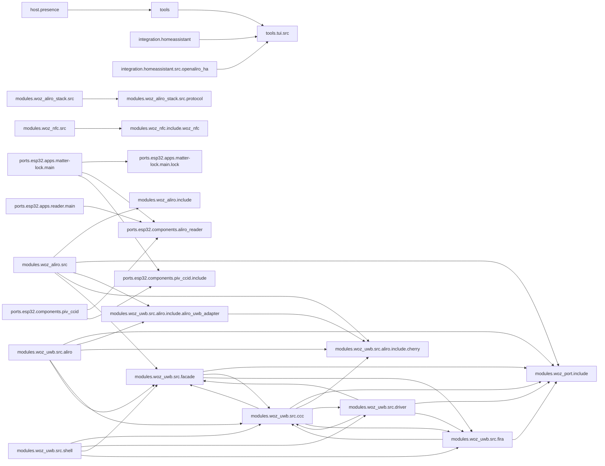

<!-- generated documentation — edit the source, not this file -->
# openaliro

**231 subsystems in 36 directories · 1463/1799 symbols documented (81%)**

**Start here:** [`modules/woz_uwb/src/aliro/aliro_uwb_msg.c`](architecture/modules.woz_uwb.src.aliro/aliro_uwb_msg.c.md), [`modules/woz_aliro/src/aliro_ranging.c`](architecture/modules.woz_aliro.src/aliro_ranging.c.md), [`modules/woz_aliro/src/aliro_reader.c`](architecture/modules.woz_aliro.src/aliro_reader.c.md) — the doors into the codebase (nothing else imports them).

## Directories

| directory | subsystems | documented |
|---|---|---|
| [`host/presence/`](architecture/host.presence/README.md) | 5 | 11/36 (30%) |
| [`integration/homeassistant/`](architecture/integration.homeassistant/README.md) | 1 | 5/5 (100%) |
| [`integration/homeassistant/custom_components/openaliro/`](architecture/integration.homeassistant.custom_components.openaliro/README.md) | 8 | 12/34 (35%) |
| [`integration/homeassistant/scripts/`](architecture/integration.homeassistant.scripts/README.md) | 1 | 1/3 (33%) |
| [`integration/homeassistant/src/openaliro_ha/`](architecture/integration.homeassistant.src.openaliro_ha/README.md) | 11 | 72/120 (60%) |
| [`integration/homeassistant/tools/`](architecture/integration.homeassistant.tools/README.md) | 1 | 1/3 (33%) |
| [`modules/woz_aliro/include/`](architecture/modules.woz_aliro.include/README.md) | 13 | 28/29 (96%) |
| [`modules/woz_aliro/src/`](architecture/modules.woz_aliro.src/README.md) | 18 | 215/230 (93%) |
| [`modules/woz_aliro_ecp/src/`](architecture/modules.woz_aliro_ecp.src/README.md) | 1 | 5/5 (100%) |
| [`modules/woz_aliro_stack/src/`](architecture/modules.woz_aliro_stack.src/README.md) | 4 | 77/77 (100%) |
| [`modules/woz_aliro_stack/src/protocol/`](architecture/modules.woz_aliro_stack.src.protocol/README.md) | 14 | 67/67 (100%) |
| [`modules/woz_nfc/include/woz_nfc/`](architecture/modules.woz_nfc.include.woz_nfc/README.md) | 1 | 1/1 (100%) |
| [`modules/woz_nfc/src/`](architecture/modules.woz_nfc.src/README.md) | 9 | 64/64 (100%) |
| [`modules/woz_port/include/`](architecture/modules.woz_port.include/README.md) | 2 | 12/12 (100%) |
| [`modules/woz_uwb/src/aliro/`](architecture/modules.woz_uwb.src.aliro/README.md) | 10 | 83/83 (100%) |
| [`modules/woz_uwb/src/aliro/include/aliro_uwb_adapter/`](architecture/modules.woz_uwb.src.aliro.include.aliro_uwb_adapter/README.md) | 2 | 4/4 (100%) |
| [`modules/woz_uwb/src/aliro/include/cherry/`](architecture/modules.woz_uwb.src.aliro.include.cherry/README.md) | 4 | 13/13 (100%) |
| [`modules/woz_uwb/src/ccc/`](architecture/modules.woz_uwb.src.ccc/README.md) | 17 | 124/124 (100%) |
| [`modules/woz_uwb/src/driver/`](architecture/modules.woz_uwb.src.driver/README.md) | 8 | 49/49 (100%) |
| [`modules/woz_uwb/src/facade/`](architecture/modules.woz_uwb.src.facade/README.md) | 12 | 86/86 (100%) |
| [`modules/woz_uwb/src/fira/`](architecture/modules.woz_uwb.src.fira/README.md) | 3 | 17/17 (100%) |
| [`modules/woz_uwb/src/shell/`](architecture/modules.woz_uwb.src.shell/README.md) | 2 | 14/14 (100%) |
| [`ports/esp32/apps/matter-lock/main/`](architecture/ports.esp32.apps.matter-lock.main/README.md) | 9 | 56/58 (96%) |
| [`ports/esp32/apps/matter-lock/main/lock/`](architecture/ports.esp32.apps.matter-lock.main.lock/README.md) | 5 | 60/60 (100%) |
| [`ports/esp32/apps/reader/main/`](architecture/ports.esp32.apps.reader.main/README.md) | 3 | 22/22 (100%) |
| [`ports/esp32/components/aliro_ble/`](architecture/ports.esp32.components.aliro_ble/README.md) | 1 | 38/40 (95%) |
| [`ports/esp32/components/aliro_reader/`](architecture/ports.esp32.components.aliro_reader/README.md) | 4 | 17/21 (80%) |
| [`ports/esp32/components/piv_ccid/`](architecture/ports.esp32.components.piv_ccid/README.md) | 4 | 3/60 (5%) |
| [`ports/esp32/components/piv_ccid/include/`](architecture/ports.esp32.components.piv_ccid.include/README.md) | 4 | 1/3 (33%) |
| [`ports/esp32/components/woz_uwb/port/`](architecture/ports.esp32.components.woz_uwb.port/README.md) | 4 | 30/30 (100%) |
| [`release/esp32-matter-lock/`](architecture/release.esp32-matter-lock/README.md) | 1 | 0/0 (0%) |
| [`release/nrf5340dk/`](architecture/release.nrf5340dk/README.md) | 1 | 0/0 (0%) |
| [`scripts/`](architecture/scripts/README.md) | 12 | 47/52 (90%) |
| [`tools/`](architecture/tools/README.md) | 22 | 184/216 (85%) |
| [`tools/tui/src/`](architecture/tools.tui.src/README.md) | 12 | 25/142 (17%) |
| [`web-twin/`](architecture/web-twin/README.md) | 2 | 19/19 (100%) |

## Hotspots

*Mined from git history as of `0a3fa32`.*

**Most-changed:** [`modules/woz_aliro/src/aliro_reader.c`](architecture/modules.woz_aliro.src/aliro_reader.c.md) (19 commits), [`modules/woz_uwb/src/ccc/ccc_shim_rx.c`](architecture/modules.woz_uwb.src.ccc/ccc_shim_rx.c.md) (19 commits), [`ports/esp32/apps/matter-lock/main/app_main.cpp`](architecture/ports.esp32.apps.matter-lock.main/app_main.cpp.md) (16 commits), [`ports/esp32/apps/matter-lock/main/app_shell.cpp`](architecture/ports.esp32.apps.matter-lock.main/app_shell.cpp.md) (11 commits), [`modules/woz_uwb/src/shell/aliro_shell.c`](architecture/modules.woz_uwb.src.shell/aliro_shell.c.md) (9 commits).

**Change together without importing each other:**

- [`modules/woz_uwb/src/shell/aliro_shell.c`](architecture/modules.woz_uwb.src.shell/aliro_shell.c.md) ↔ [`ports/esp32/apps/matter-lock/main/app_shell.cpp`](architecture/ports.esp32.apps.matter-lock.main/app_shell.cpp.md) (6 shared commits)
- [`modules/woz_uwb/src/facade/uwb_cirdiag.h`](architecture/modules.woz_uwb.src.facade/uwb_cirdiag.h.md) ↔ [`ports/esp32/apps/matter-lock/main/app_shell.cpp`](architecture/ports.esp32.apps.matter-lock.main/app_shell.cpp.md) (5 shared commits)
- [`modules/woz_aliro/src/aliro_lat.c`](architecture/modules.woz_aliro.src/aliro_lat.c.md) ↔ [`modules/woz_aliro/src/aliro_ranging.c`](architecture/modules.woz_aliro.src/aliro_ranging.c.md) (4 shared commits)
- [`modules/woz_uwb/src/driver/uwb_cirdiag.c`](architecture/modules.woz_uwb.src.driver/uwb_cirdiag.c.md) ↔ [`modules/woz_uwb/src/shell/aliro_shell.c`](architecture/modules.woz_uwb.src.shell/aliro_shell.c.md) (4 shared commits)
- [`modules/woz_uwb/src/driver/uwb_cirdiag.c`](architecture/modules.woz_uwb.src.driver/uwb_cirdiag.c.md) ↔ [`ports/esp32/apps/matter-lock/main/app_shell.cpp`](architecture/ports.esp32.apps.matter-lock.main/app_shell.cpp.md) (4 shared commits)
