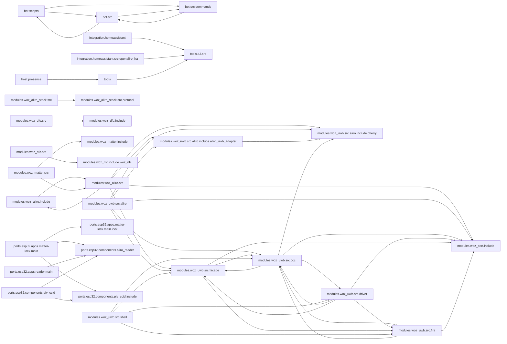

<!-- generated documentation — edit the source, not this file -->
# openaliro

**421 subsystems in 55 directories · 2449/2882 symbols documented (84%)**

**Start here:** [`bot/src/index.ts`](architecture/bot.src/index.ts.md), [`bot/scripts/register-commands.ts`](architecture/bot.scripts/register-commands.ts.md), [`modules/woz_uwb/src/aliro/aliro_uwb_msg.c`](architecture/modules.woz_uwb.src.aliro/aliro_uwb_msg.c.md) — the doors into the codebase (nothing else imports them).

## Directories

| directory | subsystems | documented |
|---|---|---|
| [`activity/`](architecture/activity/README.md) | 1 | 2/4 (50%) |
| [`activity/scripts/`](architecture/activity.scripts/README.md) | 5 | 0/9 (0%) |
| [`activity/src/`](architecture/activity.src/README.md) | 2 | 2/8 (25%) |
| [`bot/eval/`](architecture/bot.eval/README.md) | 12 | 15/72 (20%) |
| [`bot/migrations/`](architecture/bot.migrations/README.md) | 7 | 0/9 (0%) |
| [`bot/scripts/`](architecture/bot.scripts/README.md) | 10 | 8/15 (53%) |
| [`bot/src/`](architecture/bot.src/README.md) | 41 | 94/185 (50%) |
| [`bot/src/commands/`](architecture/bot.src.commands/README.md) | 17 | 12/47 (25%) |
| [`firmware/src/`](architecture/firmware.src/README.md) | 15 | 161/164 (98%) |
| [`host/presence/`](architecture/host.presence/README.md) | 5 | 36/36 (100%) |
| [`integration/homeassistant/`](architecture/integration.homeassistant/README.md) | 1 | 5/5 (100%) |
| [`integration/homeassistant/custom_components/openaliro/`](architecture/integration.homeassistant.custom_components.openaliro/README.md) | 8 | 31/34 (91%) |
| [`integration/homeassistant/scripts/`](architecture/integration.homeassistant.scripts/README.md) | 1 | 3/3 (100%) |
| [`integration/homeassistant/src/openaliro_ha/`](architecture/integration.homeassistant.src.openaliro_ha/README.md) | 11 | 109/120 (90%) |
| [`integration/homeassistant/tools/`](architecture/integration.homeassistant.tools/README.md) | 1 | 3/3 (100%) |
| [`modules/woz_aliro/include/`](architecture/modules.woz_aliro.include/README.md) | 16 | 38/38 (100%) |
| [`modules/woz_aliro/src/`](architecture/modules.woz_aliro.src/README.md) | 21 | 257/257 (100%) |
| [`modules/woz_aliro_ecp/src/`](architecture/modules.woz_aliro_ecp.src/README.md) | 1 | 5/5 (100%) |
| [`modules/woz_aliro_stack/src/`](architecture/modules.woz_aliro_stack.src/README.md) | 4 | 77/77 (100%) |
| [`modules/woz_aliro_stack/src/protocol/`](architecture/modules.woz_aliro_stack.src.protocol/README.md) | 14 | 67/67 (100%) |
| [`modules/woz_dfu/include/`](architecture/modules.woz_dfu.include/README.md) | 2 | 1/1 (100%) |
| [`modules/woz_dfu/scripts/`](architecture/modules.woz_dfu.scripts/README.md) | 1 | 1/1 (100%) |
| [`modules/woz_dfu/src/`](architecture/modules.woz_dfu.src/README.md) | 3 | 42/48 (87%) |
| [`modules/woz_matter/include/`](architecture/modules.woz_matter.include/README.md) | 16 | 44/44 (100%) |
| [`modules/woz_matter/src/`](architecture/modules.woz_matter.src/README.md) | 14 | 209/217 (96%) |
| [`modules/woz_nfc/include/woz_nfc/`](architecture/modules.woz_nfc.include.woz_nfc/README.md) | 1 | 1/1 (100%) |
| [`modules/woz_nfc/src/`](architecture/modules.woz_nfc.src/README.md) | 9 | 64/64 (100%) |
| [`modules/woz_port/include/`](architecture/modules.woz_port.include/README.md) | 2 | 12/12 (100%) |
| [`modules/woz_uwb/src/aliro/`](architecture/modules.woz_uwb.src.aliro/README.md) | 12 | 92/92 (100%) |
| [`modules/woz_uwb/src/aliro/include/aliro_uwb_adapter/`](architecture/modules.woz_uwb.src.aliro.include.aliro_uwb_adapter/README.md) | 2 | 4/4 (100%) |
| [`modules/woz_uwb/src/aliro/include/cherry/`](architecture/modules.woz_uwb.src.aliro.include.cherry/README.md) | 4 | 13/13 (100%) |
| [`modules/woz_uwb/src/ccc/`](architecture/modules.woz_uwb.src.ccc/README.md) | 17 | 125/125 (100%) |
| [`modules/woz_uwb/src/driver/`](architecture/modules.woz_uwb.src.driver/README.md) | 9 | 52/52 (100%) |
| [`modules/woz_uwb/src/facade/`](architecture/modules.woz_uwb.src.facade/README.md) | 12 | 86/86 (100%) |
| [`modules/woz_uwb/src/fira/`](architecture/modules.woz_uwb.src.fira/README.md) | 3 | 17/17 (100%) |
| [`modules/woz_uwb/src/shell/`](architecture/modules.woz_uwb.src.shell/README.md) | 2 | 14/14 (100%) |
| [`ports/esp32/apps/initiator/main/`](architecture/ports.esp32.apps.initiator.main/README.md) | 1 | 3/5 (60%) |
| [`ports/esp32/apps/matter-lock/main/`](architecture/ports.esp32.apps.matter-lock.main/README.md) | 9 | 58/58 (100%) |
| [`ports/esp32/apps/matter-lock/main/lock/`](architecture/ports.esp32.apps.matter-lock.main.lock/README.md) | 5 | 60/60 (100%) |
| [`ports/esp32/apps/reader/main/`](architecture/ports.esp32.apps.reader.main/README.md) | 3 | 22/22 (100%) |
| [`ports/esp32/components/aliro_ble/`](architecture/ports.esp32.components.aliro_ble/README.md) | 1 | 40/40 (100%) |
| [`ports/esp32/components/aliro_ble_central/`](architecture/ports.esp32.components.aliro_ble_central/README.md) | 1 | 14/18 (77%) |
| [`ports/esp32/components/aliro_reader/`](architecture/ports.esp32.components.aliro_reader/README.md) | 4 | 19/21 (90%) |
| [`ports/esp32/components/piv_ccid/`](architecture/ports.esp32.components.piv_ccid/README.md) | 4 | 40/60 (66%) |
| [`ports/esp32/components/piv_ccid/include/`](architecture/ports.esp32.components.piv_ccid.include/README.md) | 4 | 3/3 (100%) |
| [`ports/esp32/components/woz_uwb/port/`](architecture/ports.esp32.components.woz_uwb.port/README.md) | 4 | 30/30 (100%) |
| [`ports/nrf5340dk/on_target_ec/src/`](architecture/ports.nrf5340dk.on_target_ec.src/README.md) | 1 | 1/1 (100%) |
| [`release/dwm3001cdk/`](architecture/release.dwm3001cdk/README.md) | 1 | 0/0 (0%) |
| [`release/esp32-matter-lock/`](architecture/release.esp32-matter-lock/README.md) | 1 | 0/0 (0%) |
| [`release/nrf5340dk/`](architecture/release.nrf5340dk/README.md) | 1 | 0/0 (0%) |
| [`scripts/`](architecture/scripts/README.md) | 37 | 158/202 (78%) |
| [`tools/`](architecture/tools/README.md) | 26 | 221/239 (92%) |
| [`tools/tui/src/`](architecture/tools.tui.src/README.md) | 12 | 51/142 (35%) |
| [`web-flasher/`](architecture/web-flasher/README.md) | 1 | 8/8 (100%) |
| [`web-twin/`](architecture/web-twin/README.md) | 3 | 19/24 (79%) |

## Hotspots

*Mined from git history as of `39a30bf`.*

**Most-changed:** [`modules/woz_aliro/src/aliro_reader.c`](architecture/modules.woz_aliro.src/aliro_reader.c.md) (24 commits), [`modules/woz_matter/src/matter_clusters.c`](architecture/modules.woz_matter.src/matter_clusters.c.md) (23 commits), [`modules/woz_uwb/src/ccc/ccc_shim_rx.c`](architecture/modules.woz_uwb.src.ccc/ccc_shim_rx.c.md) (22 commits), [`scripts/verify.sh`](architecture/scripts/verify.sh.md) (21 commits), [`modules/woz_matter/include/matter_clusters.h`](architecture/modules.woz_matter.include/matter_clusters.h.md) (20 commits).

**Change together without importing each other:**

- [`modules/woz_matter/include/matter_im.h`](architecture/modules.woz_matter.include/matter_im.h.md) ↔ [`modules/woz_matter/src/matter_clusters.c`](architecture/modules.woz_matter.src/matter_clusters.c.md) (7 shared commits)
- [`modules/woz_uwb/src/shell/aliro_shell.c`](architecture/modules.woz_uwb.src.shell/aliro_shell.c.md) ↔ [`ports/esp32/apps/matter-lock/main/app_shell.cpp`](architecture/ports.esp32.apps.matter-lock.main/app_shell.cpp.md) (6 shared commits)
- [`modules/woz_matter/include/matter_clusters.h`](architecture/modules.woz_matter.include/matter_clusters.h.md) ↔ [`modules/woz_matter/src/matter_im.c`](architecture/modules.woz_matter.src/matter_im.c.md) (5 shared commits)
- [`modules/woz_matter/src/matter_clusters.c`](architecture/modules.woz_matter.src/matter_clusters.c.md) ↔ [`modules/woz_matter/src/matter_im.c`](architecture/modules.woz_matter.src/matter_im.c.md) (5 shared commits)
- [`modules/woz_uwb/src/facade/uwb_cirdiag.h`](architecture/modules.woz_uwb.src.facade/uwb_cirdiag.h.md) ↔ [`ports/esp32/apps/matter-lock/main/app_shell.cpp`](architecture/ports.esp32.apps.matter-lock.main/app_shell.cpp.md) (5 shared commits)
