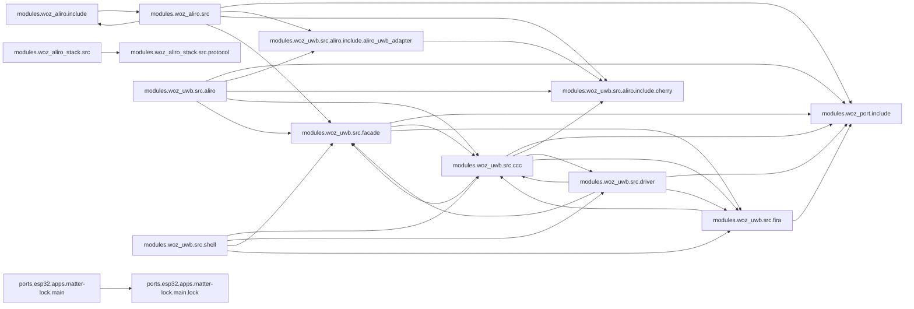

<!-- generated documentation — edit the source, not this file -->
# openaliro

**168 subsystems in 29 directories · 773/1196 symbols documented (64%)**

**Start here:** [`modules/woz_uwb/src/aliro/aliro_uwb_msg.c`](architecture/modules.woz_uwb.src.aliro/aliro_uwb_msg.c.md), [`modules/woz_aliro/src/aliro_ranging.c`](architecture/modules.woz_aliro.src/aliro_ranging.c.md), [`modules/woz_aliro/src/aliro_reader.c`](architecture/modules.woz_aliro.src/aliro_reader.c.md) — the doors into the codebase (nothing else imports them).

## Directories

| directory | subsystems | documented |
|---|---|---|
| [`integration/homeassistant/`](architecture/integration.homeassistant/README.md) | 1 | 4/5 (80%) |
| [`modules/woz_aliro/include/`](architecture/modules.woz_aliro.include/README.md) | 14 | 16/35 (45%) |
| [`modules/woz_aliro/src/`](architecture/modules.woz_aliro.src/README.md) | 19 | 121/224 (54%) |
| [`modules/woz_aliro_ecp/src/`](architecture/modules.woz_aliro_ecp.src/README.md) | 1 | 5/5 (100%) |
| [`modules/woz_aliro_stack/src/`](architecture/modules.woz_aliro_stack.src/README.md) | 4 | 2/77 (2%) |
| [`modules/woz_aliro_stack/src/protocol/`](architecture/modules.woz_aliro_stack.src.protocol/README.md) | 14 | 17/67 (25%) |
| [`modules/woz_port/include/`](architecture/modules.woz_port.include/README.md) | 2 | 12/12 (100%) |
| [`modules/woz_uwb/src/aliro/`](architecture/modules.woz_uwb.src.aliro/README.md) | 12 | 90/92 (97%) |
| [`modules/woz_uwb/src/aliro/include/aliro_uwb_adapter/`](architecture/modules.woz_uwb.src.aliro.include.aliro_uwb_adapter/README.md) | 2 | 4/4 (100%) |
| [`modules/woz_uwb/src/aliro/include/cherry/`](architecture/modules.woz_uwb.src.aliro.include.cherry/README.md) | 4 | 13/13 (100%) |
| [`modules/woz_uwb/src/ccc/`](architecture/modules.woz_uwb.src.ccc/README.md) | 17 | 122/122 (100%) |
| [`modules/woz_uwb/src/driver/`](architecture/modules.woz_uwb.src.driver/README.md) | 7 | 36/36 (100%) |
| [`modules/woz_uwb/src/facade/`](architecture/modules.woz_uwb.src.facade/README.md) | 11 | 36/71 (50%) |
| [`modules/woz_uwb/src/fira/`](architecture/modules.woz_uwb.src.fira/README.md) | 3 | 12/12 (100%) |
| [`modules/woz_uwb/src/shell/`](architecture/modules.woz_uwb.src.shell/README.md) | 1 | 11/11 (100%) |
| [`ports/esp32/apps/initiator/main/`](architecture/ports.esp32.apps.initiator.main/README.md) | 1 | 0/4 (0%) |
| [`ports/esp32/apps/matter-lock/main/`](architecture/ports.esp32.apps.matter-lock.main/README.md) | 7 | 32/33 (96%) |
| [`ports/esp32/apps/matter-lock/main/lock/`](architecture/ports.esp32.apps.matter-lock.main.lock/README.md) | 5 | 60/60 (100%) |
| [`ports/esp32/apps/reader/main/`](architecture/ports.esp32.apps.reader.main/README.md) | 3 | 18/18 (100%) |
| [`ports/esp32/components/aliro_ble/`](architecture/ports.esp32.components.aliro_ble/README.md) | 1 | 33/38 (86%) |
| [`ports/esp32/components/aliro_ble_central/`](architecture/ports.esp32.components.aliro_ble_central/README.md) | 1 | 3/18 (16%) |
| [`ports/esp32/components/aliro_reader/`](architecture/ports.esp32.components.aliro_reader/README.md) | 2 | 3/8 (37%) |
| [`ports/esp32/components/woz_uwb/port/`](architecture/ports.esp32.components.woz_uwb.port/README.md) | 4 | 30/30 (100%) |
| [`ports/nrf5340dk/on_target_ec/src/`](architecture/ports.nrf5340dk.on_target_ec.src/README.md) | 1 | 0/1 (0%) |
| [`release/esp32-matter-lock/`](architecture/release.esp32-matter-lock/README.md) | 1 | 0/0 (0%) |
| [`release/nrf5340dk/`](architecture/release.nrf5340dk/README.md) | 1 | 0/0 (0%) |
| [`scripts/`](architecture/scripts/README.md) | 9 | 16/27 (59%) |
| [`tools/`](architecture/tools/README.md) | 18 | 64/154 (41%) |
| [`web-twin/`](architecture/web-twin/README.md) | 2 | 13/19 (68%) |

## Hotspots

*Mined from git history as of `2c6997a`.*

**Most-changed:** [`modules/woz_uwb/src/ccc/ccc_shim_rx.c`](architecture/modules.woz_uwb.src.ccc/ccc_shim_rx.c.md) (17 commits), [`modules/woz_aliro/src/aliro_reader.c`](architecture/modules.woz_aliro.src/aliro_reader.c.md) (13 commits), [`ports/esp32/apps/matter-lock/main/app_main.cpp`](architecture/ports.esp32.apps.matter-lock.main/app_main.cpp.md) (11 commits), [`scripts/docs.sh`](architecture/scripts/docs.sh.md) (9 commits), [`modules/woz_aliro/src/aliro_ranging.c`](architecture/modules.woz_aliro.src/aliro_ranging.c.md) (7 commits).

**Change together without importing each other:**

- [`modules/woz_aliro/src/aliro_lat.c`](architecture/modules.woz_aliro.src/aliro_lat.c.md) ↔ [`modules/woz_aliro/src/aliro_ranging.c`](architecture/modules.woz_aliro.src/aliro_ranging.c.md) (4 shared commits)
- [`modules/woz_aliro/src/aliro_lat.c`](architecture/modules.woz_aliro.src/aliro_lat.c.md) ↔ [`modules/woz_aliro/src/aliro_reader.c`](architecture/modules.woz_aliro.src/aliro_reader.c.md) (3 shared commits)
- [`modules/woz_aliro/src/aliro_lat.c`](architecture/modules.woz_aliro.src/aliro_lat.c.md) ↔ [`tools/aliro_lab.py`](architecture/tools/aliro_lab.md) (3 shared commits)
- [`modules/woz_aliro/src/aliro_ranging.c`](architecture/modules.woz_aliro.src/aliro_ranging.c.md) ↔ [`tools/aliro_lab.py`](architecture/tools/aliro_lab.md) (3 shared commits)
- [`modules/woz_uwb/src/aliro/aliro_uwb_msg.c`](architecture/modules.woz_uwb.src.aliro/aliro_uwb_msg.c.md) ↔ [`modules/woz_uwb/src/ccc/ccc_shim_rx.c`](architecture/modules.woz_uwb.src.ccc/ccc_shim_rx.c.md) (3 shared commits)
