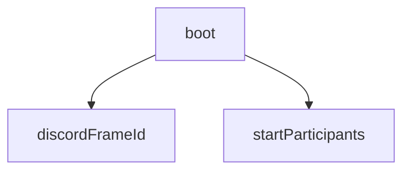

<!-- generated documentation — edit the source, not this file -->
# `activity/src/discord-boot.ts`

Discord Activity boot shim for the openaliro web twin.
The twin is a standalone page that knows nothing about Discord and must keep
working when opened straight off disk. So this file is the entire Discord
surface: it detects the embedded context, marks the document so CSS can
adapt, and completes the SDK handshake. It does not touch the simulation, it
does not request an OAuth scope, and it holds no secret -- the client id is
public by design and is injected at build time.
Anything beyond `ready()` belongs in a later phase.

**depends on** [`activity/src/participants.ts`](participants.ts.md)

## API

### `function discordFrameId(): string | null`
`activity/src/discord-boot.ts:21`

Discord launches the Activity with frame_id in the query string. That is the
documented signal, and unlike a user-agent test it cannot be spoofed into a
false negative by a client we have not seen. Absent it, we are a normal web
page and do nothing at all.

**called by** `boot`

Undocumented (1)

- `boot`

