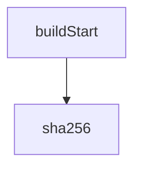

<!-- generated documentation — edit the source, not this file -->
# `activity/vite.config.ts`

**discussed in** [`activity/README.md`](../../../activity/README.md)

## API

### `function twinPassthrough(): Plugin`
`activity/vite.config.ts:25`

twin.js carries the WASM module inline as a byte array, so it is a binary
file wearing a .js extension. Vite must never see it as source: bundling,
minifying or re-encoding it corrupts the firmware. It is copied with fs, and
the copy is compared back against the original before the build succeeds.

### `buildStart()`
`activity/vite.config.ts:33`

Fail before doing any work, so a drifted twin never half-builds.

**calls** `sha256`

Undocumented (2)

- `sha256` — tested: domain separated from a bare hash; repeated builds are byte identical
- `writeBundle`

