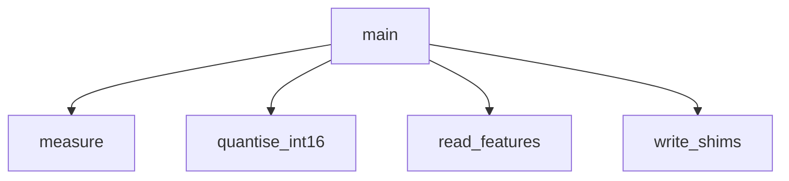

<!-- generated documentation — edit the source, not this file -->
# `ai/tinyml/codesize.py`

Cross-compile the chosen tree for the CDK's core and measure what it costs.

Run (after extract_features.py with PORTABLE=1):
    ai/tinyml/.venv/bin/python ai/tinyml/codesize.py

Options (env vars):
    FEATURES    input .npz (default ai/tinyml/features_dw3000.npz)
    SEED        split seed, must match bakeoff.py (default 42)
    TRIPLE      arm-none-eabi (default) or arm-zephyr-eabi
    DEPTHS      comma-separated tree depths (default 4,6)

bakeoff.py counts model PAYLOAD only, because that is all it can count without a
cross compiler. This closes that gap: it compiles the generated C for the
nRF52833's Cortex-M4F with the same optimisation the firmware uses
(CONFIG_SIZE_OPTIMIZATIONS=y, i.e. -Os) and reports the section sizes.

Two emlearn code generation methods are measured, because they trade the same
bytes in opposite directions:

    loadable  the tree is a const EmlTreesNode[] walked by eml_trees_predict().
              Payload scales with the tree, the walker is a fixed cost, and one
              walker serves any number of trees.
    inline    the tree is generated as nested if/else. No node array and no
              walker at all, so a small tree is pure .text and nothing else.

Sizes come from `arm-none-eabi-size -A` on an object holding only the model and
a three-line wrapper, so every byte reported belongs to the model. Nothing is
linked: at link time --gc-sections can only remove, never add.

**depends on** [`ai/tinyml/features_io.py`](features_io.md)  ·  **discussed in** [`ai/README.md`](../../../ai/README.md), [`ai/tinyml/RESULTS.md`](../../../ai/tinyml/RESULTS.md)

## API

### `quantise_int16(X, lo, span)`
`ai/tinyml/codesize.py:116`

Identical to bakeoff.py: the tree is trained on the quantised features, so
the int16 conversion is lossless rather than applied afterwards.

**called by** `main`

### `section_sizes(obj)`
`ai/tinyml/codesize.py:123`

`size -A` section table, as a name -> bytes dict.

**called by** `measure`

### `measure(name, method, model, dtype='int16_t')`
`ai/tinyml/codesize.py:135`

Generate C for one model, cross-compile it, return its section sizes.

**called by** `main`  ·  **calls** `section_sizes`

Undocumented (2)

- `write_shims`
- `main`

