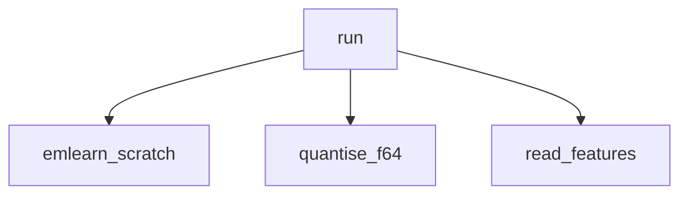

<!-- generated documentation — edit the source, not this file -->
# `ai/tinyml/leaf_bits.py`

Does emlearn's leaf_bits actually close the forest-vs-sklearn gap?

Run from the repository root:
    ai/tinyml/.venv/bin/python <this file>

Result 5 recorded that a converted RandomForest disagrees with sklearn on ~1% of
samples, because the generated C majority-votes where sklearn averages
probabilities, and concluded a forest has no oracle to be certified against.
emlearn 0.23.2's trees.py:553 switches from forest_predict_majority_func to
forest_predict_proportions_func whenever leaf_bits != 0, and leaf_bits defaults
to 0 for classifiers. So the divergence may be a default rather than a property.

It trades one error for another: quantize_probabilities_into_byte (trees.py:26)
puts each leaf's probabilities on 255 steps, so near-ties can still flip. Which
error is bigger is measurable, and this measures it on both data sets that
matter -- the 544 door captures the shipped model uses, and the 42,000-sample
public set the bake-off ran on.

**depends on** [`ai/tinyml/features_io.py`](features_io.md), [`ai/tinyml/gen_model.py`](gen_model.md)  ·  **discussed in** [`ai/tinyml/RESULTS.md`](../../../ai/tinyml/RESULTS.md)

Undocumented (1)

- `run`

