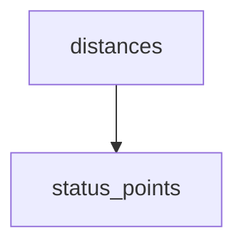

<!-- generated documentation — edit the source, not this file -->
# `ai/tinyml/parse_alab.py`

Turn `make monitor` captures into the scalar feature set, one class per file.

    python3 ai/tinyml/parse_alab.py <capture.log>              # inspect, write nothing
    python3 ai/tinyml/parse_alab.py --clear a.log --blocked b.log -o door.npz

    <capture.log>   RTT log from the cirdiag image (`make monitor ... | tee <file>`)
    --clear FILE    a run with nothing between phone and reader; repeatable
    --blocked FILE  a run with a body, door or laptop in the path; repeatable
    -o FILE         write an .npz that bakeoff.py and gen_model.py read unchanged

ONE CONDITION PER RUN, one file per run. Labelling by cycle marker inside a single run
was tried and is a trap: it needs the operator to change condition on a 23 s clock, and
a single missed interval silently mislabels everything after it. Capture clear until you
are bored, stop, set up the obstruction, capture again.

BUT A BLOCKED RUN IS NOT ENTIRELY BLOCKED, which is what --blocked-window is for. A
session has to be established before anything is received at all, and establishing it
needs enough signal, so an operator blocking the phone hard enough to matter has to
expose it first. Those exposed receptions land in the blocked file and are physically
clear. Measured 2026-08-07 on the first 300-sample pair: 28% of "blocked" samples fell
inside the clear inter-quartile range while 30% sat below the clear 5th percentile --
one label covering two populations. Cross-validated balanced accuracy was 0.6339 against
a 0.6040 vendor-rule baseline, which reads as a weak feature set and is mostly a third of
one class being mislabelled.

So write down the wall-clock spans during which the obstruction was actually in place and
pass them as --blocked-window. Receptions outside every window are DROPPED, never
relabelled: outside the window the condition is unknown, and guessing there is the
original mistake wearing a hat.

The two classes are the ones modules/woz_ml/include/woz_ml.h already names,
WOZ_ML_LOS_CLEAR (y=0) and WOZ_ML_LOS_OBSTRUCTED (y=1), matching eWINE's LOS/NLOS
convention so a model trained here drops into the same seam.

With no labelled files it prints per-interval statistics and writes nothing, which is how
you check a capture is worth keeping before walking any further.

WHY ONLY FOUR FEATURES. The other ten in extract_features.py need the 64-tap CIR window,
and on the DWM3001CDK the image that reads the accumulator cannot range at all (see
ai/tinyml/RESULTS.md Result 7, which also measures the cost of dropping them: 0.14
accuracy points). These four come from `dwt_readdiagnostics` alone.

THE dB CONSTANTS ARE DW1000's. A_CONST_PRF64 and the 2^17 scaling come from the eWINE
formulas, and the DW3000's ipatovPower is a 17-bit "channel area" that is not the same
quantity as the DW1000's CIR_PWR. That is fine here and only here: the model is retrained
on this data, so a consistent offset moves the fitted thresholds and nothing else. Do NOT
compare these dBm numbers against the eWINE ones.

**depends on** [`ai/tinyml/features_io.py`](features_io.md)  ·  **discussed in** [`ai/tinyml/RESULTS.md`](../../../ai/tinyml/RESULTS.md), [`modules/woz_ml/README.md`](../../../modules/woz_ml/README.md)

## API

### `parse_clock(text)`
`ai/tinyml/parse_alab.py:95`

"HH:MM:SS" -> seconds since midnight. Accepts a bare "HH:MM" too.

**called by** `parse_windows`

### `parse_windows(specs)`
`ai/tinyml/parse_alab.py:105`

["03:20:10-03:23:00", ...] -> [(start_s, end_s), ...], empty meaning "no filter".

**called by** `main`  ·  **calls** `parse_clock`

### `parse_log(path)`
`ai/tinyml/parse_alab.py:123`

Return (records, skipped). Each record is the k=v dict plus the cycle it fell in.

A reception belongs to the cycle whose `capture` marker most recently preceded it;
receptions after an `end` and before the next `capture` are in the gap and carry
cycle None, because that is when the operator is repositioning and the label does
not hold.

**called by** `load`

### `status_points(path)`
`ai/tinyml/parse_alab.py:156`

(rx_count, distance_cm) for every FRESH status line, in reception order.

Lines reading `stale Ns` carry a distance from N seconds ago and are dropped: a stale
reading is the reader's own statement that it does not know the current range.

**called by** `distances`

### `distances(path, records, every)`
`ai/tinyml/parse_alab.py:171`

Per-reception range in cm, NaN where none can be attributed to the reception.

TWO SOURCES, and the good one is preferred silently. Firmware built after the `d=`
field was added puts the DS-TWR distance on the [ALAB] line itself, along with `dage`,
its age in milliseconds. That needs no alignment at all: the range arrives attached to
the reception it belongs to, and a plain `make monitor` capture carries it.

Older captures have neither key, and for those the range has to be recovered by
scraping the bench TUI's RENDERED status line and interpolating on the reception
counter, which is why every capture before this had to be made with `make openaliro`.
That path is kept because the tracked 2026-08-07 set was made that way and has to stay
reproducible; it is not the path to use for new work.

`every` is CONFIG_WOZ_UWB_CIRDIAG_SUMMARY_EVERY and only matters to the old path: the
firmware emits one [ALAB] line per `every` receptions, so record `n` sits at rx count
~n*every. Both sequences are monotonic in that counter, so a piecewise-linear
interpolation between status lines is the natural association, and it extrapolates to
neither end.

**called by** `load`  ·  **calls** `status_points`

### `path_loss_residual(fp_pwr, dist_cm)`
`ai/tinyml/parse_alab.py:213`

fp_pwr with free-space spreading at `dist_cm` removed, referenced to 1 m.

**called by** `load`

### `features(records)`
`ai/tinyml/parse_alab.py:218`

The four scalar features, in FEATURE_NAMES order.

**called by** `load`

### `load(path, label, want_len=None, windows=None, every=None)`
`ai/tinyml/parse_alab.py:240`

One file's usable receptions as (X, y, frame lengths, report lines).

`windows` is a list of (start, end) wall-clock seconds. When given, receptions
OUTSIDE every window are dropped rather than relabelled: outside the window the
condition is unknown, and a guess there is exactly the mistake this argument exists
to prevent (see the module docstring on the exposed phase).

**called by** `main`  ·  **calls** `distances`, `features`, `parse_log`, `path_loss_residual`

### `frame_mix_report(lens, y)`
`ai/tinyml/parse_alab.py:292`

Per-class frame-length mix, and a warning when the classes do not match.

THIS EXISTS BECAUSE THE CONFOUND ALMOST SHIPPED. On 2026-08-07 the first labelled
pair was 94% len=0 in the clear class and 24% in the blocked one, because the clear
capture predated the fix that let rounds complete: a broken round retries POLLs
(len=0 RFRAMEs) while a working one carries Pre-POLL and Final_Data too. Pooled, the
strongest-looking feature was rxpacc at d=-1.01 and 0.800 balanced accuracy. Split by
frame length it collapses to d~0.2: it was measuring frame type, not obstruction. A
model trained on that mixture would have scored well and learned the wrong thing.

fp_pwr and pwr_diff survived the split at d=-1.2..-3.3 and +0.95..+1.44, consistently
signed in every stratum, which is what a real physical effect looks like.

**called by** `main`

Undocumented (1)

- `main`

