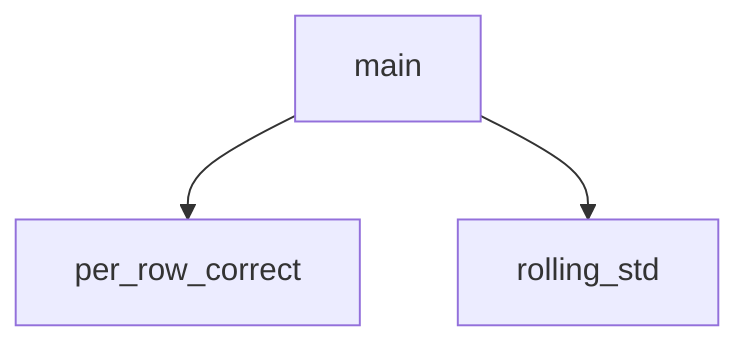

<!-- generated documentation — edit the source, not this file -->
# `ai/tinyml/variance_significance.py`

Is the best variance gain real, and is the information already in the model?

Run from the repository root, after ai/tinyml/variance.py:
    ai/tinyml/.venv/bin/python ai/tinyml/variance_significance.py

Two questions the headline deltas cannot answer.

1. SIGNIFICANCE. +0.028 on 8 folds is one or two receptions per fold. A paired
   bootstrap over whole blocks -- resampling the unit that was held out, not the
   rows -- says how often the gain survives a different draw of the same data.

2. REDUNDANCY. pwr_diff = rx_pwr - fp_pwr, and both are already in the model, so
   a large solo effect size does not imply new information. If its variance is
   predictable from the shipped pair, the model already has it.

Undocumented (3)

- `rolling_std`
- `main`
- `per_row_correct`

