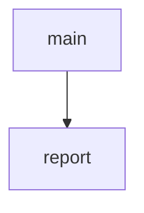

<!-- generated documentation — edit the source, not this file -->
# `anchor/src/main.c`

*No module docstring. First commit: "anchor: two-anchor DS-TWR bench link (stage A)".*

**depends on** [`anchor/src/anchor_twr.h`](anchor_twr.h.md)

## API

### `static void report(void)`
`anchor/src/main.c:49`

One line per report interval, in a form a host script can parse without
knowing anything about this firmware: `ANCHOR` then key=value pairs.
Printed from thread context between rounds, never from the exchange, and
deliberately not once per round -- at the initiator's cadence a per-round
line is a print every few tens of milliseconds, which is exactly the load
this board's ranging path cannot absorb.

**called by** `main`

### `int main(void)`
`anchor/src/main.c:72`

Entry point. Brings the DW3000 up, applies the anchor PHY, then loops on the
configured role for ever. Returns non-zero only if the radio never came up,
which on this board is a wiring or power fault rather than a software one.

**calls** `report`
