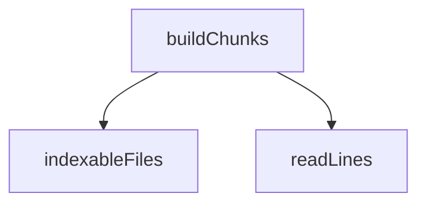

<!-- generated documentation — edit the source, not this file -->
# `bot/eval/corpus.ts`

@file What gets indexed, and how it is cut up for the Stage 0 baseline.
The chunker here is deliberately naive: fixed line windows with overlap, no
grammar awareness at all. That is the point. Stage 0 measures the floor, so
the custom Kconfig/devicetree/Makefile chunkers proposed for Stage 1 have a
number to beat rather than an assertion to agree with.
File selection is `git ls-files` minus binaries and minus anything generated,
so a hit can never come from a file that would be rebuilt rather than edited.

**depends on** [`bot/eval/golden.ts`](golden.ts.md)  ·  **used by** [`bot/eval/chunk-kconfig.ts`](chunk-kconfig.ts.md), [`bot/eval/headers.ts`](headers.ts.md), [`bot/eval/independent.ts`](independent.ts.md), [`bot/eval/retrieve.ts`](retrieve.ts.md), [`bot/eval/scope.ts`](scope.ts.md), [`bot/eval/stage0.ts`](stage0.ts.md), [`bot/eval/stage1-probe.ts`](stage1-probe.ts.md)

## API

### `function readLines(file: string): string[] | null`
`bot/eval/corpus.ts:66`

Read a file as lines, or null when it is not valid UTF-8 text.

**called by** `buildChunks`

### `export function covers(chunk: Chunk, file: string, line: number): boolean`
`bot/eval/corpus.ts:97`

True when `chunk` covers `line` of `file` — the hit test the scorer uses.

**called by** `hitAt`, `hitAt`, `hitAt`, `main`, `makeScorer`, `score`, `scoreQuestion`, `seen`

Undocumented (2)

- `indexableFiles`
- `buildChunks`

