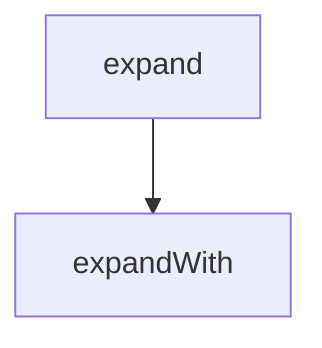

<!-- generated documentation — edit the source, not this file -->
# `bot/eval/expand.ts`

@file The vocabulary alias table, and query expansion over it.
Lives on its own because two experiments need it: the Stage 1 probe, which
measured it as the one candidate fix that moves the config stratum, and the
independent-set scorer, which has to run the same expansion against questions
written by somebody who never saw this table.
On overfitting: it would be trivial to read the miss list, write an alias per
failing question and report a wonderful number that means nothing. Every entry
below is written from the domain's own vocabulary -- a serial port IS a UART,
a console IS where logs go -- and not one was added by looking at which
questions failed. It is also small enough to read in one screen, which is the
honest way to let somebody check that claim.

**used by** [`bot/eval/headers.ts`](headers.ts.md), [`bot/eval/independent.ts`](independent.ts.md), [`bot/eval/stage1-probe.ts`](stage1-probe.ts.md)

Undocumented (3)

- `expandWith`
- `expand`
- `expandHeldOut`

