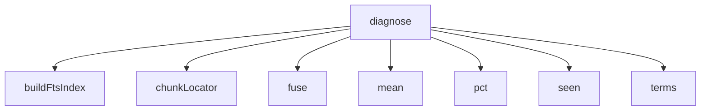

<!-- generated documentation — edit the source, not this file -->
# `bot/eval/independent.ts`

@file Validate and score a golden set this session did not write.
Every number in this directory rests on 183 questions written by the same
agent that then graded them, which is the one weakness the harness cannot
measure about itself. A question written by somebody who has just read the
answering line tends to share vocabulary with it, and lexical retrieval is
exactly the technique that reward biases like that. So the headline finding —
identifier phrasing retrieves at 0.93, prose phrasing at 0.38 — could in
principle be an artifact of how the questions were phrased rather than a fact
about the repository.
`independent.jsonl` holds 90 questions written by three separate agents, each
scoped to one slice of the tree and each told to draft its questions from an
imagined situation BEFORE opening any file that might answer them, so the
wording could not be copied off the line being cited. None of them read
`bot/eval/`. This script then:
1. rejects every anchor that does not resolve, so a hallucinated path or a
misquoted substring cannot enter the measurement,
2. classifies each question mechanically as identifier-phrased or
prose-phrased, by whether it contains a token the retriever can match
exactly, and
3. scores the same retrieval stack on both sets under the same classifier.
Blindness here is by instruction, not by sandbox. It cannot be proved from
inside, and the honest reason to believe it is the result: an agent that had
read the answer key would not have produced a set the harness scores 0.34
lower.
Usage: node eval/independent.ts [dir]
no argument   score the committed independent.jsonl
a directory   score every indep-*.jsonl in it, for vetting a fresh batch
before merging it in

**depends on** [`bot/eval/corpus.ts`](corpus.ts.md), [`bot/eval/expand.ts`](expand.ts.md), [`bot/eval/golden.ts`](golden.ts.md), [`bot/eval/headers.ts`](headers.ts.md), [`bot/eval/retrieve.ts`](retrieve.ts.md)

## API

### `function validate(raw: RawQuestion[]):`
`bot/eval/independent.ts:112`

Drop anchors that do not resolve, and questions left with none.

**called by** `main`  ·  **calls** `indexableFiles`, `resolveAnchor`

### `function diagnose(label: string, items: { q: string; gold: GoldAnchor[] }[], chunks: Chunk[], files: string[]): void`
`bot/eval/independent.ts:265`

Where do the misses actually fail?
This is the question the Stage 0 README deferred, and it decides whether the
Stage 2 dense-retrieval layer gets built. Every anchor lands in one bucket:
hit           in the top 10 the bot would actually serve
buried        missed at 10, but present in the top 200 of a deeper search —
the lexical index CAN see it and the ranking buries it, which
a reranker fixes and embeddings are not needed for
unreachable   absent even from 200 — the query and the answering line share
too little for the index to surface it at all, the vocabulary
gap, and the only honest argument for embeddings
Two traps, both hit while writing this and both worth stating, since the
bucket split is the number the Stage 2 decision rests on:
RRF is depth-dependent. A chunk ranked 15th by FTS5 and 3rd by ripgrep gets
only ripgrep's contribution when each list is cut at 10, and both when they
are cut at 200, so the fused order genuinely differs. "Rank <= 10 in a
depth-200 fusion" is therefore NOT the top 10 the bot serves. Hits are
decided by the same depth-10 fusion the headline table uses, and only the
misses are looked up in the deep list.
Fusing two lists of 200 yields up to 400 entries, so the deep list must be
sliced to 200 before "not in 200" means anything.
These counts are micro-averaged over anchors, whereas the headline table is
macro-averaged over questions, so `hit/total` here differs slightly from the
recall@10 above. The overlap column counts how many of the query's extracted
terms appear in the answering chunk, so "unreachable" can be checked rather
than assumed.

**called by** `main`  ·  **calls** `buildFtsIndex`, `chunkLocator`, `fuse`, `mean`, `pct`, `seen`, `terms`

Undocumented (13)

- `isIdentifierPhrased`
- `loadRaw`
- `mean`
- `makeScorer`
- `hitAt`
- `summarise`
- `slice` — tested: :/matrix with data and a fresh cooldown renders a real png attachment@l78; :fit rule drops whole entries from the tail and never overflows@l29; :render matrix png honours a validation result by rendering without throwing@l98; :render matrix png produces a real, valid png for a single-cell matrix@l49; it:never returns spec prose, only file:line pointers@l91; it:rejects a malformed public key without throwing@l66; it:rejects malformed hex without throwing@l56; it:reports the real recorded flash and ram figures@l32
- `table`
- `fuse`
- `seen`
- `pct`
- `main`
- `q`

