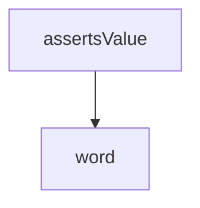

<!-- generated documentation — edit the source, not this file -->
# `bot/eval/score-deepwiki.ts`

@file Re-score the cached DeepWiki answers, with a metric that is fair to prose.
The strict metric in deepwiki.ts asks whether the answer contains the gold
`expect` text verbatim. For a config anchor that is nearly fair, but it scored
this as a miss:
expect: CONFIG_BT_MAX_CONN=1
answer: "...for the DWM3001CDK target, this value is set to `1`"
which is a correct answer. Reporting 0.020 on the identifier stratum off the
back of that would have been a measurement artifact presented as a finding.
So two metrics are reported side by side:
strict — the gold text appears verbatim. A floor.
fair   — for `SYMBOL=VALUE` anchors, the answer names SYMBOL and states
VALUE within 120 characters of it. For prose anchors, at least 80%
of the gold line's distinctive tokens appear.
`fair` is the honest read of whether the answer carries the fact. `strict`
stays because it is the one a machine could check without judgement, and the
gap between them is itself informative.

**depends on** [`bot/eval/golden.ts`](golden.ts.md)

## API

### `function tokens(expect: string): string[]`
`bot/eval/score-deepwiki.ts:40`

Distinctive tokens of a gold line: alphanumeric/underscore runs of 3+ chars.

**called by** `fairHit`  ·  **calls** `norm`

### `function symbolValue(expect: string): [string, string] | null`
`bot/eval/score-deepwiki.ts:45`

`CONFIG_X=value` -> ["config_x", "value"], else null.

**called by** `fairHit`  ·  **calls** `norm`

### `function assertsValue(window: string, value: string): boolean`
`bot/eval/score-deepwiki.ts:64`

Does `window` assert `value` for a Kconfig symbol?
Kconfig's `y` and `n` are one character long, so a substring test scores
"is enabled" as an assertion of `=n` — the "n" inside "enabled". That
over-credited most of the config stratum before it was caught. Booleans are
matched as whole words or by their prose equivalents; everything else needs a
word-boundary match so `=1` is not satisfied by the 1 in 1024.

**called by** `fairHit`  ·  **calls** `word`

Undocumented (7)

- `norm`
- `strictHit`
- `word`
- `fairHit`
- `mean`
- `main`
- `frac`

