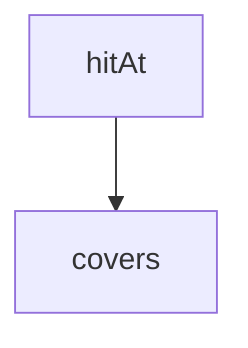

<!-- generated documentation — edit the source, not this file -->
# `bot/eval/stage0.ts`

@file Stage 0 baseline D: the lexical floor, measured.
Recall@k here is a retrieval metric, so this runs with no API key, no network
and no model call. That matters: the Stage 0 gate can be decided for $0, and
only the baselines that are somebody else's hosted service cost anything.
A gold anchor counts as retrieved when a returned chunk covers the line that
actually contains its `expect` substring at HEAD. That is the same test as
"the citation resolves to the right lines at a pinned SHA", which is the
third weighted stratum, so citation correctness is not scored separately for
this baseline — it is what recall already means here.

**depends on** [`bot/eval/corpus.ts`](corpus.ts.md), [`bot/eval/golden.ts`](golden.ts.md), [`bot/eval/retrieve.ts`](retrieve.ts.md)

Undocumented (5)

- `scoreQuestion`
- `hitAt`
- `mean`
- `report`
- `main`

