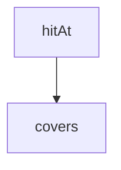

<!-- generated documentation — edit the source, not this file -->
# `bot/eval/stage1-probe.ts`

@file Which candidate fix actually moves the config stratum?
Four variants over the same golden set, so the Stage 1 build order is chosen
by measurement rather than by the order the design brief listed them in.
naive          the committed baseline: 40-line windows
kconfig        grammar-aware chunks for .conf files
expand         naive chunks, query expanded through a vocabulary alias table
kconfig+expand both
headers        naive chunks, each given a deterministic keyword header
The alias table and the overfitting hold-out live in `expand.ts`, because the
independent-set scorer has to run the same expansion.

**depends on** [`bot/eval/chunk-kconfig.ts`](chunk-kconfig.ts.md), [`bot/eval/corpus.ts`](corpus.ts.md), [`bot/eval/expand.ts`](expand.ts.md), [`bot/eval/golden.ts`](golden.ts.md), [`bot/eval/headers.ts`](headers.ts.md), [`bot/eval/retrieve.ts`](retrieve.ts.md)

## API

### `function hybridChunks(): Chunk[]`
`bot/eval/stage1-probe.ts:26`

Naive windows everywhere except .conf, which gets one chunk per symbol.

**called by** `main`  ·  **calls** `buildChunks`, `chunkKconfig`, `isKconfig`, `readLines`

Undocumented (5)

- `mean`
- `main`
- `q`
- `hitAt`
- `pick`

