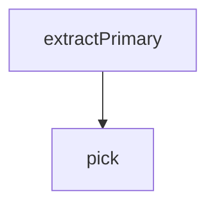

<!-- generated documentation — edit the source, not this file -->
# `bot/scripts/size-baseline-extract.ts`

@file The extraction logic, separate from the file I/O in
build-size-baseline.ts so size-baseline.test.ts can drive it against a
fresh read without importing a script that writes files as a side effect.

**depends on** [`bot/src/size-baseline.ts`](../bot.src/size-baseline.ts.md)  ·  **used by** [`bot/scripts/build-size-baseline.ts`](build-size-baseline.ts.md)

## API

### `export function extractPrimary(raw: unknown): SizeBaseline | null`
`bot/scripts/size-baseline-extract.ts:11`

Same shape check `src/size-baseline.ts` does at runtime, reused so the
generator and the (unused, but retained as a fallback contract) runtime
reader agree on what "parseable" means.

**calls** `pick`

### `const pick = (r: { size: number; used: number; free: number; pct: number }) => ({ size: r.size, used: r.used, free: r.free, pct: r.pct, })`
`bot/scripts/size-baseline-extract.ts:46`

Picked field by field rather than spread: the source objects carry
origin/used_by_sections/load_images/padding too, which nothing here
reads, and copying them would both widen RegionUsage for no reason and
silently re-fatten the generated file the next time the source schema
grows a field.

**called by** `extractPrimary`
