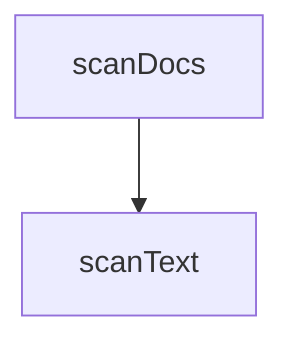

<!-- generated documentation — edit the source, not this file -->
# `bot/scripts/spec-scan.ts`

**used by** [`bot/scripts/build-spec-index.ts`](build-spec-index.ts.md), [`bot/src/spec-index.generated.ts`](../bot.src/spec-index.generated.ts.md)

## API

### `export function scanText(file: string, text: string): SpecCitation[]`
`bot/scripts/spec-scan.ts:52`

`read` returns a docs/*.md file's contents, or null. Exposed for tests, so
they can drive this against fixtures without touching the filesystem.

**called by** `scanDocs`  ·  **calls** `tokensOn`

### `export function scanDocs(docsDir: string, repoRelativePrefix: string): SpecCitation[]`
`bot/scripts/spec-scan.ts:93`

Every `docs/*.md` file, scanned. `docsDir` is `docs/` itself so tests can
point it at a fixture directory instead.

**calls** `scanText`

Undocumented (1)

- `tokensOn`

