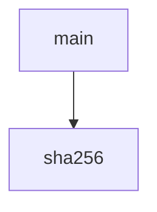

<!-- generated documentation — edit the source, not this file -->
# `bot/scripts/twin-wasm-extract.ts`

@file Extract the WASM module embedded in web-twin/twin.js into src/twin.wasm.
`/twin` runs the compiled firmware inside a Cloudflare Worker, not a
browser. workerd refuses runtime WASM code generation from a byte array
(`WebAssembly.instantiate(bytes, …)` — the exact path twin.js's own
`findWasmBinary()`/`instantiateArrayBuffer()` take — fails there with
"Wasm code generation disallowed by embedder"; confirmed directly against
`wrangler dev`, see docs/twin-worker-phase0.md). A WASM module imported as
a build-time module resource (`import wasmModule from "./twin.wasm"`) is
compiled ahead of time instead, which workerd does allow, and Emscripten's
`Module["instantiateWasm"]` hook lets a caller supply that precompiled
module without twin.js ever reaching its own embedded-bytes path.
This script produces that file — once, checked in — by requiring the real,
unmodified twin.js under Node (where runtime WASM codegen is allowed) and
capturing the exact bytes its own `WebAssembly.instantiate` call receives.
twin.js is never edited, forked, or re-encoded; only observed.
Run after any web-twin/twin.js rebuild: `npm run twin-extract` in bot/,
then commit src/twin.wasm and src/twin.lock.json together. `npm test`'s
drift guard (test/twin-wasm-drift.test.ts) fails if twin.js changes without
a matching re-extraction.

Undocumented (2)

- `sha256`
- `main`

