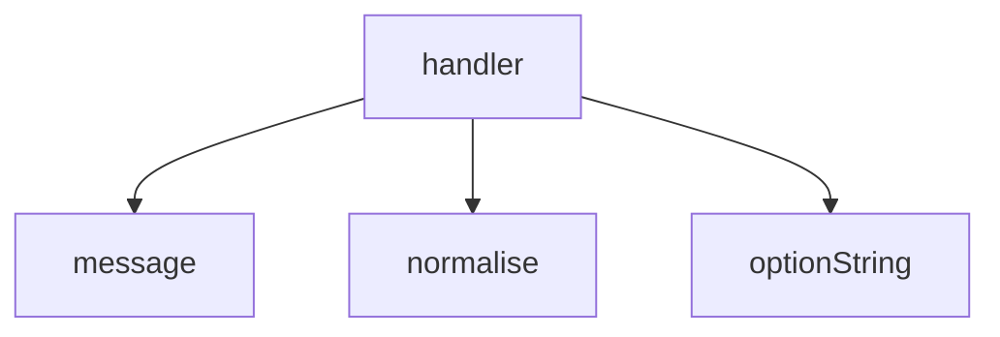

<!-- generated documentation — edit the source, not this file -->
# `bot/src/commands/decode-devid.ts`

@file `/decode-devid` — the most common bring-up failure.
`make selftest` logs the raw DEV_ID read from the DW3110 over SPI. The tree
documents exactly two outcomes for that value, and this command encodes those
two. Anything else is reported as unrecognised: a DEV_ID that is neither the
healthy prefix nor one of the two dead reads is a fact nobody here has
written down, and inventing a reading for it is how a triage bot starts
costing people evenings.

**depends on** [`bot/src/citations.ts`](../bot.src/citations.ts.md), [`bot/src/command.ts`](../bot.src/command.ts.md), [`bot/src/discord.ts`](../bot.src/discord.ts.md)  ·  **used by** [`bot/src/commands/index.ts`](index.ts.md)

## API

### `export function normalise(raw: string): string | null`
`bot/src/commands/decode-devid.ts:39`

Accept `0xDECA0302`, `DECA0302`, `deca0302`, and short forms, but nothing
that is not hex. Returns 8 lowercase hex digits, or null.
Only the ends are trimmed. Internal whitespace is a rejection rather than
something to strip: a paste of two values would otherwise be spliced into a
third that nobody's board ever reported, and answered confidently.

**called by** `handler`

Undocumented (1)

- `handler`

