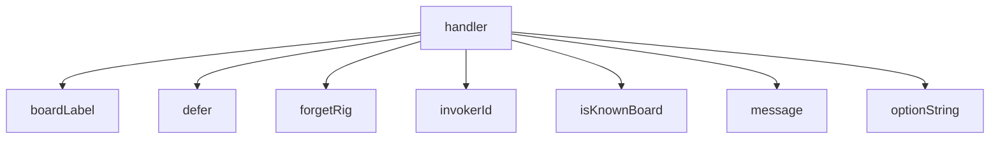

<!-- generated documentation — edit the source, not this file -->
# `bot/src/commands/forget.ts`

@file `/forget` — hard delete.
Not a flag, not a soft delete, not a tombstone. The row goes. With no
`board` argument, every row for the invoker goes.

**depends on** [`bot/src/boards.ts`](../bot.src/boards.ts.md), [`bot/src/command.ts`](../bot.src/command.ts.md), [`bot/src/discord.ts`](../bot.src/discord.ts.md), [`bot/src/followup.ts`](../bot.src/followup.ts.md), [`bot/src/rigs.ts`](../bot.src/rigs.ts.md)  ·  **used by** [`bot/src/commands/index.ts`](index.ts.md)

Undocumented (1)

- `handler`

