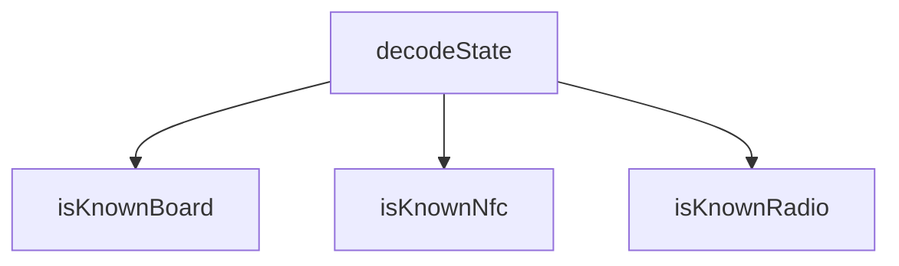

<!-- generated documentation — edit the source, not this file -->
# `bot/src/commands/ihave.ts`

@file `/ihave` — register hardware.
Board, radio and NFC front-end are command options: Discord fills these in
from `choices` before the interaction ever reaches this Worker, which is a
client-validated dropdown exactly like a modal string select would be, and
costs nothing against a modal's (unconfirmed) component limit. See
bot/README.md for why those three fields live here and not in the modal.
Everything else — phone model, iOS version, the awake window, and the UTC
offset — is free text or needs a 25-option select the command-option
`choices` list cannot hold (iOS version) or is genuinely one-shot text
(the awake window), so it goes in a modal. The three option values are not
available on the follow-up MODAL_SUBMIT interaction — it is a separate
interaction — so they are smuggled through the modal's own `custom_id`.

**depends on** [`bot/src/boards.ts`](../bot.src/boards.ts.md), [`bot/src/command.ts`](../bot.src/command.ts.md), [`bot/src/discord.ts`](../bot.src/discord.ts.md), [`bot/src/followup.ts`](../bot.src/followup.ts.md), [`bot/src/modal.ts`](../bot.src/modal.ts.md), [`bot/src/rigs.ts`](../bot.src/rigs.ts.md)  ·  **used by** [`bot/src/commands/index.ts`](index.ts.md)

## API

### `function encodeState(board: string, radio: string, nfc: string): string`
`bot/src/commands/ihave.ts:75`

`ihave:board:radio:nfc` — none of the three values can contain `:`, they
are closed enums validated before this is built.

**called by** `handler`

Undocumented (3)

- `decodeState`
- `handler`
- `modalHandler`

