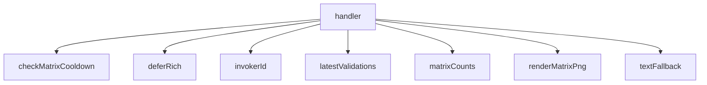

<!-- generated documentation — edit the source, not this file -->
# `bot/src/commands/matrix.ts`

@file `/matrix` — the compatibility matrix.
Public and non-ephemeral: this is the artifact people screenshot, and a
screenshot of a message only its poster can see is not useful to anyone
else. Tries the PNG render first; falls back to the monospace table from
bot/README's "phase 3" both when the per-user cooldown is still active
(PNG rendering is the expensive path) and when rendering itself throws,
so a WASM or layout failure degrades the command instead of erroring it.

**depends on** [`bot/src/command.ts`](../bot.src/command.ts.md), [`bot/src/cooldown.ts`](../bot.src/cooldown.ts.md), [`bot/src/discord.ts`](../bot.src/discord.ts.md), [`bot/src/followup.ts`](../bot.src/followup.ts.md), [`bot/src/matrix.ts`](../bot.src/matrix.ts.md), [`bot/src/render.ts`](../bot.src/render.ts.md), [`bot/src/rigs.ts`](../bot.src/rigs.ts.md), [`bot/src/validations.ts`](../bot.src/validations.ts.md)  ·  **used by** [`bot/src/commands/index.ts`](index.ts.md)

Undocumented (2)

- `textFallback`
- `handler`

