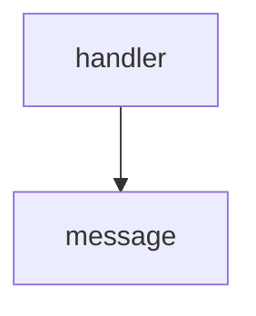

<!-- generated documentation — edit the source, not this file -->
# `bot/src/commands/ping.ts`

@file `/ping` — the liveness check.
Answers only if the signature already verified, so a successful reply proves
three things at once: the endpoint is reachable, the public key binding is
the right one, and the Worker is inside the 3 second response deadline
without deferring. That is the whole point of it, and it is why this command
touches no binding: it must not be able to fail for a second reason.

**depends on** [`bot/src/command.ts`](../bot.src/command.ts.md), [`bot/src/discord.ts`](../bot.src/discord.ts.md)  ·  **used by** [`bot/src/commands/index.ts`](index.ts.md)

Undocumented (1)

- `handler`

