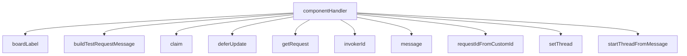

<!-- generated documentation — edit the source, not this file -->
# `bot/src/commands/test-request.ts`

@file `/test-request board: ios: what:` — maintainer-only.
Looks owners up the same way `/who-has` does, partitions them into awake
and asleep from their stored UTC offset and awake window, posts a status
Container to the fixed test-queue channel (not wherever the command was
run — `TEST_QUEUE_CHANNEL_ID`), and pings only the awake half. Nobody's
identity appears in the persistent card itself, only aggregate counts,
matching this bot's "user IDs are not a browsable roster" posture even
though this command's whole job is finding and reaching specific people:
the card is what everyone in the channel sees, the ping is a disposable
message naming exactly the candidates being paged.

**depends on** [`bot/src/awake.ts`](../bot.src/awake.ts.md), [`bot/src/boards.ts`](../bot.src/boards.ts.md), [`bot/src/command.ts`](../bot.src/command.ts.md), [`bot/src/discord.ts`](../bot.src/discord.ts.md), [`bot/src/discordRest.ts`](../bot.src/discordRest.ts.md), [`bot/src/followup.ts`](../bot.src/followup.ts.md), [`bot/src/maintainer.ts`](../bot.src/maintainer.ts.md), [`bot/src/rigs.ts`](../bot.src/rigs.ts.md), [`bot/src/testRequestContainer.ts`](../bot.src/testRequestContainer.ts.md), [`bot/src/testRequests.ts`](../bot.src/testRequests.ts.md)  ·  **used by** [`bot/src/commands/index.ts`](index.ts.md)

## API

### `export function componentHandler(c: CommandContext): Response`
`bot/src/commands/test-request.ts:155`

The Accept button's own handler: first click wins (claim() is an atomic
UPDATE...WHERE guard), starts a thread, and edits the card in place to
CLAIMED. A losing click never touches the card — it would clobber
whichever edit the winner's click already wrote — and gets a private
"someone already accepted this" instead.

**calls** `boardLabel`, `buildTestRequestMessage`, `claim`, `deferUpdate`, `getRequest`, `invokerId`, `message`, `requestIdFromCustomId`

Undocumented (1)

- `handler`

