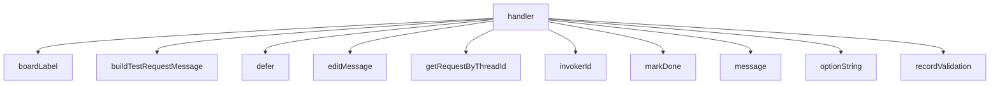

<!-- generated documentation — edit the source, not this file -->
# `bot/src/commands/test-result.ts`

@file `/test-result pass|fail` — run inside the claim thread, by whoever
claimed it. Closes the job (`claimed -> done`, atomically, so a retried
or duplicate delivery cannot record two validations for one claim),
writes a validation row, and edits the original queue Container to a
pass/fail accent — the one edit in this bot that a component's own
interaction token cannot make, since this command runs in the thread, a
different channel from the card it needs to update, so it goes through
the bot token like the escalation sweep does.

**depends on** [`bot/src/boards.ts`](../bot.src/boards.ts.md), [`bot/src/command.ts`](../bot.src/command.ts.md), [`bot/src/discord.ts`](../bot.src/discord.ts.md), [`bot/src/discordRest.ts`](../bot.src/discordRest.ts.md), [`bot/src/followup.ts`](../bot.src/followup.ts.md), [`bot/src/testRequestContainer.ts`](../bot.src/testRequestContainer.ts.md), [`bot/src/testRequests.ts`](../bot.src/testRequests.ts.md), [`bot/src/validations.ts`](../bot.src/validations.ts.md)  ·  **used by** [`bot/src/commands/index.ts`](index.ts.md)

Undocumented (1)

- `handler`

