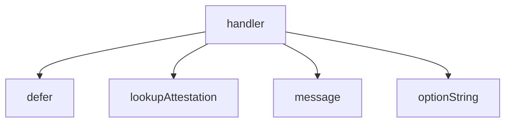

<!-- generated documentation — edit the source, not this file -->
# `bot/src/commands/verify.ts`

@file `/verify <sha256>` — attestation lookup by subject digest.
Answers "did openaliro/openaliro's CI actually build this file", from
GitHub's public attestations API, not from a SHA256SUMS.txt served next to
the artifact it describes (a compromise that could replace the binary could
replace that file in the same motion — `scripts/security-attest.sh`'s own
reasoning for why this control exists at all).

**depends on** [`bot/src/attest.ts`](../bot.src/attest.ts.md), [`bot/src/command.ts`](../bot.src/command.ts.md), [`bot/src/discord.ts`](../bot.src/discord.ts.md), [`bot/src/followup.ts`](../bot.src/followup.ts.md)  ·  **used by** [`bot/src/commands/index.ts`](index.ts.md)

Undocumented (1)

- `handler`

