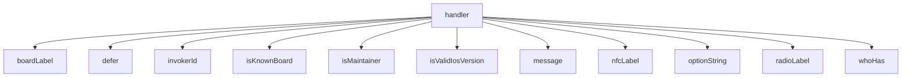

<!-- generated documentation — edit the source, not this file -->
# `bot/src/commands/who-has.ts`

@file `/who-has` — maintainer-only lookup.
Returns user IDs to ping, not a browsable roster: `default_member_permissions:
"0"` hides it from everyone without guild administrator rights, and the
handler checks the invoker against MAINTAINER_IDS regardless, because the
first is a server setting somebody can change and the second is not.

**depends on** [`bot/src/boards.ts`](../bot.src/boards.ts.md), [`bot/src/command.ts`](../bot.src/command.ts.md), [`bot/src/discord.ts`](../bot.src/discord.ts.md), [`bot/src/followup.ts`](../bot.src/followup.ts.md), [`bot/src/maintainer.ts`](../bot.src/maintainer.ts.md), [`bot/src/rigs.ts`](../bot.src/rigs.ts.md)  ·  **used by** [`bot/src/commands/index.ts`](index.ts.md)

Undocumented (1)

- `handler`

