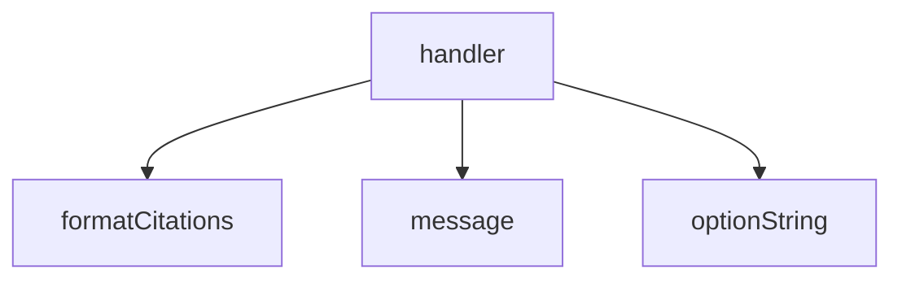

<!-- generated documentation — edit the source, not this file -->
# `bot/src/commands/why.ts`

@file `/why` — the recurring "is this a bug?" answers.
Every one of these is a thing the tree already says, that a contributor has
no reason to have read. Answers publicly rather than ephemerally: the point
is that the next person sees it too.

**depends on** [`bot/src/citations.ts`](../bot.src/citations.ts.md), [`bot/src/command.ts`](../bot.src/command.ts.md), [`bot/src/discord.ts`](../bot.src/discord.ts.md)  ·  **used by** [`bot/src/commands/index.ts`](index.ts.md)

Undocumented (1)

- `handler`

