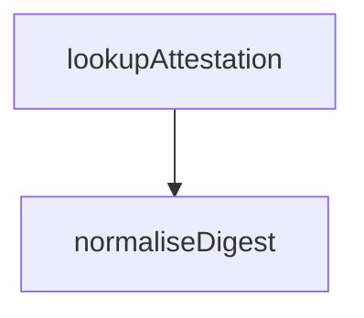

<!-- generated documentation — edit the source, not this file -->
# `bot/src/attest.ts`

@file Look up a GitHub build-provenance attestation by subject digest.
`release.yml` runs `actions/attest-build-provenance` on every published
asset (`.github/workflows/release.yml`, `scripts/security-attest.sh`), which
binds an artifact's sha256 to the workflow, repository and commit that built
it. This is the read half: "does this digest have one", answered from
GitHub's own public attestations API rather than trusted from a SHA256SUMS
file served next to the thing it describes.
Read-only and needs no write scope. A token, if bound, only raises the
unauthenticated rate limit; the lookup works without one for a public repo.

**used by** [`bot/src/commands/verify.ts`](../bot.src.commands/verify.ts.md)

## API

### `export function normaliseDigest(raw: string): string | null`
`bot/src/attest.ts:33`

Accepts a bare 64-hex digest or one prefixed `sha256:`. Case-insensitive,
normalised to lowercase, prefix added back for the API call.

**called by** `lookupAttestation`

Undocumented (2)

- `predicateTypeOf`
- `lookupAttestation` — tested: it:does not throw when the bundle payload cannot be decoded@l91; it:rejects a malformed digest before making a network call@l80; it:reports found with a predicate type@l38; it:reports not-found on a 404@l65; it:reports rate-limited on 403 and 429@l71; it:sends the token when one is bound, and omits it otherwise@l101

