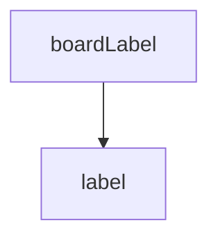

<!-- generated documentation — edit the source, not this file -->
# `bot/src/boards.ts`

@file The enums a contributor picks from: board, radio, NFC front-end, and
UTC offset. Taken from the hardware axes in the spec this bot follows and
from CLAUDE.md's own target table.
Board, radio and nfc are enforced as Discord command `choices`, so a
well-behaved client never sends anything outside the list. They are
re-validated here anyway: choices are a client-side convenience, not a
server-side guarantee, and every one of these values reaches a bound SQL
parameter and a modal `custom_id`.

**used by** [`bot/src/commands/context.ts`](../bot.src.commands/context.ts.md), [`bot/src/commands/forget.ts`](../bot.src.commands/forget.ts.md), [`bot/src/commands/help-me.ts`](../bot.src.commands/help-me.ts.md), [`bot/src/commands/ihave.ts`](../bot.src.commands/ihave.ts.md), [`bot/src/commands/test-request.ts`](../bot.src.commands/test-request.ts.md), [`bot/src/commands/test-result.ts`](../bot.src.commands/test-result.ts.md), [`bot/src/commands/who-has.ts`](../bot.src.commands/who-has.ts.md), [`bot/src/matrix.ts`](matrix.ts.md), [`bot/src/render.ts`](render.ts.md), [`bot/src/testRequestContainer.ts`](testRequestContainer.ts.md)

Undocumented (11)

- `values` — tested: retired algorithm id is not reused
- `isKnownBoard` — tested: :board/radio/nfc enums reject unknown values@l23
- `isKnownRadio` — tested: :board/radio/nfc enums reject unknown values@l23
- `isKnownNfc` — tested: :board/radio/nfc enums reject unknown values@l23
- `label`
- `boardLabel`
- `radioLabel`
- `nfcLabel`
- `isKnownUtcOffsetMinutes` — tested: utc+13@l13
- `isValidIosVersion` — tested: :i os version pattern accepts the documented examples@l32; :i os version pattern rejects garbage@l38
- `parseAwakeWindow` — tested: :awake window accepts a window that wraps past midnight (start > end)@l51; :awake window parses valid ranges including both boundary hours@l44; :awake window rejects out-of-range or malformed input@l58

