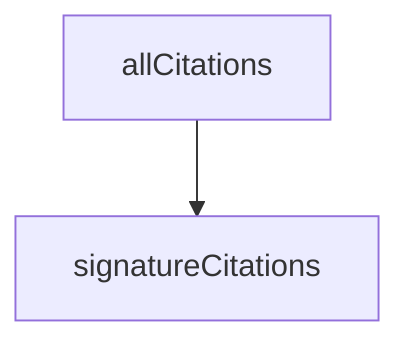

<!-- generated documentation — edit the source, not this file -->
# `bot/src/citations.ts`

@file The triage table. Every answer this bot gives comes from here.
A lookup table, not a model. Each entry is a plain reading, a next command,
and a `file:line` into this repository. Nothing is written from memory: if a
failure mode is not documented in the tree it does not get an entry, and the
bot escalates instead of guessing. A confident wrong diagnosis costs somebody
an evening, which is worse than no answer at all.
`expect` is the drift guard. scripts/check-citations.ts reads each cited line
and fails if the substring is no longer on it, so an edit to mk/cdk.mk that
moves a line breaks CI rather than quietly turning this table into folklore.
Keep `expect` short and distinctive, and never let it span a line break.

**depends on** [`bot/src/signatures.ts`](signatures.ts.md)  ·  **used by** [`bot/scripts/check-citations.ts`](../bot.scripts/check-citations.ts.md), [`bot/scripts/drift.ts`](../bot.scripts/drift.ts.md), [`bot/src/commands/decode-devid.ts`](../bot.src.commands/decode-devid.ts.md), [`bot/src/commands/help-me.ts`](../bot.src.commands/help-me.ts.md), [`bot/src/commands/twin.ts`](../bot.src.commands/twin.ts.md), [`bot/src/commands/why.ts`](../bot.src.commands/why.ts.md), [`bot/src/signatures.ts`](signatures.ts.md), [`bot/src/twin.ts`](twin.ts.md)  ·  **discussed in** [`bot/README.md`](../../../bot/README.md), [`bot/eval/README.md`](../../../bot/eval/README.md)

## API

### `export function cite(c: Citation): string`
`bot/src/citations.ts:243`

`modules/woz_uwb/src/fira/fira_session.h:111` — one citation as a bare
`file:line`, for building a reply string. Ranges are display-only: cite the
anchor line here, and write the span into the sentence around it.

**called by** `explainDecision`

### `export function allCitations(): Citation[]`
`bot/src/citations.ts:248`

Every citation the bot can print, for the drift checker.

**calls** `signatureCitations`

### `export function formatCitations(citations: Citation[]): string`
`bot/src/citations.ts:259`

`` `mk/cdk.mk:293` `` — the form a terminal turns into a link.

**called by** `handler`, `matchesSection`
