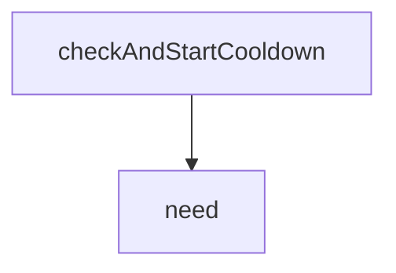

<!-- generated documentation — edit the source, not this file -->
# `bot/src/db.ts`

@file Interaction idempotency and the `/build` cooldown.
The hardware registry itself lives in rigs.ts, against the `rigs` table.
This file is what is left once that moved: the two tables that exist to stop
a command running twice rather than to remember anything about hardware.
Nothing outside this file and rigs.ts writes SQL, and neither builds SQL by
concatenation. Each query is a constant with bound parameters, so a value
arriving from a Discord field cannot become syntax.

**depends on** [`bot/src/rigs.ts`](rigs.ts.md)  ·  **used by** [`bot/src/commands/build.ts`](../bot.src.commands/build.ts.md), [`bot/src/commands/help-me.ts`](../bot.src.commands/help-me.ts.md)

## API

### `export async function claimInteraction(db: D1Database | undefined, interactionId: string): Promise<boolean>`
`bot/src/db.ts:39`

Claim an interaction ID, once.
True means this caller owns it and should do the work. False means a
previous delivery already did: Discord retries, and a retry must not open a
second thread.
Throws RegistryUnavailable when D1 is not reachable, and the caller is
expected to proceed anyway. Losing deduplication costs a duplicate thread;
refusing to act costs the report entirely, and the second is worse.

**called by** `handler`, `onModalSubmit`  ·  **calls** `need`

### `export async function checkAndStartCooldown(db: D1Database | undefined, userId: string, cooldownMs: number, now: number): Promise<CooldownCheck>`
`bot/src/db.ts:69`

Check a user's /build cooldown and, if it has expired, start a new one
atomically in the same statement.

**called by** `handler`  ·  **calls** `need`

Undocumented (1)

- `need`

