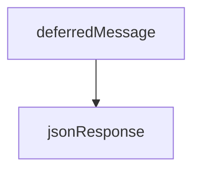

<!-- generated documentation — edit the source, not this file -->
# `bot/src/discord.ts`

@file Wire constants and response builders for the Discord interactions
protocol. Kept dependency-free so `test/` can exercise it without a
Worker runtime.

**used by** [`bot/src/command.ts`](command.ts.md), [`bot/src/commands/build.ts`](../bot.src.commands/build.ts.md), [`bot/src/commands/context.ts`](../bot.src.commands/context.ts.md), [`bot/src/commands/decode-devid.ts`](../bot.src.commands/decode-devid.ts.md), [`bot/src/commands/forget.ts`](../bot.src.commands/forget.ts.md), [`bot/src/commands/help-me.ts`](../bot.src.commands/help-me.ts.md), [`bot/src/commands/ihave.ts`](../bot.src.commands/ihave.ts.md), [`bot/src/commands/matrix.ts`](../bot.src.commands/matrix.ts.md), [`bot/src/commands/ping.ts`](../bot.src.commands/ping.ts.md), [`bot/src/commands/size.ts`](../bot.src.commands/size.ts.md), [`bot/src/commands/spec.ts`](../bot.src.commands/spec.ts.md), [`bot/src/commands/test-request.ts`](../bot.src.commands/test-request.ts.md), [`bot/src/commands/test-result.ts`](../bot.src.commands/test-result.ts.md), [`bot/src/commands/twin.ts`](../bot.src.commands/twin.ts.md), [`bot/src/commands/verify.ts`](../bot.src.commands/verify.ts.md), [`bot/src/commands/who-has.ts`](../bot.src.commands/who-has.ts.md), [`bot/src/commands/why.ts`](../bot.src.commands/why.ts.md), [`bot/src/followup.ts`](followup.ts.md), [`bot/src/index.ts`](index.ts.md), [`bot/src/modal.ts`](modal.ts.md), [`bot/src/testRequestContainer.ts`](testRequestContainer.ts.md)

## API

### `export function jsonResponse(body: unknown, status = 200): Response`
`bot/src/discord.ts:109`

Serialises an interaction response body. Discord expects exactly this
shape back within the 3 second deadline, or a defer followed by a PATCH
to the response webhook.

**called by** `deferredMessage`, `deferredUpdate`, `handleApproach`, `handleExplain`, `message`, `modal`, `modalResponse`

### `export function message(content: string, opts: { ephemeral?: boolean } = {}): Response`
`bot/src/discord.ts:132`

A CHANNEL_MESSAGE_WITH_SOURCE response, **ephemeral unless told otherwise**.
The default is deliberate and is the one place the two halves of this bot
disagreed: triage replies defaulted to ephemeral, compatibility replies to
public. Nothing in the type system can catch that — it is a runtime default
behind ~50 call sites — so it resolves in the fail-safe direction. A reply
that should have been public and came out private is a visible annoyance
somebody reports; a reply that should have been private and came out public
has already been read by the channel. Say `{ ephemeral: false }`, or use
`publicMessage`, to opt a reply into being visible to everyone.
Mention parsing is suppressed unconditionally: nothing this bot echoes back
should ever be able to ping, since some of what it echoes is user-typed.
`onlyUsers` is the single sanctioned exception.

**called by** `componentHandler`, `handler`, `handler`, `handler`, `handler`, `handler`, `handler`, `handler`  ·  **calls** `jsonResponse`

### `export function publicMessage(content: string): Response`
`bot/src/discord.ts:147`

A reply everyone in the channel can see. Exists so that "this is public"
is written at the call site rather than inferred from an absent argument,
which is what made the two halves' defaults disagree unnoticed.

**calls** `message`

### `export function invokerId(interaction: Interaction): string | null`
`bot/src/discord.ts:153`

The Discord user ID that invoked an interaction: `member.user.id` in a
guild, `user.id` in a DM. Never a username or display name.

**called by** `componentHandler`, `handler`, `handler`, `handler`, `handler`, `handler`, `handler`, `modalHandler`

### `export function optionString(interaction: Interaction, name: string, max: number): string | null`
`bot/src/discord.ts:159`

A command option's string value, trimmed and capped. Discord enforces its
own limits client-side; this Worker does not trust that.

**called by** `handler`, `handler`, `handler`, `handler`, `handler`, `handler`, `handler`, `handler`

### `export function deferredMessage(opts: { ephemeral?: boolean } = {}): Response`
`bot/src/discord.ts:168`

A DEFERRED_CHANNEL_MESSAGE_WITH_SOURCE response: the "thinking…"
placeholder for work that will not finish inside the 3 second deadline.

**called by** `defer`, `deferRich`  ·  **calls** `jsonResponse`

### `export function modalResponse(modal: { custom_id: string; title: string; components: unknown[]; }): Response`
`bot/src/discord.ts:177`

A MODAL response. Must be the immediate response to the interaction —
there is no deferring first and opening one after.

**called by** `handler`  ·  **calls** `jsonResponse`

### `export function deferredUpdate(): Response`
`bot/src/discord.ts:190`

A DEFERRED_UPDATE_MESSAGE response: for a MESSAGE_COMPONENT interaction
(a button click) whose eventual edit will not finish inside the 3 second
deadline. Unlike `deferredMessage`, this carries no placeholder content —
Discord shows no "thinking…" state at all, it just leaves the existing
message as-is until the follow-up edit lands.

**called by** `deferUpdate`  ·  **calls** `jsonResponse`

### `export function onlyUsers(ids: string[]):`
`bot/src/discord.ts:213`

Suppress everything, then re-allow specific user IDs.
The only pings this bot ever sends are to the maintainer, on a no-match or
on request, and the ID comes from configuration rather than from a field
somebody typed. `parse: []` still holds, so nothing inside the user's own
text can become a mention.

**called by** `onModalSubmit`

### `export function modal(customId: string, title: string, inputs: ModalInput[]): Response`
`bot/src/discord.ts:231`

Build and return a modal from plain field descriptions. The ergonomic half
of `modalResponse`, which takes an already-assembled payload.

**called by** `handler`  ·  **calls** `jsonResponse`

### `export function modalValue(interaction: Interaction, customId: string, max: number): string | null`
`bot/src/discord.ts:257`

One submitted modal field, trimmed and capped. `null` for absent or empty,
matching `optionString` so callers treat both the same way.

**called by** `onModalSubmit`

Undocumented (1)

- `newCorrelationId`

