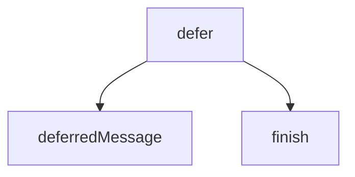

<!-- generated documentation — edit the source, not this file -->
# `bot/src/followup.ts`

@file Deferring, and the edit that finishes a deferred command.
Discord gives an interaction 3 seconds. Anything touching D1 defers
unconditionally rather than racing that clock, because a command that
usually answers in 200 ms and occasionally does not is a command that
occasionally fails for no reason a user can see.
The interaction token authenticates the follow-up edit, so no bot token is
involved here. It expires 15 minutes after the interaction.

**depends on** [`bot/src/command.ts`](command.ts.md), [`bot/src/discord.ts`](discord.ts.md)  ·  **used by** [`bot/src/commands/build.ts`](../bot.src.commands/build.ts.md), [`bot/src/commands/context.ts`](../bot.src.commands/context.ts.md), [`bot/src/commands/forget.ts`](../bot.src.commands/forget.ts.md), [`bot/src/commands/help-me.ts`](../bot.src.commands/help-me.ts.md), [`bot/src/commands/ihave.ts`](../bot.src.commands/ihave.ts.md), [`bot/src/commands/matrix.ts`](../bot.src.commands/matrix.ts.md), [`bot/src/commands/test-request.ts`](../bot.src.commands/test-request.ts.md), [`bot/src/commands/test-result.ts`](../bot.src.commands/test-result.ts.md), [`bot/src/commands/twin.ts`](../bot.src.commands/twin.ts.md), [`bot/src/commands/verify.ts`](../bot.src.commands/verify.ts.md), [`bot/src/commands/who-has.ts`](../bot.src.commands/who-has.ts.md)

## API

### `export function defer(c: CommandContext, work: (c: CommandContext) => Promise<string>, opts: { ephemeral?: boolean } = {}): Response`
`bot/src/followup.ts:20`

Answer now, work after. `work` returns the message body to put in place
of the "thinking" placeholder; if it throws, the placeholder is replaced
by an error naming the correlation ID rather than left spinning.

**called by** `handleApproach`, `handler`, `handler`, `handler`, `handler`, `handler`, `handler`, `handler`  ·  **calls** `deferredMessage`, `finish`

### `export function deferRich(c: CommandContext, work: (c: CommandContext) => Promise<DeferredResult>, opts: { ephemeral?: boolean } = {}): Response`
`bot/src/followup.ts:50`

Like `defer`, but `work` may also attach a file (an image, so far) to
the follow-up edit. A separate entry point rather than widening `defer`
itself, since every other command only ever needs text.

**called by** `handler`  ·  **calls** `deferredMessage`, `finishRich`

### `export async function editOriginal(c: CommandContext, content: string, file?: { bytes: Uint8Array; filename: string }): Promise<void>`
`bot/src/followup.ts:76`

Replace the deferred placeholder, optionally attaching a file. Mentions
stay off either way.

**called by** `finish`, `finishRich`

### `export function deferUpdate(c: CommandContext, work: (c: CommandContext) => Promise<UpdateOutcome>): Response`
`bot/src/followup.ts:119`

Like `defer`, but for a MESSAGE_COMPONENT interaction: answers with
DEFERRED_UPDATE_MESSAGE (no "thinking…" placeholder shown) and finishes
by either editing the component's own message or sending a private note.

**called by** `componentHandler`  ·  **calls** `deferredUpdate`, `finishUpdate`

### `export async function editOriginalComponents(c: CommandContext, body: Record<string, unknown>): Promise<void>`
`bot/src/followup.ts:144`

PATCHes @original with an arbitrary components-shaped body, for messages
where `content` is disabled (IS_COMPONENTS_V2) and editOriginal's
content-only shape does not apply.

**called by** `finishUpdate`

### `async function sendEphemeralFollowup(c: CommandContext, content: string): Promise<void>`
`bot/src/followup.ts:162`

POSTs a new ephemeral follow-up message without touching the message the
component is attached to.

**called by** `finishUpdate`

Undocumented (3)

- `finish`
- `finishRich`
- `finishUpdate`

