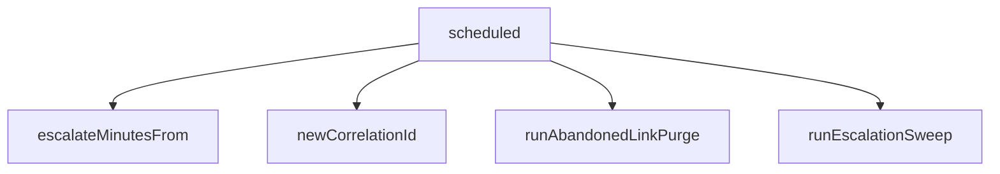

<!-- generated documentation — edit the source, not this file -->
# `bot/src/index.ts`

@file The interactions endpoint.
An HTTP interactions Worker, not a gateway bot: no persistent socket, no
privileged intents, no process with an uptime obligation. Discord POSTs
here, this file answers within the 3 second deadline or defers.
The order below is load-bearing and is checked by index.test.ts:
1. reject anything that is not a POST
2. read the body as TEXT, never as JSON
3. verify Ed25519 over timestamp + that exact text
4. only then parse
Verifying after parsing would still reject bad signatures, but it would
run a JSON parser on unauthenticated input first, and it would answer
Discord's deliberately invalid PING with a 400 instead of a 401. Discord
refuses the URL for the second one.

**depends on** [`bot/src/commands/index.ts`](../bot.src.commands/index.ts.md), [`bot/src/discord.ts`](discord.ts.md), [`bot/src/env.ts`](env.ts.md), [`bot/src/linkedRoles.ts`](linkedRoles.ts.md), [`bot/src/scheduled.ts`](scheduled.ts.md), [`bot/src/verify.ts`](verify.ts.md)

Undocumented (1)

- `scheduled`

