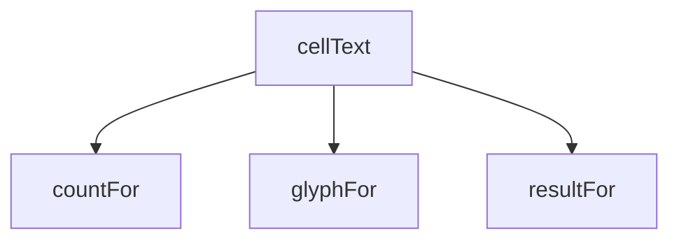

<!-- generated documentation — edit the source, not this file -->
# `bot/src/matrix.ts`

@file The compatibility matrix: pure formatting, no D1 and no Discord
wire types, so it is testable without either.
Only two of the four documented glyphs are reachable yet. ✅ (validated)
and ❌ (known-broken) both come from test *results*, which is the
`/test-request` + `/test-result` machinery — not built. Showing them here
would be a status this bot has not actually observed, so for now every
cell is either ⚠️ (someone owns that board/iOS pair) or ❓ (nobody does).
`matrixTable` takes an optional results map so this file does not need to
change again once that phase lands.

**depends on** [`bot/src/boards.ts`](boards.ts.md), [`bot/src/rigs.ts`](rigs.ts.md)  ·  **used by** [`bot/src/commands/matrix.ts`](../bot.src.commands/matrix.ts.md), [`bot/src/render.ts`](render.ts.md), [`bot/src/validations.ts`](validations.ts.md)

## API

### `export function compareVersions(a: string, b: string): number`
`bot/src/matrix.ts:21`

Compare dot-separated numeric version strings ("9.1" < "19.1" < "19.1.2"),
not lexicographically ("19.1" would otherwise sort before "9.1"). Missing
trailing segments compare as 0, so "19.1" < "19.1.2".

### `export function distinctVersions(counts: readonly MatrixCount[]): string[]`
`bot/src/matrix.ts:33`

Every iOS version with at least one registered owner, ascending.

**called by** `buildMatrixImage`, `matrixTable`

### `export function matrixTable(counts: readonly MatrixCount[], results: readonly ValidationStatus[] = []): string | null`
`bot/src/matrix.ts:56`

A monospace grid: rows are every known board (in the order boards.ts
lists them, even ones with zero owners — an all-❓ row is the signal
this bot exists to surface), columns are every iOS version seen in the
registry, ascending. Returns null if the registry has no iOS versions
recorded at all, since there is then no column axis to draw.

**called by** `textFallback`  ·  **calls** `boardLabel`, `cellText`, `distinctVersions`, `pad`

Undocumented (6)

- `glyphFor`
- `countFor`
- `resultFor`
- `cellText`
- `colWidth`
- `pad`

