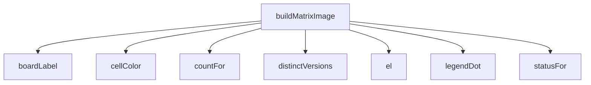

<!-- generated documentation — edit the source, not this file -->
# `bot/src/render.ts`

@file The compatibility matrix, as a PNG.
Satori (JSX-shaped element tree + CSS-subset styles -> SVG) does the text
shaping itself and bakes glyphs into vector paths, so the SVG it produces
is self-contained — @resvg/resvg-wasm rasterizes it with no font of its
own needed. WASM is initialised once per Worker isolate and reused, per
the spec this bot follows ("Load WASM once at module init").
Colors are exactly the four semantic accents the spec defines for status
Containers elsewhere in this bot (0x2ECC71/0xF1C40F/0xE74C3C/0x5865F2):
reused here rather than inventing a fifth palette, so "owned" and
"nobody owns it" read the same way in the image as they eventually will
in a Container.

**depends on** [`bot/src/assets.ts`](assets.ts.md), [`bot/src/boards.ts`](boards.ts.md), [`bot/src/matrix.ts`](matrix.ts.md), [`bot/src/rigs.ts`](rigs.ts.md)  ·  **used by** [`bot/src/commands/matrix.ts`](../bot.src.commands/matrix.ts.md)

## API

### `export function buildMatrixImage(input: MatrixImageInput):`
`bot/src/render.ts:93`

Builds the element tree and the canvas size it needs. Pure and
synchronous — split out from `renderMatrixPng` so layout can be unit
tested without touching WASM. Returns null if there is no column axis
to draw, same condition as `matrixTable`.

**called by** `renderMatrixPng`  ·  **calls** `boardLabel`, `cellColor`, `countFor`, `distinctVersions`, `el`, `legendDot`, `statusFor`

### `export async function renderMatrixPng(input: MatrixImageInput): Promise<RenderedMatrix | null>`
`bot/src/render.ts:254`

Renders the matrix to PNG bytes, or null if there is nothing to draw
(same condition as the monospace table). Callers are expected to fall
back to `matrixTable` on any thrown error — WASM init and Satori's
layout pass are the two realistic failure points, and neither should
turn `/matrix` into a hard failure when the text version would have
worked.

**called by** `handler`  ·  **calls** `buildMatrixImage`, `ensureWasm`, `interBoldFont`, `interRegularFont`

Undocumented (6)

- `ensureWasm`
- `cellColor`
- `el`
- `legendDot`
- `countFor`
- `statusFor`

