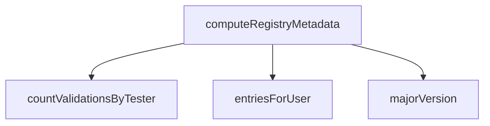

<!-- generated documentation — edit the source, not this file -->
# `bot/src/roleConnection.ts`

@file Linked Roles metadata: the five fields the spec suggests
(`boards_owned`, `has_nfc`, `ios_major`, `validated_runs`, `merged_prs`),
their Discord registration schema, and computing four of the five purely
from this bot's own D1 tables. `merged_prs` is deliberately not computed
here — it needs the linked GitHub account (githubOAuth.ts) and a call to
GitHub's own API, a different failure domain from "read our own D1".

**depends on** [`bot/src/rigs.ts`](rigs.ts.md), [`bot/src/validations.ts`](validations.ts.md)  ·  **used by** [`bot/scripts/register-role-metadata.ts`](../bot.scripts/register-role-metadata.ts.md), [`bot/src/linkedRoles.ts`](linkedRoles.ts.md)

## API

### `function majorVersion(iosVersion: string | null): number`
`bot/src/roleConnection.ts:68`

"19.1.2" -> 19; anything unparseable -> 0, same as "no board on that
axis" rather than a thrown error, since a metadata field cannot fail a
role-connection push over one malformed row.

**called by** `computeRegistryMetadata`

### `export async function computeRegistryMetadata(db: D1Database | undefined, discordUserId: string): Promise<RegistryMetadata>`
`bot/src/roleConnection.ts:75`

The four fields this bot can compute without leaving D1.

**called by** `pushMetadataNow`  ·  **calls** `countValidationsByTester`, `entriesForUser`, `majorVersion`

### `export function stringifyMetadata(m: RegistryMetadata & { merged_prs: number }): Record<string, string>`
`bot/src/roleConnection.ts:96`

Discord's role-connection push wants every metadata value "stringified"
(verified against docs.discord.com 2026-08-04 — the field itself is
documented as taking each value's string-ified form). The boolean
convention specifically ("1"/"0" vs "true"/"false") is not spelled out in
the same page; "1"/"0" is used here because the type's own doc describes
the *comparison* as integer-valued ("the metadata value (integer) is
equal to... (integer; 1)"), which is the strongest signal available
without a live round trip to confirm against.

**called by** `pushMetadataNow`
