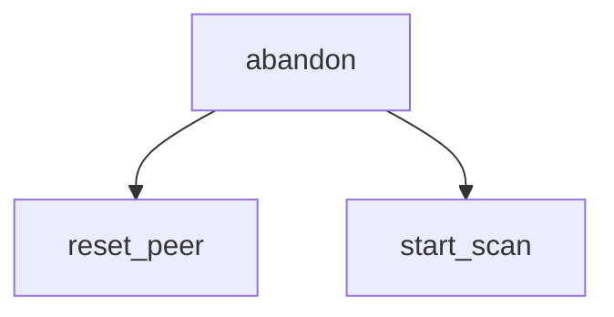

<!-- generated documentation — edit the source, not this file -->
# `firmware/src/aliro_ble_central_zephyr.c`

Zephyr central/client backend for the Aliro initiator: the mirror of
aliro_ble_zephyr.c. That file advertises 0xFFF2, serves the characteristics and
runs a CoC server; this one scans for 0xFFF2, connects, discovers, reads the
reader's SPSM/versions, writes the selected version and opens a CoC client to
that SPSM.

## API

### `static uint16_t conn_to_handle(struct bt_conn *conn)`
`firmware/src/aliro_ble_central_zephyr.c:99`

The engine's transport handle. Zephyr identifies a link by pointer, the seam
by uint16_t, so hand out the connection index (0..MAX_CONN-1), exactly as
aliro_ble_zephyr.c:104 does.

**called by** `aliro_ble_central_send`, `coc_connected`, `coc_disconnected`, `coc_recv`, `connected`, `disconnected`

### `static void reset_peer(void)`
`firmware/src/aliro_ble_central_zephyr.c:107`

Drop any reference held on the peer connection and clear all per-peer state.

**called by** `abandon`, `disconnected`

### `static void abandon(const char *why, int err)`
`firmware/src/aliro_ble_central_zephyr.c:118`

Abandon this peer and go back to scanning. Called from every failure path so a
half-finished chain can never leave the app wedged.

**called by** `coc_connect`, `connected`, `on_chr_disc`, `on_devver_write`, `on_spsm_read`, `on_svc_disc`, `scan_cb`  ·  **calls** `reset_peer`, `start_scan`

### `static struct net_buf *coc_alloc_buf(struct bt_l2cap_chan *chan)`
`firmware/src/aliro_ble_central_zephyr.c:138`

Allocate a receive net_buf from the CoC pool with no wait.

### `static int coc_recv(struct bt_l2cap_chan *chan, struct net_buf *buf)`
`firmware/src/aliro_ble_central_zephyr.c:147`

Forward one received SDU to the on_data callback as a transport handle and byte buffer.

**calls** `conn_to_handle`

### `static void coc_connected(struct bt_l2cap_chan *chan)`
`firmware/src/aliro_ble_central_zephyr.c:159`

Handle CoC establishment: the transaction can now start, so report on_ready with the peer facts
the GATT READ recovered.

**calls** `conn_to_handle`

### `static void coc_disconnected(struct bt_l2cap_chan *chan)`
`firmware/src/aliro_ble_central_zephyr.c:173`

Handle CoC teardown by clearing channel state and notifying the app. The link itself may still be
up, so this does not rescan; disconnected() owns that.

**calls** `conn_to_handle`

### `static void coc_connect(void)`
`firmware/src/aliro_ble_central_zephyr.c:193`

Final step of the chain: open the CoC to the SPSM the READ gave us.

**called by** `on_devver_write`  ·  **calls** `abandon`

### `static void on_devver_write(struct bt_conn *conn, uint8_t err, struct bt_gatt_write_params *params)`
`firmware/src/aliro_ble_central_zephyr.c:218`

Callback when the device-version write completes. On success, open the CoC to the SPSM previously
read. On error, abandon this peer.

**calls** `abandon`, `coc_connect`

### `static uint8_t on_spsm_read(struct bt_conn *conn, uint8_t err, struct bt_gatt_read_params *params, const void *data, uint16_t length)`
`firmware/src/aliro_ble_central_zephyr.c:234`

GATT read callback for the reader-SPSM characteristic: parse the payload for SPSM, supported
versions and features, check the peer publishes our version, then write the selected version.

**calls** `abandon`

### `static uint8_t on_chr_disc(struct bt_conn *conn, const struct bt_gatt_attr *attr, struct bt_gatt_discover_params *params)`
`firmware/src/aliro_ble_central_zephyr.c:300`

GATT characteristic discovery callback: record the value handles of the SPSM and device-version
characteristics, then read the SPSM one once discovery completes.

**calls** `abandon`

### `static uint8_t on_svc_disc(struct bt_conn *conn, const struct bt_gatt_attr *attr, struct bt_gatt_discover_params *params)`
`firmware/src/aliro_ble_central_zephyr.c:340`

GATT service discovery callback: record the 0xFFF2 service handle range, then discover the
characteristics inside it.

**calls** `abandon`

### `static bool advert_is_our_reader(struct bt_data *data, void *user_data)`
`firmware/src/aliro_ble_central_zephyr.c:375`

True when this advert carries Aliro service data from the reader we want. The
reader falls back to a bare UUID + name when unprovisioned or GRK-less; that
form has no group id to match, so it is skipped quietly rather than treated as
an error.

### `static void start_scan(void)`
`firmware/src/aliro_ble_central_zephyr.c:504`

Start active scanning. Duplicate filtering stays off because the reader's dynamic advert tag
changes and dedupe would hide the very reports we match on.

**called by** `abandon`, `aliro_ble_central_start`, `bt_ready`, `disconnected`

Undocumented (7)

- `aliro_coc_client`
- `scan_cb`
- `connected`
- `disconnected`
- `bt_ready`
- `aliro_ble_central_start`
- `aliro_ble_central_send`

