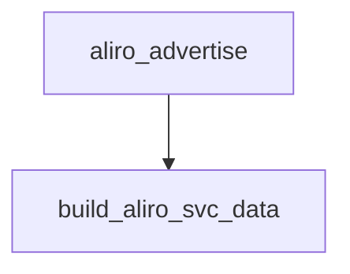

<!-- generated documentation — edit the source, not this file -->
# `firmware/src/aliro_ble_zephyr.c`

**depends on** [`firmware/src/matter_ble_zephyr.h`](matter_ble_zephyr.h.md), [`firmware/src/matter_commission.h`](matter_commission.h.md)  ·  **discussed in** [`firmware/README.md`](../../../firmware/README.md)

## API

### `static struct aliro_coc`
`firmware/src/aliro_ble_zephyr.c:88`

One peer at a time. CONFIG_BT_MAX_CONN=1 makes that a build-time fact, not a
hope, so a single channel record is the whole table.

### `static uint16_t conn_to_handle(struct bt_conn *conn)`
`firmware/src/aliro_ble_zephyr.c:104`

The reader engine's transport handle. Zephyr identifies a link by pointer,
the seam by uint16_t, so hand out the connection index (0..MAX_CONN-1).

**called by** `coc_connected`, `coc_disconnected`, `coc_recv`

### `static struct net_buf *coc_alloc_buf(struct bt_l2cap_chan *chan)`
`firmware/src/aliro_ble_zephyr.c:112`

Allocate a receive net_buf from the CoC pool with no wait.

### `static int coc_recv(struct bt_l2cap_chan *chan, struct net_buf *buf)`
`firmware/src/aliro_ble_zephyr.c:122`

Forward received L2CAP CoC data to the registered on_data callback as a transport handle and byte
buffer.

**calls** `conn_to_handle`

### `static void coc_connected(struct bt_l2cap_chan *chan)`
`firmware/src/aliro_ble_zephyr.c:133`

Handle L2CAP CoC connection establishment by notifying the Aliro engine and logging the event.

**calls** `conn_to_handle`, `on_connected`

### `static void coc_disconnected(struct bt_l2cap_chan *chan)`
`firmware/src/aliro_ble_zephyr.c:145`

Handle L2CAP CoC disconnection by releasing the channel, clearing state, and notifying the Aliro
engine.

**calls** `conn_to_handle`, `on_disconnected`

### `static int coc_accept(struct bt_conn *conn, struct bt_l2cap_server *server, struct bt_l2cap_chan **chan)`
`firmware/src/aliro_ble_zephyr.c:168`

Accept an incoming L2CAP CoC connection if no channel is in use, allocate it to the static
instance, initialize its MTU and callback ops, and bind it to the peer connection.

### `static uint8_t encode_features(const struct aliro_ble_features *f)`
`firmware/src/aliro_ble_zephyr.c:197`

Encode Aliro feature flags (timesync procedures 0 and 1, LE Coded PHY) into a byte bitmap for the
service data advertisement.

**called by** `build_read_payload`

### `static void build_read_payload(const struct aliro_ble_config *cfg)`
`firmware/src/aliro_ble_zephyr.c:217`

Build the Aliro BLE advertisement payload containing the L2CAP SPSM, supported protocol versions,
and feature flags.

**called by** `aliro_ble_prepare`  ·  **calls** `encode_features`

### `static ssize_t reader_spsm_read(struct bt_conn *conn, const struct bt_gatt_attr *attr, void *buf, uint16_t len, uint16_t offset)`
`firmware/src/aliro_ble_zephyr.c:240`

GATT read callback that returns the static Aliro reader payload (service data with identity
material and features).

### `static ssize_t device_ver_write(struct bt_conn *conn, const struct bt_gatt_attr *attr, const void *buf, uint16_t len, uint16_t offset, uint8_t flags)`
`firmware/src/aliro_ble_zephyr.c:250`

The peer writes the BLE-UWB protocol version it selected. Both shipped
readers require at least 3 bytes here (see 588df2e); we only need to accept
it, the reader engine reads the selection off the transaction itself.

### `static bool build_aliro_svc_data(uint8_t out[24])`
`firmware/src/aliro_ble_zephyr.c:289`

Aliro 1.0 section 11.3 (Table 11-2). 24 payload bytes after the 16-bit UUID:
[0]      flags: bit7 = BLE+UWB supported, bits2:0 = version (0)
[1]      tx power (int8)
[2..9]   truncated reader group id      = reader_id[0..7]
[10..11] truncated reader group sub id  = reader_id[16..17]
[12..15] dynamic-tag expiry, big-endian (0xFFFFFFFF = no clock)
[16]     reserved
[17..23] dynamic tag
The derivation wants the identity address MSB-first; bt_id_get hands it out
LSB-first, same as NimBLE.

**called by** `aliro_advertise`

### `static int aliro_advertise(void)`
`firmware/src/aliro_ble_zephyr.c:375`

Advertise the Aliro reader service or Matter commissioning availability over BLE, with payload
priority given to findability: reader service when commissioned, commissioning advertisement when
unprovisioned or a window is open, or bare service UUID as fallback. Stops advertising if a
connection is active and schedules re-advertisement on disconnect.

**called by** `aliro_ble_readvertise`, `aliro_ble_start`, `aliro_ble_time_updated`, `readvertise_work_fn`  ·  **calls** `build_aliro_svc_data`

### `static void readvertise_work_fn(struct k_work *w)`
`firmware/src/aliro_ble_zephyr.c:500`

Attempt to resume BLE advertising with exponential backoff (100 ms, max 5 attempts) when a
disconnect requires re-advertisement; runs on the system work queue to avoid blocking the Aliro
access protocol.

**calls** `aliro_advertise`

### `static void on_connected(struct bt_conn *conn, uint8_t err)`
`firmware/src/aliro_ble_zephyr.c:567`

Mark the BLE connection established on successful controller completion, noting that the callback
fires for every connection attempt including those about to fail.

**called by** `coc_connected`

### `static void on_disconnected(struct bt_conn *conn, uint8_t reason)`
`firmware/src/aliro_ble_zephyr.c:586`

Mark the BLE connection dropped, count establishment failures and report them in one log line
when the run ends, then schedule re-advertisement.

**called by** `coc_disconnected`

### `static void on_le_param_updated(struct bt_conn *conn, uint16_t interval, uint16_t latency, uint16_t timeout)`
`firmware/src/aliro_ble_zephyr.c:617`

Report the connection interval the peer actually granted, which is the only proof the requested
15-30 ms took effect (prj.conf sets the preferred parameters and the 300 ms request timer).

### `int aliro_ble_prepare(const struct aliro_ble_config *cfg)`
`firmware/src/aliro_ble_zephyr.c:642`

Validate and store Aliro BLE configuration: protocol versions and callback handler. Caller must
provide non-null cfg with non-empty proto_versions array sized <= ALIRO_MAX_VERSIONS; returns 0
on success or -EINVAL if any parameter is invalid.

**called by** `aliro_ble_start`  ·  **calls** `build_read_payload`

### `uint16_t aliro_ble_spsm(void)`
`firmware/src/aliro_ble_zephyr.c:692`

Return the L2CAP protocol/service multiplexer for the Aliro reader channel.

### `int aliro_ble_send(uint16_t conn_handle, const uint8_t *data, size_t len)`
`firmware/src/aliro_ble_zephyr.c:702`

Send an APDU over the active L2CAP CoC link; fails if not connected. Copies data into a reserved
net_buf and asserts the payload fits the pool buffer to catch oversized framing from the reader
itself.

### `int aliro_ble_disconnect(uint16_t conn_handle)`
`firmware/src/aliro_ble_zephyr.c:745`

Disconnect the active L2CAP CoC link, terminating the Aliro protocol exchange.

### `void aliro_ble_set_adv_params(const uint8_t group_id8[8], const uint8_t sub_id2[2], const uint8_t grk[16], int8_t tx_power)`
`firmware/src/aliro_ble_zephyr.c:759`

Store the Aliro reader identity material (group ID, sub ID, GRK, TX power) to populate the
service data advertisement on the next readvertise call.

### `void aliro_ble_readvertise(void)`
`firmware/src/aliro_ble_zephyr.c:773`

Re-advertise the Aliro reader service or Matter commissioning availability over BLE after a state
change requiring advertisement resume.

**calls** `aliro_advertise`

### `void aliro_ble_time_updated(void)`
`firmware/src/aliro_ble_zephyr.c:782`

Re-advertise the Aliro reader service or Matter commissioning availability over BLE after the
system time is updated.

**calls** `aliro_advertise`

### `static void status_work_fn(struct k_work *w)`
`firmware/src/aliro_ble_zephyr.c:797`

Deferred work callback that invokes the reader status callback with the unsecured flag if set.

### `static void presence_work_fn(struct k_work *w)`
`firmware/src/aliro_ble_zephyr.c:809`

Deferred work callback that invokes the presence reset callback if set.

### `void aliro_ble_post_reader_status(void (*cb)(bool unsecured), bool unsecured)`
`firmware/src/aliro_ble_zephyr.c:821`

Queue a reader status callback with unsecured state to run asynchronously on the work queue.

### `void aliro_ble_post_presence_reset(void (*cb)(void))`
`firmware/src/aliro_ble_zephyr.c:831`

Queue a presence reset callback to run asynchronously on the work queue.

### `const struct ble_gatt_svc_def *aliro_ble_service_def(void)`
`firmware/src/aliro_ble_zephyr.c:839`

Attach mode exists only so the ESP32 reader can share a NimBLE host with
esp-matter. Nothing shares this host.

### `int aliro_ble_start_attached(void)`
`firmware/src/aliro_ble_zephyr.c:847`

Not supported on this target; returns ENOTSUP.

Undocumented (1)

- `aliro_ble_start`

