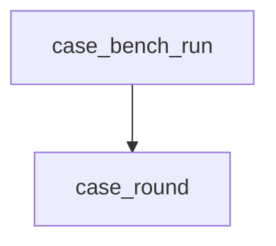

<!-- generated documentation — edit the source, not this file -->
# `firmware/src/case_bench.c`

## API

### `static psa_status_t make_ecc_key(psa_key_usage_t usage, psa_algorithm_t alg, psa_key_id_t *out)`
`firmware/src/case_bench.c:123`

An ECC key pair usable for one algorithm. The bench needs several: two
ephemeral pairs for the ECDH, and three signing pairs standing in for RCAC,
ICAC and the initiator's NOC.

**called by** `case_round`

### `static void hkdf(const uint8_t *secret, size_t secret_len, const uint8_t *salt, size_t salt_len, const char *info, uint8_t *out, size_t out_len)`
`firmware/src/case_bench.c:157`

HKDF-SHA256, the KDF CASE uses for S2K, S3K and the session keys.
The repo's own aliro_hkdf(), not PSA key derivation, for two reasons. It is
what a hand-written node on this board would actually call: pure C11, already
linked, no extra flash. And PSA key derivation is not available in this image
at all -- PSA_WANT_ALG_HKDF depends on PSA_WANT_ALG_HMAC, which is off, so
psa_key_derivation_setup() returns PSA_ERROR_NOT_SUPPORTED (-134). The first
run of this bench found that the hard way; see prj.conf.

**called by** `case_round`

### `static uint32_t case_round(void)`
`firmware/src/case_bench.c:172`

One CASE handshake, its setup included, returning the microseconds spent in
the measured part. The certificate keys and the signatures over them are
regenerated on every call where a real responder would have them resident, so
a repeated round costs slightly MORE than the real thing rather than less --
which is the direction a contention test should err in.

**called by** `case_bench_run`  ·  **calls** `hkdf`, `import_pub`, `make_ecc_key`, `psa_check`

Undocumented (4)

- `psa_check`
- `import_pub`
- `case_bench_run`
- `case_bench_start`

