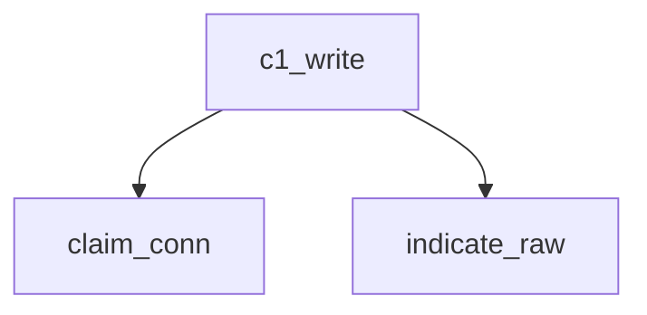

<!-- generated documentation — edit the source, not this file -->
# `firmware/src/matter_ble_zephyr.c`

@file matter_ble_zephyr.c — the 0xFFF6 GATT service that carries BTP.
A thin adapter, on purpose. All the framing lives in modules/woz_matter
(matter_btp.c), which has no Zephyr dependency and is tested on the host
under sanitizers. This file does three things and no more: hand C1 writes to
the reassembler, drive the fragmenter out through C2 indications, and build
the commissionable advertisement.
Modelled on aliro_ble_zephyr.c, which is the same shape -- proprietary
service, one write characteristic, one indicate characteristic,
connection-scoped state -- and is proven against live iPhones.

**depends on** [`firmware/src/matter_ble_zephyr.h`](matter_ble_zephyr.h.md)

## API

### `static int pump_tx(void)`
`firmware/src/matter_ble_zephyr.c:396`

Emit the next BTP fragment, if a message is being sent.

**called by** `indicate_done`, `matter_ble_send`

### `int matter_ble_send(const uint8_t *msg, size_t len)`
`firmware/src/matter_ble_zephyr.c:456`

Fragment and indicate a Matter message.
@return 0, -ENOTCONN before the BTP handshake, -EAGAIN if the peer has not
subscribed to C2, -EBUSY while another message is still going out.

**calls** `is_subscribed`, `pump_tx`

### `void matter_ble_set_msg_handler(matter_ble_msg_cb cb)`
`firmware/src/matter_ble_zephyr.c:489`

There is no init call. The work queue is started by SYS_INIT at APPLICATION
priority, because the GATT service is registered statically and the two must
come up together.

### `static bool claim_conn(struct bt_conn *conn)`
`firmware/src/matter_ble_zephyr.c:502`

The connection is claimed on the first C1 write, NOT on connect. The reader
accepts BLE connections too, and claiming every one of them would let an
Aliro peer occupy the single commissioning slot and lock out a real
commissioner. A peer that writes C1 has identified itself as one.

**called by** `c1_write`  ·  **calls** `reset_link`

### `int matter_ble_commissionable_svc_data(uint8_t *out, size_t cap)`
`firmware/src/matter_ble_zephyr.c:544`

ChipBLEDeviceIdentificationInfo, 8 bytes after the 16-bit UUID
(CHIPBleServiceData.h:52-79):
[0]    opcode, 0x00 = commissionable
[1]    low 8 bits of the 12-bit discriminator
[2]    high 4 bits of the discriminator in the low nibble,
advertisement version in the high nibble
[3..4] vendor ID, little-endian
[5..6] product ID, little-endian
[7]    additional-data flag

### `static int matter_ble_init(void)`
`firmware/src/matter_ble_zephyr.c:580`

Started by SYS_INIT rather than by the application, because
BT_GATT_SERVICE_DEFINE registers the 0xFFF6 service unconditionally: the C1
write handler is live the moment BLE comes up, whether or not anything asked
for it. Leaving the queue to an explicit call meant the two lifetimes could
disagree, and they did -- with no caller, --gc-sections dropped this function
and matter_wq_stack with it, so a C1 write would have submitted to a work
queue that was never started. Tying the queue to the service removes the
question.

**calls** `reset_link`

Undocumented (10)

- `reset_link`
- `hs_work_handler`
- `msg_work_handler`
- `c1_write`
- `c2_ccc_changed`
- `is_subscribed`
- `indicate_raw`
- `indicate_done`
- `matter_ble_set_link_handler`
- `on_disconnected`

