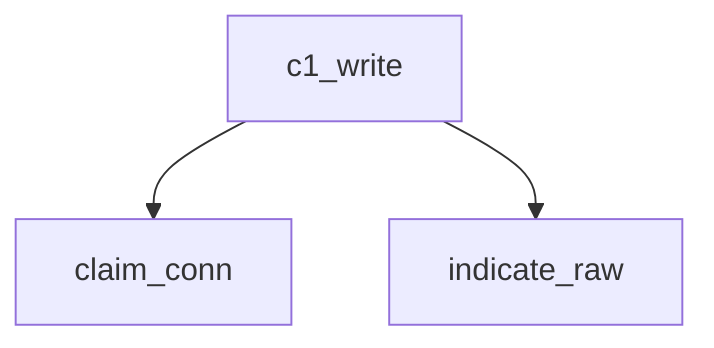

<!-- generated documentation — edit the source, not this file -->
# `firmware/src/matter_ble_zephyr.c`

@file matter_ble_zephyr.c — the 0xFFF6 GATT service that carries BTP.
A thin adapter, on purpose. All the framing lives in modules/woz_matter
(matter_btp.c), which has no Zephyr dependency and is tested on the host
under sanitizers. This file does three things and no more: hand C1 writes to
the reassembler, drive the fragmenter out through C2 indications, and build
the commissionable advertisement.
Modelled on aliro_ble_zephyr.c, which is the same shape -- proprietary
service, one write characteristic, one indicate characteristic,
connection-scoped state -- and is proven against live iPhones.

**depends on** [`firmware/src/matter_ble_zephyr.h`](matter_ble_zephyr.h.md)

## API

### `static void reset_link(void)`
`firmware/src/matter_ble_zephyr.c:156`

Reset the BLE link state: clear the reassembly buffer, zero TX state, clear all flags (tx_active,
indicate_busy, handshaked), reset fragment size to the minimum, and reset sequence and ack
counters. Invoke the link state callback if registered.

**called by** `claim_conn`, `matter_ble_init`, `on_disconnected`

### `static void hs_work_handler(struct k_work *work)`
`firmware/src/matter_ble_zephyr.c:190`

Send the BTP handshake response to the peer if subscribed to C2 indications; otherwise do nothing
and let the subscription handler (c2_ccc_changed) resubmit this work when the subscription
arrives.

**calls** `indicate_raw`, `is_subscribed`

### `static void msg_work_handler(struct k_work *work)`
`firmware/src/matter_ble_zephyr.c:212`

Work queue handler for a completed BTP message reassembly. If a message callback is registered,
invoke it with the reassembly buffer and message length; otherwise log a warning and drop the
message. Then reset the reassembly state for the next message. Runs on the work queue rather than
in the BLE RX callback to keep the reassembly area exclusive to the handler.

### `static ssize_t c1_write(struct bt_conn *conn, const struct bt_gatt_attr *attr, const void *buf, uint16_t len, uint16_t offset, uint8_t flags)`
`firmware/src/matter_ble_zephyr.c:236`

Handle a BLE GATT write to the Matter BTP C1 characteristic. On first write, decode and accept
the BTP handshake; initialize RX/TX sequence numbers and fragment size; queue the handshake
response for transmission on C2. On subsequent writes, decode incoming BTP fragments, reassemble
messages, send acknowledgments when the peer's window is half-full or a message completes, and
disconnect if framing desynchronizes. Return the number of bytes consumed or a GATT error code.

**calls** `claim_conn`, `indicate_raw`

### `static void c2_ccc_changed(const struct bt_gatt_attr *attr, uint16_t value)`
`firmware/src/matter_ble_zephyr.c:369`

BLE GATT CCC callback for the C2 indication characteristic. If indications are enabled (value ==
BT_GATT_CCC_INDICATE) and a handshake response is staged, submit the hs_work to the Matter work
queue.

### `static bool is_subscribed(void)`
`firmware/src/matter_ble_zephyr.c:391`

Return true if a BLE connection is active and subscribed to indications on the C2 characteristic.

**called by** `hs_work_handler`, `indicate_raw`, `matter_ble_send`

### `static int indicate_raw(const uint8_t *data, size_t len)`
`firmware/src/matter_ble_zephyr.c:402`

Enqueue a BLE indication (server-to-client notification) of the given data on the Matter C2
characteristic. Returns -EBUSY if no connection exists or an indication is already pending;
-EAGAIN if the peer is not subscribed to indications; 0 on success.

**called by** `c1_write`, `hs_work_handler`  ·  **calls** `is_subscribed`

### `static int pump_tx(void)`
`firmware/src/matter_ble_zephyr.c:432`

Emit the next BTP fragment, if a message is being sent.

**called by** `indicate_done`, `matter_ble_send`

### `static void indicate_done(struct bt_conn *conn, struct bt_gatt_indicate_params *params, uint8_t err)`
`firmware/src/matter_ble_zephyr.c:480`

Callback fired when a BLE indication is confirmed by the peer. Clears indicate_busy and logs the
confirmation error. If no error, calls pump_tx to emit the next BTP fragment; if error is
nonzero, sets tx_active to false and logs the error.

**calls** `pump_tx`

### `int matter_ble_send(const uint8_t *msg, size_t len)`
`firmware/src/matter_ble_zephyr.c:497`

Fragment and indicate a Matter message.
@return 0, -ENOTCONN before the BTP handshake, -EAGAIN if the peer has not
subscribed to C2, -EBUSY while another message is still going out.

**calls** `is_subscribed`, `pump_tx`

### `void matter_ble_set_link_handler(matter_ble_link_cb cb)`
`firmware/src/matter_ble_zephyr.c:528`

Register a callback to be invoked when the BLE link state changes (connection or disconnection).

### `void matter_ble_set_msg_handler(matter_ble_msg_cb cb)`
`firmware/src/matter_ble_zephyr.c:533`

There is no init call. The work queue is started by SYS_INIT at APPLICATION
priority, because the GATT service is registered statically and the two must
come up together.

### `static bool claim_conn(struct bt_conn *conn)`
`firmware/src/matter_ble_zephyr.c:546`

The connection is claimed on the first C1 write, NOT on connect. The reader
accepts BLE connections too, and claiming every one of them would let an
Aliro peer occupy the single commissioning slot and lock out a real
commissioner. A peer that writes C1 has identified itself as one.

**called by** `c1_write`  ·  **calls** `reset_link`

### `static void on_disconnected(struct bt_conn *conn, uint8_t reason)`
`firmware/src/matter_ble_zephyr.c:564`

BLE disconnection callback. Clears the connection reference, marks any active session as
inactive, and resets the link state (reassembly buffer, TX flags).

**calls** `reset_link`

### `void matter_ble_set_discriminator(uint16_t discriminator)`
`firmware/src/matter_ble_zephyr.c:601`

Override the advertised discriminator; 0 restores the built-in one.

### `uint16_t matter_ble_discriminator(void)`
`firmware/src/matter_ble_zephyr.c:606`

The discriminator currently advertised.

**called by** `matter_ble_commissionable_svc_data`

### `int matter_ble_commissionable_svc_data(uint8_t *out, size_t cap)`
`firmware/src/matter_ble_zephyr.c:612`

Build the commissionable-node service data element.
This does NOT start advertising, deliberately. The reader owns the single
advertising set (aliro_ble_zephyr.c), and it stays that way: Zephyr's legacy
bt_le_adv_start API has exactly one set, and the alternative -- CONFIG_BT_EXT_ADV
with two sets -- measured +24,844 B of flash and +2,464 B of RAM on this board
before either advertiser was rewritten to use it. On a part where CASE and the
Interaction Model are still unbuilt, that is not a trade worth making for
something the protocol does not ask for: a Matter node advertises as
commissionable only while it has no fabric, which is exactly when this reader
has nothing to advertise as an Aliro reader either.
So the reader asks for these bytes when it has no identity yet, and stops
asking once it has one.
@param out receives MATTER_BLE_SVC_DATA_LEN bytes, caller-owned and required to
outlive the advertisement -- bt_data holds the pointer, not a copy.
@return 0 or -EINVAL.

**calls** `matter_ble_discriminator`

### `static int matter_ble_init(void)`
`firmware/src/matter_ble_zephyr.c:656`

Started by SYS_INIT rather than by the application, because
BT_GATT_SERVICE_DEFINE registers the 0xFFF6 service unconditionally: the C1
write handler is live the moment BLE comes up, whether or not anything asked
for it. Leaving the queue to an explicit call meant the two lifetimes could
disagree, and they did -- with no caller, --gc-sections dropped this function
and matter_wq_stack with it, so a C1 write would have submitted to a work
queue that was never started. Tying the queue to the service removes the
question.

**calls** `reset_link`
