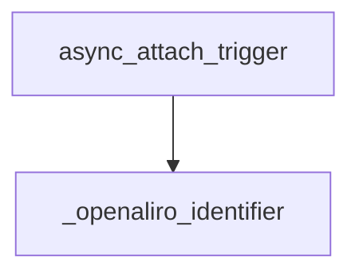

<!-- generated documentation — edit the source, not this file -->
# `integration/homeassistant/custom_components/openaliro/device_trigger.py`

Granted and denied device-automation triggers for OpenAliro access events.

**depends on** [`integration/homeassistant/custom_components/openaliro/const.py`](const.md)

## API

### `_openaliro_identifier(hass: HomeAssistant, device_id: str) -> str`
`integration/homeassistant/custom_components/openaliro/device_trigger.py:20`

Look up the OpenAliro domain identifier for a Home Assistant device by ID; raise DeviceNotFound if the device does not exist or is not an OpenAliro device.

**called by** `async_attach_trigger`, `async_get_triggers`

### `async_get_triggers(hass: HomeAssistant, device_id: str) -> list[dict[str, str]]`
`integration/homeassistant/custom_components/openaliro/device_trigger.py:31`

List the two credential-free access outcome triggers.

**calls** `_openaliro_identifier`

### `async_attach_trigger(hass: HomeAssistant, config: ConfigType, action: TriggerActionType, trigger_info: TriggerInfo) -> CALLBACK_TYPE`
`integration/homeassistant/custom_components/openaliro/device_trigger.py:41`

Attach an automation to one access outcome without exposing credential data.

**calls** `_openaliro_identifier`
