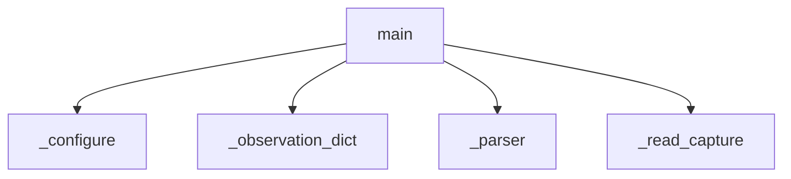

<!-- generated documentation — edit the source, not this file -->
# `integration/homeassistant/src/openaliro_ha/cli.py`

Small, non-interactive HA=1 staging CLI for safe offline operations.

**depends on** [`integration/homeassistant/src/openaliro_ha/agent.py`](agent.md), [`integration/homeassistant/src/openaliro_ha/config.py`](config.md), [`integration/homeassistant/src/openaliro_ha/models.py`](models.md), [`integration/homeassistant/src/openaliro_ha/parser.py`](parser.md), [`integration/homeassistant/src/openaliro_ha/serial_session.py`](serial_session.md), [`integration/homeassistant/src/openaliro_ha/serial_transport.py`](serial_transport.md)  ·  **used by** [`integration/homeassistant/src/openaliro_ha/__main__.py`](__main__.md)  ·  **discussed in** [`docs/home-assistant-internals.md`](../../home-assistant-internals.md)

## API

### `_candidate_label(index: int, port: SerialPort) -> str`
`integration/homeassistant/src/openaliro_ha/cli.py:85`

Describe a candidate without echoing its device path or USB serial.

**called by** `_select_port`

### `_probe_candidate(port: SerialPort) -> Optional[str]`
`integration/homeassistant/src/openaliro_ha/cli.py:96`

Return None when a candidate answers, else why it did not.

The reason is stripped of device paths so the picker keeps hiding them.

**called by** `_select_port`

### `_flag(arguments: argparse.Namespace, name: str) -> Optional[object]`
`integration/homeassistant/src/openaliro_ha/cli.py:176`

Read an optional configure flag, tolerating callers that omit it.

**called by** `_configure`, `_flag_mqtt_config`

### `_flag_mqtt_config(arguments: argparse.Namespace) -> MqttConfig`
`integration/homeassistant/src/openaliro_ha/cli.py:182`

Build an MQTT config from flags so a setup script needs no prompts.

**called by** `_configure`  ·  **calls** `_flag`

### `_configure(arguments: argparse.Namespace, *, input_fn: object=input, output_fn: object=print) -> int`
`integration/homeassistant/src/openaliro_ha/cli.py:202`

Create or add one device, from flags when given and prompts otherwise.

**called by** `main`  ·  **calls** `_flag`, `_flag_mqtt_config`, `_new_mqtt_config`, `_prompt`, `_select_port`

### `main(argv: Sequence[str] | None=None) -> int`
`integration/homeassistant/src/openaliro_ha/cli.py:240`

Run an HA=1-gated offline command without exposing raw capture text.

**calls** `_configure`, `_observation_dict`, `_parser`, `_read_capture`

Undocumented (6)

- `_observation_dict`
- `_read_capture`
- `_parser`
- `_prompt`
- `_select_port` — tested: probe failure reason is shown without the device path
- `_new_mqtt_config`

